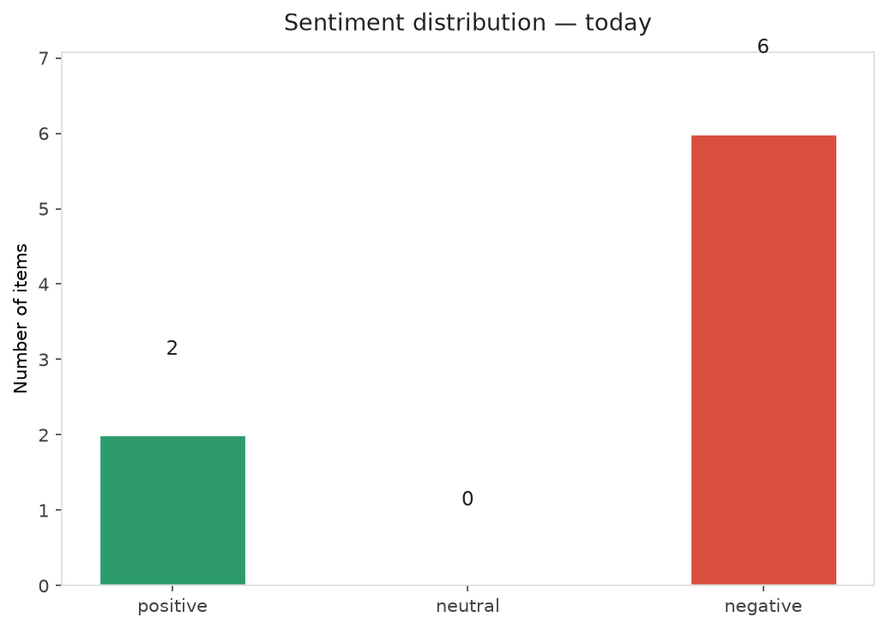
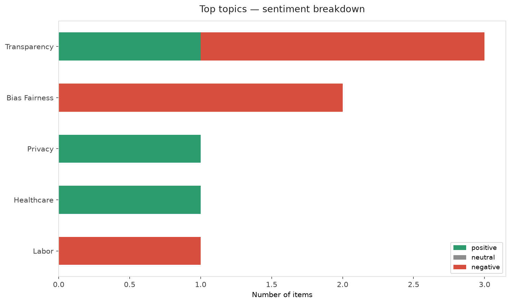
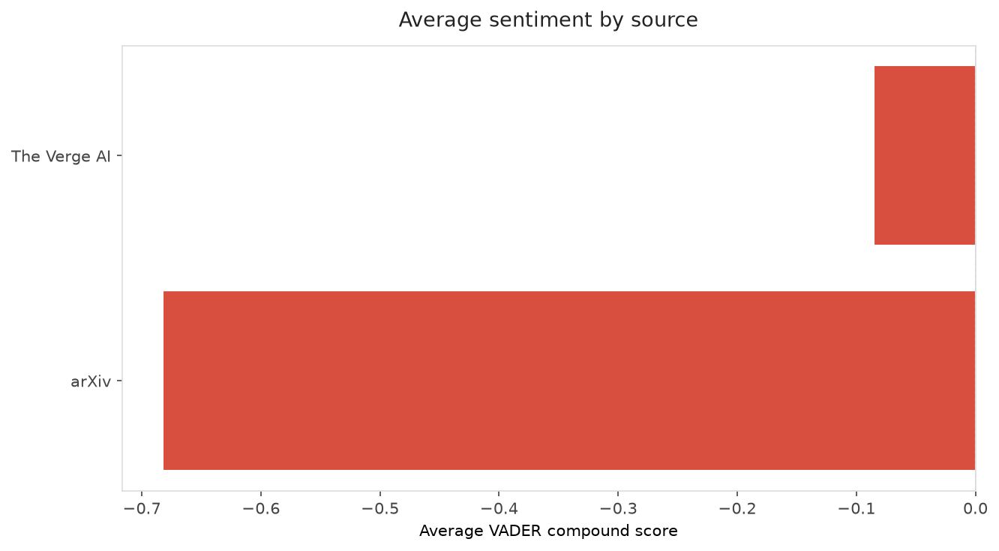
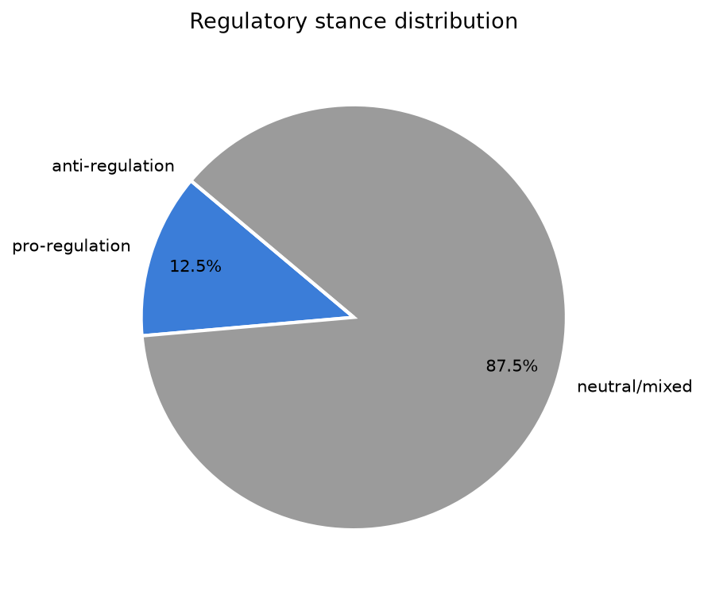
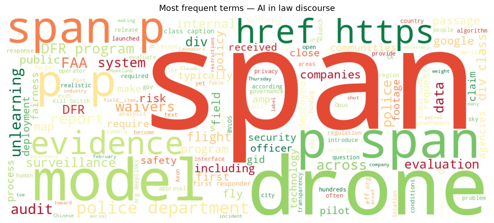
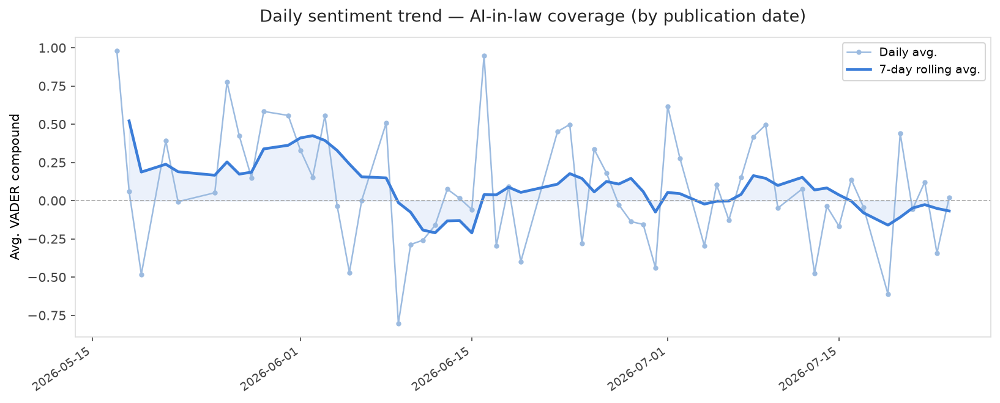
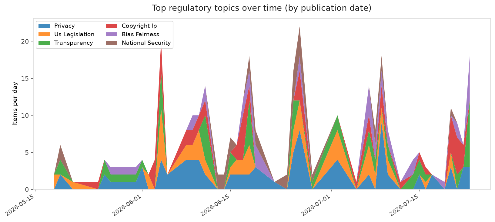
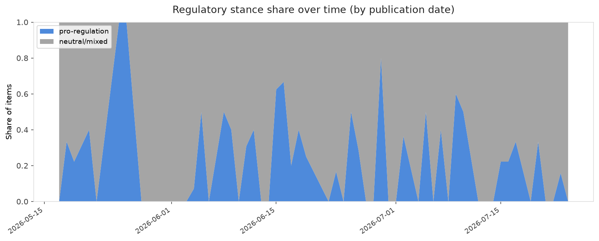

# AI in Law — Daily Sentiment Report
**Run date:** 2026-07-25 | **Items analyzed:** 8 | **Overall:** 🔴 Mildly negative (-0.261)

_Articles in this report were published between **2026-07-23** and **2026-07-24**._

---

## Summary

Today's collection covers **8** items from news outlets, academic preprints, Reddit, and regulatory sources.
Compared to the historical average of **+0.266**, today's sentiment is ↓ **0.527** points lower.

| Metric | Value |
|--------|-------|
| Positive items | 2 (25.0%) |
| Neutral items  | 0 (0.0%) |
| Negative items | 6 (75.0%) |
| Avg. VADER compound | -0.2611 |
| Pro-regulation items | 1 |
| Anti-regulation items | 0 |

---

## Top Topics Today

- **Transparency** — 3 items
- **Bias Fairness** — 2 items
- **Privacy** — 1 items
- **Healthcare** — 1 items
- **Labor** — 1 items

---

## Most Positive Coverage

- [Hundreds of Drone-as-First-Responder Programs Could Soon Be Launched Across the Country](https://www.eff.org/deeplinks/2026/07/hundreds-drone-first-responder-programs-could-soon-be-launched-across-country)  
  _EFF DeepLinks_ — VADER: `+0.936`
- [Anthropic releases Opus 5 with ‘close’ to Fable 5’s capabilities](https://www.theverge.com/ai-artificial-intelligence/970105/claude-opus-5-announced-anthropic-ai-model-release)  
  _The Verge AI_ — VADER: `+0.340`
- [As US weighs response to Chinese AI, industry urges against broad open-weight restrictions](https://techcrunch.com/2026/07/24/as-us-weighs-response-to-chinese-ai-industry-urges-against-broad-open-weight-restrictions/)  
  _TechCrunch_ — VADER: `-0.296`

---

## Most Critical / Negative Coverage

- [Open Veins of Algorithmic Auditing: Why AI Assessment Lags Behind Its Deployment in the Global South](https://arxiv.org/abs/2607.21317v1)  
  _arXiv_ — VADER: `-0.867`
- [Unlearning Under Imbalance: Benchmarking Fairness in Multimodal LLM Unlearning](https://arxiv.org/abs/2607.21300v1)  
  _arXiv_ — VADER: `-0.660`
- [White Box Evidence Packages for Policy Audit Reports](https://arxiv.org/abs/2607.21462v1)  
  _arXiv_ — VADER: `-0.520`

---

## Visualizations — Today

## Visualizations — Trends Over Time

---

## Methodology

- **VADER** (Valence Aware Dictionary and sEntiment Reasoner) — compound score in [-1, 1].
- **Topic tagging** — regex keyword matching across 12 AI-law sub-domains.
- **Stance detection** — keyword-based pro/anti-regulation signal detection.
- **Date filter** — items are kept only if their *publication* date falls within the look-back window (default 2 days).
- Sources: RSS news feeds, arXiv academic API, Reddit (PRAW), Regulations.gov API.

_Generated automatically on 2026-07-25 12:05 UTC._
