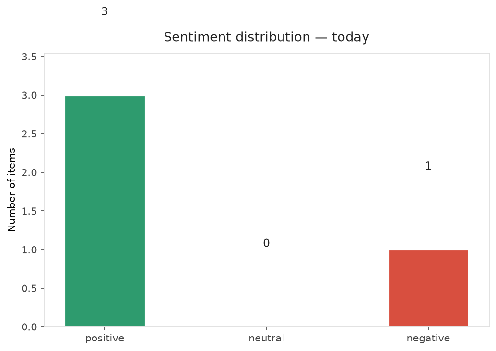
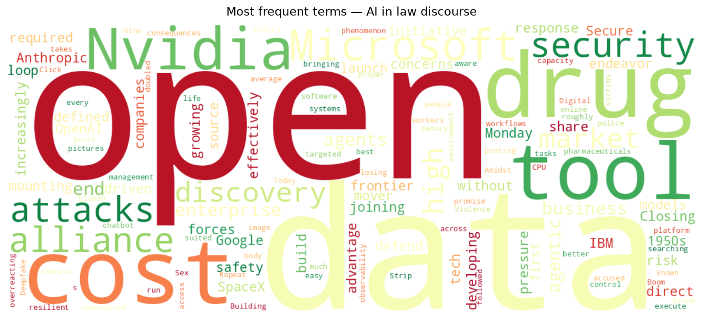
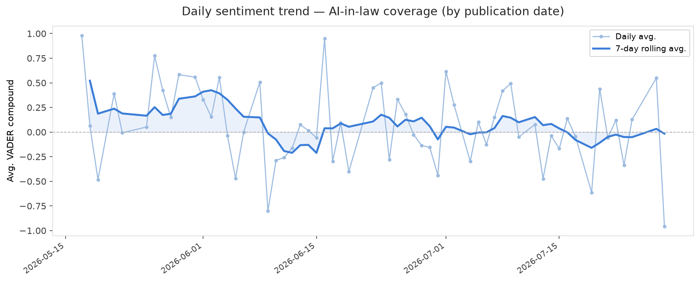
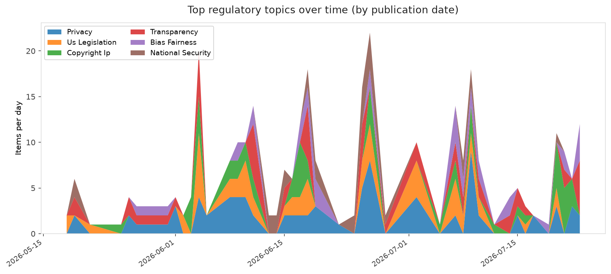
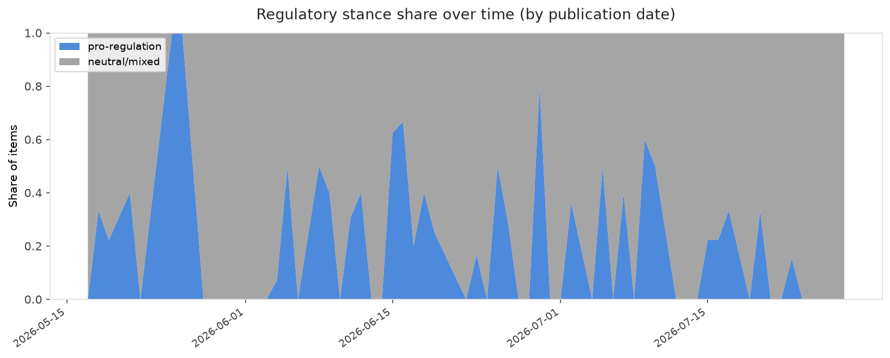

# AI in Law — Daily Sentiment Report
**Run date:** 2026-07-28 | **Items analyzed:** 4 | **Overall:** 🟢 Mildly positive (+0.172)

_Articles in this report were published between **2026-07-27** and **2026-07-28**._

---

## Summary

Today's collection covers **4** items from news outlets, academic preprints, Reddit, and regulatory sources.
Compared to the historical average of **+0.267**, today's sentiment is ↓ **0.094** points lower.

| Metric | Value |
|--------|-------|
| Positive items | 3 (75.0%) |
| Neutral items  | 0 (0.0%) |
| Negative items | 1 (25.0%) |
| Avg. VADER compound | +0.1724 |
| Pro-regulation items | 0 |
| Anti-regulation items | 0 |

---

## Top Topics Today

_No strong topic signals detected today._

---

## Most Positive Coverage

- [Nvidia, Microsoft launch open AI security alliance — without OpenAI, Google, or Anthropic](https://www.theverge.com/ai-artificial-intelligence/971281/nvidia-open-secure-ai-alliance-cybersecurity)  
  _The Verge AI_ — VADER: `+0.881`
- [Building the enterprise environment for agentic AI](https://www.technologyreview.com/2026/07/27/1140668/building-the-enterprise-environment-for-agentic-ai/)  
  _MIT Tech Review_ — VADER: `+0.637`
- [Closing the data loop in AI-driven drug discovery](https://www.technologyreview.com/2026/07/27/1139667/closing-the-data-loop-in-ai-driven-drug-discovery/)  
  _MIT Tech Review_ — VADER: `+0.128`

---

## Most Critical / Negative Coverage

- [Click, Strip, Repeat: Sex Workers and Digital Violence Amidst the Deepfake Boom](https://algorithmwatch.org/en/workers-digital-violence-deepfakes/)  
  _AlgorithmWatch_ — VADER: `-0.956`
- [Closing the data loop in AI-driven drug discovery](https://www.technologyreview.com/2026/07/27/1139667/closing-the-data-loop-in-ai-driven-drug-discovery/)  
  _MIT Tech Review_ — VADER: `+0.128`
- [Building the enterprise environment for agentic AI](https://www.technologyreview.com/2026/07/27/1140668/building-the-enterprise-environment-for-agentic-ai/)  
  _MIT Tech Review_ — VADER: `+0.637`

---

## Visualizations — Today

## Visualizations — Trends Over Time

---

## Methodology

- **VADER** (Valence Aware Dictionary and sEntiment Reasoner) — compound score in [-1, 1].
- **Topic tagging** — regex keyword matching across 12 AI-law sub-domains.
- **Stance detection** — keyword-based pro/anti-regulation signal detection.
- **Date filter** — items are kept only if their *publication* date falls within the look-back window (default 2 days).
- Sources: RSS news feeds, arXiv academic API, Reddit (PRAW), Regulations.gov API.

_Generated automatically on 2026-07-28 12:58 UTC._
