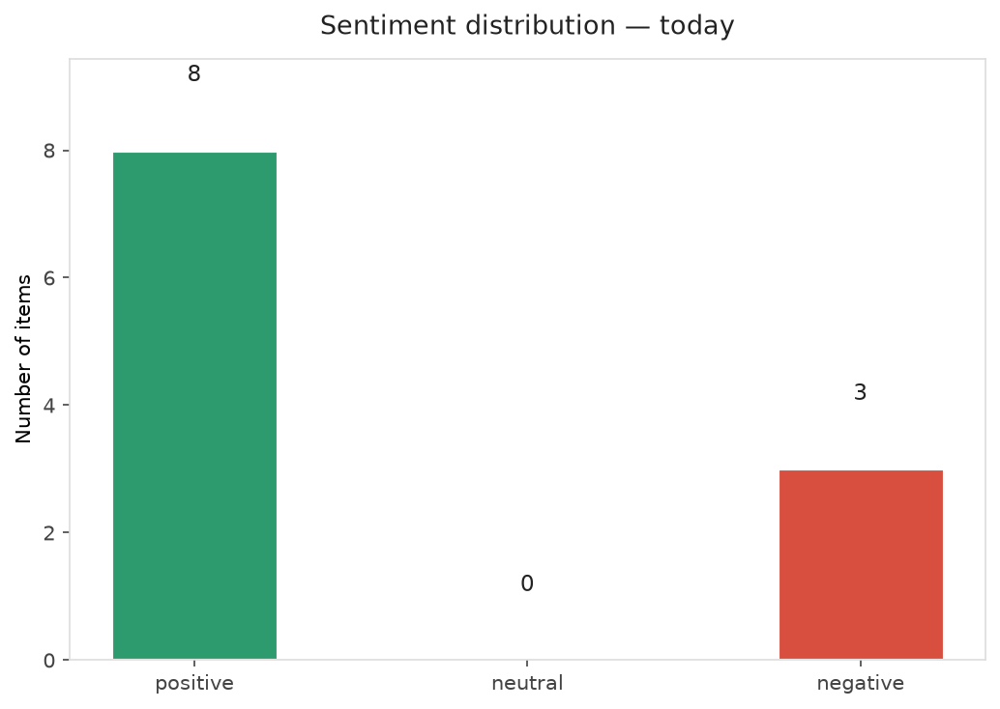
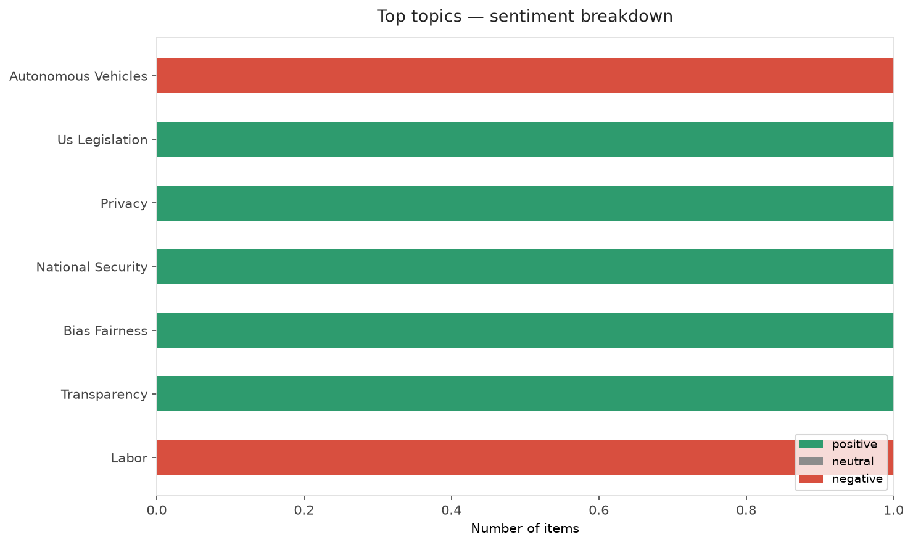
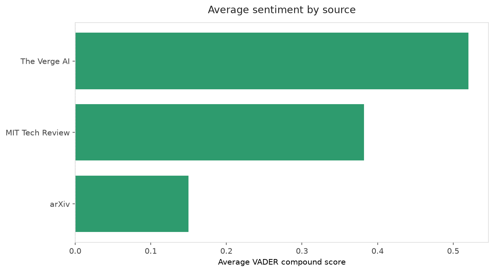
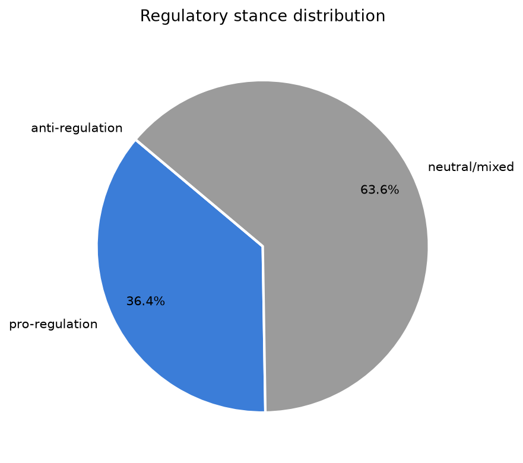
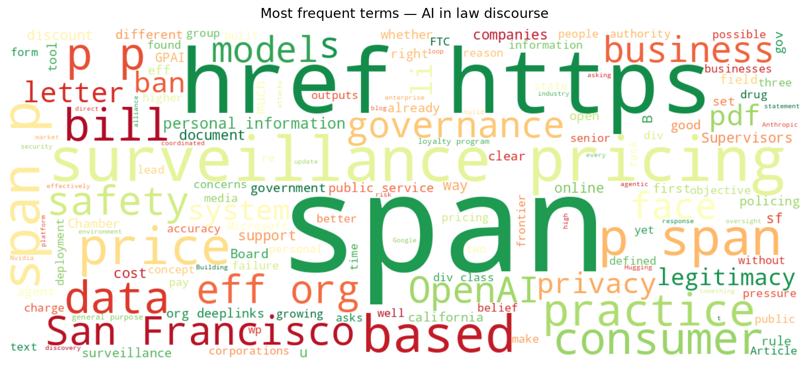
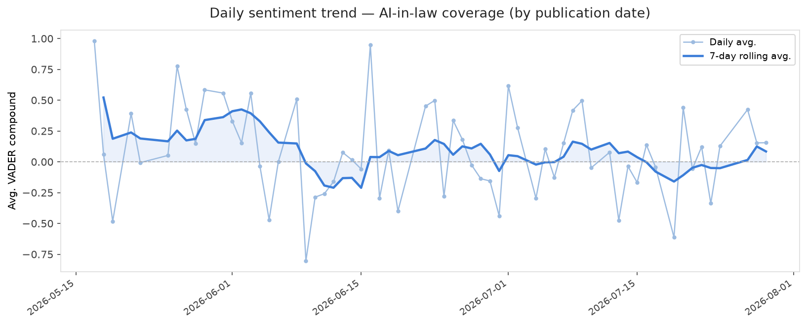
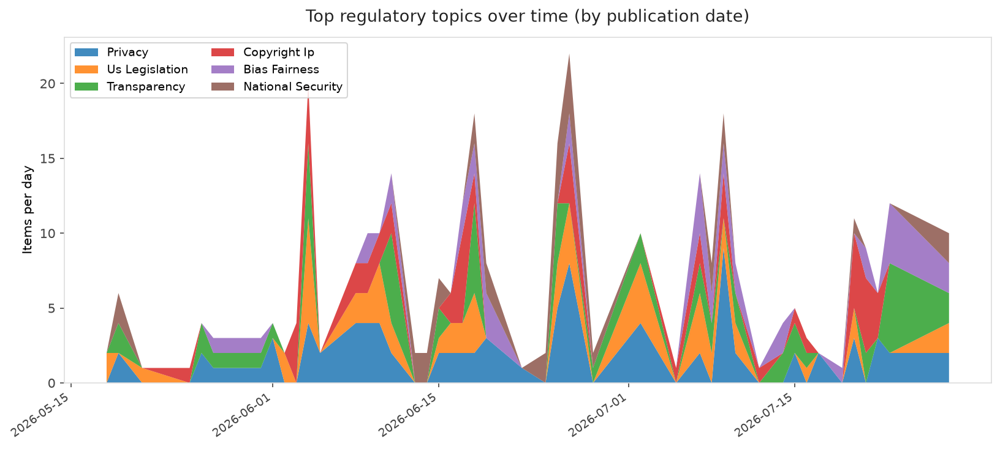
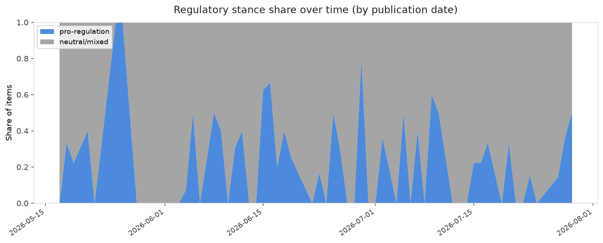

# AI in Law — Daily Sentiment Report
**Run date:** 2026-07-29 | **Items analyzed:** 11 | **Overall:** 🟢 Mildly positive (+0.269)

_Articles in this report were published between **2026-07-27** and **2026-07-29**._

---

## Summary

Today's collection covers **11** items from news outlets, academic preprints, Reddit, and regulatory sources.
Compared to the historical average of **+0.267**, today's sentiment is ↑ **0.002** points higher.

| Metric | Value |
|--------|-------|
| Positive items | 8 (72.7%) |
| Neutral items  | 0 (0.0%) |
| Negative items | 3 (27.3%) |
| Avg. VADER compound | +0.2685 |
| Pro-regulation items | 4 |
| Anti-regulation items | 0 |

---

## Top Topics Today

- **Autonomous Vehicles** — 1 items
- **Us Legislation** — 1 items
- **Privacy** — 1 items
- **National Security** — 1 items
- **Bias Fairness** — 1 items

---

## Most Positive Coverage

- [AI leaders sign a statement asking the government to do something about automated AI](https://www.theverge.com/ai-artificial-intelligence/972161/ai-leaders-us-government-openai-anthropic-google-meta)  
  _The Verge AI_ — VADER: `+0.893`
- [San Francisco: Don’t Fall for Industry Defense of Surveillance Pricing](https://www.eff.org/deeplinks/2026/07/san-francisco-dont-fall-industry-defense-surveillance-pricing)  
  _EFF DeepLinks_ — VADER: `+0.888`
- [Nvidia, Microsoft launch open AI security alliance — without OpenAI, Google, or Anthropic](https://www.theverge.com/ai-artificial-intelligence/971281/nvidia-open-secure-ai-alliance-cybersecurity)  
  _The Verge AI_ — VADER: `+0.881`

---

## Most Critical / Negative Coverage

- [Click, Strip, Repeat: Sex Workers and Digital Violence Amidst the Deepfake Boom](https://algorithmwatch.org/en/workers-digital-violence-deepfakes/)  
  _AlgorithmWatch_ — VADER: `-0.956`
- [Regulating for AI Legitimacy](https://arxiv.org/abs/2607.24391v1)  
  _arXiv_ — VADER: `-0.325`
- [Waymo, robotaxi operators face fresh scrutiny over emergency response failures](https://techcrunch.com/2026/07/28/waymo-robotaxi-operators-face-fresh-scrutiny-over-emergency-response-failures/)  
  _TechCrunch_ — VADER: `-0.128`

---

## Visualizations — Today

## Visualizations — Trends Over Time

---

## Methodology

- **VADER** (Valence Aware Dictionary and sEntiment Reasoner) — compound score in [-1, 1].
- **Topic tagging** — regex keyword matching across 12 AI-law sub-domains.
- **Stance detection** — keyword-based pro/anti-regulation signal detection.
- **Date filter** — items are kept only if their *publication* date falls within the look-back window (default 2 days).
- Sources: RSS news feeds, arXiv academic API, Reddit (PRAW), Regulations.gov API.

_Generated automatically on 2026-07-29 13:02 UTC._
