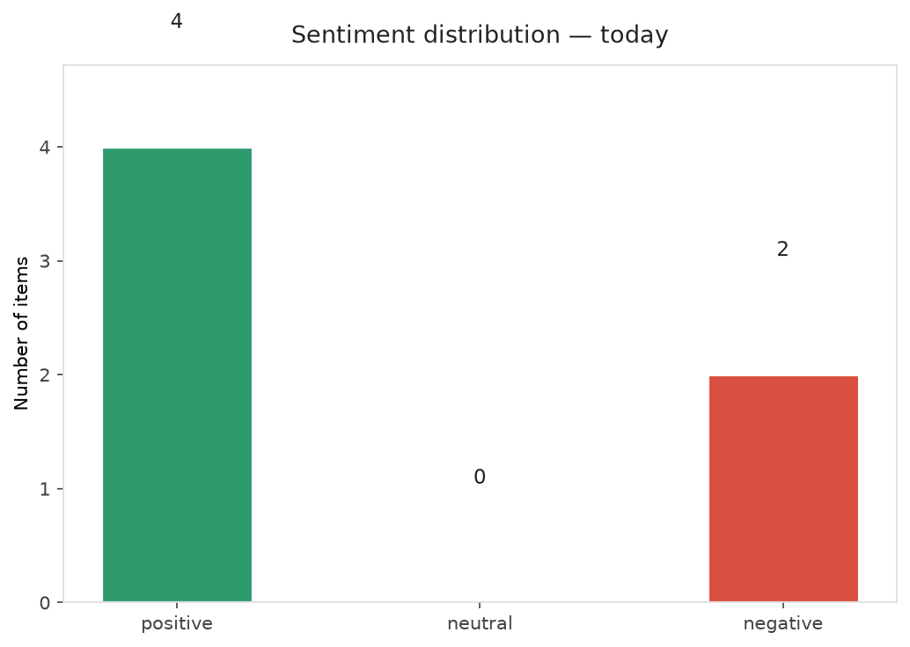
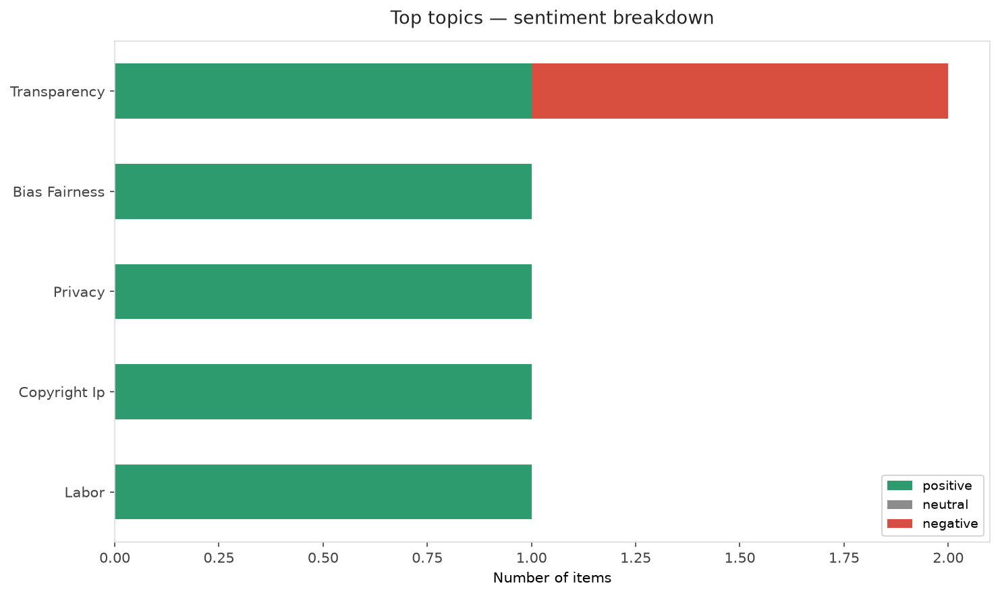
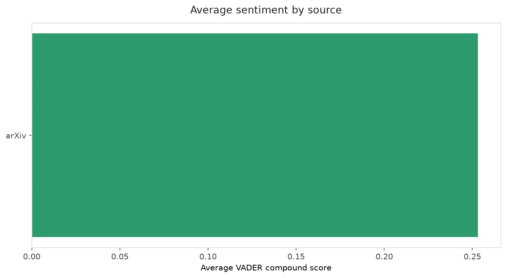
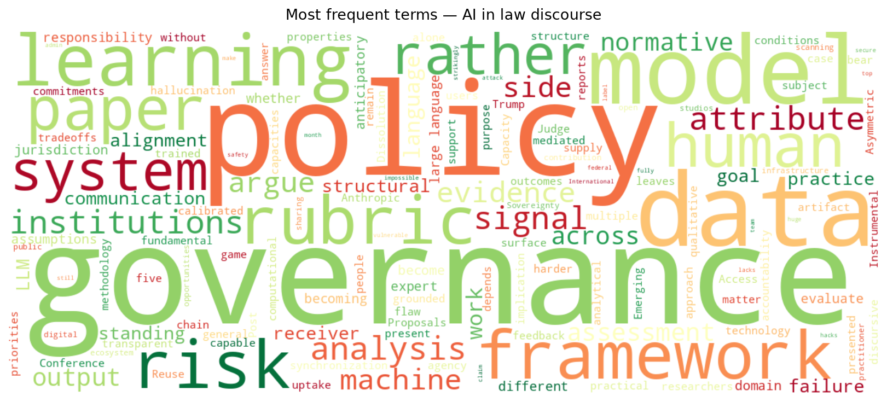
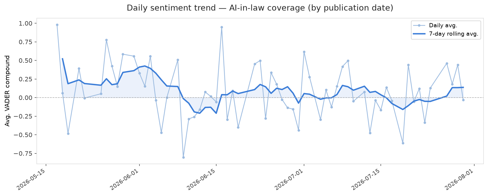
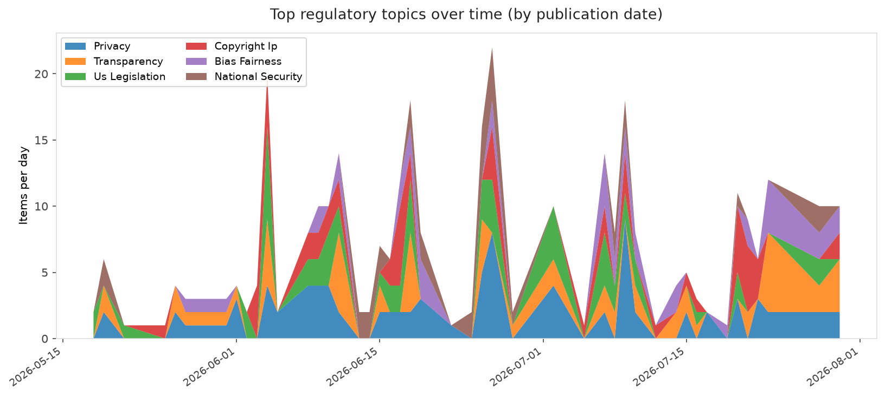
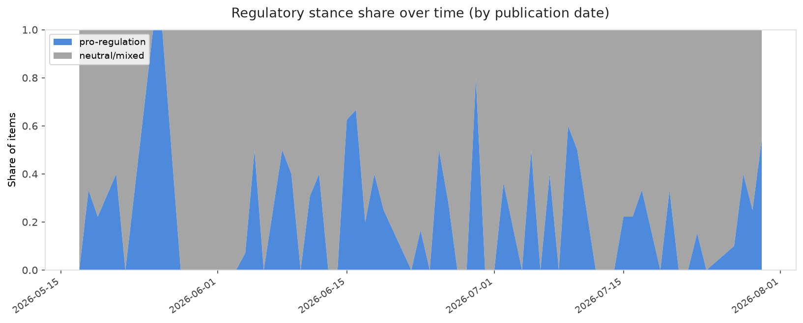

# AI in Law — Daily Sentiment Report
**Run date:** 2026-07-31 | **Items analyzed:** 6 | **Overall:** 🟢 Mildly positive (+0.084)

_Articles in this report were published between **2026-07-29** and **2026-07-30**._

---

## Summary

Today's collection covers **6** items from news outlets, academic preprints, Reddit, and regulatory sources.
Compared to the historical average of **+0.267**, today's sentiment is ↓ **0.182** points lower.

| Metric | Value |
|--------|-------|
| Positive items | 4 (66.7%) |
| Neutral items  | 0 (0.0%) |
| Negative items | 2 (33.3%) |
| Avg. VADER compound | +0.0842 |
| Pro-regulation items | 3 |
| Anti-regulation items | 0 |

---

## Top Topics Today

- **Transparency** — 2 items
- **Bias Fairness** — 1 items
- **Privacy** — 1 items
- **Copyright Ip** — 1 items
- **Labor** — 1 items

---

## Most Positive Coverage

- [Anticipatory Data Governance in the Age of AI: Emerging Signals in Data Access, Reuse, and Sovereign](https://arxiv.org/abs/2607.27029v1)  
  _arXiv_ — VADER: `+0.827`
- [An Instrument to Evaluate Governance Proposals: AI Policy Analysis at Scale](https://arxiv.org/abs/2607.28094v1)  
  _arXiv_ — VADER: `+0.402`
- [When AI Does the Work, What Is Learning For? Post-Instrumental Learning and the Risk of Capacity Dis](https://arxiv.org/abs/2607.28041v1)  
  _arXiv_ — VADER: `+0.320`

---

## Most Critical / Negative Coverage

- [Judge says Trump admin still lacks evidence for Anthropic ‘supply-chain risk’ label](https://techcrunch.com/2026/07/30/judge-says-trump-admin-still-lacks-evidence-for-anthropic-supply-chain-risk-label/)  
  _TechCrunch_ — VADER: `-0.802`
- [Asymmetric Communication: Large Language Models and Language Games](https://arxiv.org/abs/2607.28137v1)  
  _arXiv_ — VADER: `-0.536`
- [A fundamental flaw leaves LLMs strikingly vulnerable to attack](https://www.technologyreview.com/2026/07/30/1140927/a-fundamental-flaw-leaves-llms-vulnerable-to-attack/)  
  _MIT Tech Review_ — VADER: `+0.294`

---

## Visualizations — Today

## Visualizations — Trends Over Time

---

## Methodology

- **VADER** (Valence Aware Dictionary and sEntiment Reasoner) — compound score in [-1, 1].
- **Topic tagging** — regex keyword matching across 12 AI-law sub-domains.
- **Stance detection** — keyword-based pro/anti-regulation signal detection.
- **Date filter** — items are kept only if their *publication* date falls within the look-back window (default 2 days).
- Sources: RSS news feeds, arXiv academic API, Reddit (PRAW), Regulations.gov API.

_Generated automatically on 2026-07-31 12:57 UTC._
