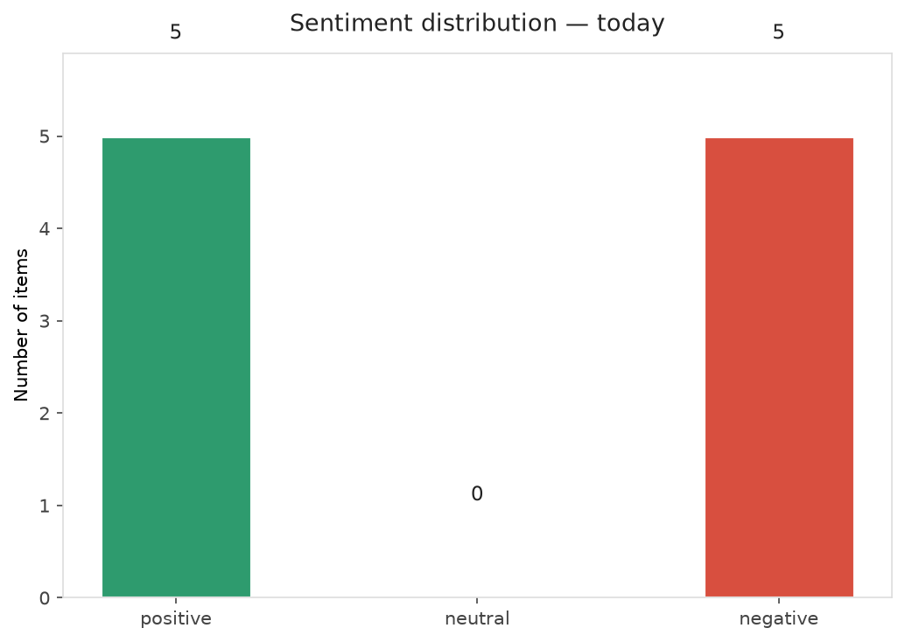
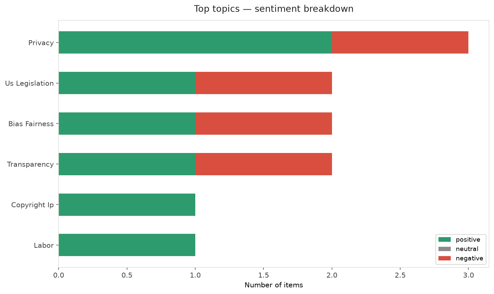
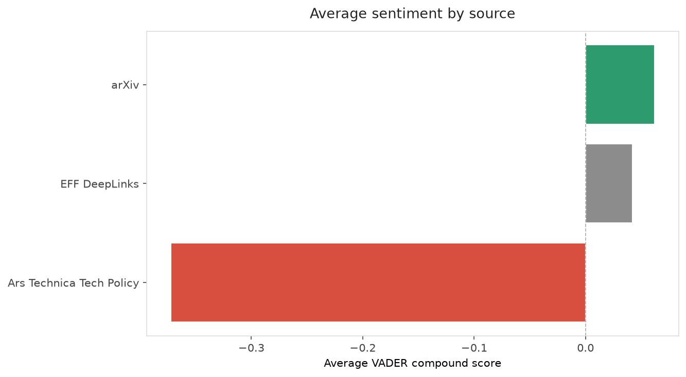
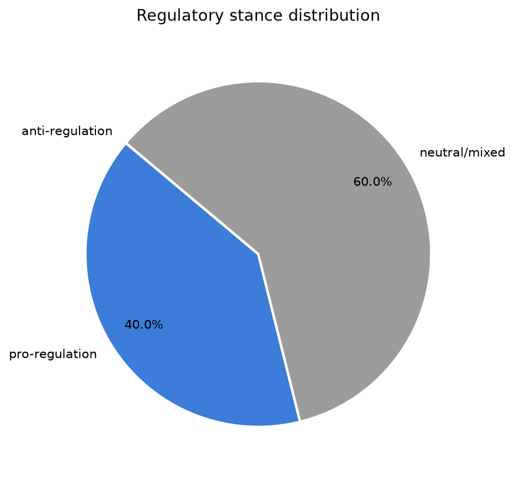
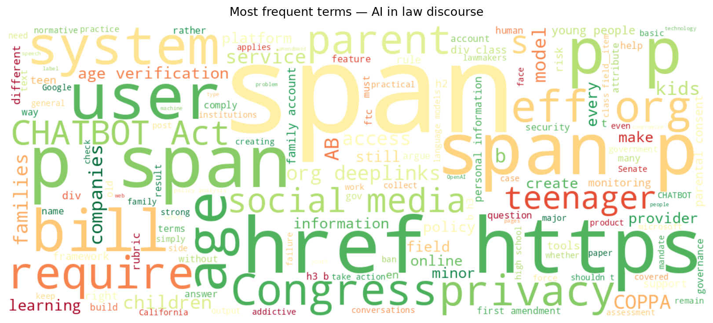
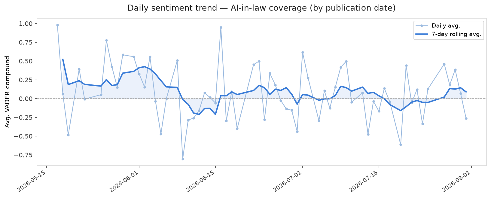
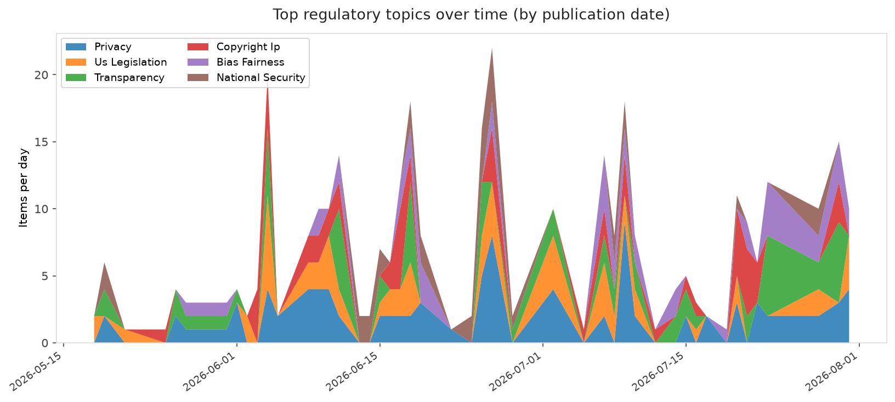
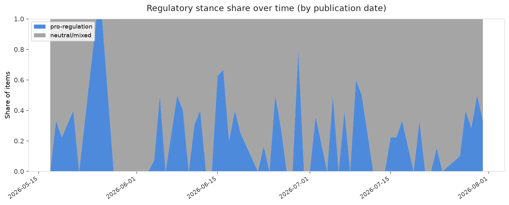

# AI in Law — Daily Sentiment Report
**Run date:** 2026-08-01 | **Items analyzed:** 10 | **Overall:** 🔴 Mildly negative (-0.109)

_Articles in this report were published between **2026-07-30** and **2026-07-31**._

---

## Summary

Today's collection covers **10** items from news outlets, academic preprints, Reddit, and regulatory sources.
Compared to the historical average of **+0.262**, today's sentiment is ↓ **0.372** points lower.

| Metric | Value |
|--------|-------|
| Positive items | 5 (50.0%) |
| Neutral items  | 0 (0.0%) |
| Negative items | 5 (50.0%) |
| Avg. VADER compound | -0.1095 |
| Pro-regulation items | 4 |
| Anti-regulation items | 0 |

---

## Top Topics Today

- **Privacy** — 3 items
- **Us Legislation** — 2 items
- **Bias Fairness** — 2 items
- **Transparency** — 2 items
- **Copyright Ip** — 1 items

---

## Most Positive Coverage

- [The CHATBOT Act Forces One Parenting Model On Every Family](https://www.eff.org/deeplinks/2026/07/chatbot-act-forces-one-parenting-model-every-family)  
  _EFF DeepLinks_ — VADER: `+0.953`
- [An Instrument to Evaluate Governance Proposals: AI Policy Analysis at Scale](https://arxiv.org/abs/2607.28094v1)  
  _arXiv_ — VADER: `+0.402`
- [When AI Does the Work, What Is Learning For? Post-Instrumental Learning and the Risk of Capacity Dis](https://arxiv.org/abs/2607.28041v1)  
  _arXiv_ — VADER: `+0.320`

---

## Most Critical / Negative Coverage

- [Amending AB 1709 Doesn’t Fix It: California’s Social Media Ban Still Threatens Free Speech and Priva](https://www.eff.org/deeplinks/2026/07/amending-ab-1709-doesnt-fix-it-californias-social-media-ban-still-threatens-free)  
  _EFF DeepLinks_ — VADER: `-0.869`
- [How a Yale AI-cheating dispute became a 13-count federal lawsuit](https://arstechnica.com/tech-policy/2026/07/how-a-yale-ai-cheating-dispute-became-a-13-count-federal-lawsuit/)  
  _Ars Technica Tech Policy_ — VADER: `-0.718`
- [It’s time to panic about AI safety](https://www.theverge.com/podcast/973668/ai-safety-openai-hugging-face-vergecast)  
  _The Verge AI_ — VADER: `-0.542`

---

## Visualizations — Today

## Visualizations — Trends Over Time

---

## Methodology

- **VADER** (Valence Aware Dictionary and sEntiment Reasoner) — compound score in [-1, 1].
- **Topic tagging** — regex keyword matching across 12 AI-law sub-domains.
- **Stance detection** — keyword-based pro/anti-regulation signal detection.
- **Date filter** — items are kept only if their *publication* date falls within the look-back window (default 2 days).
- Sources: RSS news feeds, arXiv academic API, Reddit (PRAW), Regulations.gov API.

_Generated automatically on 2026-08-01 12:04 UTC._
