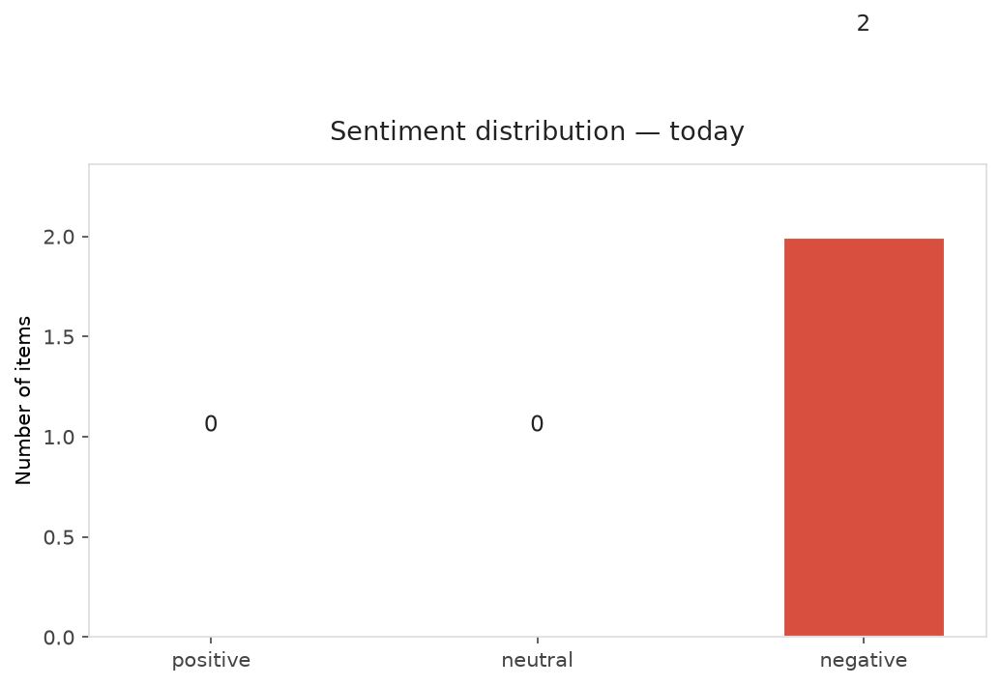
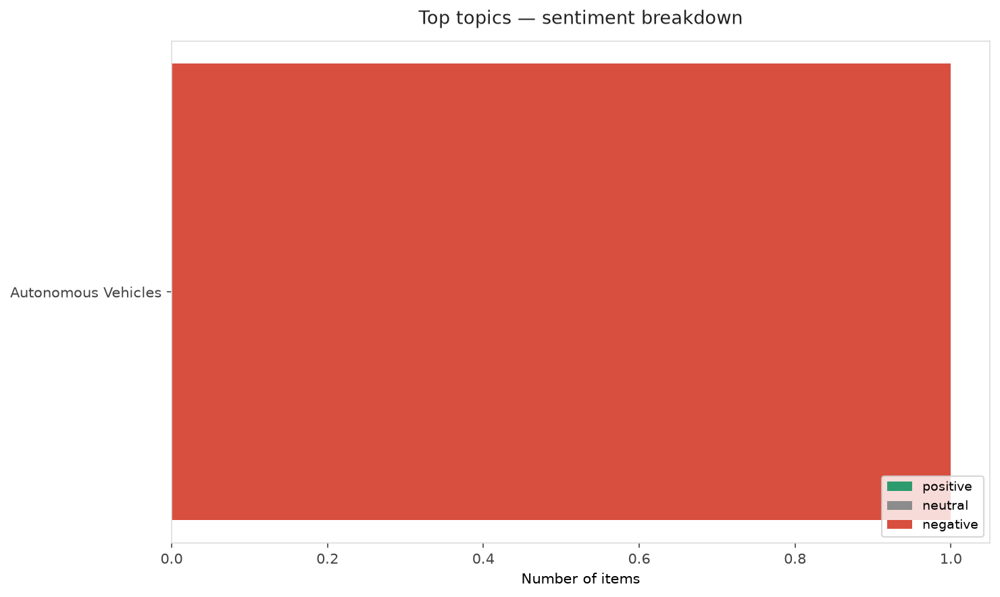
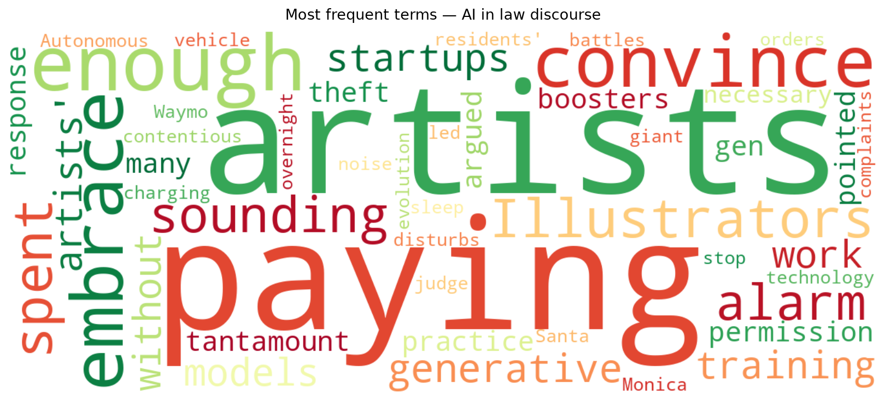
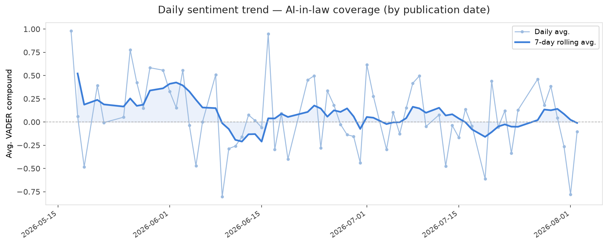
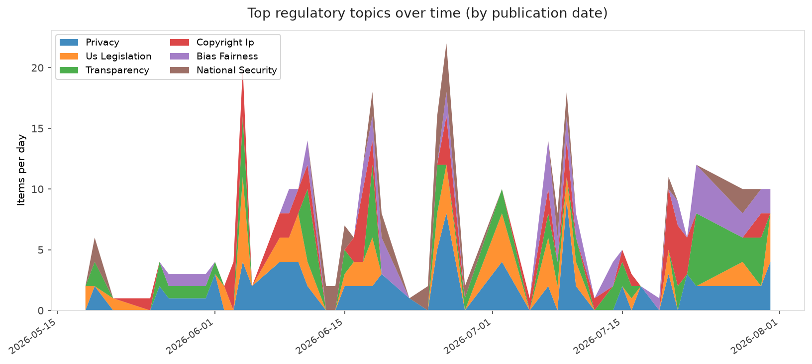
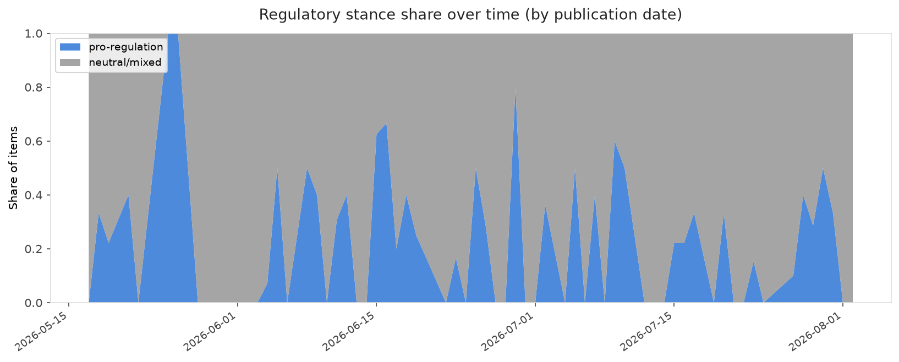

# AI in Law — Daily Sentiment Report
**Run date:** 2026-08-03 | **Items analyzed:** 2 | **Overall:** 🔴 Mildly negative (-0.441)

_Articles in this report were published between **2026-08-01** and **2026-08-02**._

---

## Summary

Today's collection covers **2** items from news outlets, academic preprints, Reddit, and regulatory sources.
Compared to the historical average of **+0.255**, today's sentiment is ↓ **0.696** points lower.

| Metric | Value |
|--------|-------|
| Positive items | 0 (0.0%) |
| Neutral items  | 0 (0.0%) |
| Negative items | 2 (100.0%) |
| Avg. VADER compound | -0.4405 |
| Pro-regulation items | 0 |
| Anti-regulation items | 0 |

---

## Top Topics Today

- **Autonomous Vehicles** — 1 items

---

## Most Positive Coverage

- [Is paying artists enough to convince them to embrace AI?](https://www.theverge.com/ai-artificial-intelligence/974018/pippa-seedance-artist-royalties)  
  _The Verge AI_ — VADER: `-0.103`
- [After noise complaints, judge orders Waymo to stop overnight charging in Santa Monica](https://arstechnica.com/tech-policy/2026/08/after-noise-complaints-judge-orders-waymo-to-stop-overnight-charging-in-santa-monica/)  
  _Ars Technica Tech Policy_ — VADER: `-0.778`

---

## Most Critical / Negative Coverage

- [After noise complaints, judge orders Waymo to stop overnight charging in Santa Monica](https://arstechnica.com/tech-policy/2026/08/after-noise-complaints-judge-orders-waymo-to-stop-overnight-charging-in-santa-monica/)  
  _Ars Technica Tech Policy_ — VADER: `-0.778`
- [Is paying artists enough to convince them to embrace AI?](https://www.theverge.com/ai-artificial-intelligence/974018/pippa-seedance-artist-royalties)  
  _The Verge AI_ — VADER: `-0.103`

---

## Visualizations — Today

## Visualizations — Trends Over Time

---

## Methodology

- **VADER** (Valence Aware Dictionary and sEntiment Reasoner) — compound score in [-1, 1].
- **Topic tagging** — regex keyword matching across 12 AI-law sub-domains.
- **Stance detection** — keyword-based pro/anti-regulation signal detection.
- **Date filter** — items are kept only if their *publication* date falls within the look-back window (default 2 days).
- Sources: RSS news feeds, arXiv academic API, Reddit (PRAW), Regulations.gov API.

_Generated automatically on 2026-08-03 13:45 UTC._
