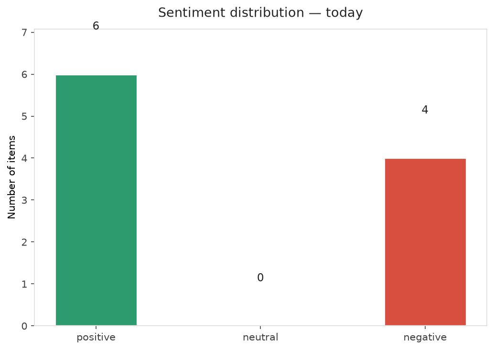
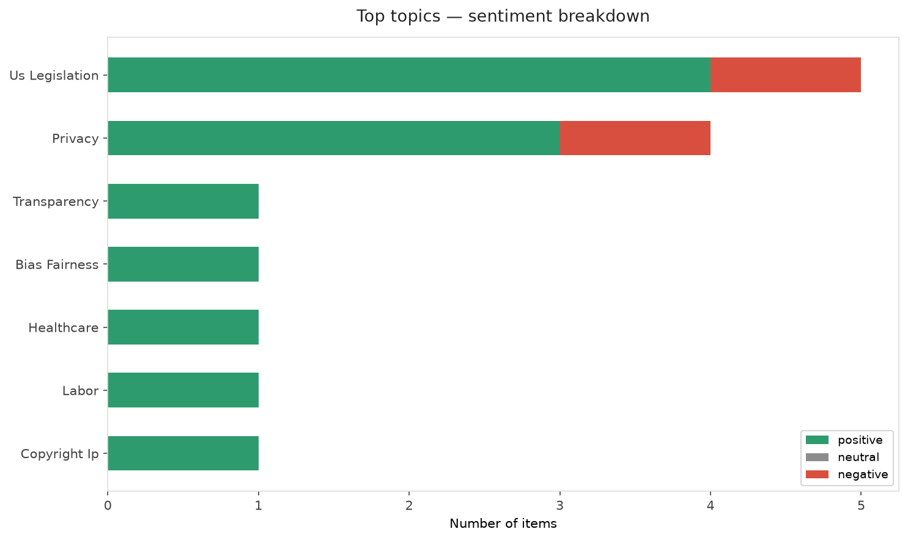
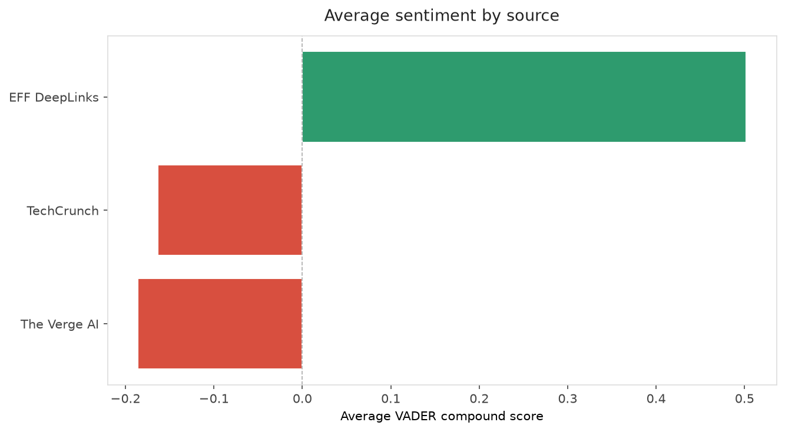
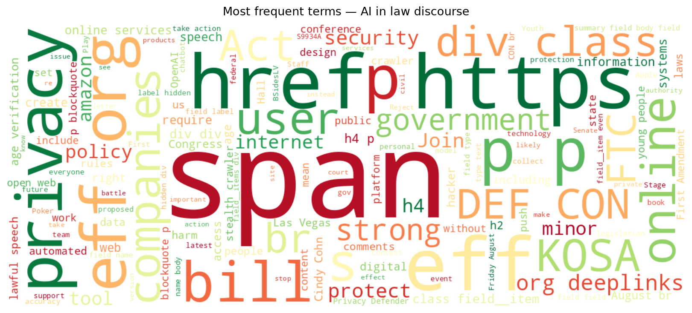
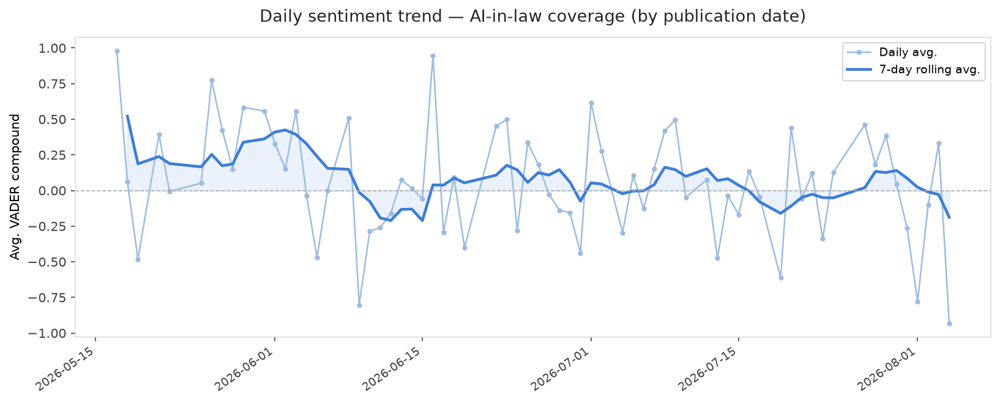
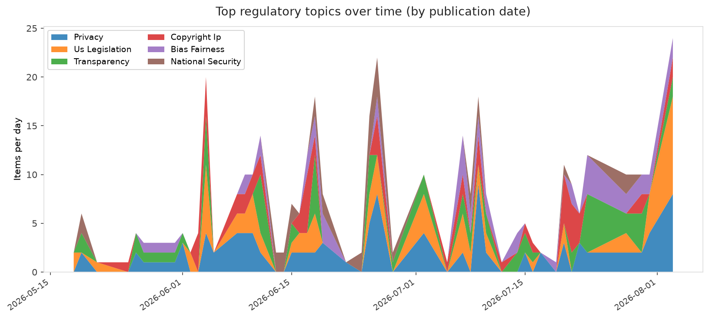
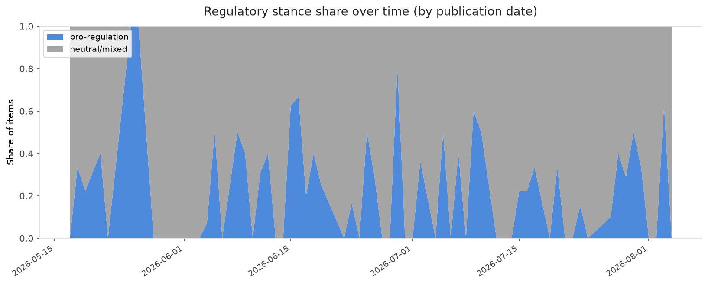

# AI in Law — Daily Sentiment Report
**Run date:** 2026-08-04 | **Items analyzed:** 10 | **Overall:** 🟢 Mildly positive (+0.162)

_Articles in this report were published between **2026-08-02** and **2026-08-04**._

---

## Summary

Today's collection covers **10** items from news outlets, academic preprints, Reddit, and regulatory sources.
Compared to the historical average of **+0.254**, today's sentiment is ↓ **0.092** points lower.

| Metric | Value |
|--------|-------|
| Positive items | 6 (60.0%) |
| Neutral items  | 0 (0.0%) |
| Negative items | 4 (40.0%) |
| Avg. VADER compound | +0.1624 |
| Pro-regulation items | 5 |
| Anti-regulation items | 0 |

---

## Top Topics Today

- **Us Legislation** — 5 items
- **Privacy** — 4 items
- **Transparency** — 1 items
- **Bias Fairness** — 1 items
- **Healthcare** — 1 items

---

## Most Positive Coverage

- [EFF at BSidesLV, Black Hat, and DEF CON 👨‍💻](https://www.eff.org/deeplinks/2026/07/eff-bsideslv-black-hat-and-def-con)  
  _EFF DeepLinks_ — VADER: `+0.993`
- [The Senate Should Reject KOSA's Privacy Risks](https://www.eff.org/deeplinks/2026/08/senate-should-reject-kosas-privacy-risks)  
  _EFF DeepLinks_ — VADER: `+0.838`
- [EFF Joins 18 Civil Rights Organizations Calling on Governor Hochul to Reject the Stealth Crawler Pro](https://www.eff.org/deeplinks/2026/08/eff-joins-18-civil-rights-organizations-calling-governor-hochul-reject-stealth)  
  _EFF DeepLinks_ — VADER: `+0.751`

---

## Most Critical / Negative Coverage

- [OpenAI drags Apple’s lawsuit into the court of public opinion](https://www.theverge.com/ai-artificial-intelligence/974914/openai-blog-response-apple-lawsuit-messages)  
  _The Verge AI_ — VADER: `-0.932`
- [Who’s legally to blame for Anthropic and OpenAI’s autonomous AI hacks? It’s complicated](https://techcrunch.com/2026/08/03/whos-legally-to-blame-for-anthropic-and-openais-autonomous-ai-hacks-its-complicated/)  
  _TechCrunch_ — VADER: `-0.821`
- [The Youth AI Privacy Act’s Privacy Paradox](https://www.eff.org/deeplinks/2026/08/youth-ai-privacy-acts-privacy-paradox)  
  _EFF DeepLinks_ — VADER: `-0.226`

---

## Visualizations — Today

## Visualizations — Trends Over Time

---

## Methodology

- **VADER** (Valence Aware Dictionary and sEntiment Reasoner) — compound score in [-1, 1].
- **Topic tagging** — regex keyword matching across 12 AI-law sub-domains.
- **Stance detection** — keyword-based pro/anti-regulation signal detection.
- **Date filter** — items are kept only if their *publication* date falls within the look-back window (default 2 days).
- Sources: RSS news feeds, arXiv academic API, Reddit (PRAW), Regulations.gov API.

_Generated automatically on 2026-08-04 13:05 UTC._
