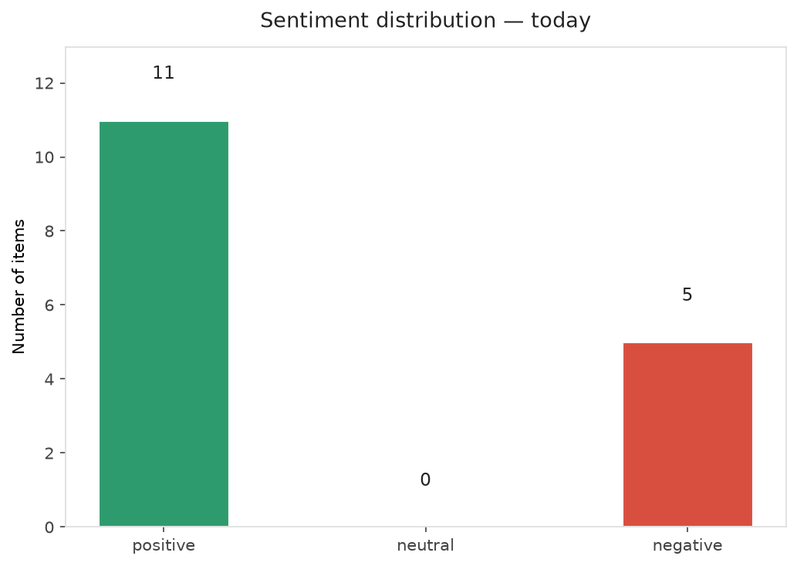
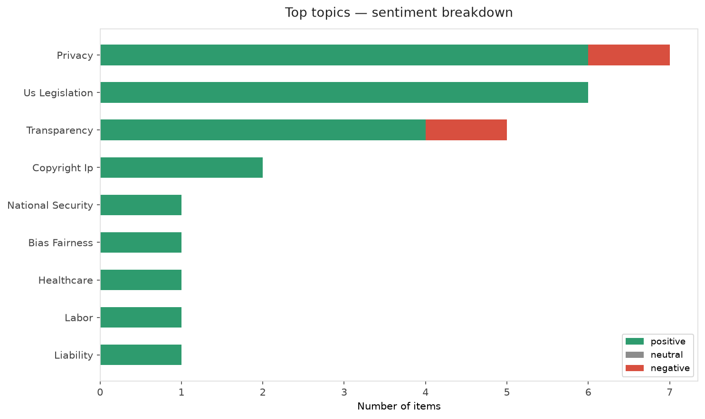
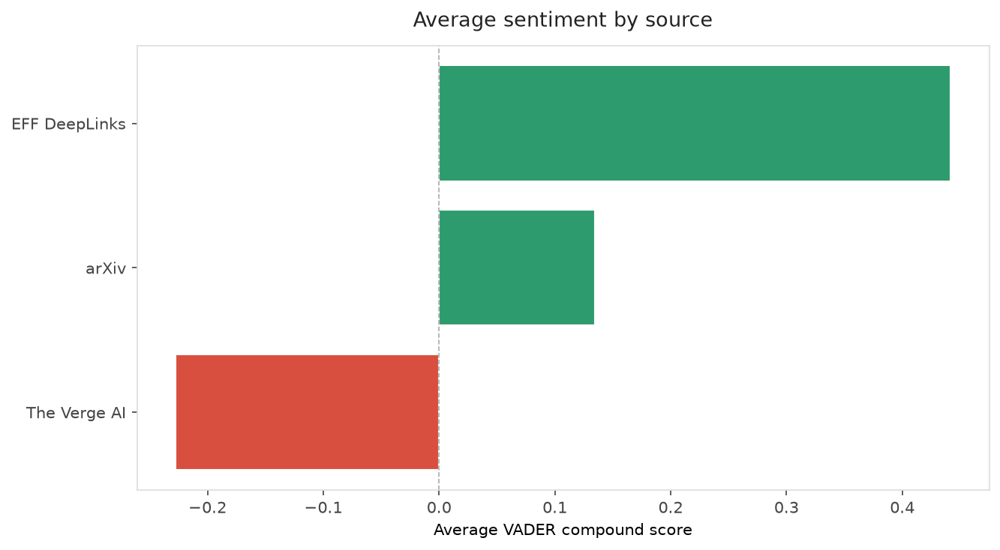
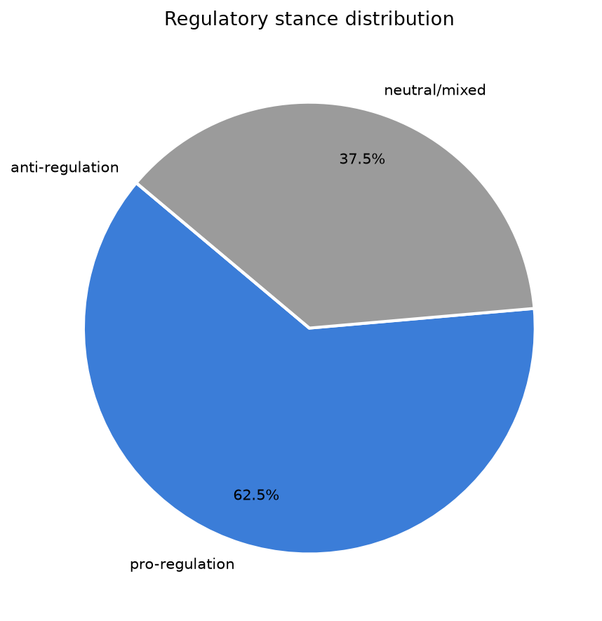
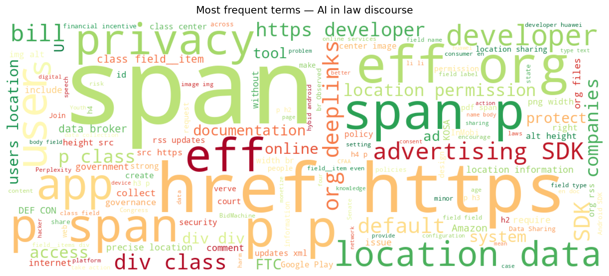
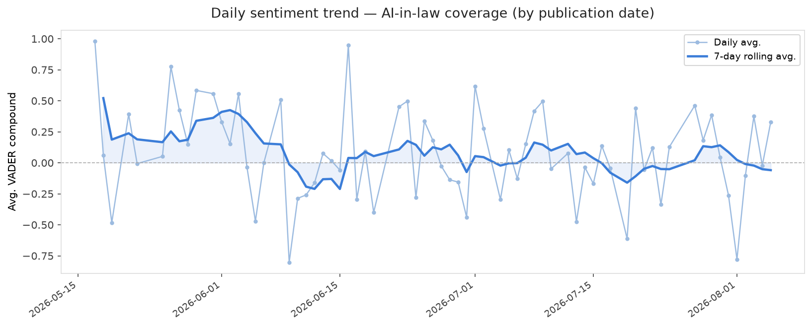
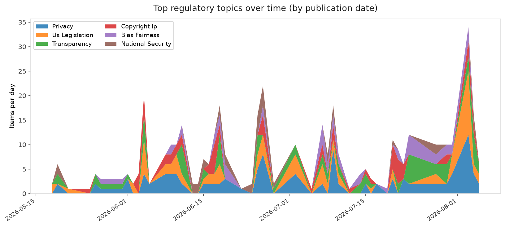
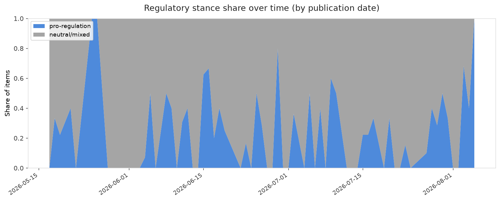

# AI in Law — Daily Sentiment Report
**Run date:** 2026-08-05 | **Items analyzed:** 16 | **Overall:** 🟢 Mildly positive (+0.234)

_Articles in this report were published between **2026-08-03** and **2026-08-05**._

---

## Summary

Today's collection covers **16** items from news outlets, academic preprints, Reddit, and regulatory sources.
Compared to the historical average of **+0.254**, today's sentiment is ↓ **0.019** points lower.

| Metric | Value |
|--------|-------|
| Positive items | 11 (68.8%) |
| Neutral items  | 0 (0.0%) |
| Negative items | 5 (31.2%) |
| Avg. VADER compound | +0.2345 |
| Pro-regulation items | 10 |
| Anti-regulation items | 0 |

---

## Top Topics Today

- **Privacy** — 7 items
- **Us Legislation** — 6 items
- **Transparency** — 5 items
- **Copyright Ip** — 2 items
- **National Security** — 1 items

---

## Most Positive Coverage

- [EFF at BSidesLV, Black Hat, and DEF CON 👨‍💻](https://www.eff.org/deeplinks/2026/07/eff-bsideslv-black-hat-and-def-con)  
  _EFF DeepLinks_ — VADER: `+0.993`
- [Making AI Visible, Not Vanished: How AI Policies Reshape Developer Experience on GitHub](https://arxiv.org/abs/2608.03329v1)  
  _arXiv_ — VADER: `+0.952`
- [Tomorrow’s U.S. Senate Vote: Four Internet Bills, One Wrong Direction](https://www.eff.org/deeplinks/2026/08/senate-vote-tomorrow-four-internet-bills-one-wrong-direction)  
  _EFF DeepLinks_ — VADER: `+0.933`

---

## Most Critical / Negative Coverage

- [OpenAI drags Apple’s lawsuit into the court of public opinion](https://www.theverge.com/ai-artificial-intelligence/974914/openai-blog-response-apple-lawsuit-messages)  
  _The Verge AI_ — VADER: `-0.932`
- [Appeals Court Agrees with EFF that Building a Web Browser Doesn’t Violate the CFAA](https://www.eff.org/deeplinks/2026/08/appeals-court-agrees-eff-building-web-browser-doesnt-violate-cfaa)  
  _EFF DeepLinks_ — VADER: `-0.793`
- [AI Governance for Institutional Readiness in Finance](https://arxiv.org/abs/2608.02311v1)  
  _arXiv_ — VADER: `-0.612`

---

## Visualizations — Today

## Visualizations — Trends Over Time

---

## Methodology

- **VADER** (Valence Aware Dictionary and sEntiment Reasoner) — compound score in [-1, 1].
- **Topic tagging** — regex keyword matching across 12 AI-law sub-domains.
- **Stance detection** — keyword-based pro/anti-regulation signal detection.
- **Date filter** — items are kept only if their *publication* date falls within the look-back window (default 2 days).
- Sources: RSS news feeds, arXiv academic API, Reddit (PRAW), Regulations.gov API.

_Generated automatically on 2026-08-05 12:53 UTC._
