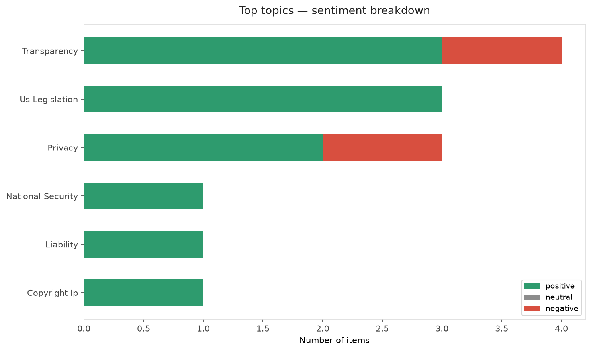
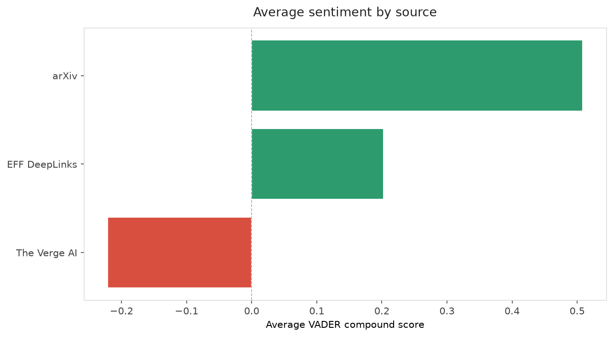
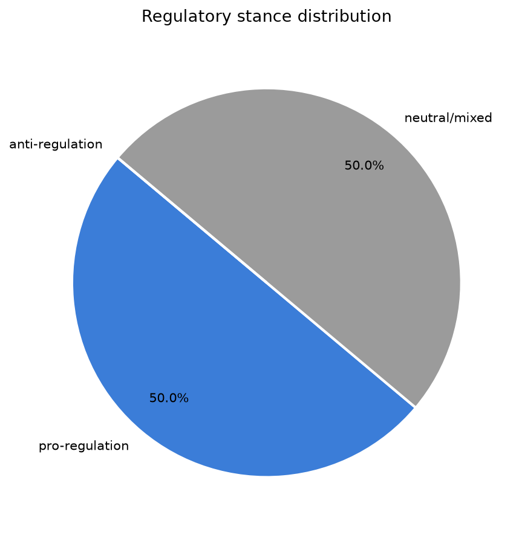
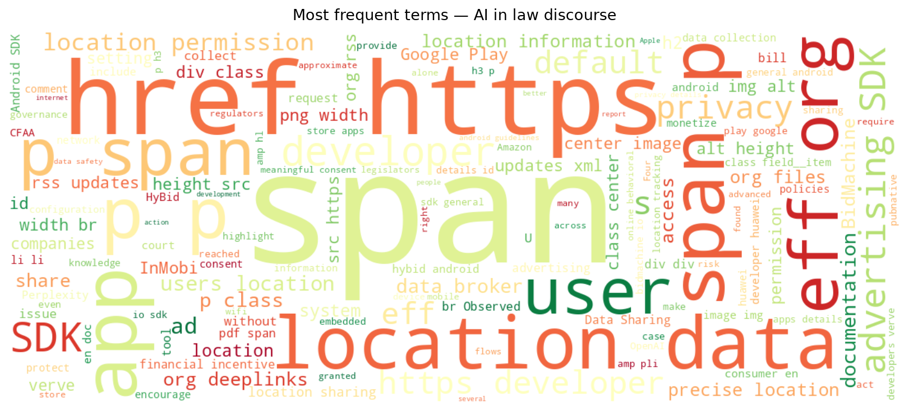
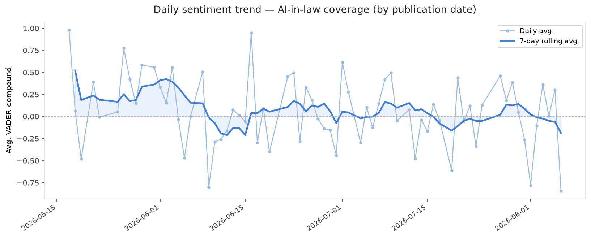
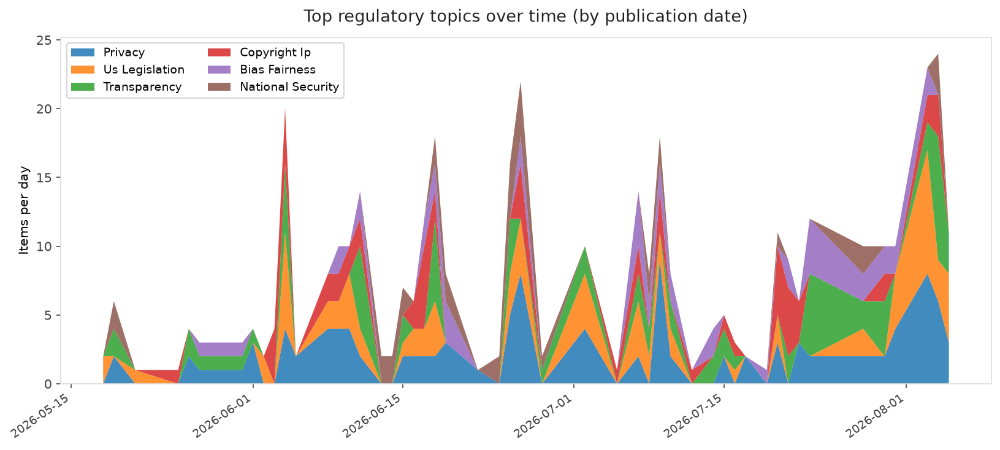
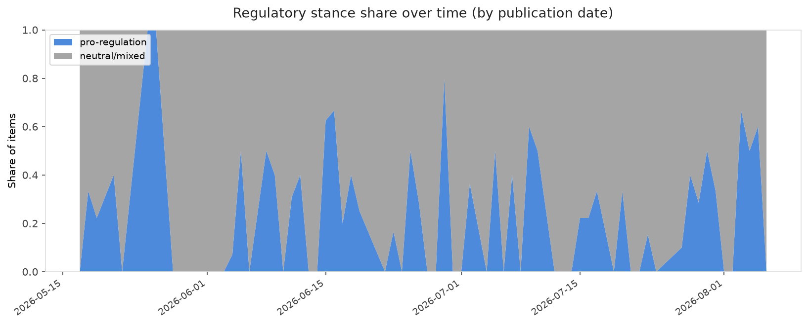

# AI in Law — Daily Sentiment Report
**Run date:** 2026-08-06 | **Items analyzed:** 10 | **Overall:** 🟢 Mildly positive (+0.069)

_Articles in this report were published between **2026-08-04** and **2026-08-06**._

---

## Summary

Today's collection covers **10** items from news outlets, academic preprints, Reddit, and regulatory sources.
Compared to the historical average of **+0.252**, today's sentiment is ↓ **0.182** points lower.

| Metric | Value |
|--------|-------|
| Positive items | 6 (60.0%) |
| Neutral items  | 0 (0.0%) |
| Negative items | 4 (40.0%) |
| Avg. VADER compound | +0.0695 |
| Pro-regulation items | 5 |
| Anti-regulation items | 0 |

---

## Top Topics Today

- **Transparency** — 4 items
- **Us Legislation** — 3 items
- **Privacy** — 3 items
- **National Security** — 1 items
- **Liability** — 1 items

---

## Most Positive Coverage

- [Making AI Visible, Not Vanished: How AI Policies Reshape Developer Experience on GitHub](https://arxiv.org/abs/2608.03329v1)  
  _arXiv_ — VADER: `+0.952`
- [Tomorrow’s U.S. Senate Vote: Four Internet Bills, One Wrong Direction](https://www.eff.org/deeplinks/2026/08/senate-vote-tomorrow-four-internet-bills-one-wrong-direction)  
  _EFF DeepLinks_ — VADER: `+0.933`
- [Developers: Beware of Ad Libraries that Betray Your Users’ Location Privacy](https://www.eff.org/deeplinks/2026/07/developers-beware-ad-libraries-betray-your-users-location-privacy)  
  _EFF DeepLinks_ — VADER: `+0.468`

---

## Most Critical / Negative Coverage

- [OpenAI says Apple’s trade secrets lawsuit is ‘rotten to its core’](https://www.theverge.com/tech/976042/openai-apple-trade-secrets-lawsuit-dismissal-request)  
  _The Verge AI_ — VADER: `-0.844`
- [Appeals Court Agrees with EFF that Building a Web Browser Doesn’t Violate the CFAA](https://www.eff.org/deeplinks/2026/08/appeals-court-agrees-eff-building-web-browser-doesnt-violate-cfaa)  
  _EFF DeepLinks_ — VADER: `-0.793`
- [OpenAI says Apple's trade secrets lawsuit is "aggressive and oddly personal"](https://arstechnica.com/tech-policy/2026/08/openai-says-apples-trade-secrets-lawsuit-is-aggressive-and-oddly-personal/)  
  _Ars Technica Tech Policy_ — VADER: `-0.326`

---

## Visualizations — Today

## Visualizations — Trends Over Time

---

## Methodology

- **VADER** (Valence Aware Dictionary and sEntiment Reasoner) — compound score in [-1, 1].
- **Topic tagging** — regex keyword matching across 12 AI-law sub-domains.
- **Stance detection** — keyword-based pro/anti-regulation signal detection.
- **Date filter** — items are kept only if their *publication* date falls within the look-back window (default 2 days).
- Sources: RSS news feeds, arXiv academic API, Reddit (PRAW), Regulations.gov API.

_Generated automatically on 2026-08-06 12:58 UTC._
