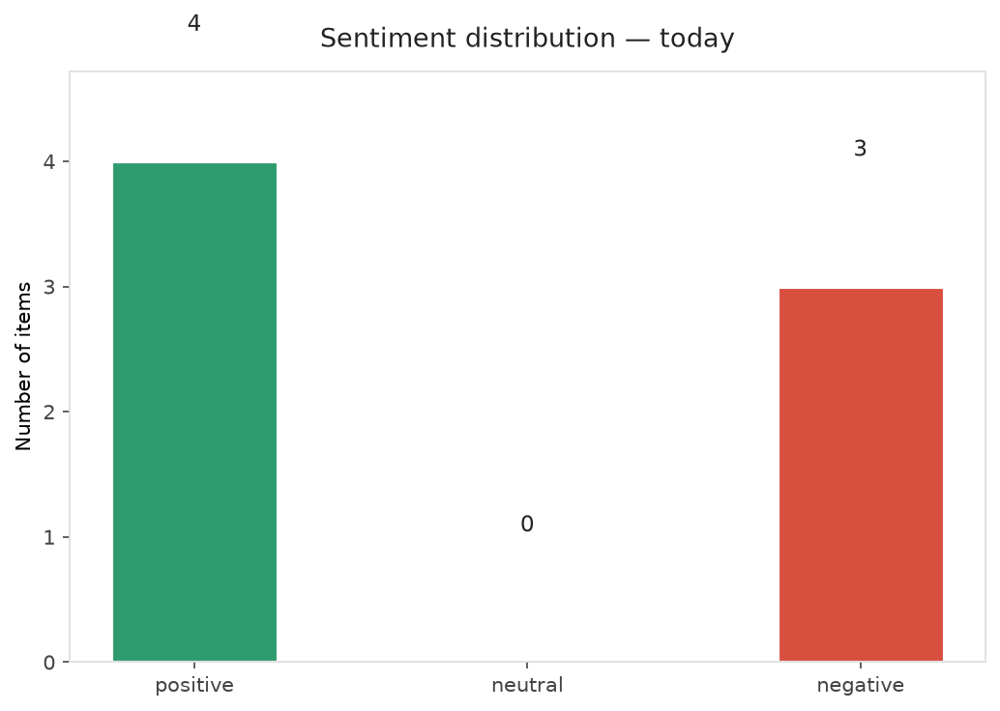
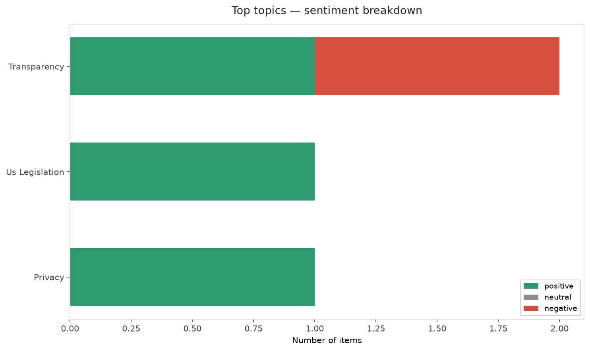
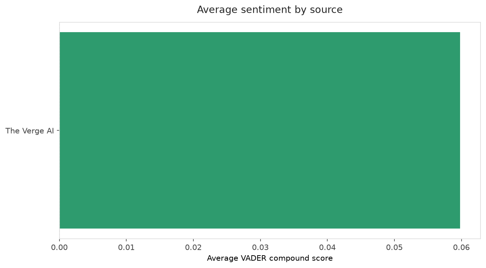
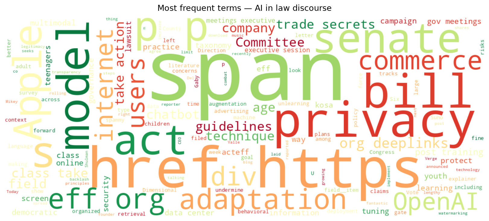
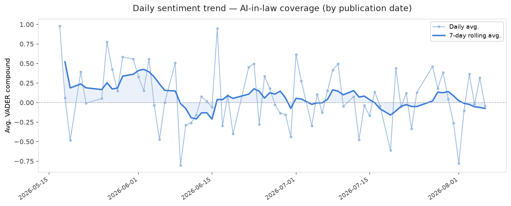
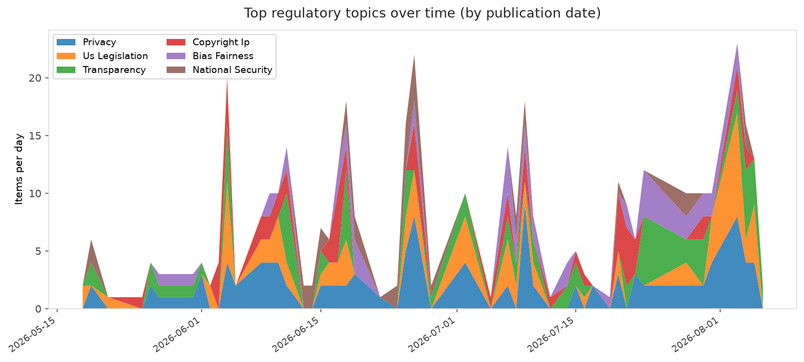
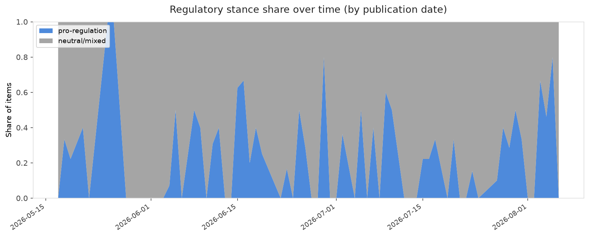

# AI in Law — Daily Sentiment Report
**Run date:** 2026-08-07 | **Items analyzed:** 7 | **Overall:** 🟢 Mildly positive (+0.120)

_Articles in this report were published between **2026-08-05** and **2026-08-06**._

---

## Summary

Today's collection covers **7** items from news outlets, academic preprints, Reddit, and regulatory sources.
Compared to the historical average of **+0.251**, today's sentiment is ↓ **0.131** points lower.

| Metric | Value |
|--------|-------|
| Positive items | 4 (57.1%) |
| Neutral items  | 0 (0.0%) |
| Negative items | 3 (42.9%) |
| Avg. VADER compound | +0.1199 |
| Pro-regulation items | 2 |
| Anti-regulation items | 0 |

---

## Top Topics Today

- **Transparency** — 2 items
- **Us Legislation** — 1 items
- **Privacy** — 1 items

---

## Most Positive Coverage

- [Tomorrow’s U.S. Senate Vote: Four Internet Bills, One Wrong Direction](https://www.eff.org/deeplinks/2026/08/senate-vote-tomorrow-four-internet-bills-one-wrong-direction)  
  _EFF DeepLinks_ — VADER: `+0.933`
- [The left and right agree on one thing: no data centers](https://www.theverge.com/podcast/971855/ai-data-center-backlash-protests-florida-bipartisan)  
  _The Verge AI_ — VADER: `+0.751`
- [Suno shares plans to combat spammy AI music](https://www.theverge.com/ai-artificial-intelligence/976289/suno-ai-music-spam-watermark)  
  _The Verge AI_ — VADER: `+0.273`

---

## Most Critical / Negative Coverage

- [OpenAI says Apple’s trade secrets lawsuit is ‘rotten to its core’](https://www.theverge.com/tech/976042/openai-apple-trade-secrets-lawsuit-dismissal-request)  
  _The Verge AI_ — VADER: `-0.844`
- [Chatbots & Democratic Decisionmakers – Guidelines](https://algorithmwatch.org/en/chatbots-democratic-decisionmakers-guidelines/)  
  _AlgorithmWatch_ — VADER: `-0.273`
- [OpenAI says Apple’s own security practices undermine its trade secrets case](https://techcrunch.com/2026/08/06/openai-says-apples-own-security-practices-undermine-its-trade-secrets-case/)  
  _TechCrunch_ — VADER: `-0.128`

---

## Visualizations — Today

## Visualizations — Trends Over Time

---

## Methodology

- **VADER** (Valence Aware Dictionary and sEntiment Reasoner) — compound score in [-1, 1].
- **Topic tagging** — regex keyword matching across 12 AI-law sub-domains.
- **Stance detection** — keyword-based pro/anti-regulation signal detection.
- **Date filter** — items are kept only if their *publication* date falls within the look-back window (default 2 days).
- Sources: RSS news feeds, arXiv academic API, Reddit (PRAW), Regulations.gov API.

_Generated automatically on 2026-08-07 11:46 UTC._
