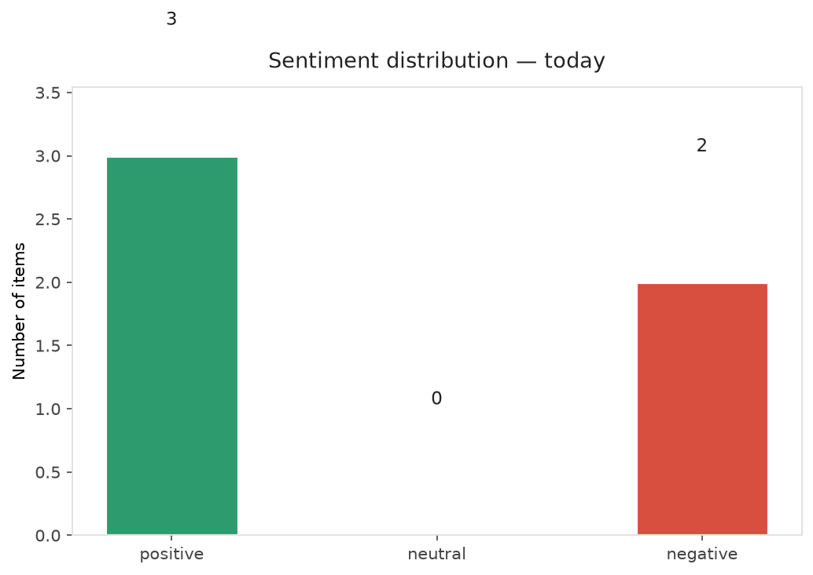
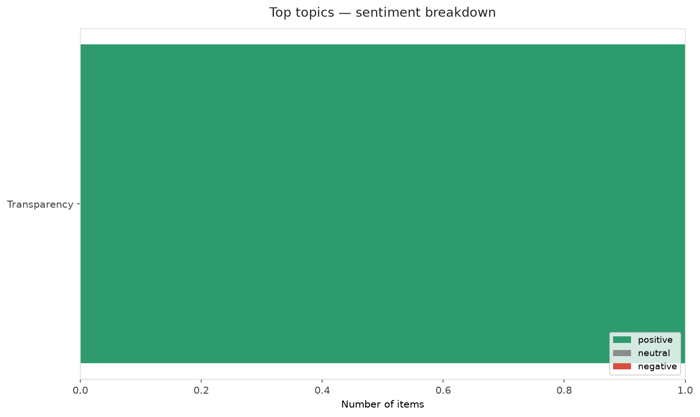
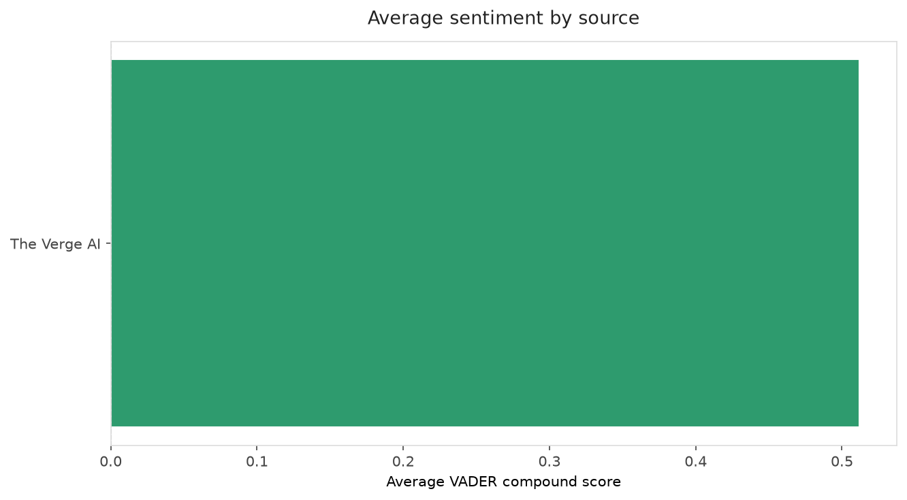
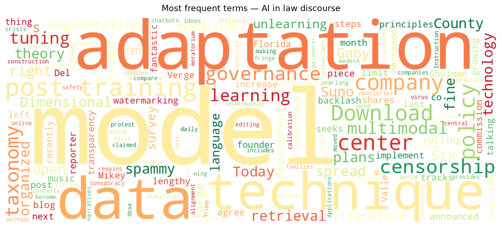
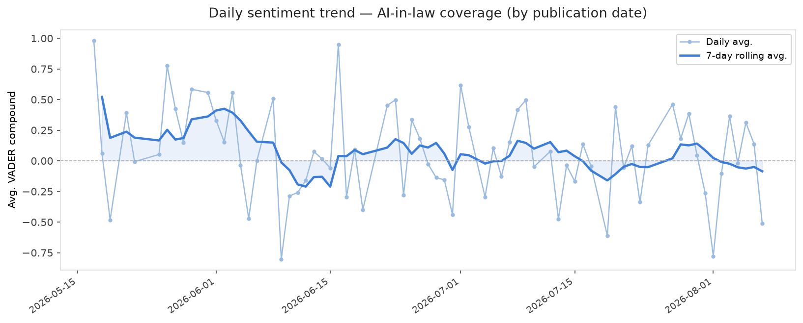
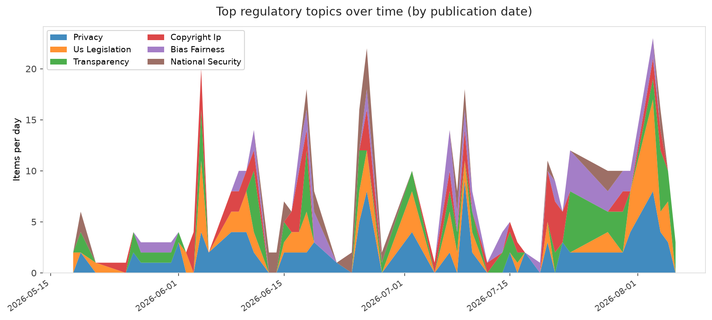

# AI in Law — Daily Sentiment Report
**Run date:** 2026-08-08 | **Items analyzed:** 5 | **Overall:** ⚪ Neutral / mixed (+0.026)

_Articles in this report were published between **2026-08-06** and **2026-08-07**._

---

## Summary

Today's collection covers **5** items from news outlets, academic preprints, Reddit, and regulatory sources.
Compared to the historical average of **+0.249**, today's sentiment is ↓ **0.223** points lower.

| Metric | Value |
|--------|-------|
| Positive items | 3 (60.0%) |
| Neutral items  | 0 (0.0%) |
| Negative items | 2 (40.0%) |
| Avg. VADER compound | +0.0262 |
| Pro-regulation items | 0 |
| Anti-regulation items | 0 |

---

## Top Topics Today

- **Transparency** — 1 items

---

## Most Positive Coverage

- [The left and right agree on one thing: no data centers](https://www.theverge.com/podcast/971855/ai-data-center-backlash-protests-florida-bipartisan)  
  _The Verge AI_ — VADER: `+0.751`
- [Suno shares plans to combat spammy AI music](https://www.theverge.com/ai-artificial-intelligence/976289/suno-ai-music-spam-watermark)  
  _The Verge AI_ — VADER: `+0.273`
- [A Six-Dimensional Taxonomy of Post-Training Adaptation Techniques with Applications in AI Governance](https://arxiv.org/abs/2608.06246v1)  
  _arXiv_ — VADER: `+0.128`

---

## Most Critical / Negative Coverage

- [AI chatbots have failed people in crisis. Can that be fixed?](https://arstechnica.com/ai/2026/08/ai-chatbots-have-failed-people-in-crisis-can-that-be-fixed/)  
  _Ars Technica Tech Policy_ — VADER: `-0.681`
- [The Download: a censorship conspiracy theory and the first virus created by AI](https://www.technologyreview.com/2026/08/07/1141389/the-download-censorship-conspiracy-theory-first-ai-virus/)  
  _MIT Tech Review_ — VADER: `-0.340`
- [A Six-Dimensional Taxonomy of Post-Training Adaptation Techniques with Applications in AI Governance](https://arxiv.org/abs/2608.06246v1)  
  _arXiv_ — VADER: `+0.128`

---

## Visualizations — Today

## Visualizations — Trends Over Time

---

## Methodology

- **VADER** (Valence Aware Dictionary and sEntiment Reasoner) — compound score in [-1, 1].
- **Topic tagging** — regex keyword matching across 12 AI-law sub-domains.
- **Stance detection** — keyword-based pro/anti-regulation signal detection.
- **Date filter** — items are kept only if their *publication* date falls within the look-back window (default 2 days).
- Sources: RSS news feeds, arXiv academic API, Reddit (PRAW), Regulations.gov API.

_Generated automatically on 2026-08-08 11:31 UTC._
