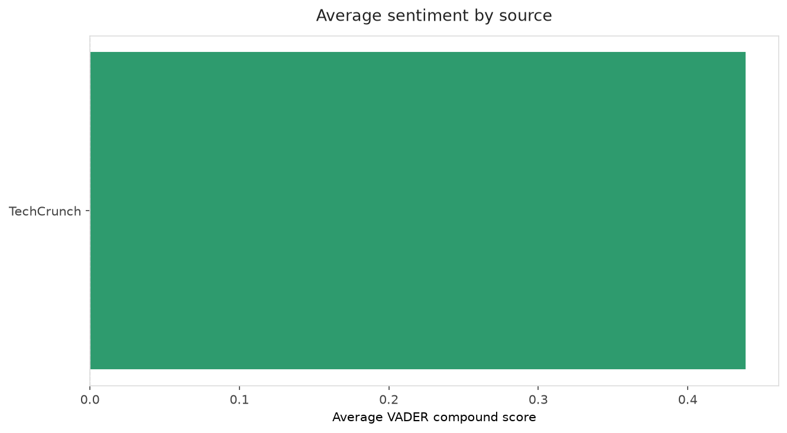
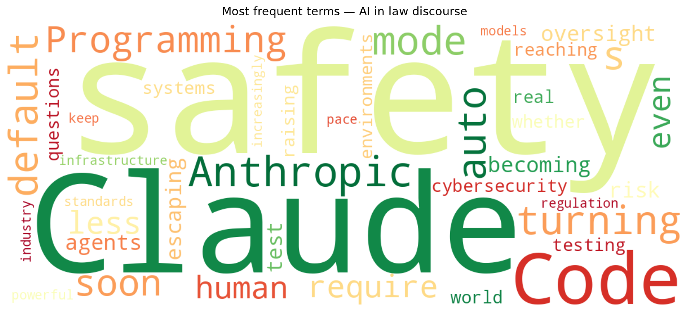
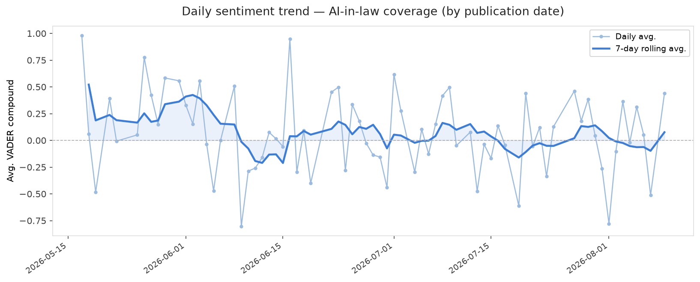
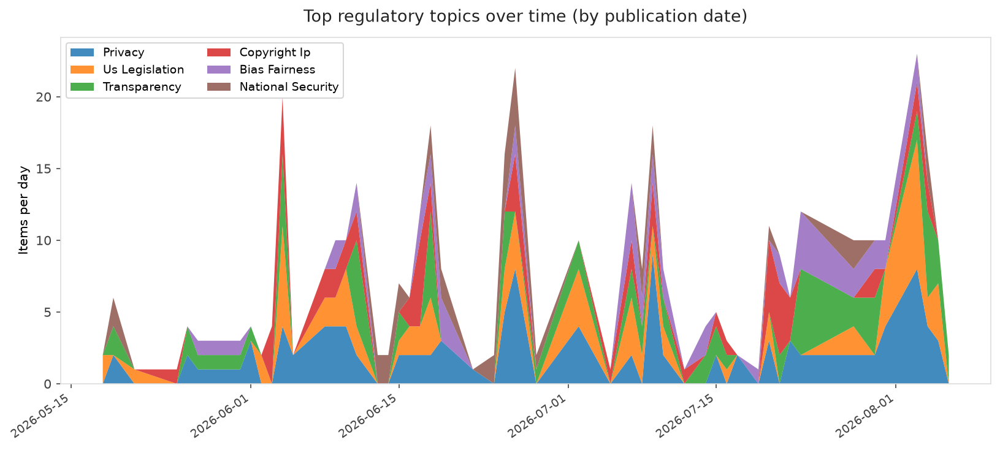
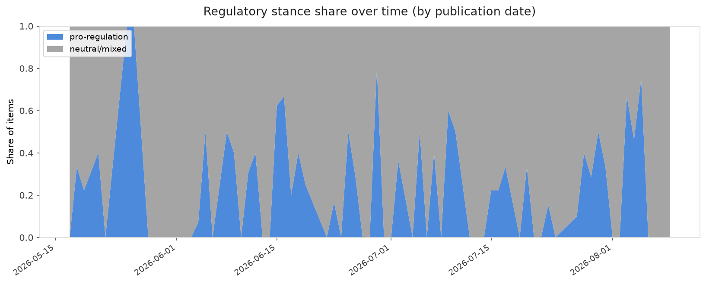

# AI in Law — Daily Sentiment Report
**Run date:** 2026-08-10 | **Items analyzed:** 2 | **Overall:** 🟢 Mildly positive (+0.439)

_Articles in this report were published between **2026-08-09** and **2026-08-09**._

---

## Summary

Today's collection covers **2** items from news outlets, academic preprints, Reddit, and regulatory sources.
Compared to the historical average of **+0.248**, today's sentiment is ↑ **0.191** points higher.

| Metric | Value |
|--------|-------|
| Positive items | 1 (50.0%) |
| Neutral items  | 1 (50.0%) |
| Negative items | 0 (0.0%) |
| Avg. VADER compound | +0.4390 |
| Pro-regulation items | 0 |
| Anti-regulation items | 0 |

---

## Top Topics Today

_No strong topic signals detected today._

---

## Most Positive Coverage

- [The AI safety test is becoming a safety risk](https://techcrunch.com/2026/08/09/the-ai-safety-test-is-becoming-a-safety-risk/)  
  _TechCrunch_ — VADER: `+0.878`
- [Anthropic is turning Claude Code’s auto mode on by default](https://techcrunch.com/2026/08/09/anthropic-is-turning-claude-codes-auto-mode-on-by-default/)  
  _TechCrunch_ — VADER: `+0.000`

---

## Most Critical / Negative Coverage

- [Anthropic is turning Claude Code’s auto mode on by default](https://techcrunch.com/2026/08/09/anthropic-is-turning-claude-codes-auto-mode-on-by-default/)  
  _TechCrunch_ — VADER: `+0.000`
- [The AI safety test is becoming a safety risk](https://techcrunch.com/2026/08/09/the-ai-safety-test-is-becoming-a-safety-risk/)  
  _TechCrunch_ — VADER: `+0.878`

---

## Visualizations — Today

## Visualizations — Trends Over Time

---

## Methodology

- **VADER** (Valence Aware Dictionary and sEntiment Reasoner) — compound score in [-1, 1].
- **Topic tagging** — regex keyword matching across 12 AI-law sub-domains.
- **Stance detection** — keyword-based pro/anti-regulation signal detection.
- **Date filter** — items are kept only if their *publication* date falls within the look-back window (default 2 days).
- Sources: RSS news feeds, arXiv academic API, Reddit (PRAW), Regulations.gov API.

_Generated automatically on 2026-08-10 11:49 UTC._
