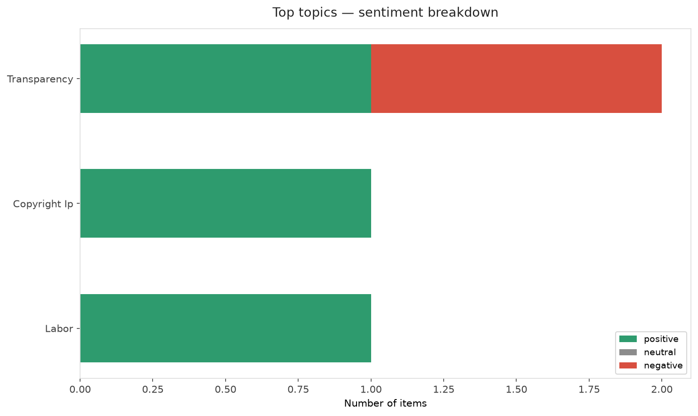
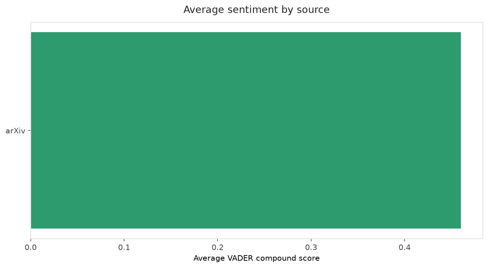
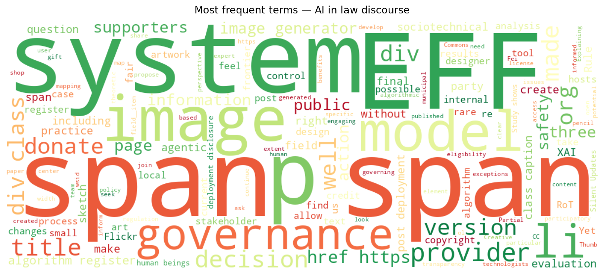
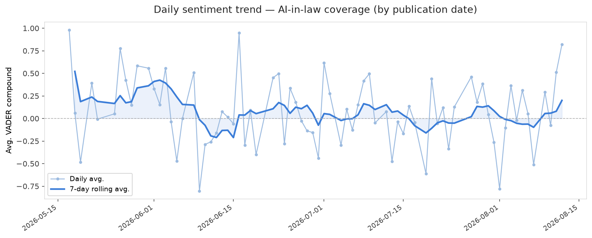
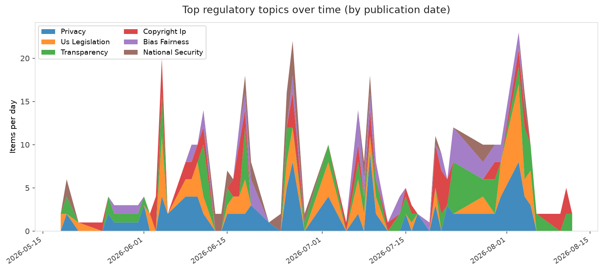
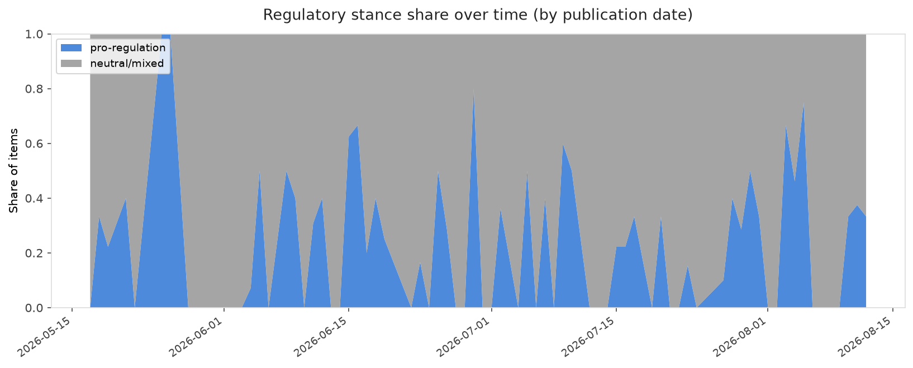

# AI in Law — Daily Sentiment Report
**Run date:** 2026-08-13 | **Items analyzed:** 6 | **Overall:** 🟢 Mildly positive (+0.594)

_Articles in this report were published between **2026-08-11** and **2026-08-12**._

---

## Summary

Today's collection covers **6** items from news outlets, academic preprints, Reddit, and regulatory sources.
Compared to the historical average of **+0.251**, today's sentiment is ↑ **0.344** points higher.

| Metric | Value |
|--------|-------|
| Positive items | 5 (83.3%) |
| Neutral items  | 0 (0.0%) |
| Negative items | 1 (16.7%) |
| Avg. VADER compound | +0.5943 |
| Pro-regulation items | 2 |
| Anti-regulation items | 0 |

---

## Top Topics Today

- **Transparency** — 2 items
- **Copyright Ip** — 1 items
- **Labor** — 1 items

---

## Most Positive Coverage

- [Who (or What) Generates Images for EFF?](https://www.eff.org/deeplinks/2026/08/who-or-what-generates-images-eff)  
  _EFF DeepLinks_ — VADER: `+0.989`
- [Co-constructing sociotechnical AI governance: participatory system mapping using algorithm registers](https://arxiv.org/abs/2608.12166v1)  
  _arXiv_ — VADER: `+0.962`
- [Rule of Thumb: Explaining Artificial Intelligence Systems using Partial Information](https://arxiv.org/abs/2608.10766v1)  
  _arXiv_ — VADER: `+0.891`

---

## Most Critical / Negative Coverage

- [Governing Agentic AI in FinTech](https://arxiv.org/abs/2608.11344v1)  
  _arXiv_ — VADER: `-0.776`
- [As AI safety concerns mount, three pioneers make the case for staying open](https://techcrunch.com/2026/08/12/as-ai-safety-concerns-mount-three-pioneers-make-the-case-for-staying-open/)  
  _TechCrunch_ — VADER: `+0.735`
- [Silent Updates: Measuring and Closing the Post-Deployment Disclosure Gap](https://arxiv.org/abs/2608.11803v1)  
  _arXiv_ — VADER: `+0.765`

---

## Visualizations — Today

## Visualizations — Trends Over Time

---

## Methodology

- **VADER** (Valence Aware Dictionary and sEntiment Reasoner) — compound score in [-1, 1].
- **Topic tagging** — regex keyword matching across 12 AI-law sub-domains.
- **Stance detection** — keyword-based pro/anti-regulation signal detection.
- **Date filter** — items are kept only if their *publication* date falls within the look-back window (default 2 days).
- Sources: RSS news feeds, arXiv academic API, Reddit (PRAW), Regulations.gov API.

_Generated automatically on 2026-08-13 11:48 UTC._
