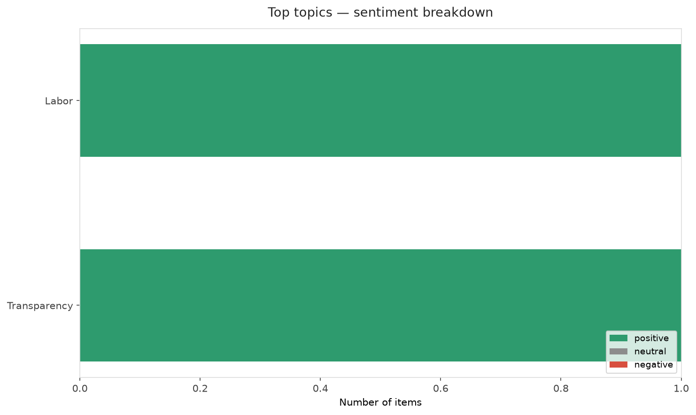
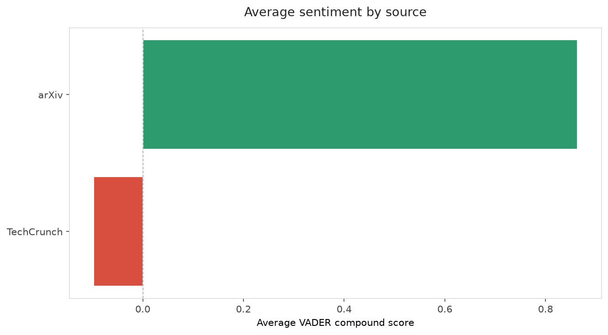
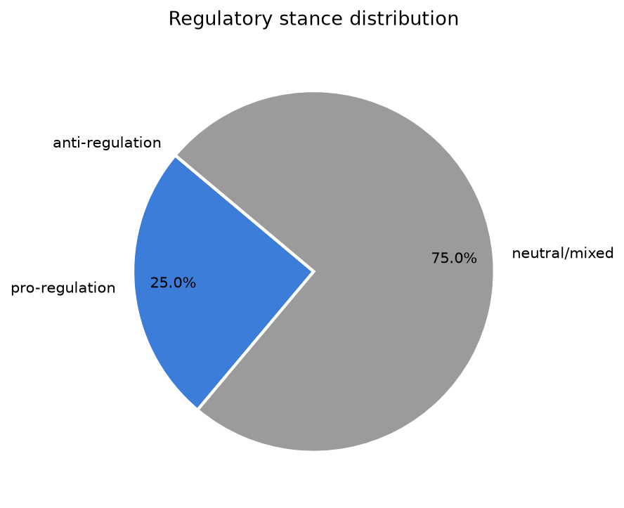
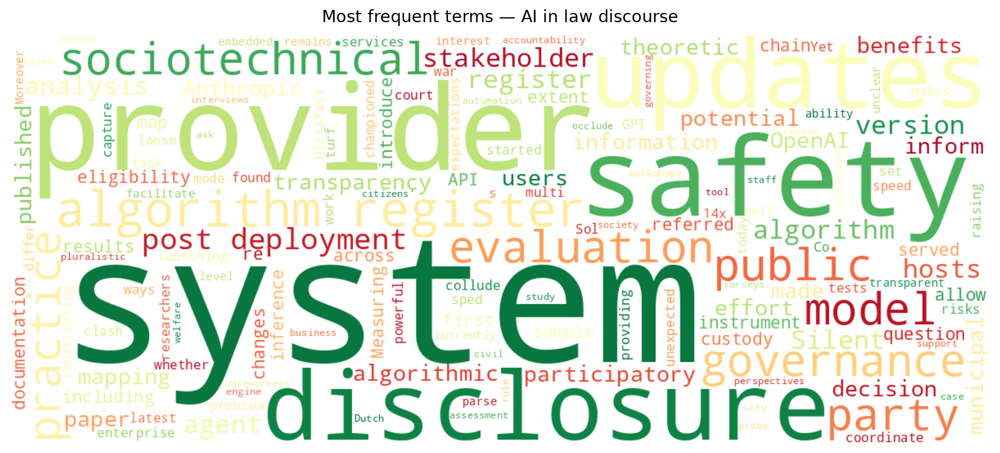
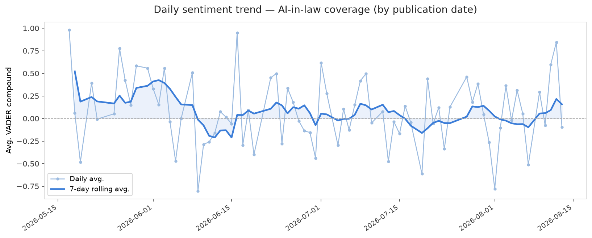
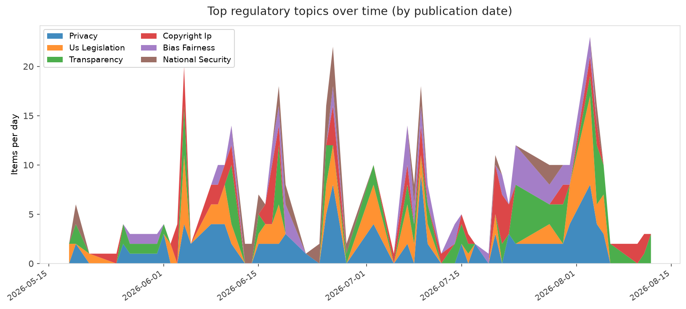
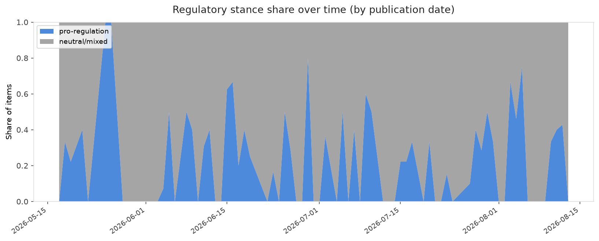

# AI in Law — Daily Sentiment Report
**Run date:** 2026-08-14 | **Items analyzed:** 4 | **Overall:** 🟢 Mildly positive (+0.383)

_Articles in this report were published between **2026-08-12** and **2026-08-13**._

---

## Summary

Today's collection covers **4** items from news outlets, academic preprints, Reddit, and regulatory sources.
Compared to the historical average of **+0.251**, today's sentiment is ↑ **0.132** points higher.

| Metric | Value |
|--------|-------|
| Positive items | 3 (75.0%) |
| Neutral items  | 0 (0.0%) |
| Negative items | 1 (25.0%) |
| Avg. VADER compound | +0.3829 |
| Pro-regulation items | 1 |
| Anti-regulation items | 0 |

---

## Top Topics Today

- **Labor** — 1 items
- **Transparency** — 1 items

---

## Most Positive Coverage

- [Co-constructing sociotechnical AI governance: participatory system mapping using algorithm registers](https://arxiv.org/abs/2608.12166v1)  
  _arXiv_ — VADER: `+0.962`
- [Silent Updates: Measuring and Closing the Post-Deployment Disclosure Gap](https://arxiv.org/abs/2608.11803v1)  
  _arXiv_ — VADER: `+0.765`
- [OpenAI introduces ‘Ultrafast,’ a new mode that makes GPT-5.6 Sol work at 14x the speed](https://techcrunch.com/2026/08/13/openai-introduces-ultrafast-a-new-mode-that-makes-gpt-5-6-sol-work-at-14x-the-speed/)  
  _TechCrunch_ — VADER: `+0.475`

---

## Most Critical / Negative Coverage

- [Anthropic set AI agents loose on the same task. They started a turf war.](https://techcrunch.com/2026/08/13/anthropic-set-ai-agents-loose-on-the-same-task-they-started-a-turf-war/)  
  _TechCrunch_ — VADER: `-0.670`
- [OpenAI introduces ‘Ultrafast,’ a new mode that makes GPT-5.6 Sol work at 14x the speed](https://techcrunch.com/2026/08/13/openai-introduces-ultrafast-a-new-mode-that-makes-gpt-5-6-sol-work-at-14x-the-speed/)  
  _TechCrunch_ — VADER: `+0.475`
- [Silent Updates: Measuring and Closing the Post-Deployment Disclosure Gap](https://arxiv.org/abs/2608.11803v1)  
  _arXiv_ — VADER: `+0.765`

---

## Visualizations — Today

## Visualizations — Trends Over Time

---

## Methodology

- **VADER** (Valence Aware Dictionary and sEntiment Reasoner) — compound score in [-1, 1].
- **Topic tagging** — regex keyword matching across 12 AI-law sub-domains.
- **Stance detection** — keyword-based pro/anti-regulation signal detection.
- **Date filter** — items are kept only if their *publication* date falls within the look-back window (default 2 days).
- Sources: RSS news feeds, arXiv academic API, Reddit (PRAW), Regulations.gov API.

_Generated automatically on 2026-08-14 11:44 UTC._
