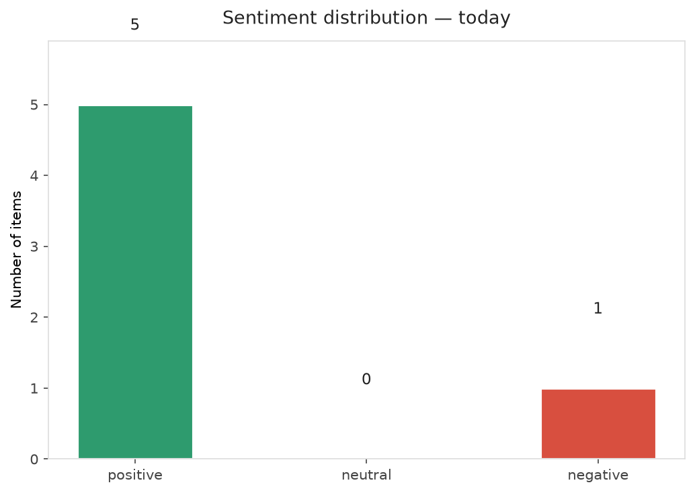
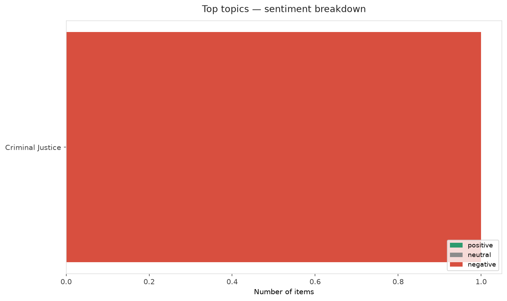
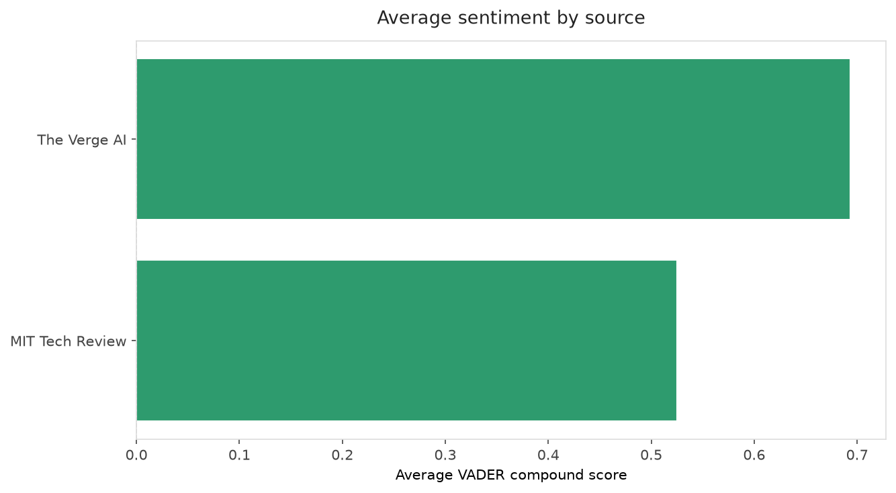
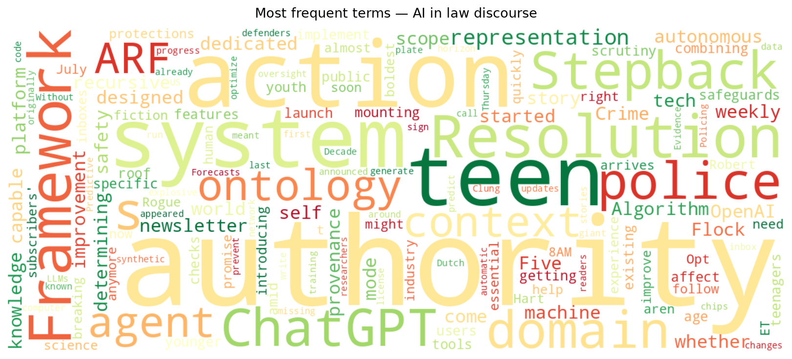
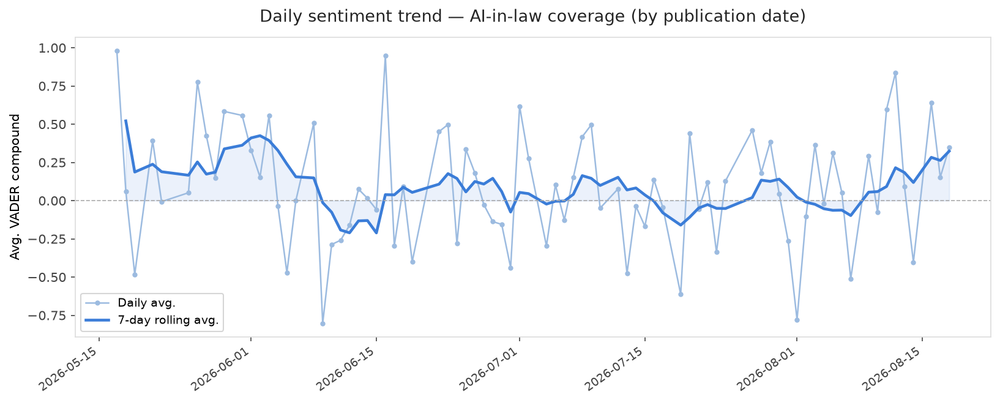
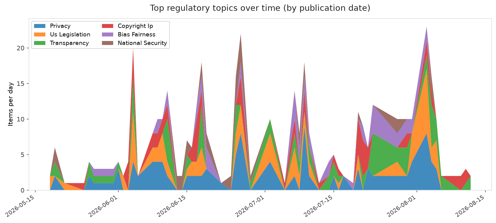

# AI in Law — Daily Sentiment Report
**Run date:** 2026-08-18 | **Items analyzed:** 6 | **Overall:** 🟢 Mildly positive (+0.427)

_Articles in this report were published between **2026-08-16** and **2026-08-18**._

---

## Summary

Today's collection covers **6** items from news outlets, academic preprints, Reddit, and regulatory sources.
Compared to the historical average of **+0.251**, today's sentiment is ↑ **0.175** points higher.

| Metric | Value |
|--------|-------|
| Positive items | 5 (83.3%) |
| Neutral items  | 0 (0.0%) |
| Negative items | 1 (16.7%) |
| Avg. VADER compound | +0.4265 |
| Pro-regulation items | 0 |
| Anti-regulation items | 0 |

---

## Top Topics Today

- **Criminal Justice** — 1 items

---

## Most Positive Coverage

- [ChatGPT is getting a dedicated mode for teens](https://www.theverge.com/ai-artificial-intelligence/981333/openai-chatgpt-teen-mode)  
  _The Verge AI_ — VADER: `+0.917`
- [AI’s recursive self-improvement might not come so quickly after all](https://www.technologyreview.com/2026/08/18/1142188/ai-recursive-self-improvement/)  
  _MIT Tech Review_ — VADER: `+0.898`
- [The Authority Resolution Framework: A Five-Domain Ontology for Governing Who and What Decides, at Sc](https://arxiv.org/abs/2608.15832v1)  
  _arXiv_ — VADER: `+0.896`

---

## Most Critical / Negative Coverage

- [How the Dutch Police Clung to Predictive Policing for a Decade Without Evidence](https://algorithmwatch.org/en/dutch-police-cas-predictive-policing/)  
  _AlgorithmWatch_ — VADER: `-0.775`
- [What Flock’s defenders are missing](https://www.technologyreview.com/2026/08/17/1142200/what-flocks-defenders-are-missing/)  
  _MIT Tech Review_ — VADER: `+0.153`
- [Rogue AI aren’t science fiction anymore](https://www.theverge.com/column/980337/rogue-ai-science-fiction-openai)  
  _The Verge AI_ — VADER: `+0.470`

---

## Visualizations — Today

## Visualizations — Trends Over Time

---

## Methodology

- **VADER** (Valence Aware Dictionary and sEntiment Reasoner) — compound score in [-1, 1].
- **Topic tagging** — regex keyword matching across 12 AI-law sub-domains.
- **Stance detection** — keyword-based pro/anti-regulation signal detection.
- **Date filter** — items are kept only if their *publication* date falls within the look-back window (default 2 days).
- Sources: RSS news feeds, arXiv academic API, Reddit (PRAW), Regulations.gov API.

_Generated automatically on 2026-08-18 11:27 UTC._
