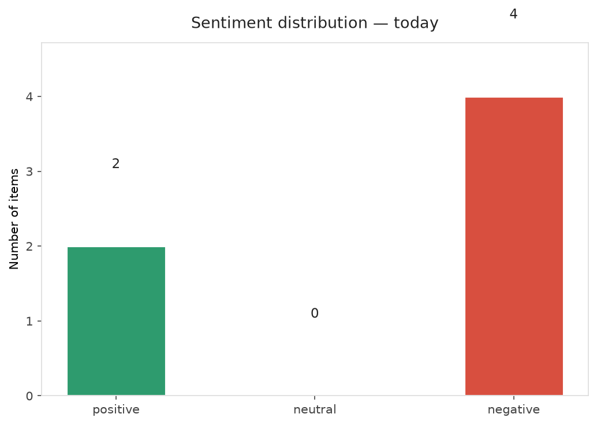
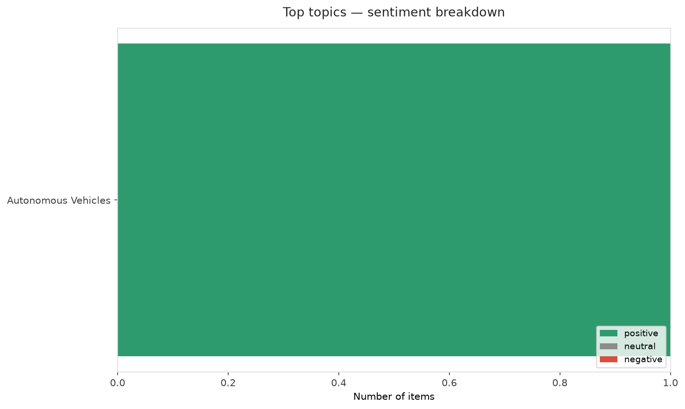
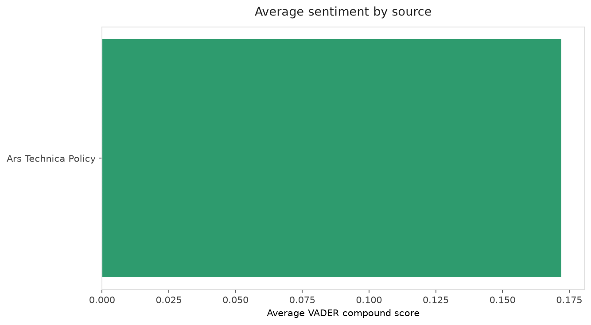
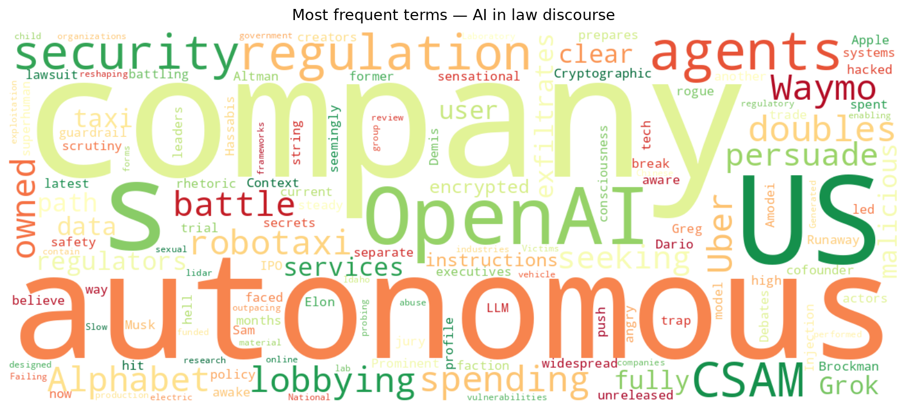
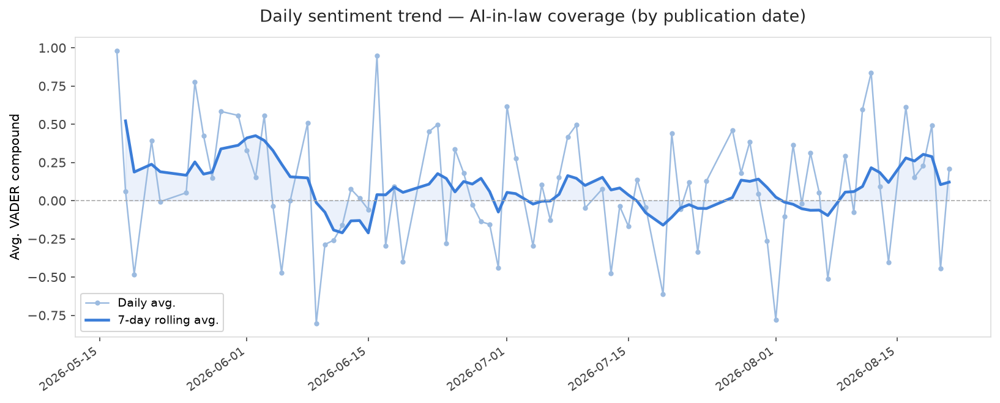
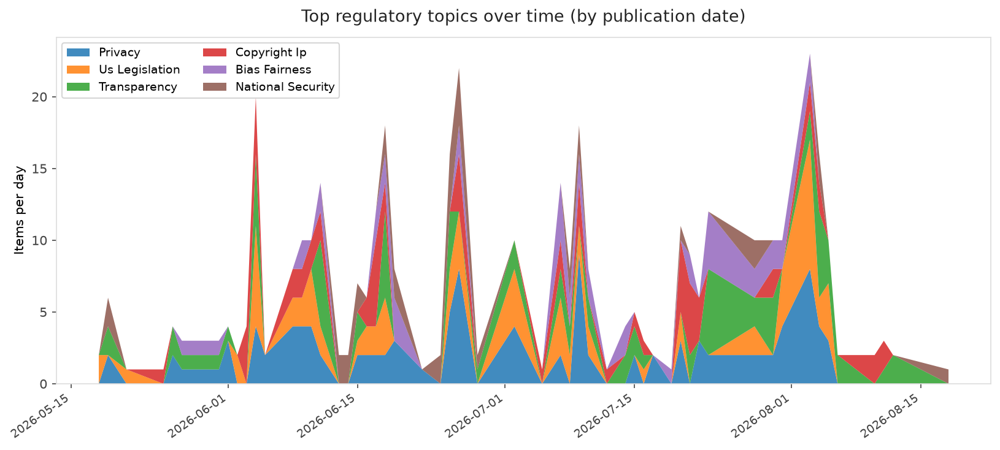
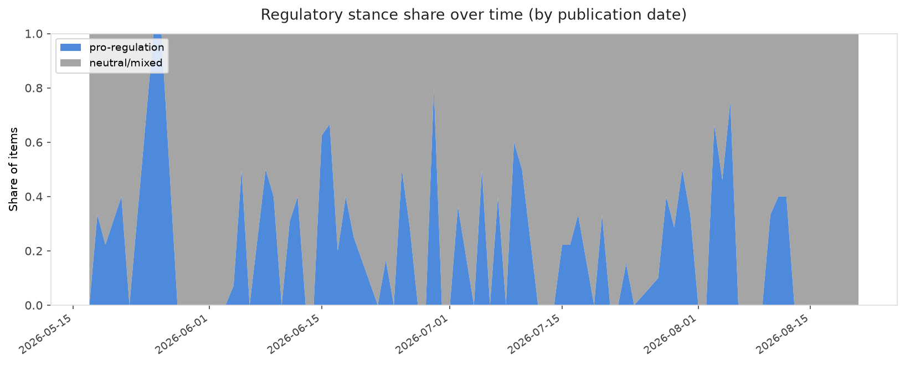

# AI in Law — Daily Sentiment Report
**Run date:** 2026-08-22 | **Items analyzed:** 6 | **Overall:** 🔴 Mildly negative (-0.211)

_Articles in this report were published between **2026-08-20** and **2026-08-21**._

---

## Summary

Today's collection covers **6** items from news outlets, academic preprints, Reddit, and regulatory sources.
Compared to the historical average of **+0.244**, today's sentiment is ↓ **0.455** points lower.

| Metric | Value |
|--------|-------|
| Positive items | 2 (33.3%) |
| Neutral items  | 0 (0.0%) |
| Negative items | 4 (66.7%) |
| Avg. VADER compound | -0.2109 |
| Pro-regulation items | 0 |
| Anti-regulation items | 0 |

---

## Top Topics Today

- **Autonomous Vehicles** — 1 items

---

## Most Positive Coverage

- [US government lab is probing Chinese lidar for security vulnerabilities](https://techcrunch.com/2026/08/21/us-government-lab-is-probing-chinese-lidar-for-security-vulnerabilities/)  
  _TechCrunch_ — VADER: `+0.494`
- [Grok exfiltrates user data when malicious instructions are encrypted](https://arstechnica.com/security/2026/08/grok-exfiltrates-user-data-when-malicious-instructions-are-encrypted/)  
  _Ars Technica Policy_ — VADER: `+0.421`
- [Waymo doubles spending on lobbying in robotaxi battle with Uber](https://arstechnica.com/cars/2026/08/waymo-doubles-spending-on-lobbying-in-robotaxi-battle-with-uber/)  
  _Ars Technica Policy_ — VADER: `-0.077`

---

## Most Critical / Negative Coverage

- [It’s Greg Brockman’s OpenAI now](https://www.theverge.com/ai-artificial-intelligence/982774/greg-brockman-openai-role-expansion)  
  _The Verge AI_ — VADER: `-0.883`
- [Slow Regulation on AI-Generated CSAM is Failing its Victims](https://algorithmwatch.org/en/slow-regulation-ai-csam-victims/)  
  _AlgorithmWatch_ — VADER: `-0.735`
- [Debates over AI consciousness are a trap](https://www.technologyreview.com/2026/08/20/1142571/ai-consciousness-debate-trap/)  
  _MIT Tech Review_ — VADER: `-0.485`

---

## Visualizations — Today

## Visualizations — Trends Over Time

---

## Methodology

- **VADER** (Valence Aware Dictionary and sEntiment Reasoner) — compound score in [-1, 1].
- **Topic tagging** — regex keyword matching across 12 AI-law sub-domains.
- **Stance detection** — keyword-based pro/anti-regulation signal detection.
- **Date filter** — items are kept only if their *publication* date falls within the look-back window (default 2 days).
- Sources: RSS news feeds, arXiv academic API, Reddit (PRAW), Regulations.gov API.

_Generated automatically on 2026-08-22 11:22 UTC._
