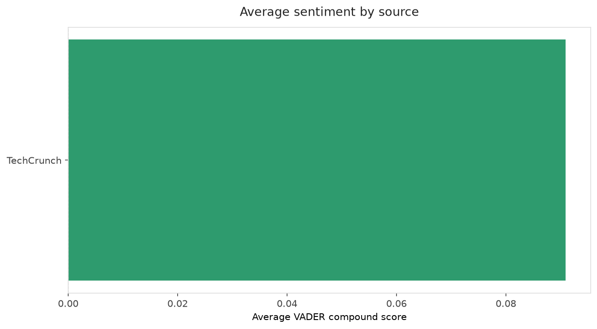
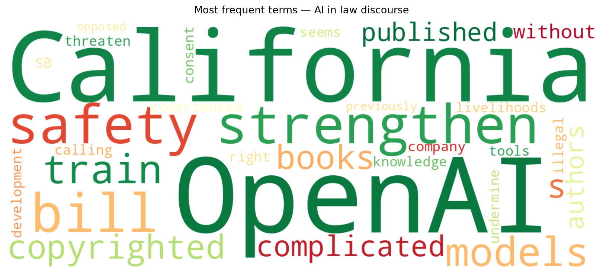
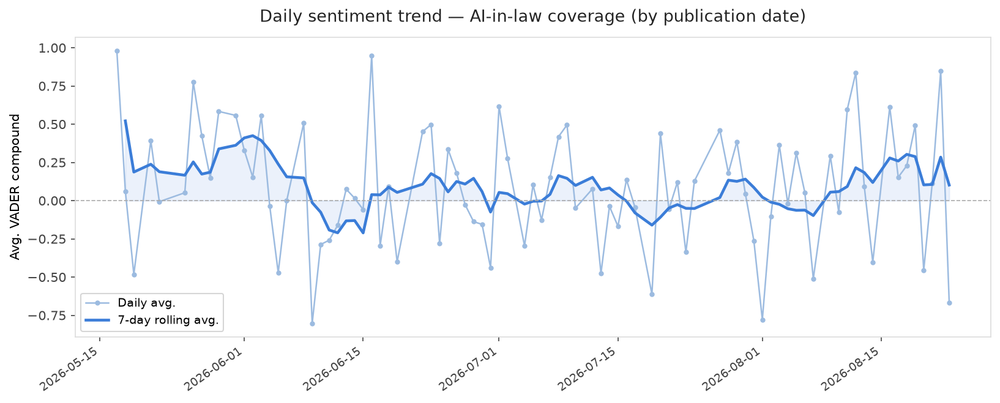
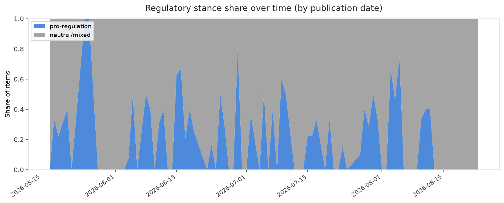

# AI in Law — Daily Sentiment Report
**Run date:** 2026-08-24 | **Items analyzed:** 2 | **Overall:** 🟢 Mildly positive (+0.091)

_Articles in this report were published between **2026-08-22** and **2026-08-23**._

---

## Summary

Today's collection covers **2** items from news outlets, academic preprints, Reddit, and regulatory sources.
Compared to the historical average of **+0.244**, today's sentiment is ↓ **0.153** points lower.

| Metric | Value |
|--------|-------|
| Positive items | 1 (50.0%) |
| Neutral items  | 0 (0.0%) |
| Negative items | 1 (50.0%) |
| Avg. VADER compound | +0.0909 |
| Pro-regulation items | 0 |
| Anti-regulation items | 0 |

---

## Top Topics Today

_No strong topic signals detected today._

---

## Most Positive Coverage

- [OpenAI says California should strengthen its AI safety bill](https://techcrunch.com/2026/08/22/openai-says-california-should-strengthen-its-ai-safety-bill/)  
  _TechCrunch_ — VADER: `+0.848`
- [Is it legal to train AI models on copyrighted books? It’s complicated](https://techcrunch.com/2026/08/23/is-it-legal-to-train-ai-models-on-copyrighted-books-its-complicated/)  
  _TechCrunch_ — VADER: `-0.666`

---

## Most Critical / Negative Coverage

- [Is it legal to train AI models on copyrighted books? It’s complicated](https://techcrunch.com/2026/08/23/is-it-legal-to-train-ai-models-on-copyrighted-books-its-complicated/)  
  _TechCrunch_ — VADER: `-0.666`
- [OpenAI says California should strengthen its AI safety bill](https://techcrunch.com/2026/08/22/openai-says-california-should-strengthen-its-ai-safety-bill/)  
  _TechCrunch_ — VADER: `+0.848`

---

## Visualizations — Today

## Visualizations — Trends Over Time

---

## Methodology

- **VADER** (Valence Aware Dictionary and sEntiment Reasoner) — compound score in [-1, 1].
- **Topic tagging** — regex keyword matching across 12 AI-law sub-domains.
- **Stance detection** — keyword-based pro/anti-regulation signal detection.
- **Date filter** — items are kept only if their *publication* date falls within the look-back window (default 2 days).
- Sources: RSS news feeds, arXiv academic API, Reddit (PRAW), Regulations.gov API.

_Generated automatically on 2026-08-24 11:29 UTC._
