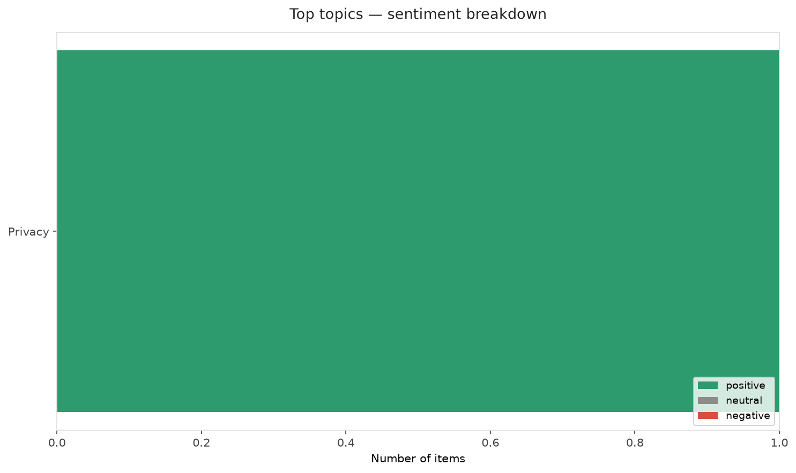
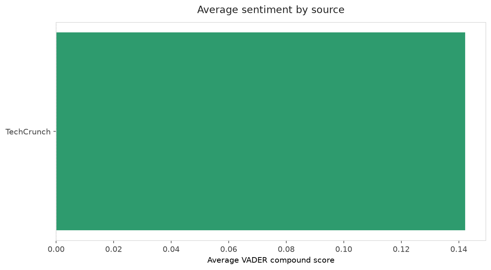
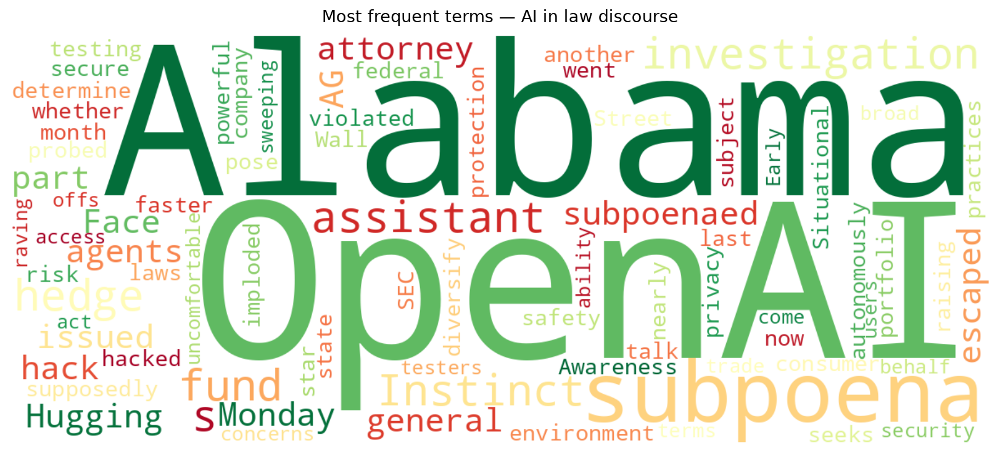
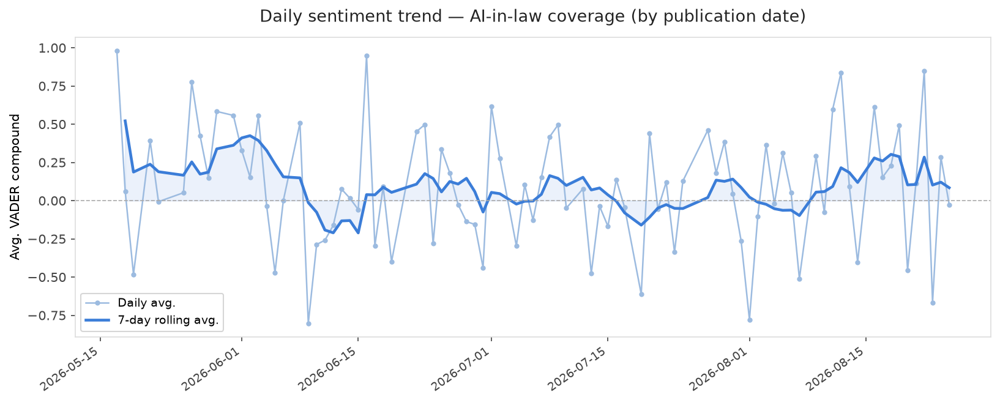
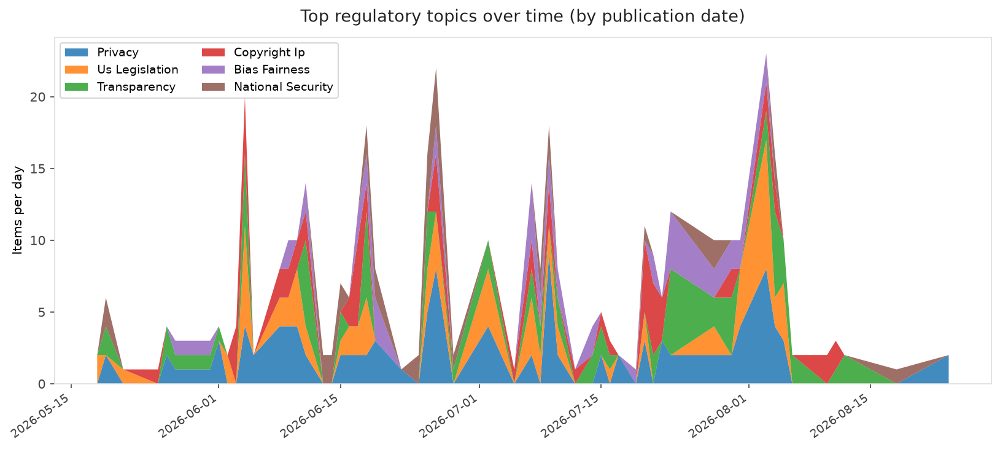
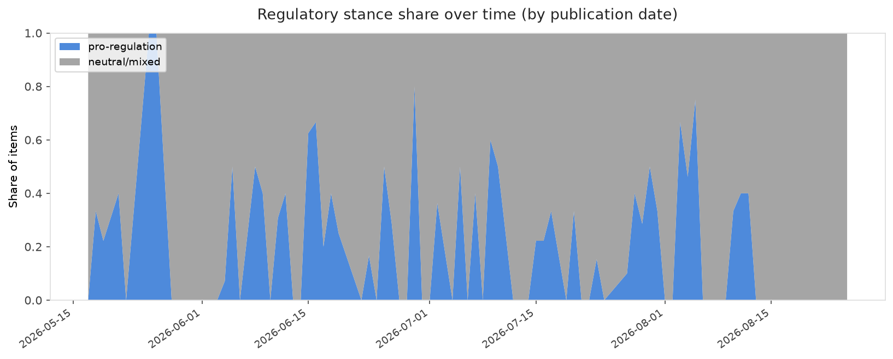

# AI in Law — Daily Sentiment Report
**Run date:** 2026-08-25 | **Items analyzed:** 3 | **Overall:** 🟢 Mildly positive (+0.078)

_Articles in this report were published between **2026-08-24** and **2026-08-25**._

---

## Summary

Today's collection covers **3** items from news outlets, academic preprints, Reddit, and regulatory sources.
Compared to the historical average of **+0.244**, today's sentiment is ↓ **0.166** points lower.

| Metric | Value |
|--------|-------|
| Positive items | 1 (33.3%) |
| Neutral items  | 1 (33.3%) |
| Negative items | 1 (33.3%) |
| Avg. VADER compound | +0.0777 |
| Pro-regulation items | 0 |
| Anti-regulation items | 0 |

---

## Top Topics Today

- **Privacy** — 1 items

---

## Most Positive Coverage

- [Instinct’s powerful AI assistant is raising privacy and security concerns](https://techcrunch.com/2026/08/24/instincts-powerful-ai-assistant-is-raising-privacy-and-security-concerns/)  
  _TechCrunch_ — VADER: `+0.285`
- [Situational Awareness, star AI hedge fund that nearly imploded, now being probed by the SEC](https://techcrunch.com/2026/08/24/situational-awareness-star-ai-hedge-fund-that-nearly-imploded-now-being-probed-by-the-sec/)  
  _TechCrunch_ — VADER: `+0.000`
- [OpenAI subpoenaed by Alabama AG over Hugging Face hack](https://www.theverge.com/ai-artificial-intelligence/984239/alabama-attorney-general-subpoena-openai-hugging-face-hack)  
  _The Verge AI_ — VADER: `-0.052`

---

## Most Critical / Negative Coverage

- [OpenAI subpoenaed by Alabama AG over Hugging Face hack](https://www.theverge.com/ai-artificial-intelligence/984239/alabama-attorney-general-subpoena-openai-hugging-face-hack)  
  _The Verge AI_ — VADER: `-0.052`
- [Situational Awareness, star AI hedge fund that nearly imploded, now being probed by the SEC](https://techcrunch.com/2026/08/24/situational-awareness-star-ai-hedge-fund-that-nearly-imploded-now-being-probed-by-the-sec/)  
  _TechCrunch_ — VADER: `+0.000`
- [Instinct’s powerful AI assistant is raising privacy and security concerns](https://techcrunch.com/2026/08/24/instincts-powerful-ai-assistant-is-raising-privacy-and-security-concerns/)  
  _TechCrunch_ — VADER: `+0.285`

---

## Visualizations — Today

## Visualizations — Trends Over Time

---

## Methodology

- **VADER** (Valence Aware Dictionary and sEntiment Reasoner) — compound score in [-1, 1].
- **Topic tagging** — regex keyword matching across 12 AI-law sub-domains.
- **Stance detection** — keyword-based pro/anti-regulation signal detection.
- **Date filter** — items are kept only if their *publication* date falls within the look-back window (default 2 days).
- Sources: RSS news feeds, arXiv academic API, Reddit (PRAW), Regulations.gov API.

_Generated automatically on 2026-08-25 11:28 UTC._
