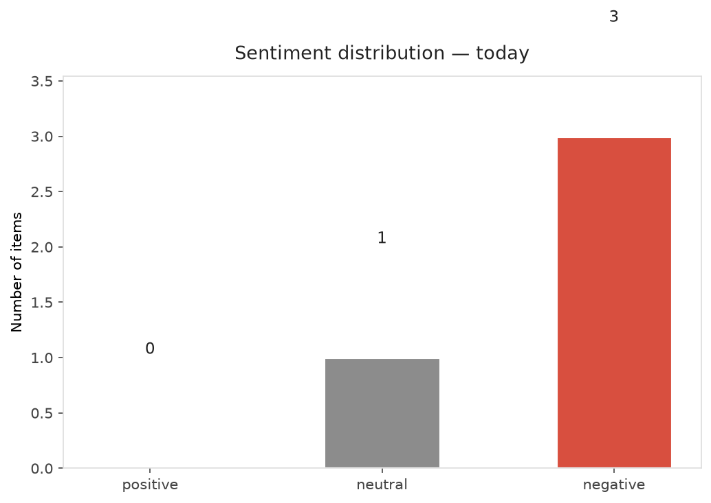
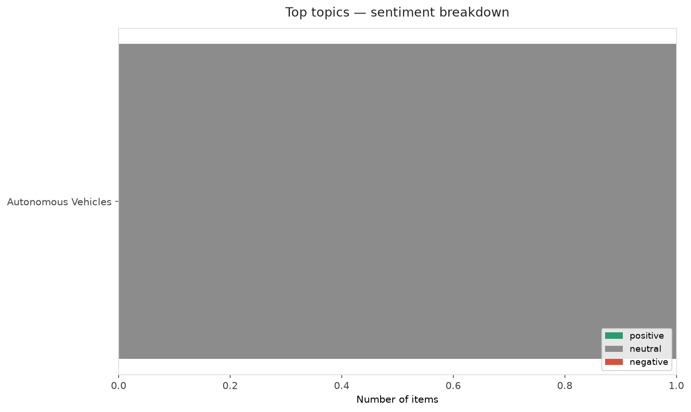
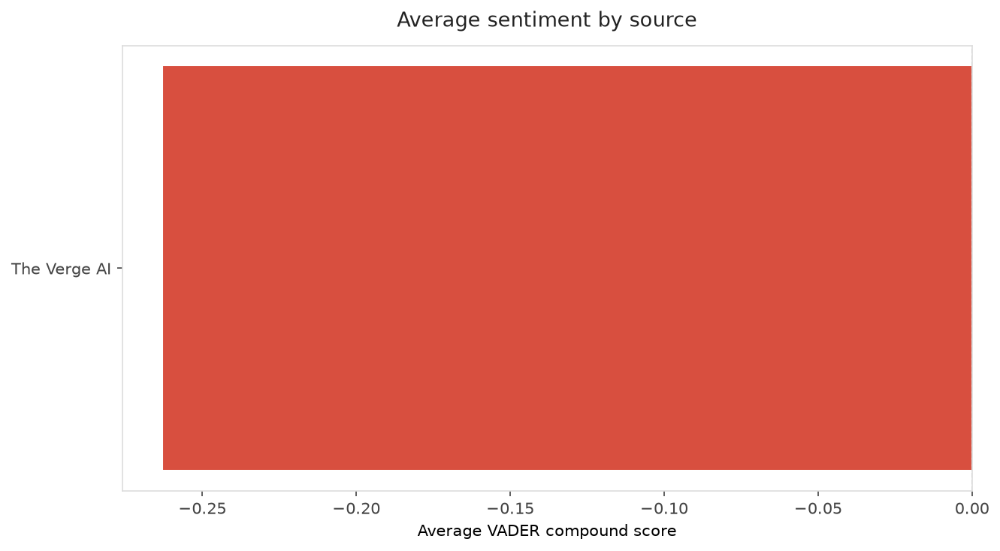
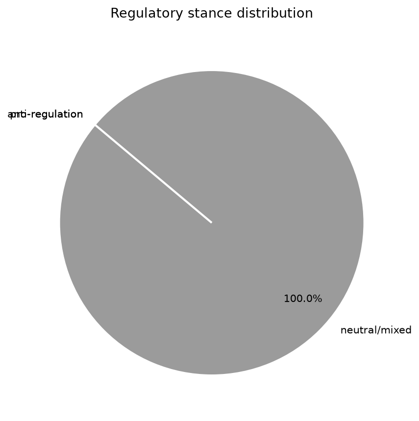
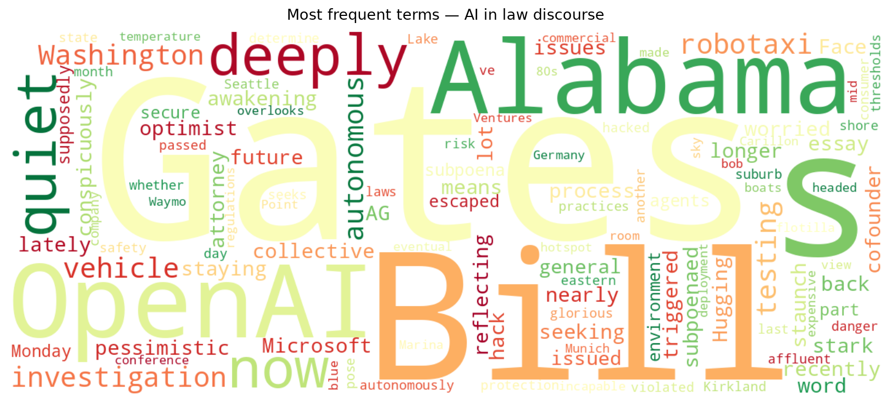
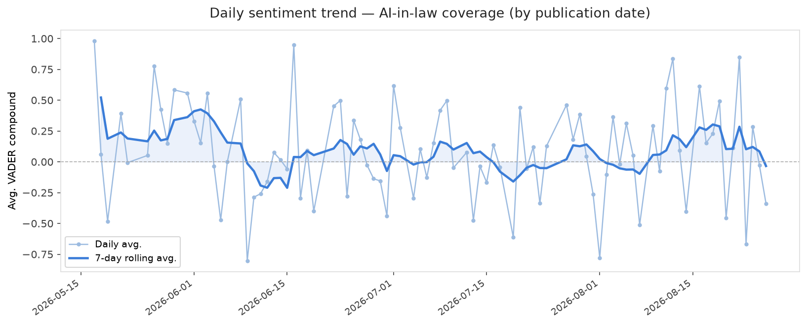
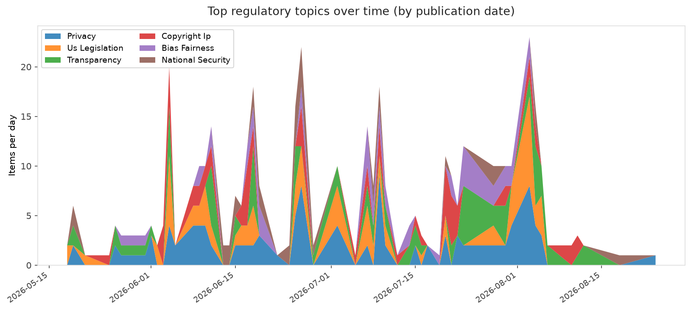
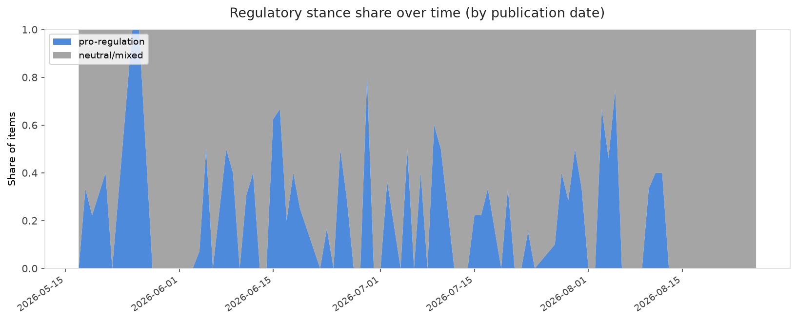

# AI in Law — Daily Sentiment Report
**Run date:** 2026-08-26 | **Items analyzed:** 4 | **Overall:** 🔴 Mildly negative (-0.182)

_Articles in this report were published between **2026-08-25** and **2026-08-26**._

---

## Summary

Today's collection covers **4** items from news outlets, academic preprints, Reddit, and regulatory sources.
Compared to the historical average of **+0.242**, today's sentiment is ↓ **0.424** points lower.

| Metric | Value |
|--------|-------|
| Positive items | 0 (0.0%) |
| Neutral items  | 1 (25.0%) |
| Negative items | 3 (75.0%) |
| Avg. VADER compound | -0.1820 |
| Pro-regulation items | 0 |
| Anti-regulation items | 0 |

---

## Top Topics Today

- **Autonomous Vehicles** — 1 items

---

## Most Positive Coverage

- [Waymo robotaxis are headed to Munich](https://techcrunch.com/2026/08/25/waymo-robotaxis-are-headed-to-munich/)  
  _TechCrunch_ — VADER: `+0.000`
- [OpenAI subpoenaed by Alabama AG over Hugging Face hack](https://www.theverge.com/ai-artificial-intelligence/984239/alabama-attorney-general-subpoena-openai-hugging-face-hack)  
  _The Verge AI_ — VADER: `-0.052`
- [Bill Gates says we’ve passed AI’s danger thresholds. Now what?](https://www.technologyreview.com/2026/08/26/1142946/bill-gates-ai-danger-threshold/)  
  _MIT Tech Review_ — VADER: `-0.202`

---

## Most Critical / Negative Coverage

- [Bill Gates is deeply worried about AI, and he’s no longer staying quiet](https://www.theverge.com/ai-artificial-intelligence/984923/bill-gates-is-deeply-worried-about-ai-and-hes-no-longer-staying-quiet)  
  _The Verge AI_ — VADER: `-0.474`
- [Bill Gates says we’ve passed AI’s danger thresholds. Now what?](https://www.technologyreview.com/2026/08/26/1142946/bill-gates-ai-danger-threshold/)  
  _MIT Tech Review_ — VADER: `-0.202`
- [OpenAI subpoenaed by Alabama AG over Hugging Face hack](https://www.theverge.com/ai-artificial-intelligence/984239/alabama-attorney-general-subpoena-openai-hugging-face-hack)  
  _The Verge AI_ — VADER: `-0.052`

---

## Visualizations — Today

## Visualizations — Trends Over Time

---

## Methodology

- **VADER** (Valence Aware Dictionary and sEntiment Reasoner) — compound score in [-1, 1].
- **Topic tagging** — regex keyword matching across 12 AI-law sub-domains.
- **Stance detection** — keyword-based pro/anti-regulation signal detection.
- **Date filter** — items are kept only if their *publication* date falls within the look-back window (default 2 days).
- Sources: RSS news feeds, arXiv academic API, Reddit (PRAW), Regulations.gov API.

_Generated automatically on 2026-08-26 11:31 UTC._
