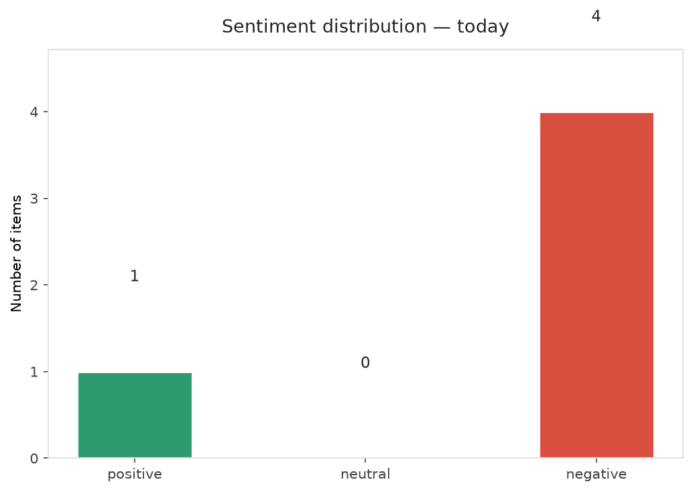
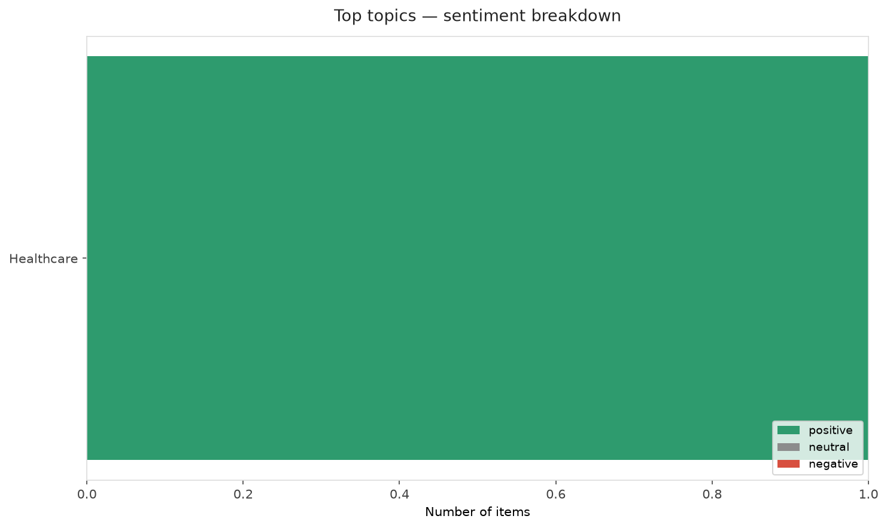
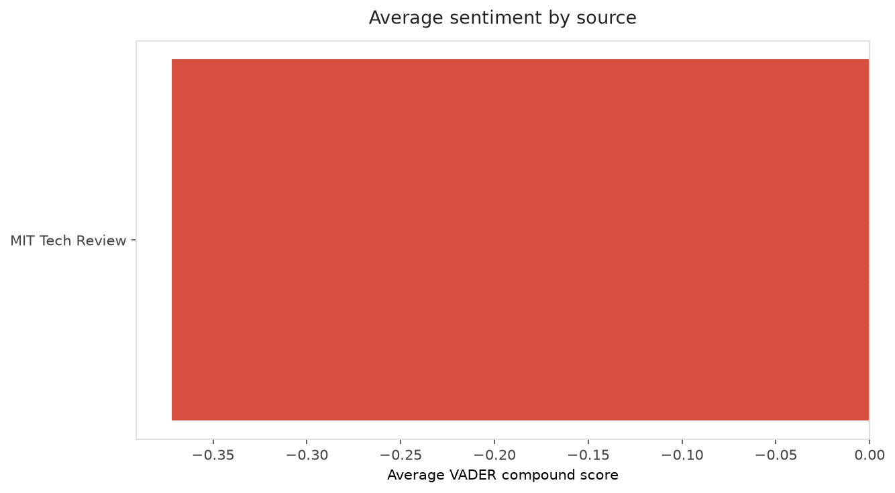
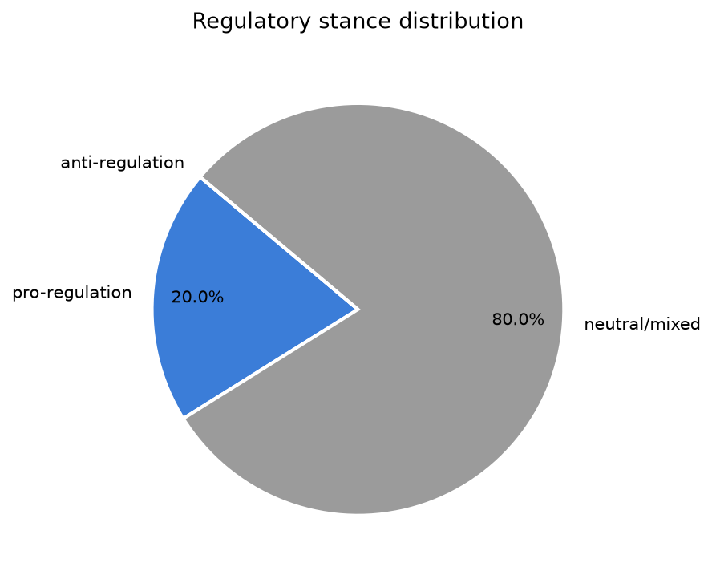
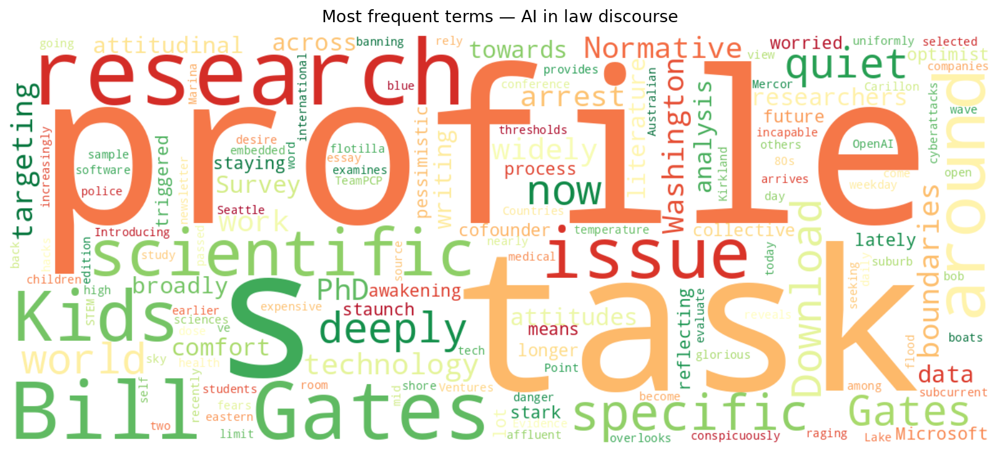
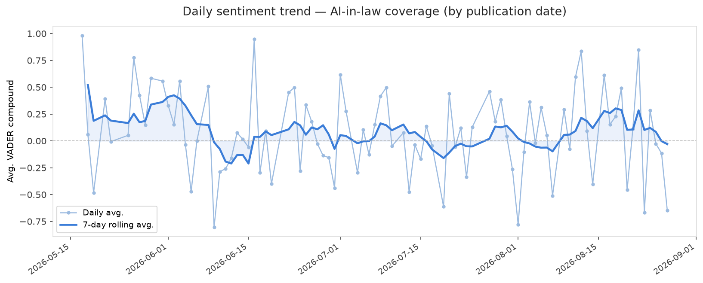
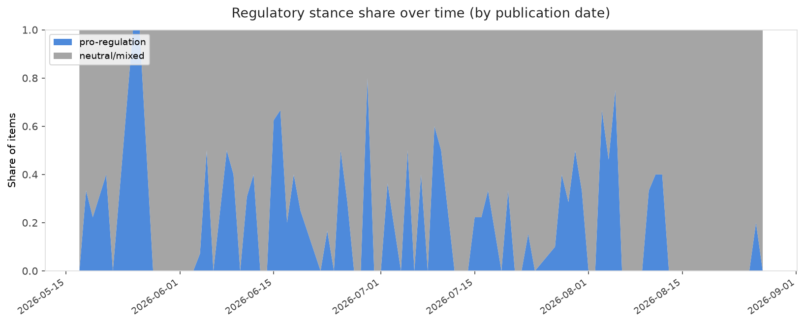

# AI in Law — Daily Sentiment Report
**Run date:** 2026-08-27 | **Items analyzed:** 5 | **Overall:** 🔴 Mildly negative (-0.178)

_Articles in this report were published between **2026-08-26** and **2026-08-27**._

---

## Summary

Today's collection covers **5** items from news outlets, academic preprints, Reddit, and regulatory sources.
Compared to the historical average of **+0.240**, today's sentiment is ↓ **0.417** points lower.

| Metric | Value |
|--------|-------|
| Positive items | 1 (20.0%) |
| Neutral items  | 0 (0.0%) |
| Negative items | 4 (80.0%) |
| Avg. VADER compound | -0.1777 |
| Pro-regulation items | 1 |
| Anti-regulation items | 0 |

---

## Top Topics Today

- **Healthcare** — 1 items

---

## Most Positive Coverage

- [Normative boundaries of AI in scientific work: Evidence from PhD researchers](https://arxiv.org/abs/2608.25678v1)  
  _arXiv_ — VADER: `+0.979`
- [Bill Gates says we’ve passed AI’s danger thresholds. Now what?](https://www.technologyreview.com/2026/08/26/1142946/bill-gates-ai-danger-threshold/)  
  _MIT Tech Review_ — VADER: `-0.202`
- [Bill Gates is deeply worried about AI, and he’s no longer staying quiet](https://www.theverge.com/ai-artificial-intelligence/984923/bill-gates-is-deeply-worried-about-ai-and-hes-no-longer-staying-quiet)  
  _The Verge AI_ — VADER: `-0.474`

---

## Most Critical / Negative Coverage

- [Australian police arrest two over TeamPCP hacks targeting Mercor, OpenAI, and others](https://techcrunch.com/2026/08/27/australian-police-arrest-two-over-teampcp-hacks-targeting-mercor-openai-and-others/)  
  _TechCrunch_ — VADER: `-0.649`
- [The Download: the Kids issue arrives, and Bill Gates reveals his AI fears](https://www.technologyreview.com/2026/08/26/1143000/the-download-kids-issue-launch-bill-gates-ai-fears/)  
  _MIT Tech Review_ — VADER: `-0.542`
- [Bill Gates is deeply worried about AI, and he’s no longer staying quiet](https://www.theverge.com/ai-artificial-intelligence/984923/bill-gates-is-deeply-worried-about-ai-and-hes-no-longer-staying-quiet)  
  _The Verge AI_ — VADER: `-0.474`

---

## Visualizations — Today

## Visualizations — Trends Over Time

---

## Methodology

- **VADER** (Valence Aware Dictionary and sEntiment Reasoner) — compound score in [-1, 1].
- **Topic tagging** — regex keyword matching across 12 AI-law sub-domains.
- **Stance detection** — keyword-based pro/anti-regulation signal detection.
- **Date filter** — items are kept only if their *publication* date falls within the look-back window (default 2 days).
- Sources: RSS news feeds, arXiv academic API, Reddit (PRAW), Regulations.gov API.

_Generated automatically on 2026-08-27 20:56 UTC._
