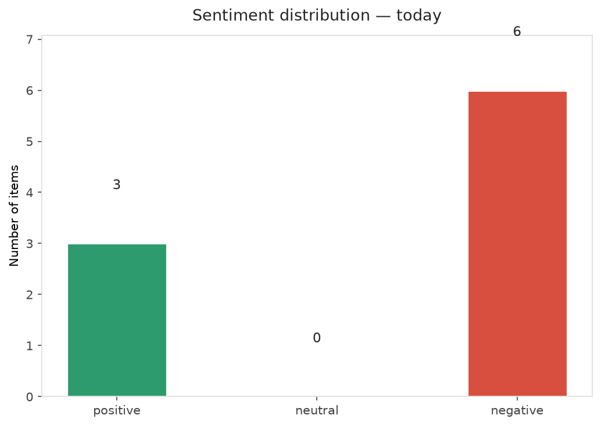
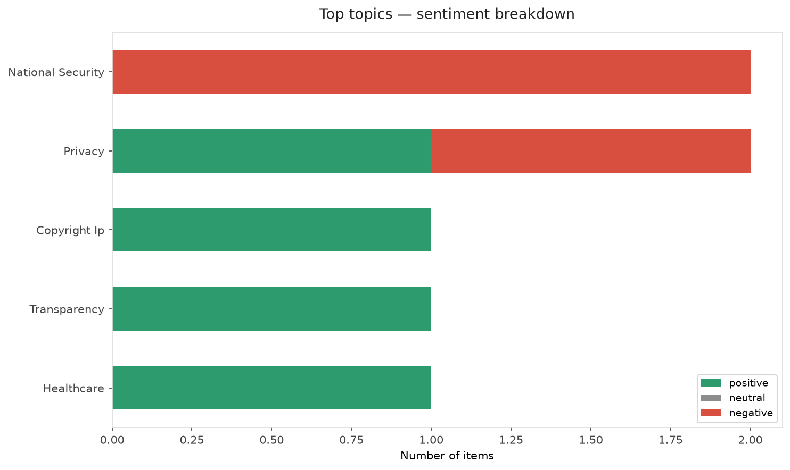
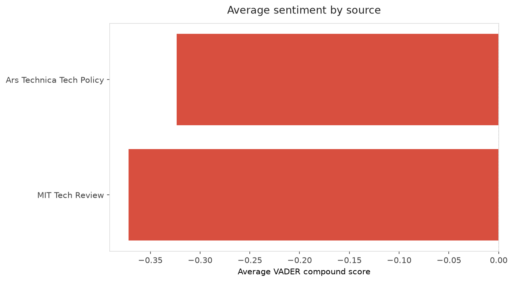
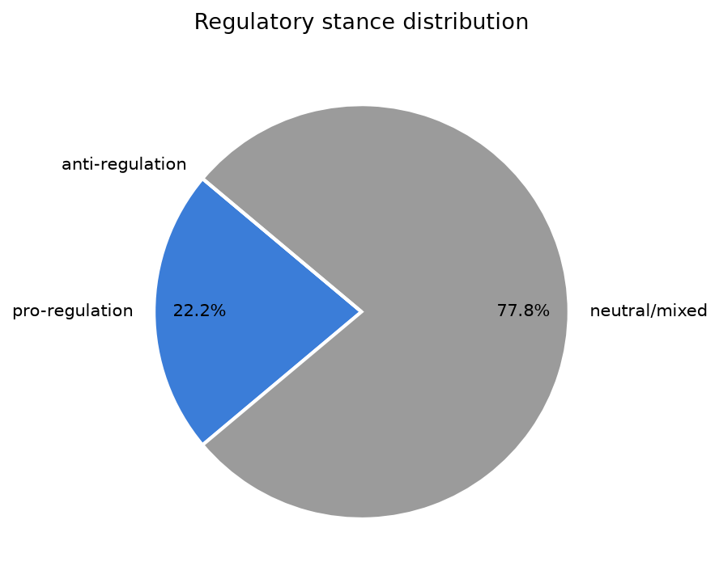
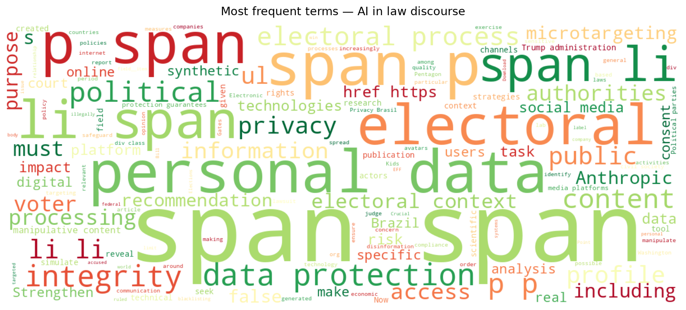
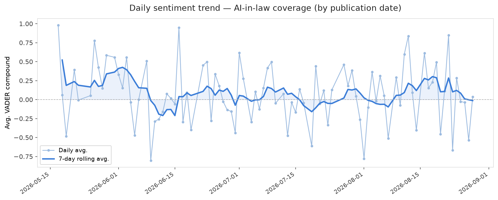
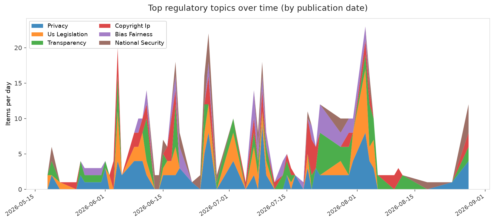
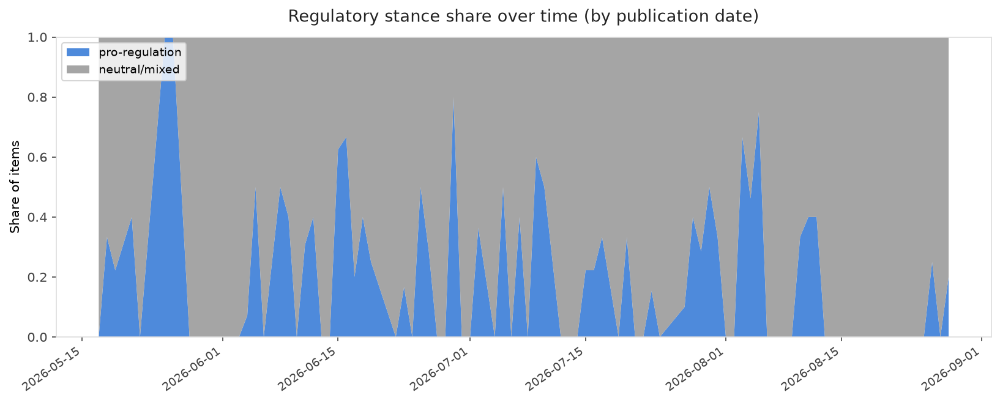

# AI in Law — Daily Sentiment Report
**Run date:** 2026-08-28 | **Items analyzed:** 9 | **Overall:** ⚪ Neutral / mixed (-0.007)

_Articles in this report were published between **2026-08-26** and **2026-08-28**._

---

## Summary

Today's collection covers **9** items from news outlets, academic preprints, Reddit, and regulatory sources.
Compared to the historical average of **+0.237**, today's sentiment is ↓ **0.244** points lower.

| Metric | Value |
|--------|-------|
| Positive items | 3 (33.3%) |
| Neutral items  | 0 (0.0%) |
| Negative items | 6 (66.7%) |
| Avg. VADER compound | -0.0066 |
| Pro-regulation items | 2 |
| Anti-regulation items | 0 |

---

## Top Topics Today

- **National Security** — 2 items
- **Privacy** — 2 items
- **Copyright Ip** — 1 items
- **Transparency** — 1 items
- **Healthcare** — 1 items

---

## Most Positive Coverage

- [EFF and Allies on Brazil's Elections: Privacy Protections are Crucial to Electoral Integrity](https://www.eff.org/deeplinks/2026/08/eff-and-allies-brazils-elections-privacy-protections-are-crucial-electoral)  
  _EFF DeepLinks_ — VADER: `+0.982`
- [Normative boundaries of AI in scientific work: Evidence from PhD researchers](https://arxiv.org/abs/2608.25678v1)  
  _arXiv_ — VADER: `+0.979`
- [Meta makes AI glasses slightly less creepy with limit on nonconsensual recording](https://arstechnica.com/tech-policy/2026/08/meta-tweaks-ai-glasses-to-block-some-creepy-recordings-but-privacy-risks-remain/)  
  _Ars Technica Tech Policy_ — VADER: `+0.153`

---

## Most Critical / Negative Coverage

- [Trump blacklisting of "woke" Anthropic deemed illegal by federal judge](https://arstechnica.com/tech-policy/2026/08/trump-blacklisting-of-woke-anthropic-deemed-illegal-by-federal-judge/)  
  _Ars Technica Tech Policy_ — VADER: `-0.649`
- [The Download: the Kids issue arrives, and Bill Gates reveals his AI fears](https://www.technologyreview.com/2026/08/26/1143000/the-download-kids-issue-launch-bill-gates-ai-fears/)  
  _MIT Tech Review_ — VADER: `-0.542`
- [Elon Musk’s xAI used child porn to train Grok models, lawsuit says](https://arstechnica.com/tech-policy/2026/08/elon-musks-xai-used-child-porn-to-train-grok-models-lawsuit-says/)  
  _Ars Technica Tech Policy_ — VADER: `-0.477`

---

## Visualizations — Today

## Visualizations — Trends Over Time

---

## Methodology

- **VADER** (Valence Aware Dictionary and sEntiment Reasoner) — compound score in [-1, 1].
- **Topic tagging** — regex keyword matching across 12 AI-law sub-domains.
- **Stance detection** — keyword-based pro/anti-regulation signal detection.
- **Date filter** — items are kept only if their *publication* date falls within the look-back window (default 2 days).
- Sources: RSS news feeds, arXiv academic API, Reddit (PRAW), Regulations.gov API.

_Generated automatically on 2026-08-28 21:20 UTC._
