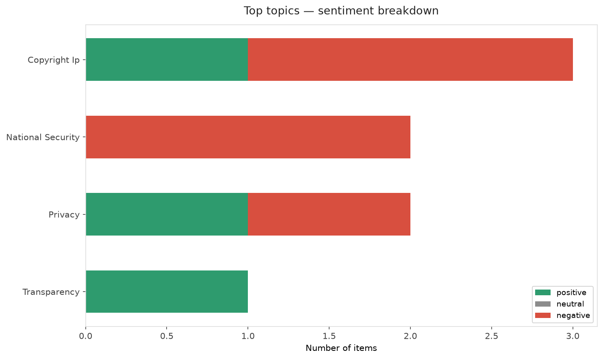
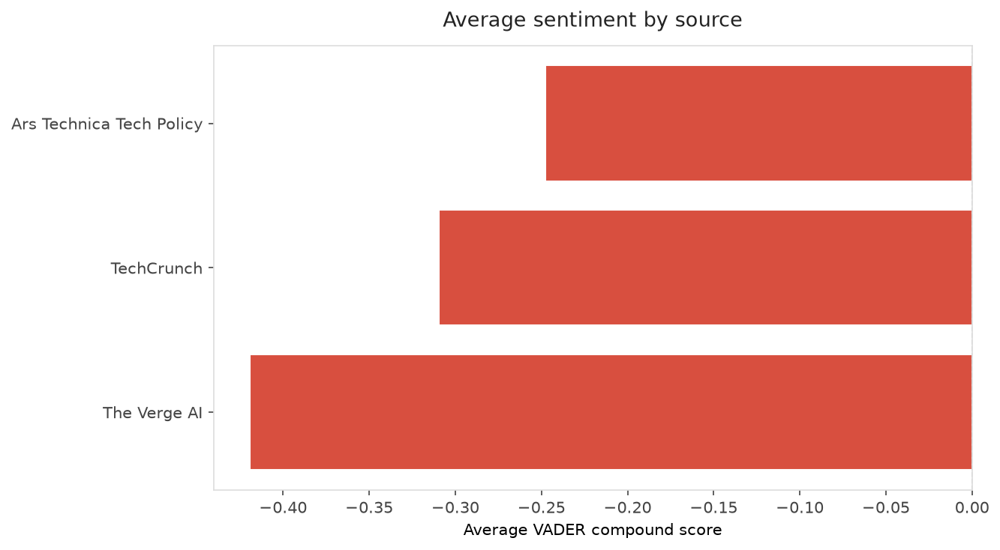
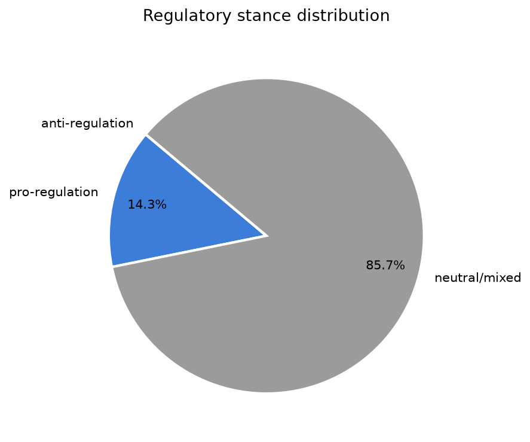
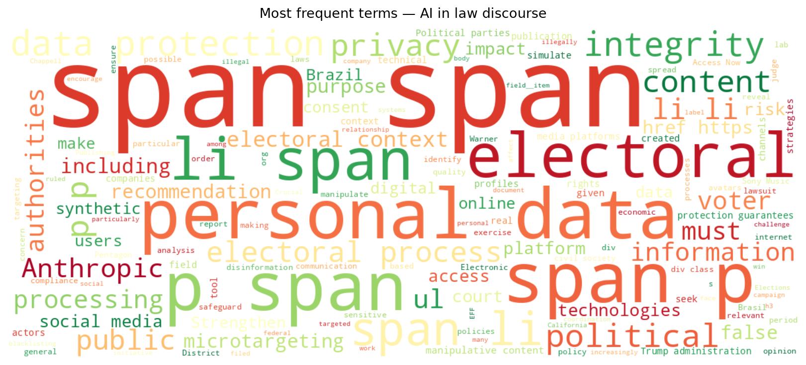
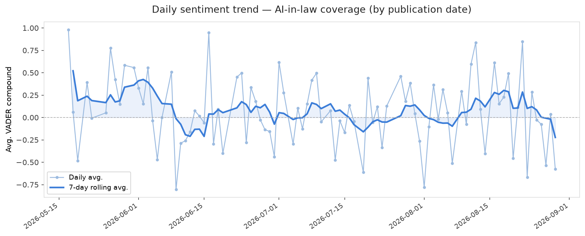
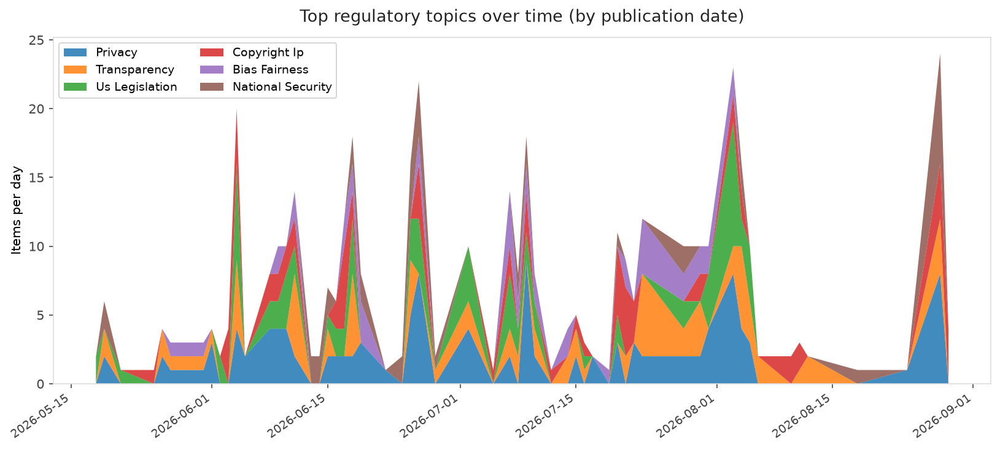
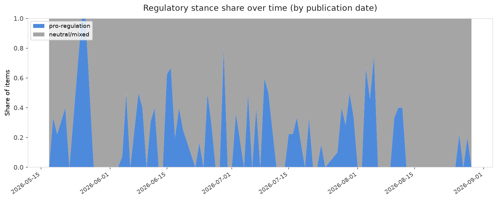

# AI in Law — Daily Sentiment Report
**Run date:** 2026-08-30 | **Items analyzed:** 7 | **Overall:** 🔴 Mildly negative (-0.139)

_Articles in this report were published between **2026-08-28** and **2026-08-29**._

---

## Summary

Today's collection covers **7** items from news outlets, academic preprints, Reddit, and regulatory sources.
Compared to the historical average of **+0.233**, today's sentiment is ↓ **0.372** points lower.

| Metric | Value |
|--------|-------|
| Positive items | 2 (28.6%) |
| Neutral items  | 0 (0.0%) |
| Negative items | 5 (71.4%) |
| Avg. VADER compound | -0.1388 |
| Pro-regulation items | 1 |
| Anti-regulation items | 0 |

---

## Top Topics Today

- **Copyright Ip** — 3 items
- **National Security** — 2 items
- **Privacy** — 2 items
- **Transparency** — 1 items

---

## Most Positive Coverage

- [EFF and Allies on Brazil's Elections: Privacy Protections are Crucial to Electoral Integrity](https://www.eff.org/deeplinks/2026/08/eff-and-allies-brazils-elections-privacy-protections-are-crucial-electoral)  
  _EFF DeepLinks_ — VADER: `+0.982`
- [Meta makes AI glasses slightly less creepy with limit on nonconsensual recording](https://arstechnica.com/tech-policy/2026/08/meta-tweaks-ai-glasses-to-block-some-creepy-recordings-but-privacy-risks-remain/)  
  _Ars Technica Tech Policy_ — VADER: `+0.153`
- [Anthropic gets its first court win over the Pentagon’s supply-chain risk label](https://techcrunch.com/2026/08/28/anthropic-gets-its-first-court-win-over-the-pentagons-supply-chain-risk-label/)  
  _TechCrunch_ — VADER: `-0.077`

---

## Most Critical / Negative Coverage

- [Trump blacklisting of "woke" Anthropic deemed illegal by federal judge](https://arstechnica.com/tech-policy/2026/08/trump-blacklisting-of-woke-anthropic-deemed-illegal-by-federal-judge/)  
  _Ars Technica Tech Policy_ — VADER: `-0.649`
- [Sony Music Publishing and Warner Chappell are suing Anthropic](https://www.theverge.com/ai-artificial-intelligence/986438/sony-music-warner-chappell-anthropic-lawsuit-copyright)  
  _The Verge AI_ — VADER: `-0.612`
- [Sony Music, Warner sue Anthropic, alleging a “brazen campaign” of intellectual property theft](https://techcrunch.com/2026/08/29/sony-music-warner-sue-anthropic-alleging-a-brazen-campaign-of-intellectual-property-theft/)  
  _TechCrunch_ — VADER: `-0.542`

---

## Visualizations — Today

## Visualizations — Trends Over Time

---

## Methodology

- **VADER** (Valence Aware Dictionary and sEntiment Reasoner) — compound score in [-1, 1].
- **Topic tagging** — regex keyword matching across 12 AI-law sub-domains.
- **Stance detection** — keyword-based pro/anti-regulation signal detection.
- **Date filter** — items are kept only if their *publication* date falls within the look-back window (default 2 days).
- Sources: RSS news feeds, arXiv academic API, Reddit (PRAW), Regulations.gov API.

_Generated automatically on 2026-08-30 15:12 UTC._
