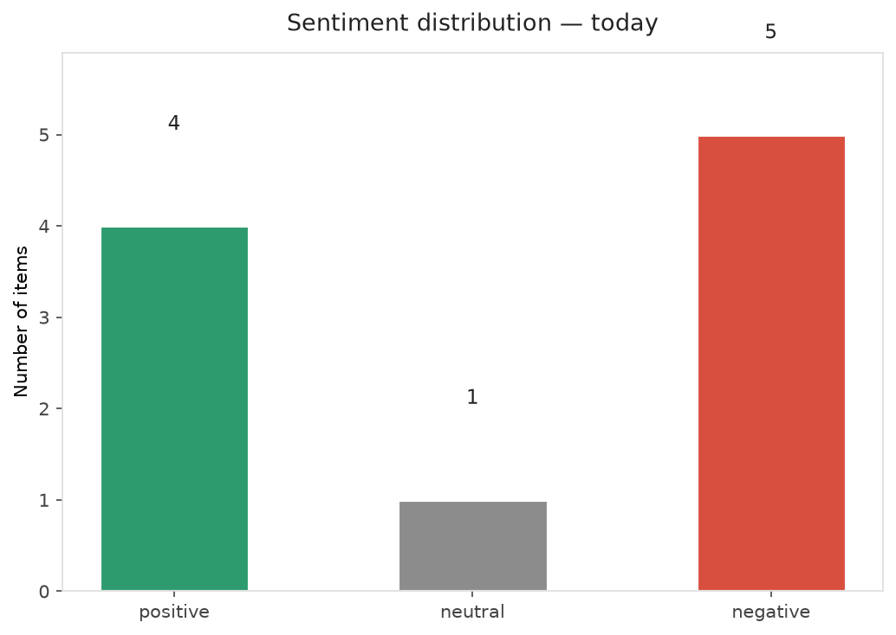
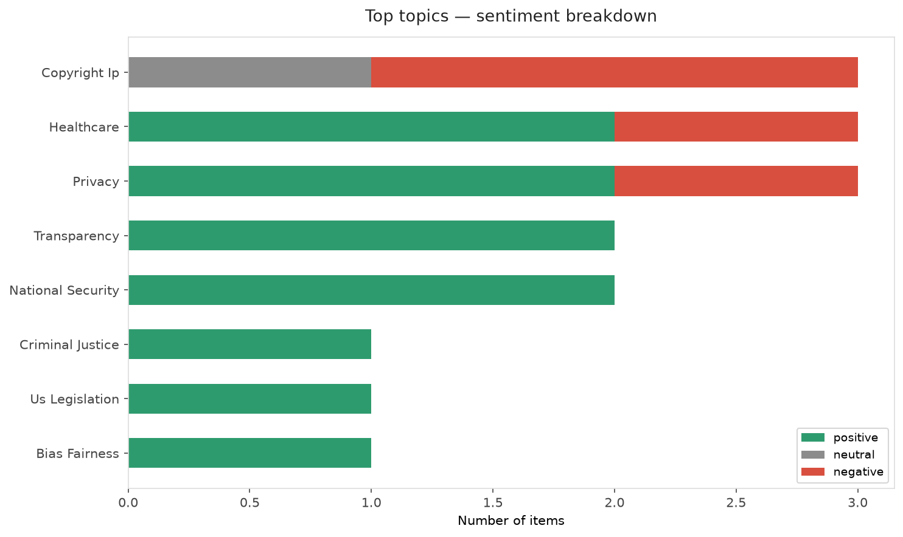
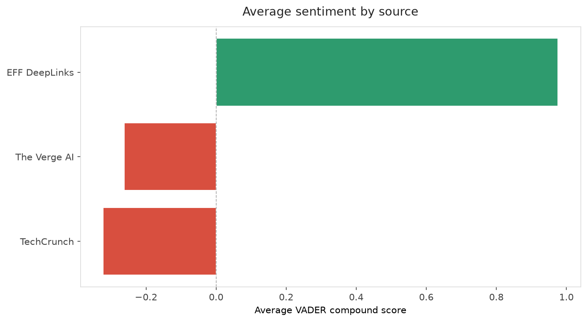
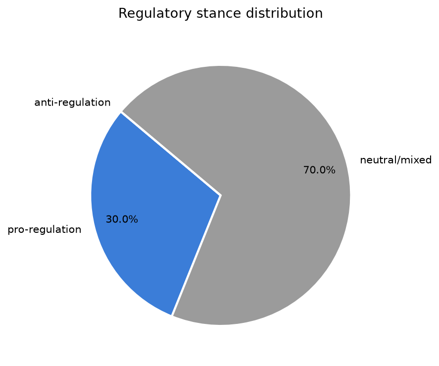
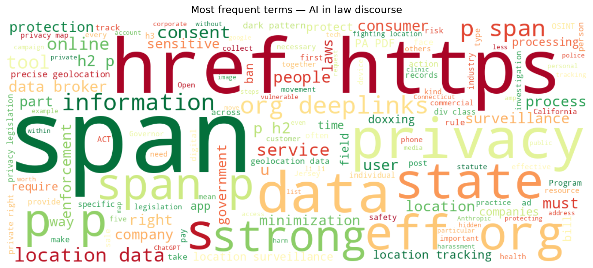
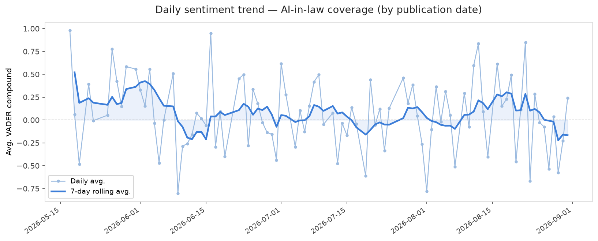
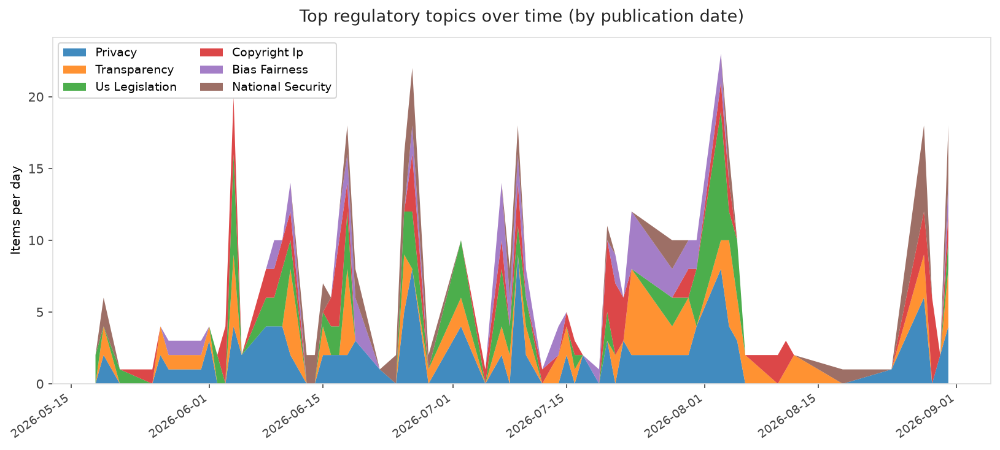
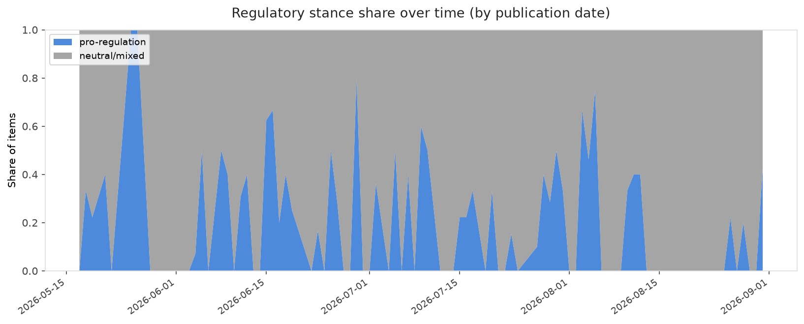

# AI in Law — Daily Sentiment Report
**Run date:** 2026-08-31 | **Items analyzed:** 10 | **Overall:** ⚪ Neutral / mixed (+0.029)

_Articles in this report were published between **2026-08-29** and **2026-08-31**._

---

## Summary

Today's collection covers **10** items from news outlets, academic preprints, Reddit, and regulatory sources.
Compared to the historical average of **+0.231**, today's sentiment is ↓ **0.202** points lower.

| Metric | Value |
|--------|-------|
| Positive items | 4 (40.0%) |
| Neutral items  | 1 (10.0%) |
| Negative items | 5 (50.0%) |
| Avg. VADER compound | +0.0290 |
| Pro-regulation items | 3 |
| Anti-regulation items | 0 |

---

## Top Topics Today

- **Copyright Ip** — 3 items
- **Healthcare** — 3 items
- **Privacy** — 3 items
- **Transparency** — 2 items
- **National Security** — 2 items

---

## Most Positive Coverage

- [Doxxing Safety Pt I: Prevention and Footprint Management](https://www.eff.org/deeplinks/2026/08/doxxing-safety-pt-i-prevention-and-footprint-management)  
  _EFF DeepLinks_ — VADER: `+0.996`
- [Privacy on the Map (Part 2): Progress, Pitfalls, and the Fight for Enforceable Location Data Protect](https://www.eff.org/deeplinks/2026/08/privacy-map-part-2-progress-pitfalls-and-fight-enforceable-location-data)  
  _EFF DeepLinks_ — VADER: `+0.956`
- [ChatGPT and Reddit now face EU's toughest online safety rules](https://arstechnica.com/tech-policy/2026/08/chatgtp-and-reddit-now-face-eus-toughest-online-safety-rules/)  
  _Ars Technica Tech Policy_ — VADER: `+0.296`

---

## Most Critical / Negative Coverage

- [ChatGPT to face tougher regulation in the EU](https://www.theverge.com/ai-artificial-intelligence/986682/openai-chatgpt-eu-dsa)  
  _The Verge AI_ — VADER: `-0.612`
- [Sony Music Publishing and Warner Chappell are suing Anthropic](https://www.theverge.com/ai-artificial-intelligence/986438/sony-music-warner-chappell-anthropic-lawsuit-copyright)  
  _The Verge AI_ — VADER: `-0.612`
- [Sony Music, Warner sue Anthropic, alleging a ‘brazen campaign’ of intellectual property theft](https://techcrunch.com/2026/08/29/sony-music-warner-sue-anthropic-alleging-a-brazen-campaign-of-intellectual-property-theft/)  
  _TechCrunch_ — VADER: `-0.542`

---

## Visualizations — Today

## Visualizations — Trends Over Time

---

## Methodology

- **VADER** (Valence Aware Dictionary and sEntiment Reasoner) — compound score in [-1, 1].
- **Topic tagging** — regex keyword matching across 12 AI-law sub-domains.
- **Stance detection** — keyword-based pro/anti-regulation signal detection.
- **Date filter** — items are kept only if their *publication* date falls within the look-back window (default 2 days).
- Sources: RSS news feeds, arXiv academic API, Reddit (PRAW), Regulations.gov API.

_Generated automatically on 2026-08-31 17:57 UTC._
