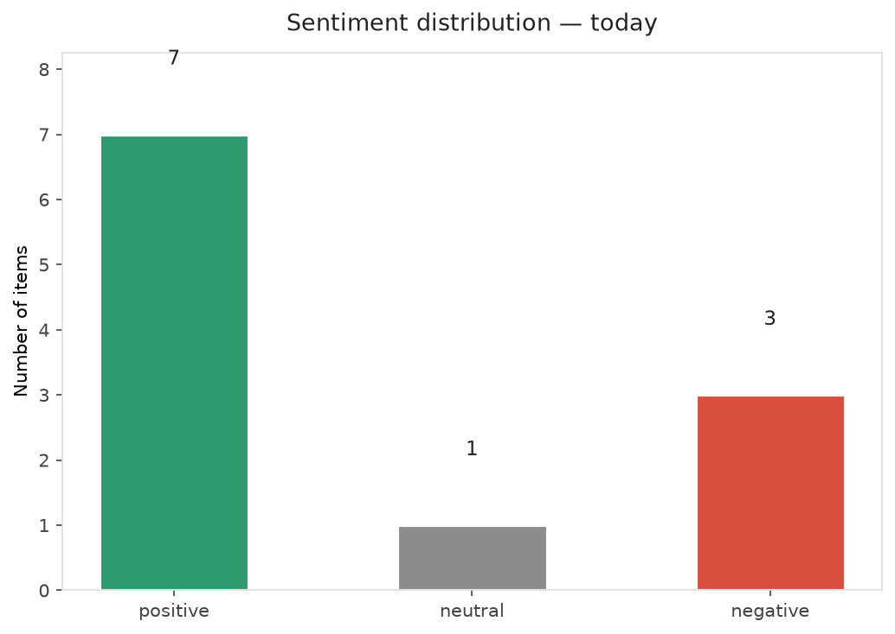
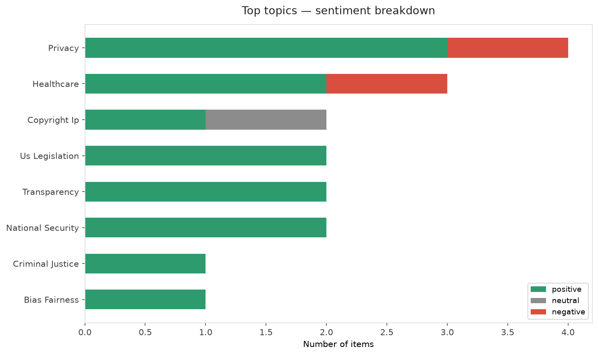
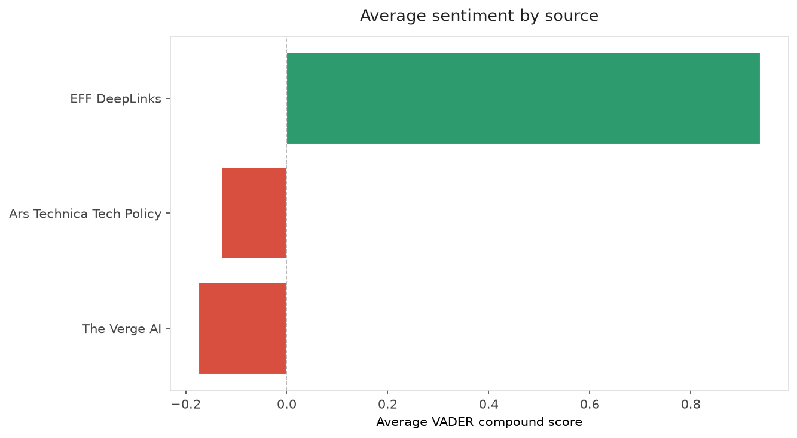
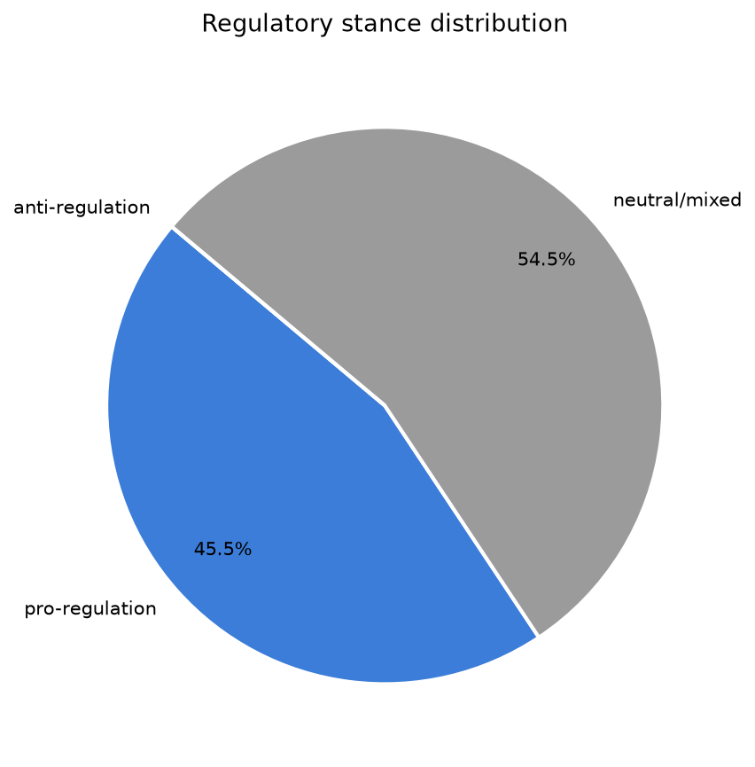
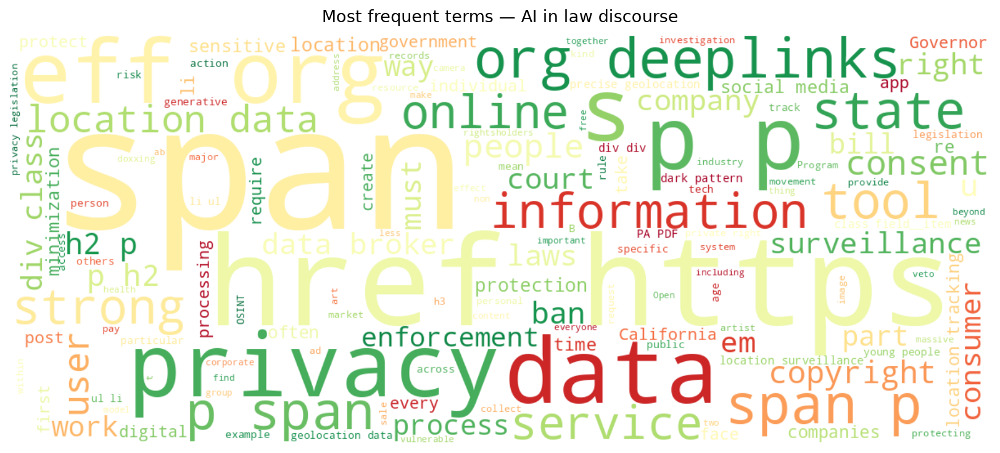
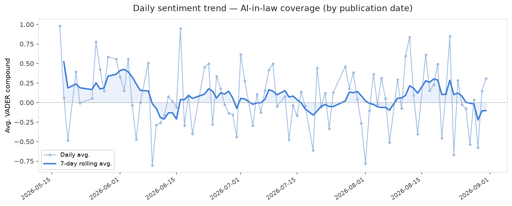
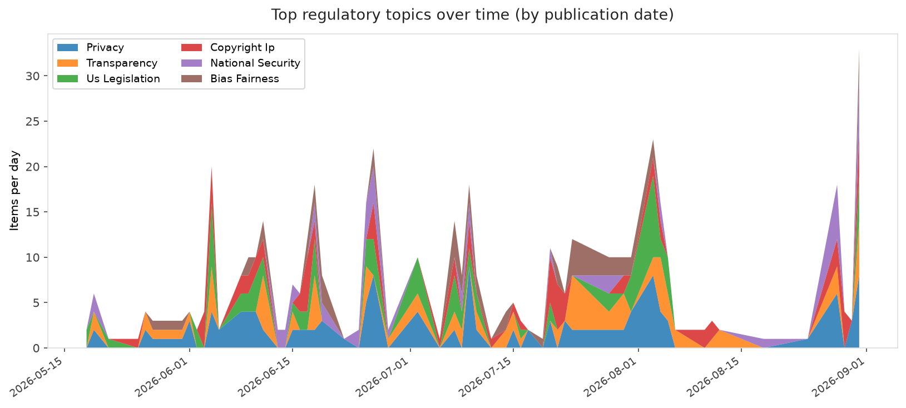
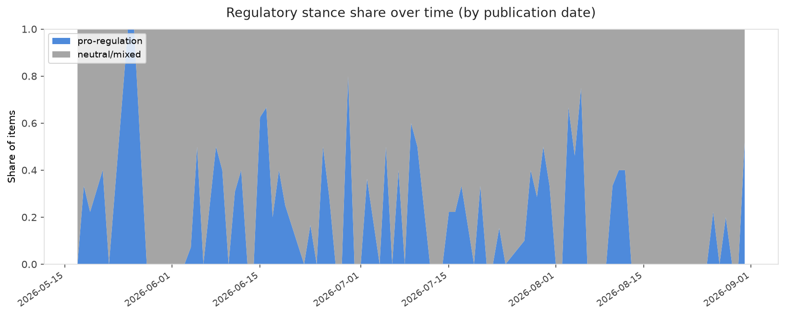

# AI in Law — Daily Sentiment Report
**Run date:** 2026-09-01 | **Items analyzed:** 11 | **Overall:** 🟢 Mildly positive (+0.318)

_Articles in this report were published between **2026-08-30** and **2026-08-31**._

---

## Summary

Today's collection covers **11** items from news outlets, academic preprints, Reddit, and regulatory sources.
Compared to the historical average of **+0.232**, today's sentiment is ↑ **0.087** points higher.

| Metric | Value |
|--------|-------|
| Positive items | 7 (63.6%) |
| Neutral items  | 1 (9.1%) |
| Negative items | 3 (27.3%) |
| Avg. VADER compound | +0.3184 |
| Pro-regulation items | 5 |
| Anti-regulation items | 0 |

---

## Top Topics Today

- **Privacy** — 4 items
- **Healthcare** — 3 items
- **Copyright Ip** — 2 items
- **Us Legislation** — 2 items
- **Transparency** — 2 items

---

## Most Positive Coverage

- [Doxxing Safety Pt I: Prevention and Footprint Management](https://www.eff.org/deeplinks/2026/08/doxxing-safety-pt-i-prevention-and-footprint-management)  
  _EFF DeepLinks_ — VADER: `+0.996`
- [Privacy on the Map (Part 2): Progress, Pitfalls, and the Fight for Enforceable Location Data Protect](https://www.eff.org/deeplinks/2026/08/privacy-map-part-2-progress-pitfalls-and-fight-enforceable-location-data)  
  _EFF DeepLinks_ — VADER: `+0.956`
- [EFF to Courts: Don’t Rewrite Copyright Over AI Hype](https://www.eff.org/deeplinks/2026/08/eff-courts-dont-rewrite-copyright-over-ai-hype)  
  _EFF DeepLinks_ — VADER: `+0.937`

---

## Most Critical / Negative Coverage

- [ChatGPT to face tougher regulation in the EU](https://www.theverge.com/ai-artificial-intelligence/986682/openai-chatgpt-eu-dsa)  
  _The Verge AI_ — VADER: `-0.612`
- [“Zlibrary my beloved”: Anthropic staff chats extolling piracy cited in Sony suit](https://arstechnica.com/tech-policy/2026/08/zlibrary-my-beloved-anthropic-staff-chats-extolling-piracy-cited-in-sony-suit/)  
  _Ars Technica Tech Policy_ — VADER: `-0.556`
- [Texas Governor Abbott blocks funding for more Flock cameras](https://www.theverge.com/ai-artificial-intelligence/986541/texas-governor-abbott-flock-cameras)  
  _The Verge AI_ — VADER: `-0.226`

---

## Visualizations — Today

## Visualizations — Trends Over Time

---

## Methodology

- **VADER** (Valence Aware Dictionary and sEntiment Reasoner) — compound score in [-1, 1].
- **Topic tagging** — regex keyword matching across 12 AI-law sub-domains.
- **Stance detection** — keyword-based pro/anti-regulation signal detection.
- **Date filter** — items are kept only if their *publication* date falls within the look-back window (default 2 days).
- Sources: RSS news feeds, arXiv academic API, Reddit (PRAW), Regulations.gov API.

_Generated automatically on 2026-09-01 15:25 UTC._
