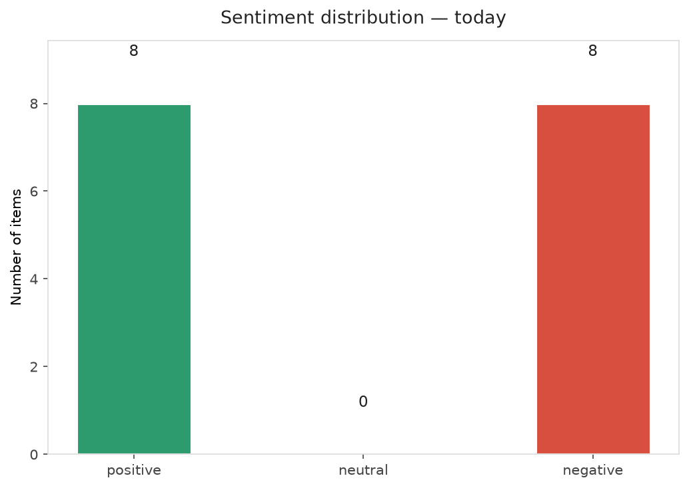
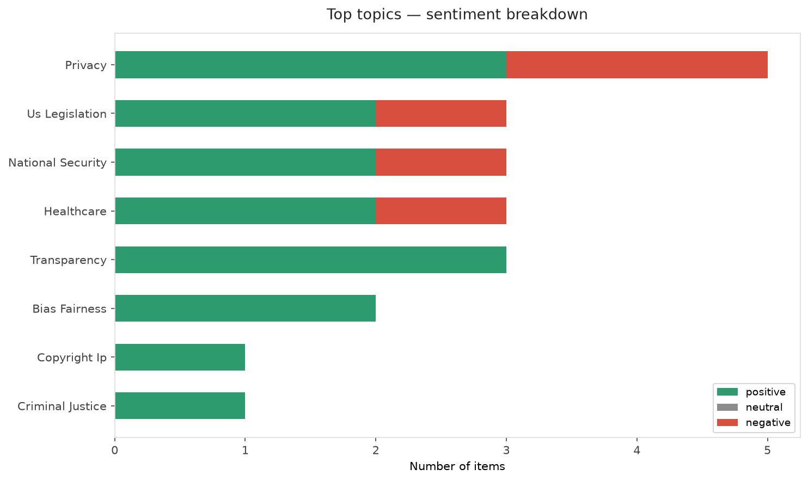
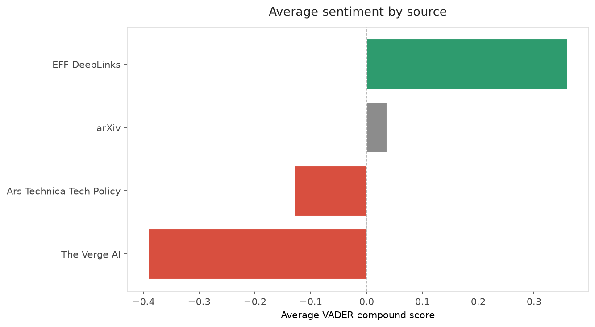
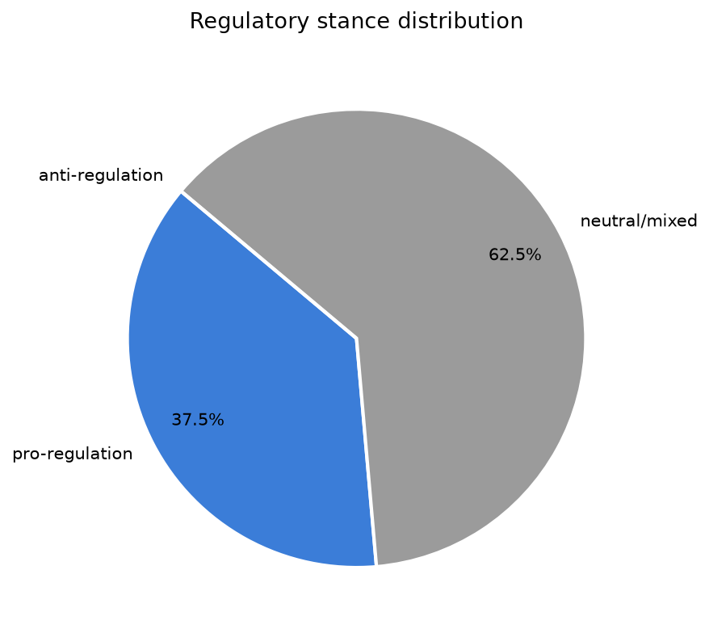
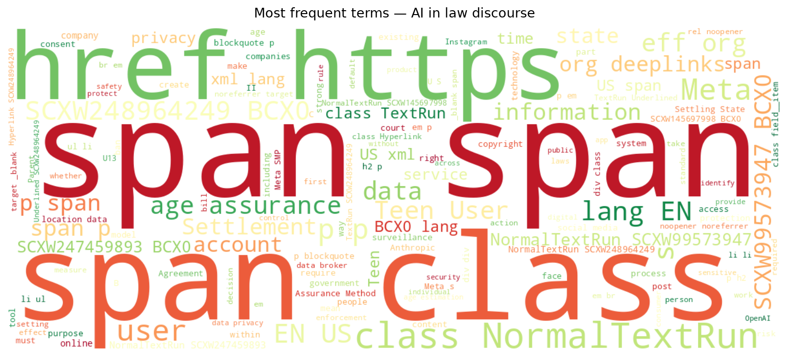

# AI in Law — Daily Sentiment Report
**Run date:** 2026-09-02 | **Items analyzed:** 16 | **Overall:** ⚪ Neutral / mixed (+0.048)

_Articles in this report were published between **2026-08-31** and **2026-09-02**._

---

## Summary

Today's collection covers **16** items from news outlets, academic preprints, Reddit, and regulatory sources.
Compared to the historical average of **+0.229**, today's sentiment is ↓ **0.181** points lower.

| Metric | Value |
|--------|-------|
| Positive items | 8 (50.0%) |
| Neutral items  | 0 (0.0%) |
| Negative items | 8 (50.0%) |
| Avg. VADER compound | +0.0475 |
| Pro-regulation items | 6 |
| Anti-regulation items | 0 |

---

## Top Topics Today

- **Privacy** — 5 items
- **Us Legislation** — 3 items
- **National Security** — 3 items
- **Healthcare** — 3 items
- **Transparency** — 3 items

---

## Most Positive Coverage

- [Doxxing Safety Pt I: Prevention and Footprint Management](https://www.eff.org/deeplinks/2026/08/doxxing-safety-pt-i-prevention-and-footprint-management)  
  _EFF DeepLinks_ — VADER: `+0.996`
- [Privacy on the Map (Part 2): Progress, Pitfalls, and the Fight for Enforceable Location Data Protect](https://www.eff.org/deeplinks/2026/08/privacy-map-part-2-progress-pitfalls-and-fight-enforceable-location-data)  
  _EFF DeepLinks_ — VADER: `+0.956`
- [EFF to Courts: Don’t Rewrite Copyright Over AI Hype](https://www.eff.org/deeplinks/2026/08/eff-courts-dont-rewrite-copyright-over-ai-hype)  
  _EFF DeepLinks_ — VADER: `+0.937`

---

## Most Critical / Negative Coverage

- [Apple accuses OpenAI of destroying evidence](https://www.theverge.com/tech/987575/apple-openai-destroying-evidence-trade-secrets-lawsuit)  
  _The Verge AI_ — VADER: `-0.931`
- [Meta's $17 Billion Settlement is a Bad Deal for Teens and All Social Media Users](https://www.eff.org/deeplinks/2026/09/metas-17-billion-settlement-bad-deal-teens-and-all-social-media-users)  
  _EFF DeepLinks_ — VADER: `-0.908`
- [Workload Identification with Physical Side Channels for AI Governance](https://arxiv.org/abs/2609.00309v1)  
  _arXiv_ — VADER: `-0.793`

---

## Visualizations — Today

## Visualizations — Trends Over Time

---

## Methodology

- **VADER** (Valence Aware Dictionary and sEntiment Reasoner) — compound score in [-1, 1].
- **Topic tagging** — regex keyword matching across 12 AI-law sub-domains.
- **Stance detection** — keyword-based pro/anti-regulation signal detection.
- **Date filter** — items are kept only if their *publication* date falls within the look-back window (default 2 days).
- Sources: RSS news feeds, arXiv academic API, Reddit (PRAW), Regulations.gov API.

_Generated automatically on 2026-09-02 15:01 UTC._
