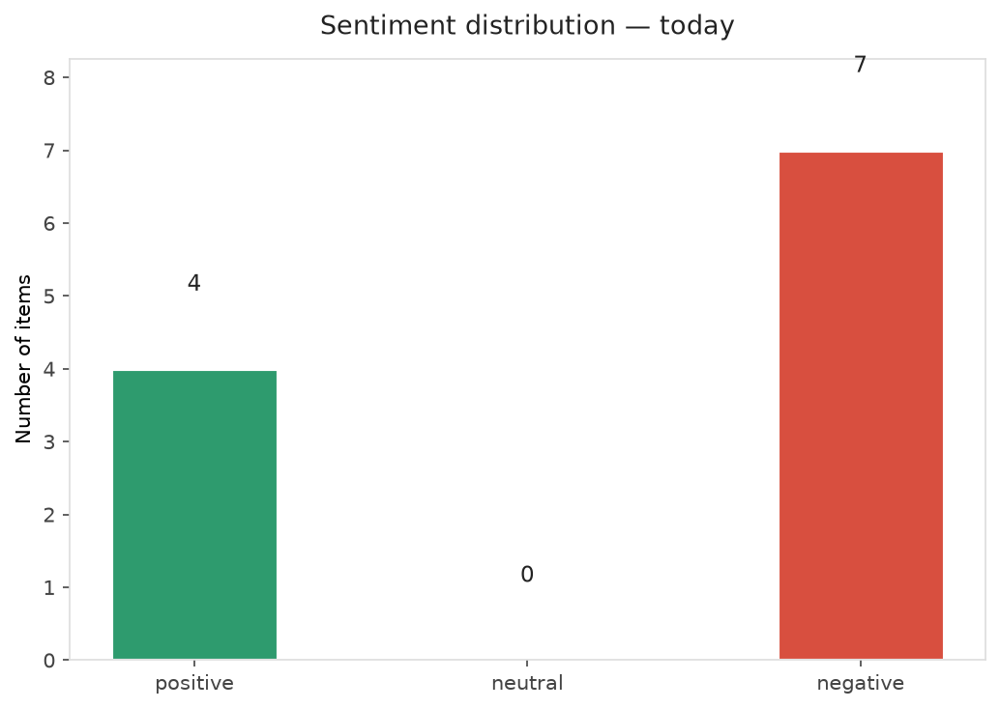
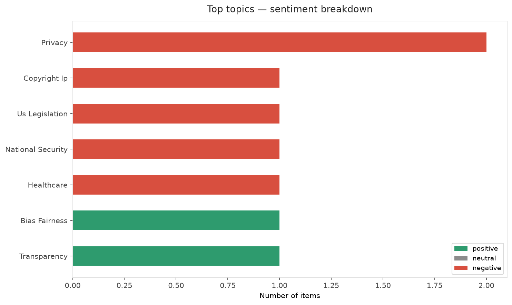
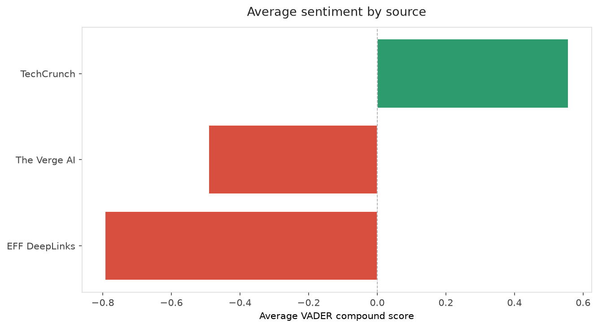
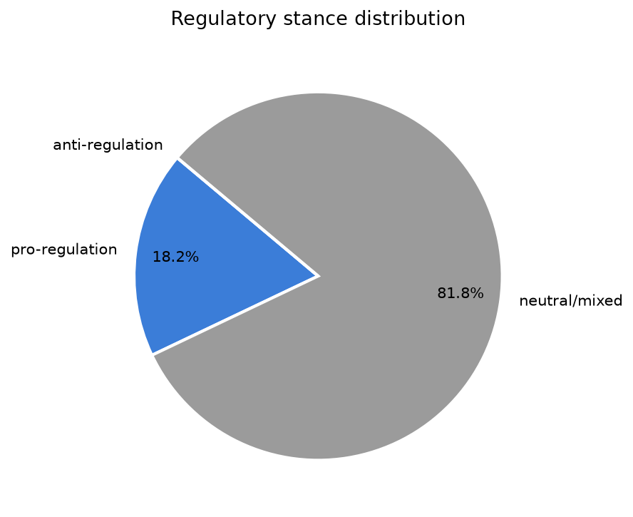
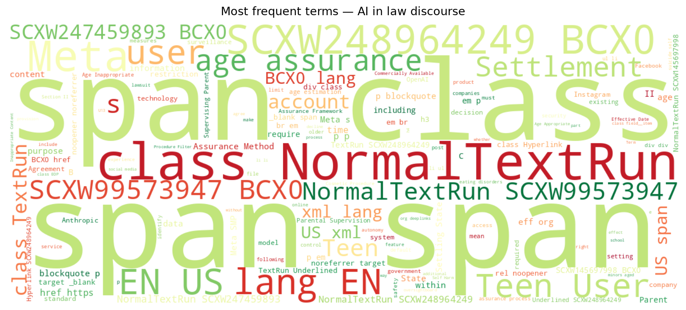
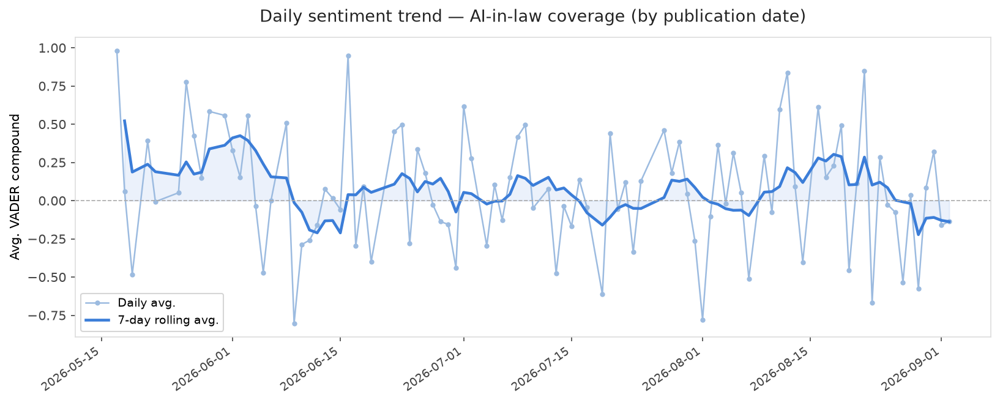
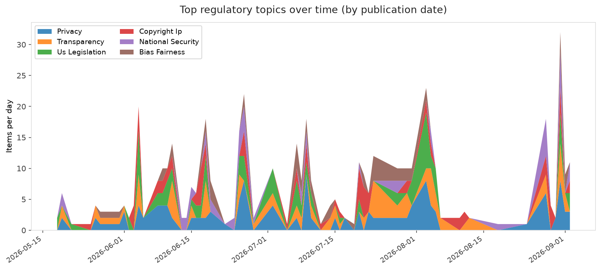
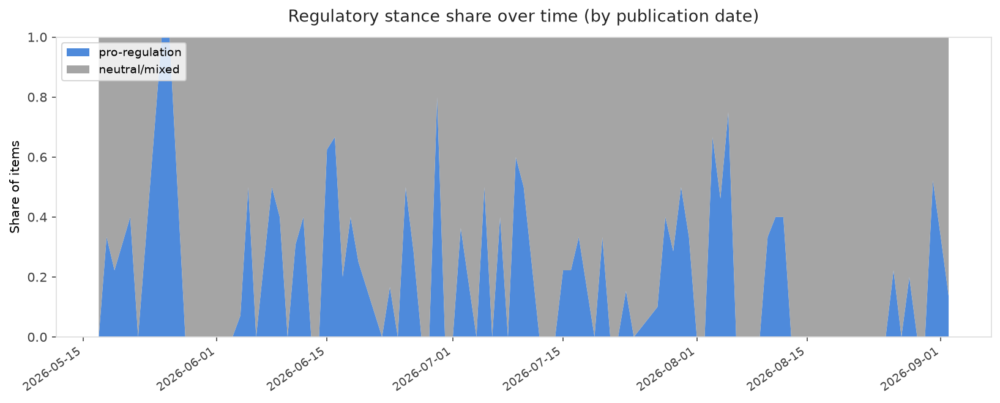

# AI in Law — Daily Sentiment Report
**Run date:** 2026-09-03 | **Items analyzed:** 11 | **Overall:** 🔴 Mildly negative (-0.114)

_Articles in this report were published between **2026-09-01** and **2026-09-02**._

---

## Summary

Today's collection covers **11** items from news outlets, academic preprints, Reddit, and regulatory sources.
Compared to the historical average of **+0.225**, today's sentiment is ↓ **0.339** points lower.

| Metric | Value |
|--------|-------|
| Positive items | 4 (36.4%) |
| Neutral items  | 0 (0.0%) |
| Negative items | 7 (63.6%) |
| Avg. VADER compound | -0.1139 |
| Pro-regulation items | 2 |
| Anti-regulation items | 0 |

---

## Top Topics Today

- **Privacy** — 2 items
- **Copyright Ip** — 1 items
- **Us Legislation** — 1 items
- **National Security** — 1 items
- **Healthcare** — 1 items

---

## Most Positive Coverage

- [US government sides with OpenAI on issue of training LLMs on copyrighted material](https://techcrunch.com/2026/09/02/u-s-government-sides-with-openai-on-issue-of-training-llms-on-copyrighted-material/)  
  _TechCrunch_ — VADER: `+0.936`
- [The Constitutional Coverage Trilemma in AI Governance](https://arxiv.org/abs/2609.01275v1)  
  _arXiv_ — VADER: `+0.866`
- [Facilitating AI integration with simplicity at scale](https://www.technologyreview.com/2026/09/02/1142879/facilitating-ai-integration-with-simplicity-at-scale/)  
  _MIT Tech Review_ — VADER: `+0.743`

---

## Most Critical / Negative Coverage

- [Meta's $17 Billion Settlement is a Bad Deal for Teens and All Social Media Users](https://www.eff.org/deeplinks/2026/09/metas-17-billion-settlement-bad-deal-teens-and-all-social-media-users)  
  _EFF DeepLinks_ — VADER: `-0.904`
- [Researchers fear safety disaster ahead of OpenAI&#8217;s Astra release](https://www.theverge.com/ai-artificial-intelligence/988334/openai-astra-ai-monitoring-safety)  
  _The Verge AI_ — VADER: `-0.845`
- [Judge Rules DOD Unlawfully Retaliated Against Anthropic](https://www.eff.org/deeplinks/2026/09/judge-rules-dod-unlawfully-retaliated-against-anthropic)  
  _EFF DeepLinks_ — VADER: `-0.682`

---

## Visualizations — Today

## Visualizations — Trends Over Time

---

## Methodology

- **VADER** (Valence Aware Dictionary and sEntiment Reasoner) — compound score in [-1, 1].
- **Topic tagging** — regex keyword matching across 12 AI-law sub-domains.
- **Stance detection** — keyword-based pro/anti-regulation signal detection.
- **Date filter** — items are kept only if their *publication* date falls within the look-back window (default 2 days).
- Sources: RSS news feeds, arXiv academic API, Reddit (PRAW), Regulations.gov API.

_Generated automatically on 2026-09-03 14:55 UTC._
