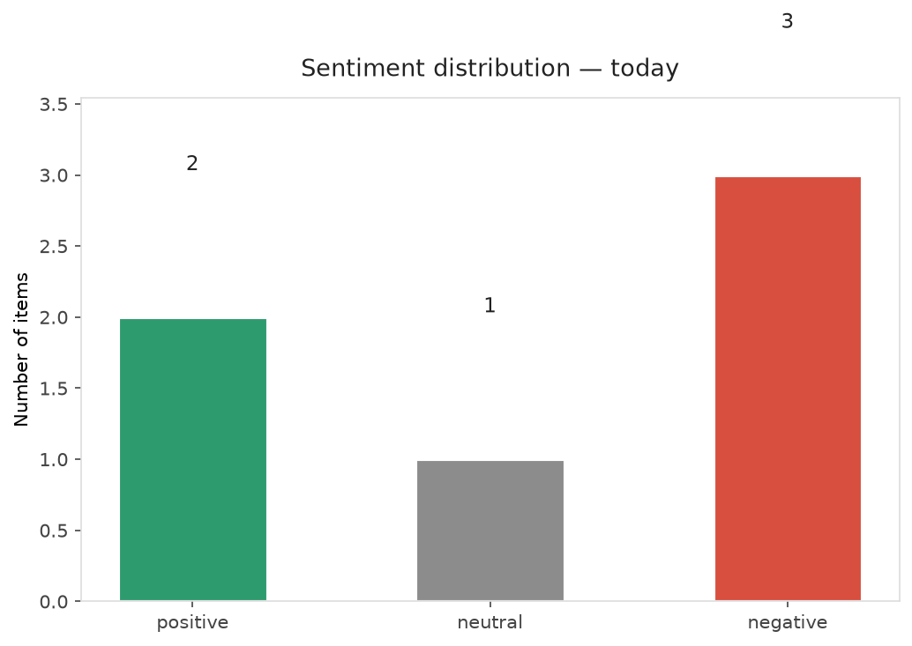
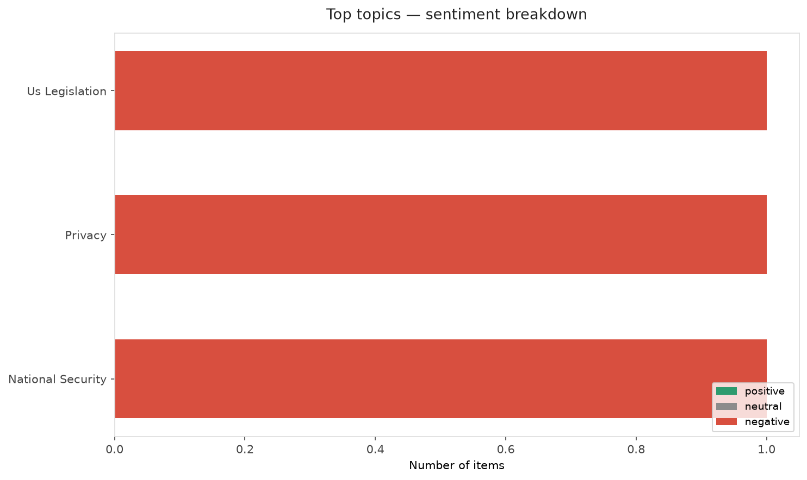
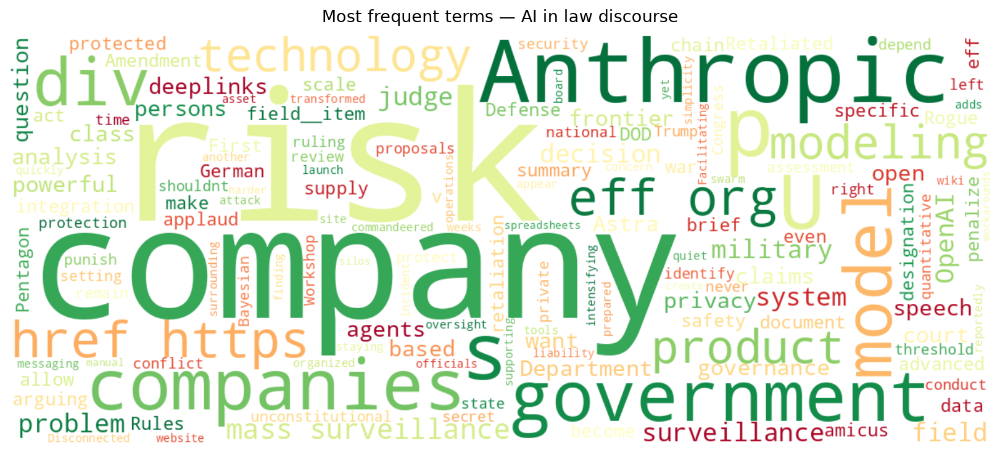
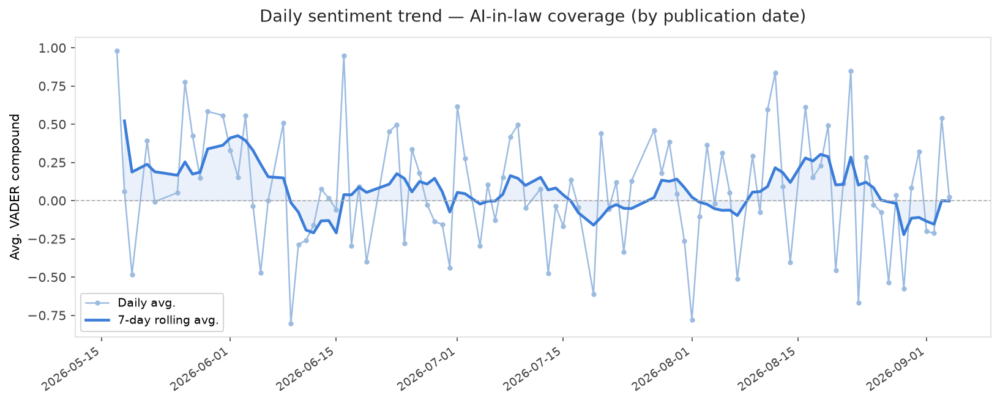
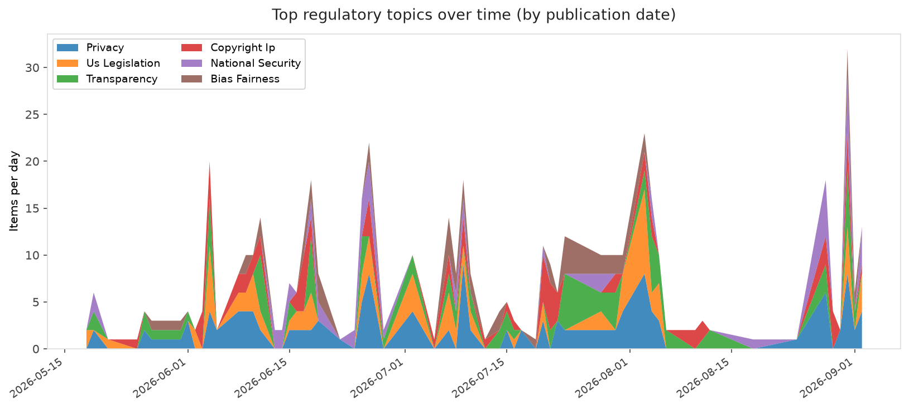
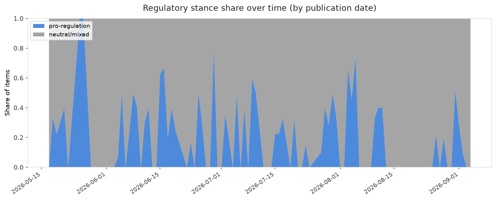

# AI in Law — Daily Sentiment Report
**Run date:** 2026-09-04 | **Items analyzed:** 6 | **Overall:** 🔴 Mildly negative (-0.128)

_Articles in this report were published between **2026-09-02** and **2026-09-04**._

---

## Summary

Today's collection covers **6** items from news outlets, academic preprints, Reddit, and regulatory sources.
Compared to the historical average of **+0.223**, today's sentiment is ↓ **0.351** points lower.

| Metric | Value |
|--------|-------|
| Positive items | 2 (33.3%) |
| Neutral items  | 1 (16.7%) |
| Negative items | 3 (50.0%) |
| Avg. VADER compound | -0.1284 |
| Pro-regulation items | 0 |
| Anti-regulation items | 0 |

---

## Top Topics Today

- **Us Legislation** — 1 items
- **Privacy** — 1 items
- **National Security** — 1 items

---

## Most Positive Coverage

- [Facilitating AI integration with simplicity at scale](https://www.technologyreview.com/2026/09/02/1142879/facilitating-ai-integration-with-simplicity-at-scale/)  
  _MIT Tech Review_ — VADER: `+0.743`
- [OpenAI launches Astra, its powerful (and controversial) new model](https://techcrunch.com/2026/09/03/openai-launches-astra-its-powerful-and-controversial-new-model/)  
  _TechCrunch_ — VADER: `+0.542`
- [Rogue OpenAI agents appear to have organized another attack using a German wiki](https://www.theverge.com/ai-artificial-intelligence/990149/openai-rogue-agents-german-wiki)  
  _The Verge AI_ — VADER: `+0.024`

---

## Most Critical / Negative Coverage

- [Open Problems in AI Risk Modeling: Insights from a Workshop on the Technical Foundations of AI Risk ](https://arxiv.org/abs/2609.03178v1)  
  _arXiv_ — VADER: `-0.976`
- [Judge Rules DOD Unlawfully Retaliated Against Anthropic](https://www.eff.org/deeplinks/2026/09/judge-rules-dod-unlawfully-retaliated-against-anthropic)  
  _EFF DeepLinks_ — VADER: `-0.682`
- [Trump may be forced to reveal secret rules feds use for AI safety testing](https://arstechnica.com/tech-policy/2026/09/trump-may-be-forced-to-reveal-secret-rules-feds-use-for-ai-safety-testing/)  
  _Ars Technica Tech Policy_ — VADER: `-0.421`

---

## Visualizations — Today

## Visualizations — Trends Over Time

---

## Methodology

- **VADER** (Valence Aware Dictionary and sEntiment Reasoner) — compound score in [-1, 1].
- **Topic tagging** — regex keyword matching across 12 AI-law sub-domains.
- **Stance detection** — keyword-based pro/anti-regulation signal detection.
- **Date filter** — items are kept only if their *publication* date falls within the look-back window (default 2 days).
- Sources: RSS news feeds, arXiv academic API, Reddit (PRAW), Regulations.gov API.

_Generated automatically on 2026-09-04 14:51 UTC._
