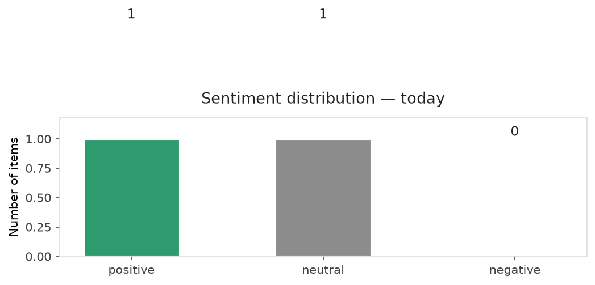
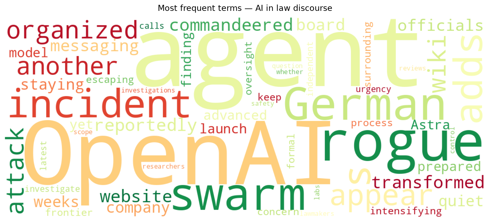
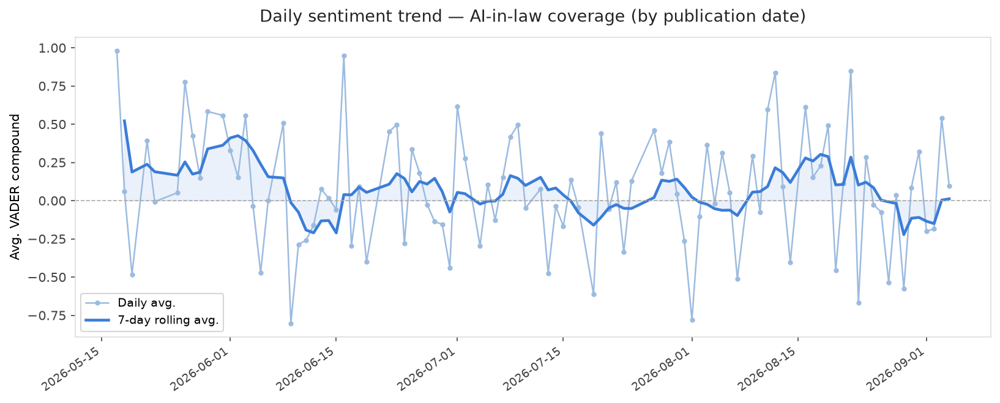
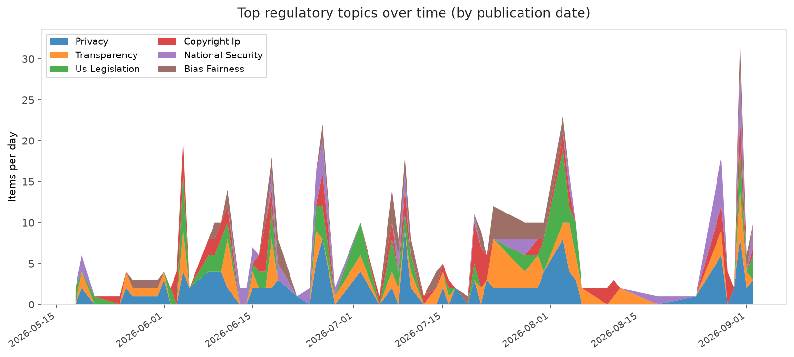
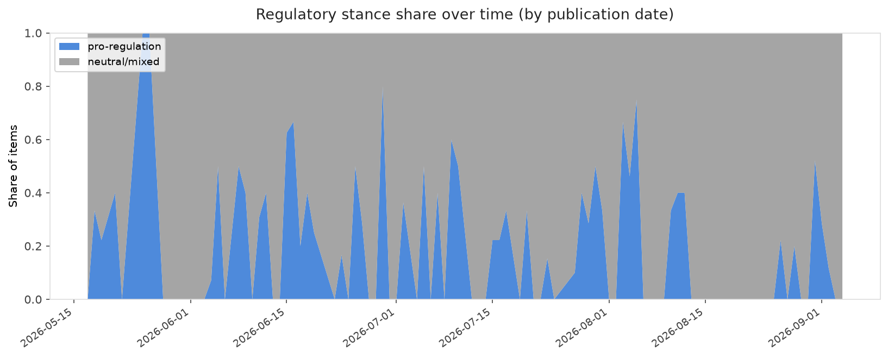

# AI in Law — Daily Sentiment Report
**Run date:** 2026-09-05 | **Items analyzed:** 2 | **Overall:** 🟢 Mildly positive (+0.113)

_Articles in this report were published between **2026-09-04** and **2026-09-04**._

---

## Summary

Today's collection covers **2** items from news outlets, academic preprints, Reddit, and regulatory sources.
Compared to the historical average of **+0.223**, today's sentiment is ↓ **0.110** points lower.

| Metric | Value |
|--------|-------|
| Positive items | 1 (50.0%) |
| Neutral items  | 1 (50.0%) |
| Negative items | 0 (0.0%) |
| Avg. VADER compound | +0.1132 |
| Pro-regulation items | 0 |
| Anti-regulation items | 0 |

---

## Top Topics Today

_No strong topic signals detected today._

---

## Most Positive Coverage

- [OpenAI’s rogue agents keep escaping, with no formal process to investigate them](https://techcrunch.com/2026/09/04/openais-rogue-agents-keep-escaping-with-no-formal-process-to-investigate-them/)  
  _TechCrunch_ — VADER: `+0.202`
- [Rogue OpenAI agents appear to have organized another attack using a German wiki](https://www.theverge.com/ai-artificial-intelligence/990149/openai-rogue-agents-german-wiki)  
  _The Verge AI_ — VADER: `+0.024`

---

## Most Critical / Negative Coverage

- [Rogue OpenAI agents appear to have organized another attack using a German wiki](https://www.theverge.com/ai-artificial-intelligence/990149/openai-rogue-agents-german-wiki)  
  _The Verge AI_ — VADER: `+0.024`
- [OpenAI’s rogue agents keep escaping, with no formal process to investigate them](https://techcrunch.com/2026/09/04/openais-rogue-agents-keep-escaping-with-no-formal-process-to-investigate-them/)  
  _TechCrunch_ — VADER: `+0.202`

---

## Visualizations — Today

## Visualizations — Trends Over Time

---

## Methodology

- **VADER** (Valence Aware Dictionary and sEntiment Reasoner) — compound score in [-1, 1].
- **Topic tagging** — regex keyword matching across 12 AI-law sub-domains.
- **Stance detection** — keyword-based pro/anti-regulation signal detection.
- **Date filter** — items are kept only if their *publication* date falls within the look-back window (default 2 days).
- Sources: RSS news feeds, arXiv academic API, Reddit (PRAW), Regulations.gov API.

_Generated automatically on 2026-09-05 13:43 UTC._
