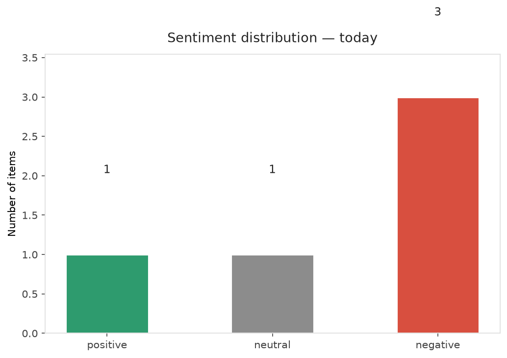
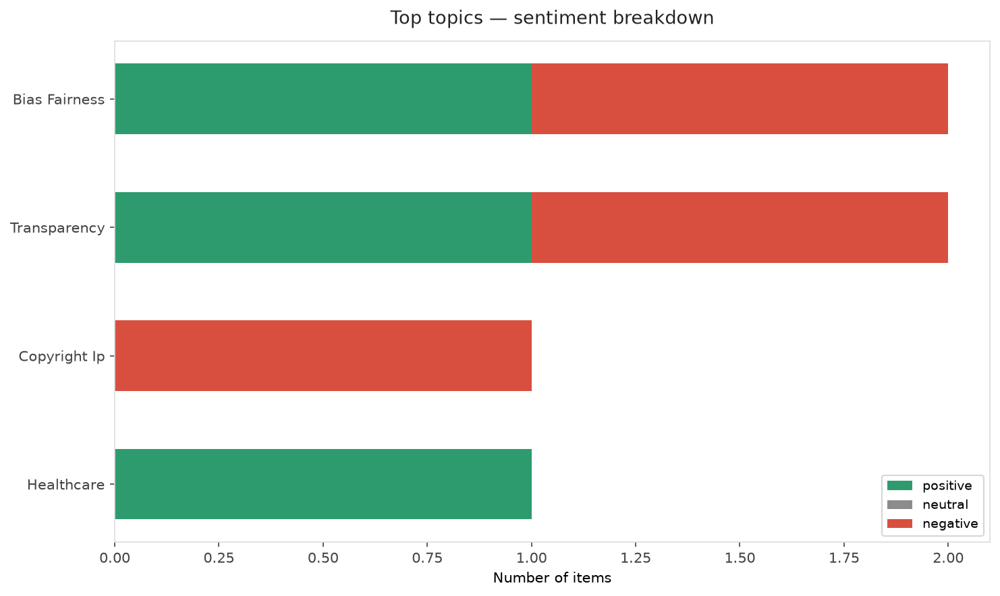
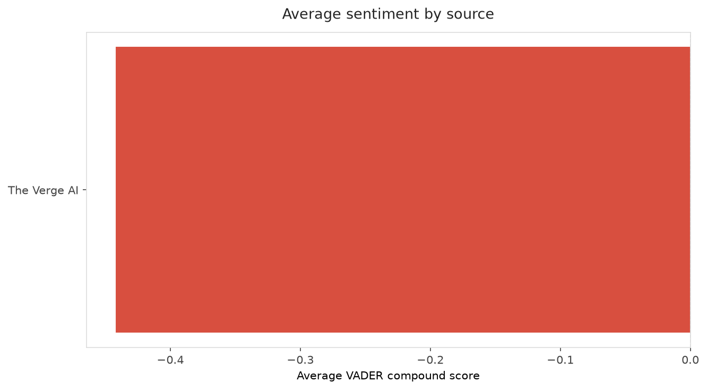
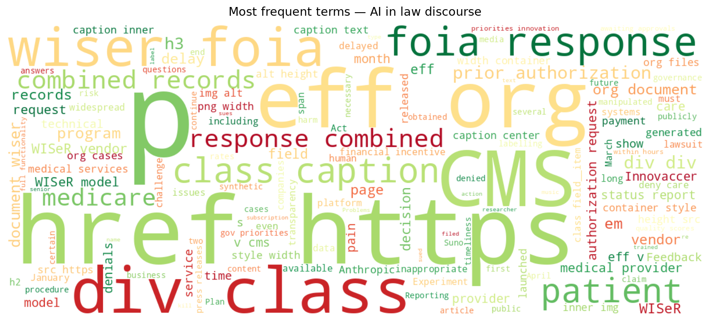
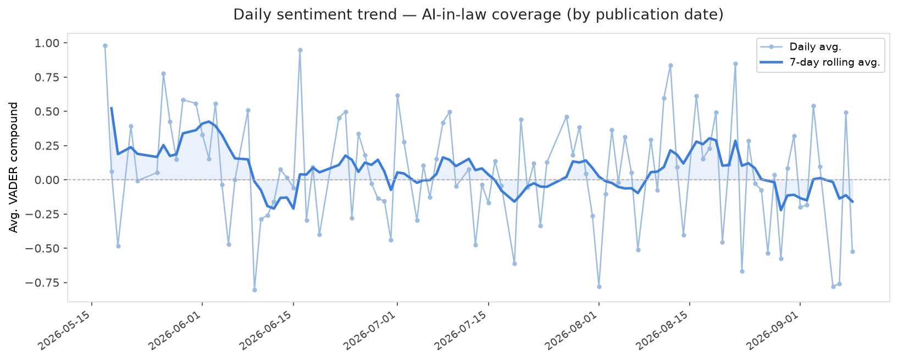
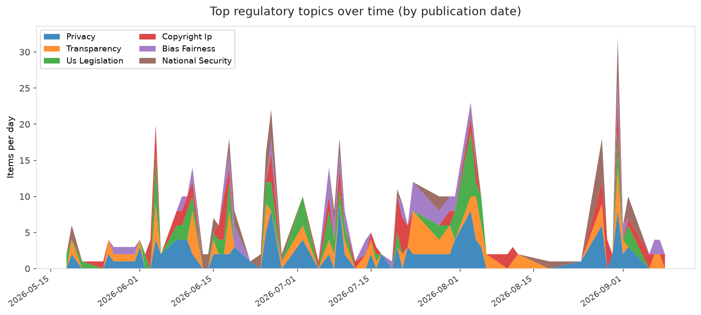
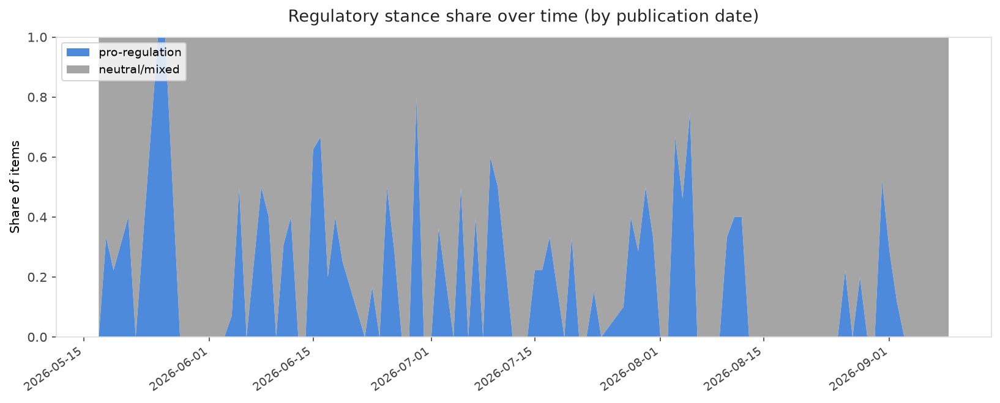

# AI in Law — Daily Sentiment Report
**Run date:** 2026-09-09 | **Items analyzed:** 5 | **Overall:** 🔴 Mildly negative (-0.165)

_Articles in this report were published between **2026-09-07** and **2026-09-09**._

---

## Summary

Today's collection covers **5** items from news outlets, academic preprints, Reddit, and regulatory sources.
Compared to the historical average of **+0.219**, today's sentiment is ↓ **0.384** points lower.

| Metric | Value |
|--------|-------|
| Positive items | 1 (20.0%) |
| Neutral items  | 1 (20.0%) |
| Negative items | 3 (60.0%) |
| Avg. VADER compound | -0.1651 |
| Pro-regulation items | 0 |
| Anti-regulation items | 0 |

---

## Top Topics Today

- **Bias Fairness** — 2 items
- **Transparency** — 2 items
- **Copyright Ip** — 1 items
- **Healthcare** — 1 items

---

## Most Positive Coverage

- [New Records Reveal Problems with Medicare’s AI Prior Authorization Experiment](https://www.eff.org/deeplinks/2026/09/new-records-reveal-problems-medicares-ai-prior-authorization-experiment)  
  _EFF DeepLinks_ — VADER: `+0.974`
- [AI power users claim Anthropic duped them with subscriptions, and they’re taking it to court](https://www.theverge.com/ai-artificial-intelligence/990313/anthropic-class-action-lawsuit-pricing-subscription-plans)  
  _The Verge AI_ — VADER: `+0.013`
- [Suno replaces its AI models with a new one trained on licensed music as copyright suits pile up](https://techcrunch.com/2026/09/09/suno-replaces-its-ai-models-with-a-new-one-trained-on-licensed-music-as-copyright-suits-pile-up/)  
  _TechCrunch_ — VADER: `-0.153`

---

## Most Critical / Negative Coverage

- [Worried Anthropic researchers warn that AI &#8216;could kill all humans&#8217;](https://www.theverge.com/ai-artificial-intelligence/991927/anthropic-ai-kill-all-humans)  
  _The Verge AI_ — VADER: `-0.898`
- [When Is Content "AI-Generated Enough"? Labelling Synthetic Media under the Digital Services Act and ](https://arxiv.org/abs/2609.07727v1)  
  _arXiv_ — VADER: `-0.761`
- [Suno replaces its AI models with a new one trained on licensed music as copyright suits pile up](https://techcrunch.com/2026/09/09/suno-replaces-its-ai-models-with-a-new-one-trained-on-licensed-music-as-copyright-suits-pile-up/)  
  _TechCrunch_ — VADER: `-0.153`

---

## Visualizations — Today

## Visualizations — Trends Over Time

---

## Methodology

- **VADER** (Valence Aware Dictionary and sEntiment Reasoner) — compound score in [-1, 1].
- **Topic tagging** — regex keyword matching across 12 AI-law sub-domains.
- **Stance detection** — keyword-based pro/anti-regulation signal detection.
- **Date filter** — items are kept only if their *publication* date falls within the look-back window (default 2 days).
- Sources: RSS news feeds, arXiv academic API, Reddit (PRAW), Regulations.gov API.

_Generated automatically on 2026-09-09 15:03 UTC._
