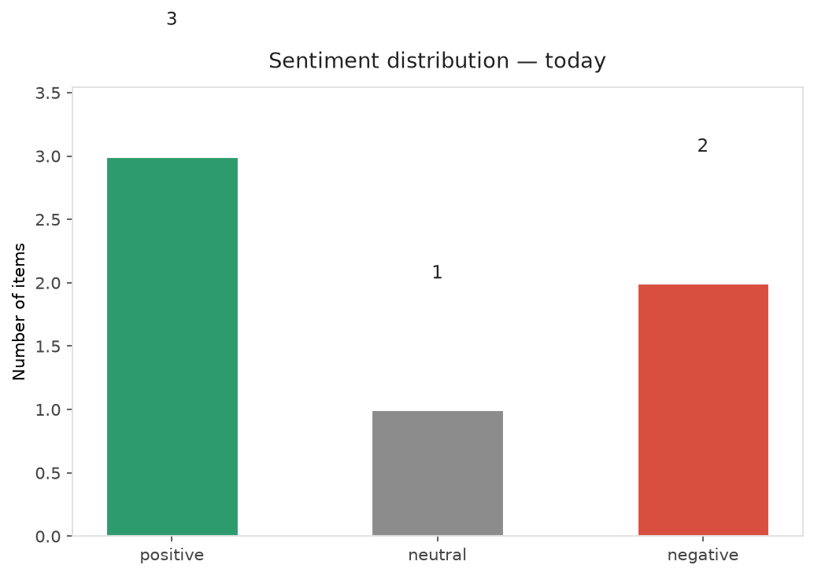
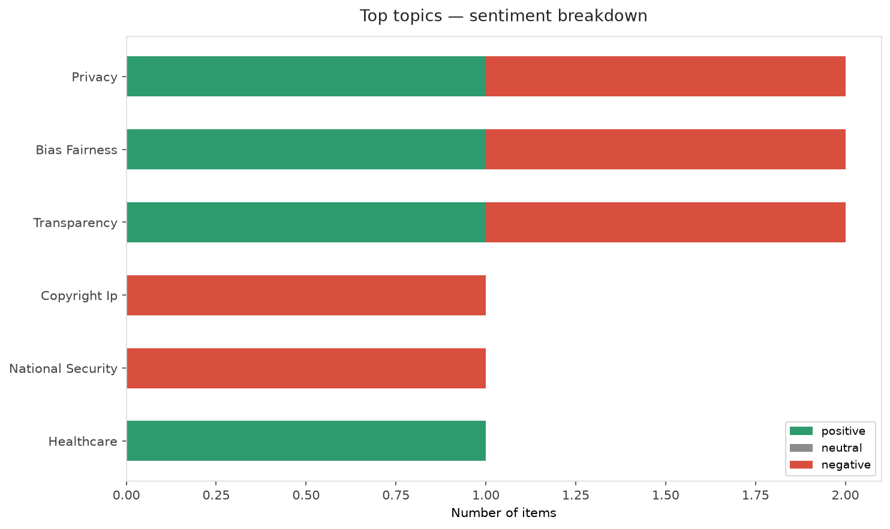
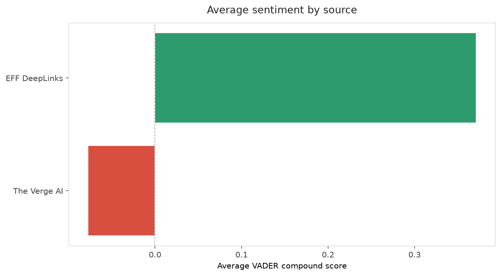
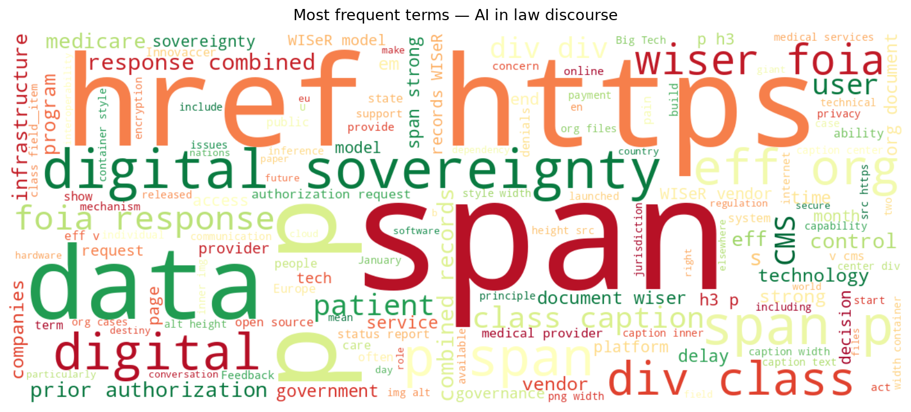
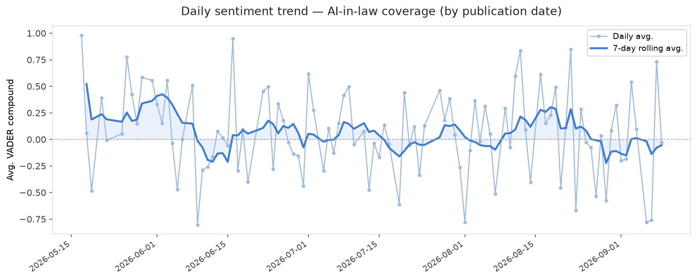
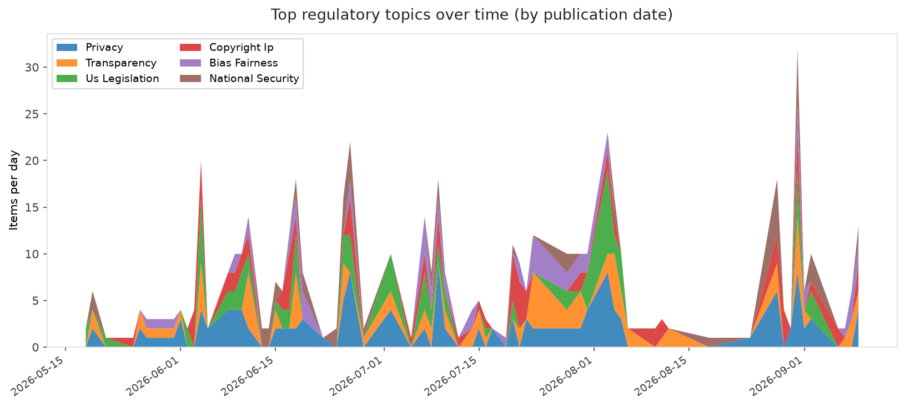
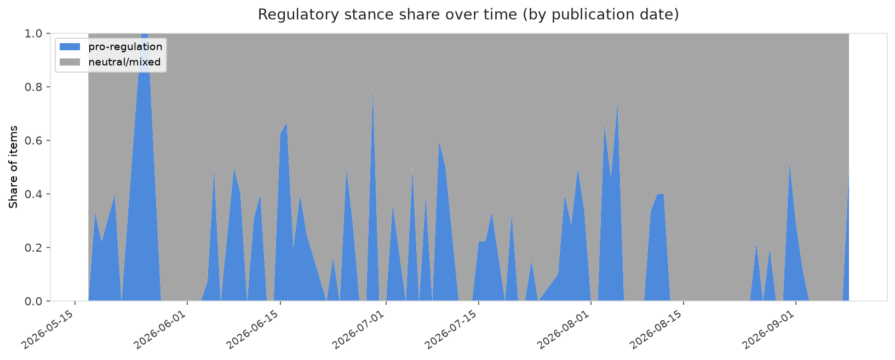

# AI in Law — Daily Sentiment Report
**Run date:** 2026-09-10 | **Items analyzed:** 6 | **Overall:** 🟢 Mildly positive (+0.222)

_Articles in this report were published between **2026-09-08** and **2026-09-09**._

---

## Summary

Today's collection covers **6** items from news outlets, academic preprints, Reddit, and regulatory sources.
Compared to the historical average of **+0.219**, today's sentiment is ↑ **0.004** points higher.

| Metric | Value |
|--------|-------|
| Positive items | 3 (50.0%) |
| Neutral items  | 1 (16.7%) |
| Negative items | 2 (33.3%) |
| Avg. VADER compound | +0.2221 |
| Pro-regulation items | 3 |
| Anti-regulation items | 0 |

---

## Top Topics Today

- **Privacy** — 2 items
- **Bias Fairness** — 2 items
- **Transparency** — 2 items
- **Copyright Ip** — 1 items
- **National Security** — 1 items

---

## Most Positive Coverage

- [New Records Reveal Problems with Medicare’s AI Prior Authorization Experiment](https://www.eff.org/deeplinks/2026/09/new-records-reveal-problems-medicares-ai-prior-authorization-experiment)  
  _EFF DeepLinks_ — VADER: `+0.974`
- [Microsoft has new AI privacy rules for schools](https://www.theverge.com/policy/992359/microsoft-aft-schools-ai-privacy)  
  _The Verge AI_ — VADER: `+0.743`
- [Harvey hits $15.5B valuation, months after reaching $11B](https://techcrunch.com/2026/09/09/harvey-hits-15-5b-valuation-months-after-reaching-11b/)  
  _TechCrunch_ — VADER: `+0.727`

---

## Most Critical / Negative Coverage

- [Worried Anthropic researchers warn that AI &#8216;could kill all humans&#8217;](https://www.theverge.com/ai-artificial-intelligence/991927/anthropic-ai-kill-all-humans)  
  _The Verge AI_ — VADER: `-0.898`
- [Digital Sovereignty: What It Is, What It Could Be](https://www.eff.org/deeplinks/2026/09/digital-sovereignty-what-it-what-it-could-be)  
  _EFF DeepLinks_ — VADER: `-0.232`
- [Beyond Training: A Feasibility Taxonomy for Inference-Time AI Governance](https://arxiv.org/abs/2609.10105v1)  
  _arXiv_ — VADER: `+0.018`

---

## Visualizations — Today

## Visualizations — Trends Over Time

---

## Methodology

- **VADER** (Valence Aware Dictionary and sEntiment Reasoner) — compound score in [-1, 1].
- **Topic tagging** — regex keyword matching across 12 AI-law sub-domains.
- **Stance detection** — keyword-based pro/anti-regulation signal detection.
- **Date filter** — items are kept only if their *publication* date falls within the look-back window (default 2 days).
- Sources: RSS news feeds, arXiv academic API, Reddit (PRAW), Regulations.gov API.

_Generated automatically on 2026-09-10 14:54 UTC._
