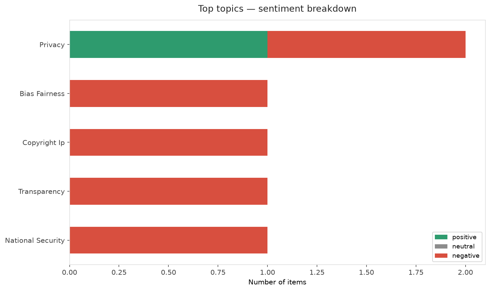
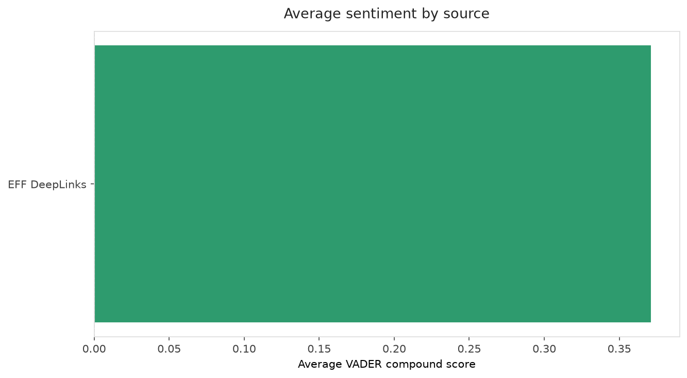
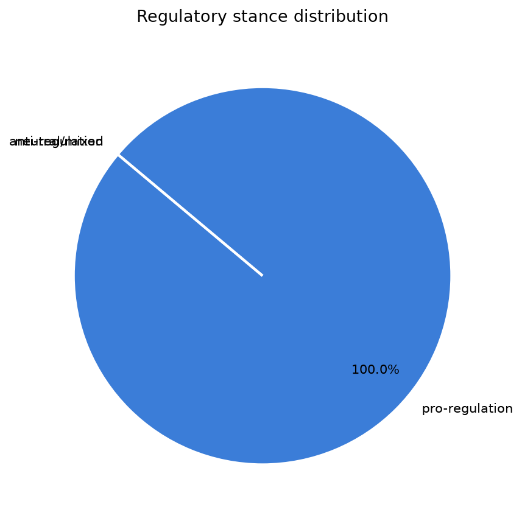
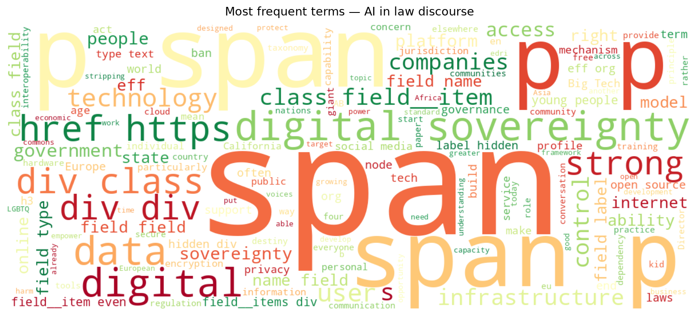
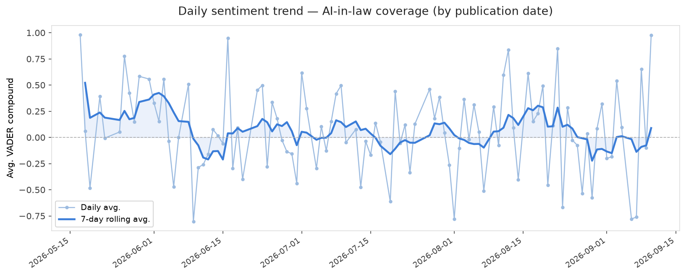
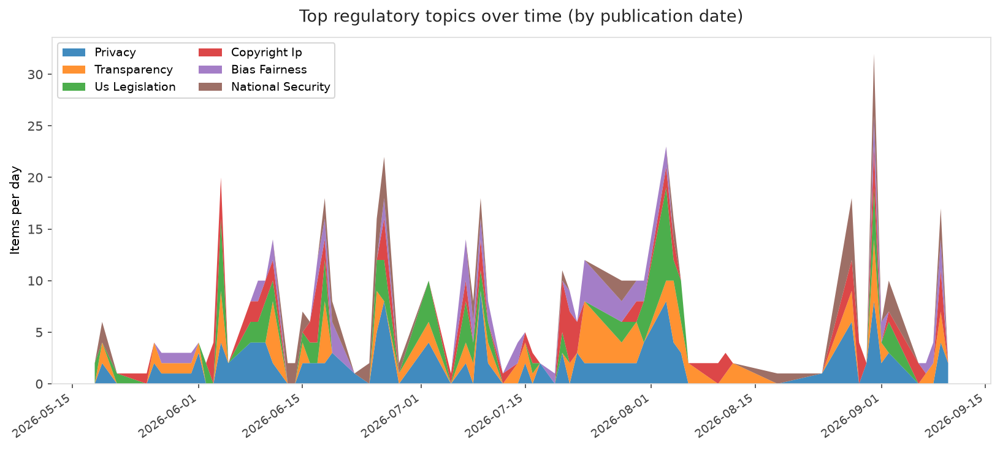
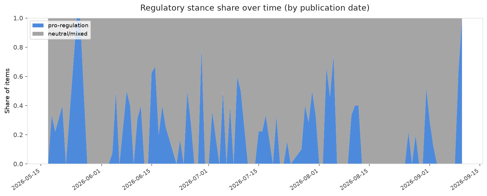

# AI in Law — Daily Sentiment Report
**Run date:** 2026-09-11 | **Items analyzed:** 3 | **Overall:** 🟢 Mildly positive (+0.254)

_Articles in this report were published between **2026-09-09** and **2026-09-10**._

---

## Summary

Today's collection covers **3** items from news outlets, academic preprints, Reddit, and regulatory sources.
Compared to the historical average of **+0.219**, today's sentiment is ↑ **0.035** points higher.

| Metric | Value |
|--------|-------|
| Positive items | 1 (33.3%) |
| Neutral items  | 1 (33.3%) |
| Negative items | 1 (33.3%) |
| Avg. VADER compound | +0.2539 |
| Pro-regulation items | 3 |
| Anti-regulation items | 0 |

---

## Top Topics Today

- **Privacy** — 2 items
- **Bias Fairness** — 1 items
- **Copyright Ip** — 1 items
- **Transparency** — 1 items
- **National Security** — 1 items

---

## Most Positive Coverage

- [We All Deserve a Better Internet, Not A Smaller One](https://www.eff.org/press/releases/we-all-deserve-better-internet-not-smaller-one)  
  _EFF DeepLinks_ — VADER: `+0.975`
- [Beyond Training: A Feasibility Taxonomy for Inference-Time AI Governance](https://arxiv.org/abs/2609.10105v1)  
  _arXiv_ — VADER: `+0.018`
- [Digital Sovereignty: What It Is, What It Could Be](https://www.eff.org/deeplinks/2026/09/digital-sovereignty-what-it-what-it-could-be)  
  _EFF DeepLinks_ — VADER: `-0.232`

---

## Most Critical / Negative Coverage

- [Digital Sovereignty: What It Is, What It Could Be](https://www.eff.org/deeplinks/2026/09/digital-sovereignty-what-it-what-it-could-be)  
  _EFF DeepLinks_ — VADER: `-0.232`
- [Beyond Training: A Feasibility Taxonomy for Inference-Time AI Governance](https://arxiv.org/abs/2609.10105v1)  
  _arXiv_ — VADER: `+0.018`
- [We All Deserve a Better Internet, Not A Smaller One](https://www.eff.org/press/releases/we-all-deserve-better-internet-not-smaller-one)  
  _EFF DeepLinks_ — VADER: `+0.975`

---

## Visualizations — Today

## Visualizations — Trends Over Time

---

## Methodology

- **VADER** (Valence Aware Dictionary and sEntiment Reasoner) — compound score in [-1, 1].
- **Topic tagging** — regex keyword matching across 12 AI-law sub-domains.
- **Stance detection** — keyword-based pro/anti-regulation signal detection.
- **Date filter** — items are kept only if their *publication* date falls within the look-back window (default 2 days).
- Sources: RSS news feeds, arXiv academic API, Reddit (PRAW), Regulations.gov API.

_Generated automatically on 2026-09-11 14:53 UTC._
