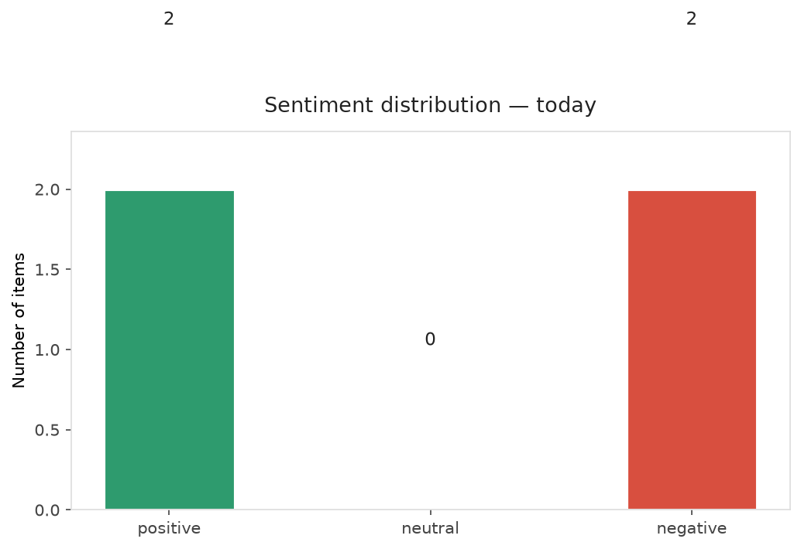
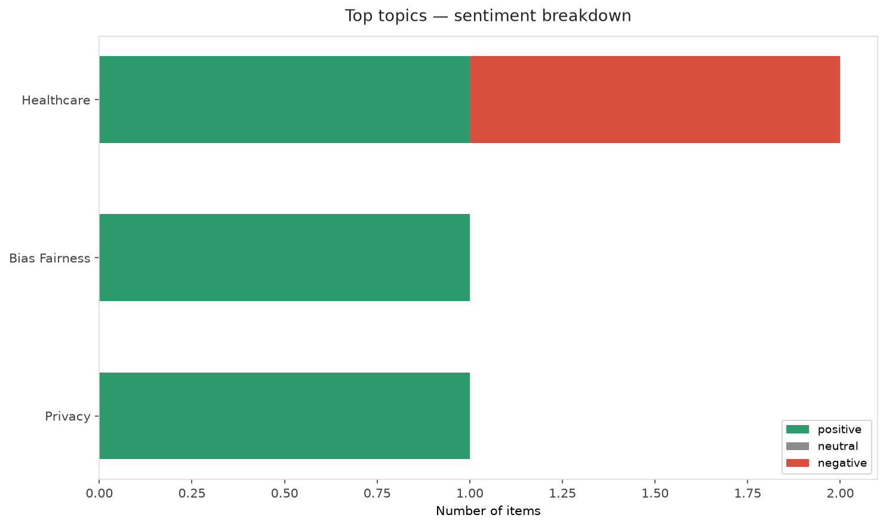
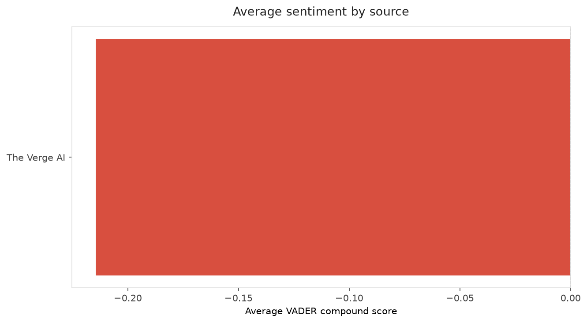
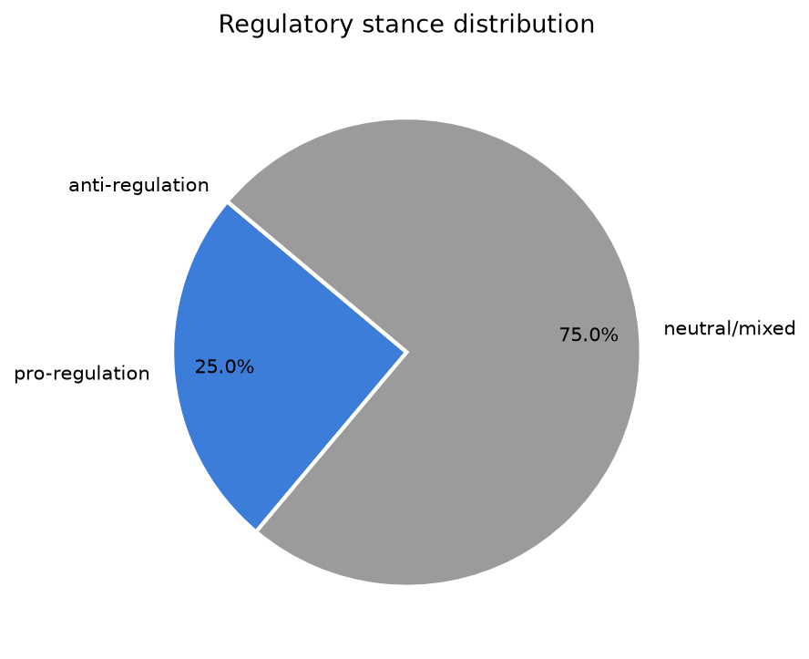
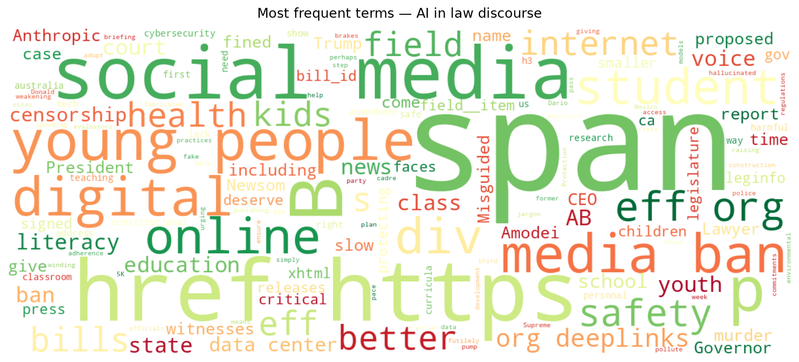
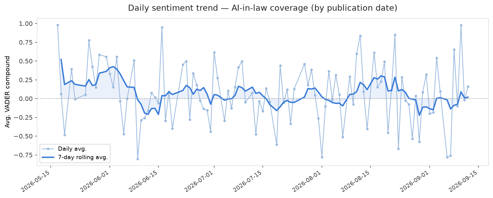
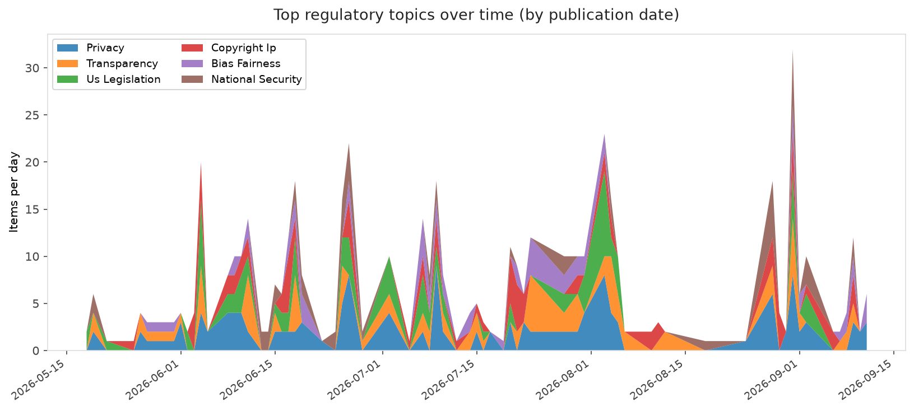
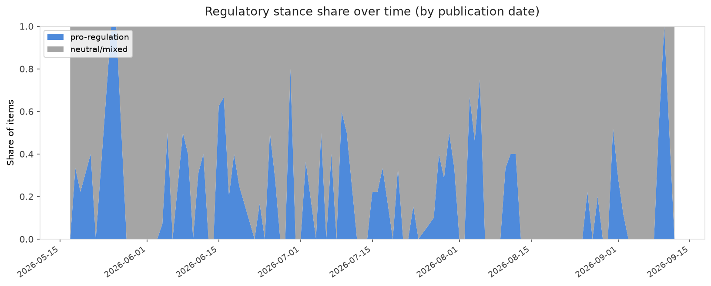

# AI in Law — Daily Sentiment Report
**Run date:** 2026-09-13 | **Items analyzed:** 4 | **Overall:** 🟢 Mildly positive (+0.070)

_Articles in this report were published between **2026-09-11** and **2026-09-12**._

---

## Summary

Today's collection covers **4** items from news outlets, academic preprints, Reddit, and regulatory sources.
Compared to the historical average of **+0.218**, today's sentiment is ↓ **0.149** points lower.

| Metric | Value |
|--------|-------|
| Positive items | 2 (50.0%) |
| Neutral items  | 0 (0.0%) |
| Negative items | 2 (50.0%) |
| Avg. VADER compound | +0.0696 |
| Pro-regulation items | 1 |
| Anti-regulation items | 0 |

---

## Top Topics Today

- **Healthcare** — 2 items
- **Bias Fairness** — 1 items
- **Privacy** — 1 items

---

## Most Positive Coverage

- [Governor Newsom Signs Student-Backed Digital Literacy Bills Alongside Misguided Bans](https://www.eff.org/deeplinks/2026/09/governor-newsom-signs-student-backed-digital-literacy-bills-alongside-misguided)  
  _EFF DeepLinks_ — VADER: `+0.922`
- [Anthropic CEO says it’s time to pump the brakes on AI](https://www.theverge.com/ai-artificial-intelligence/994337/anthropic-ceo-slow-down-ai-development)  
  _The Verge AI_ — VADER: `+0.878`
- [Trump is giving data centers a pass to pollute](https://www.theverge.com/ai-artificial-intelligence/994112/ai-data-center-pollution-health-epa)  
  _The Verge AI_ — VADER: `-0.557`

---

## Most Critical / Negative Coverage

- [Lawyer fined $5K over AI-hallucinated witnesses in a murder case](https://www.theverge.com/ai-artificial-intelligence/994207/chatgpt-new-mexico-lawyer-fined-murder-appeal)  
  _The Verge AI_ — VADER: `-0.964`
- [Trump is giving data centers a pass to pollute](https://www.theverge.com/ai-artificial-intelligence/994112/ai-data-center-pollution-health-epa)  
  _The Verge AI_ — VADER: `-0.557`
- [Anthropic CEO says it’s time to pump the brakes on AI](https://www.theverge.com/ai-artificial-intelligence/994337/anthropic-ceo-slow-down-ai-development)  
  _The Verge AI_ — VADER: `+0.878`

---

## Visualizations — Today

## Visualizations — Trends Over Time

---

## Methodology

- **VADER** (Valence Aware Dictionary and sEntiment Reasoner) — compound score in [-1, 1].
- **Topic tagging** — regex keyword matching across 12 AI-law sub-domains.
- **Stance detection** — keyword-based pro/anti-regulation signal detection.
- **Date filter** — items are kept only if their *publication* date falls within the look-back window (default 2 days).
- Sources: RSS news feeds, arXiv academic API, Reddit (PRAW), Regulations.gov API.

_Generated automatically on 2026-09-13 14:52 UTC._
