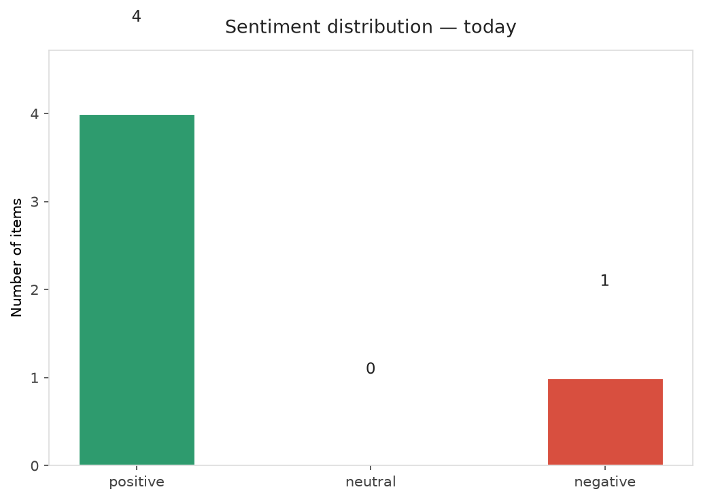
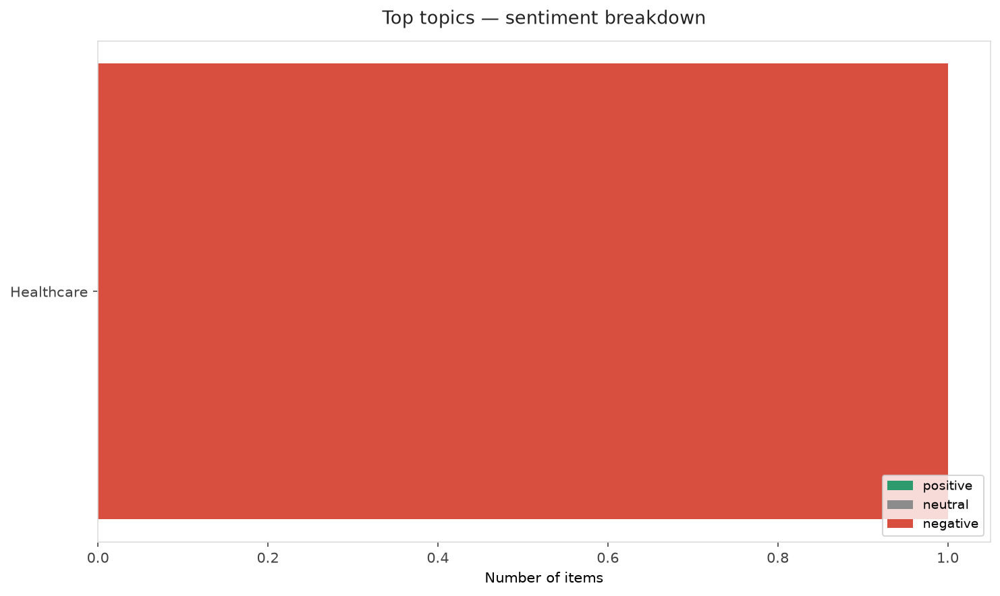
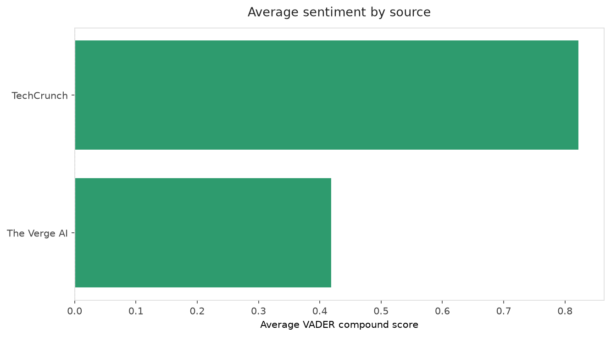
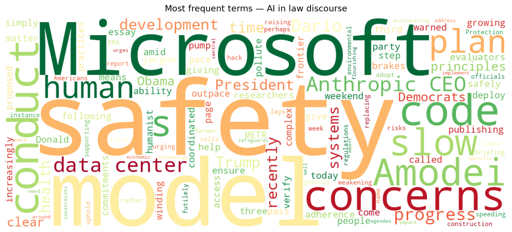
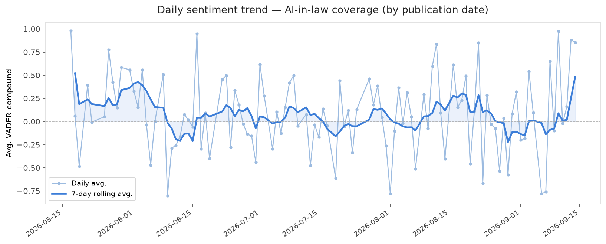
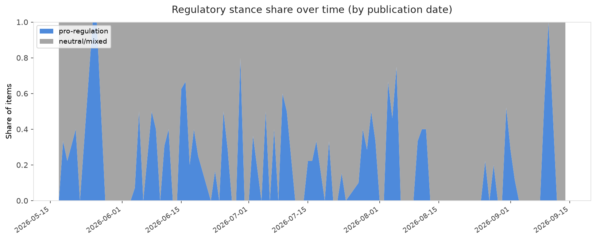

# AI in Law — Daily Sentiment Report
**Run date:** 2026-09-14 | **Items analyzed:** 5 | **Overall:** 🟢 Mildly positive (+0.581)

_Articles in this report were published between **2026-09-12** and **2026-09-14**._

---

## Summary

Today's collection covers **5** items from news outlets, academic preprints, Reddit, and regulatory sources.
Compared to the historical average of **+0.220**, today's sentiment is ↑ **0.360** points higher.

| Metric | Value |
|--------|-------|
| Positive items | 4 (80.0%) |
| Neutral items  | 0 (0.0%) |
| Negative items | 1 (20.0%) |
| Avg. VADER compound | +0.5806 |
| Pro-regulation items | 0 |
| Anti-regulation items | 0 |

---

## Top Topics Today

- **Healthcare** — 1 items

---

## Most Positive Coverage

- [Microsoft says ‘people matter more than AI’ following safety concerns](https://www.theverge.com/news/994566/microsoft-humanist-ai-code-of-conduct)  
  _The Verge AI_ — VADER: `+0.937`
- [Obama urges Democrats to have a ‘clear plan’ for AI safeguards](https://techcrunch.com/2026/09/13/obama-urges-democrats-to-have-a-clear-plan-for-ai-safeguards/)  
  _TechCrunch_ — VADER: `+0.880`
- [Anthropic CEO says it’s time to pump the brakes on AI](https://www.theverge.com/ai-artificial-intelligence/994337/anthropic-ceo-slow-down-ai-development)  
  _The Verge AI_ — VADER: `+0.878`

---

## Most Critical / Negative Coverage

- [Trump is giving data centers a pass to pollute](https://www.theverge.com/ai-artificial-intelligence/994112/ai-data-center-pollution-health-epa)  
  _The Verge AI_ — VADER: `-0.557`
- [Microsoft’s new AI ‘code of conduct’ tells models not to hack systems or trick humans](https://techcrunch.com/2026/09/14/microsofts-new-ai-code-of-conduct-tells-models-not-to-hack-systems-or-trick-humans/)  
  _TechCrunch_ — VADER: `+0.765`
- [Anthropic CEO says it’s time to pump the brakes on AI](https://www.theverge.com/ai-artificial-intelligence/994337/anthropic-ceo-slow-down-ai-development)  
  _The Verge AI_ — VADER: `+0.878`

---

## Visualizations — Today

## Visualizations — Trends Over Time

---

## Methodology

- **VADER** (Valence Aware Dictionary and sEntiment Reasoner) — compound score in [-1, 1].
- **Topic tagging** — regex keyword matching across 12 AI-law sub-domains.
- **Stance detection** — keyword-based pro/anti-regulation signal detection.
- **Date filter** — items are kept only if their *publication* date falls within the look-back window (default 2 days).
- Sources: RSS news feeds, arXiv academic API, Reddit (PRAW), Regulations.gov API.

_Generated automatically on 2026-09-14 16:51 UTC._
