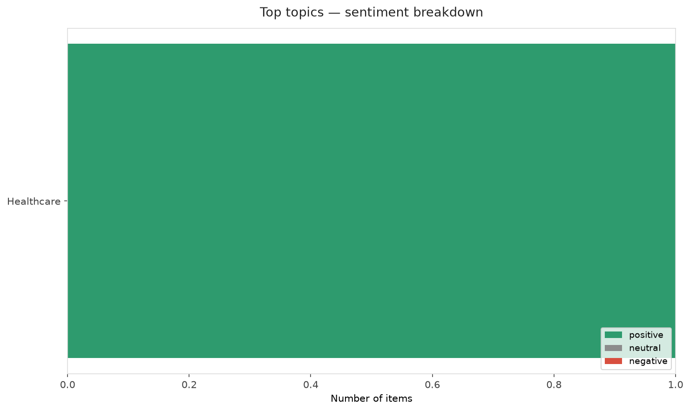
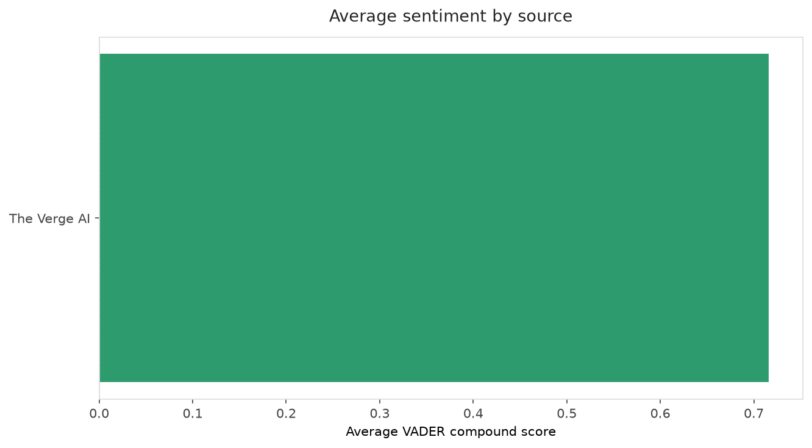
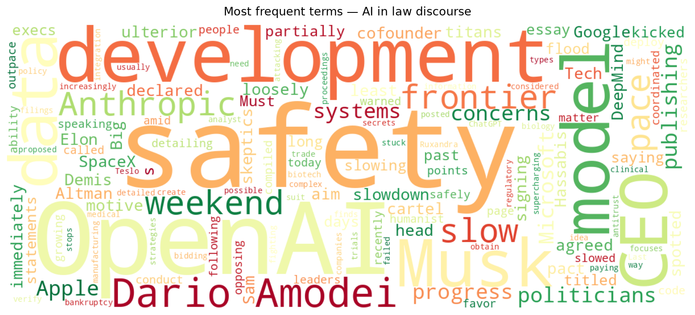
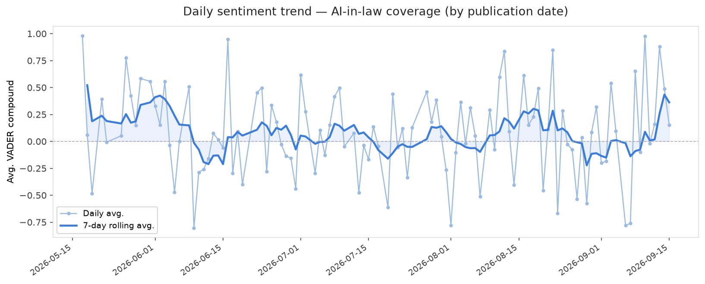
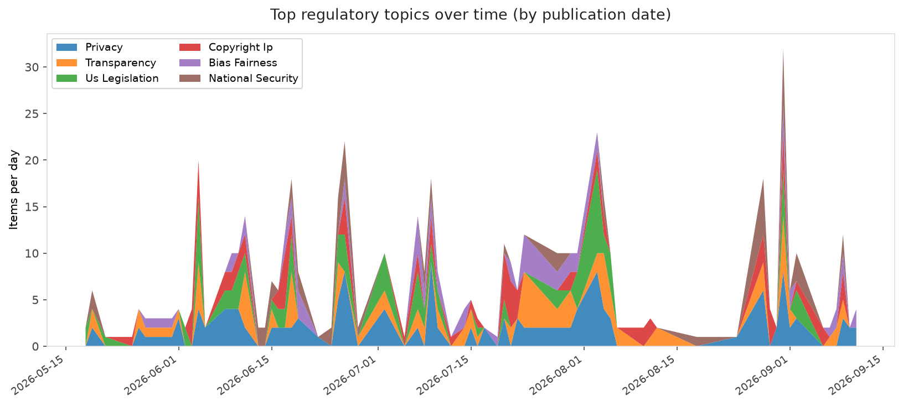
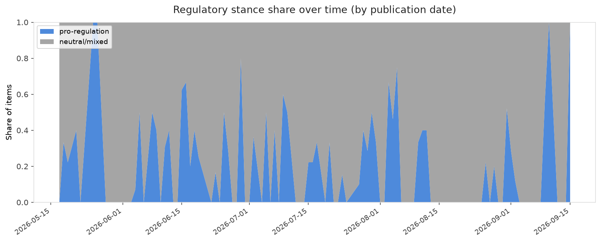

# AI in Law — Daily Sentiment Report
**Run date:** 2026-09-15 | **Items analyzed:** 5 | **Overall:** 🟢 Mildly positive (+0.351)

_Articles in this report were published between **2026-09-14** and **2026-09-15**._

---

## Summary

Today's collection covers **5** items from news outlets, academic preprints, Reddit, and regulatory sources.
Compared to the historical average of **+0.221**, today's sentiment is ↑ **0.130** points higher.

| Metric | Value |
|--------|-------|
| Positive items | 4 (80.0%) |
| Neutral items  | 0 (0.0%) |
| Negative items | 1 (20.0%) |
| Avg. VADER compound | +0.3506 |
| Pro-regulation items | 1 |
| Anti-regulation items | 0 |

---

## Top Topics Today

- **Healthcare** — 1 items

---

## Most Positive Coverage

- [Microsoft says ‘people matter more than AI’ following safety concerns](https://www.theverge.com/news/994566/microsoft-humanist-ai-code-of-conduct)  
  _The Verge AI_ — VADER: `+0.937`
- [What execs and politicians are saying about slowing down AI development](https://www.theverge.com/ai-artificial-intelligence/995141/ai-executives-politicians-safety-regulation-anthropic-dario-amodei)  
  _The Verge AI_ — VADER: `+0.670`
- [Is Big Tech’s AI slowdown a safety pact or a cartel?](https://www.theverge.com/ai-artificial-intelligence/995186/is-big-techs-ai-slowdown-a-safety-pact-or-a-cartel)  
  _The Verge AI_ — VADER: `+0.542`

---

## Most Critical / Negative Coverage

- [OpenAI stuck fighting Musk antitrust suit after Apple finds a way out](https://arstechnica.com/tech-policy/2026/09/musk-drops-apple-from-antitrust-suit-but-keeps-gunning-for-openai/)  
  _Ars Technica Tech Policy_ — VADER: `-0.550`
- [AI models need more data about biology, and OpenAI is paying to create it](https://www.technologyreview.com/2026/09/15/1144129/ai-models-need-more-data-about-biology-and-openai-is-paying-to-create-it/)  
  _MIT Tech Review_ — VADER: `+0.153`
- [Is Big Tech’s AI slowdown a safety pact or a cartel?](https://www.theverge.com/ai-artificial-intelligence/995186/is-big-techs-ai-slowdown-a-safety-pact-or-a-cartel)  
  _The Verge AI_ — VADER: `+0.542`

---

## Visualizations — Today

## Visualizations — Trends Over Time

---

## Methodology

- **VADER** (Valence Aware Dictionary and sEntiment Reasoner) — compound score in [-1, 1].
- **Topic tagging** — regex keyword matching across 12 AI-law sub-domains.
- **Stance detection** — keyword-based pro/anti-regulation signal detection.
- **Date filter** — items are kept only if their *publication* date falls within the look-back window (default 2 days).
- Sources: RSS news feeds, arXiv academic API, Reddit (PRAW), Regulations.gov API.

_Generated automatically on 2026-09-15 15:32 UTC._
