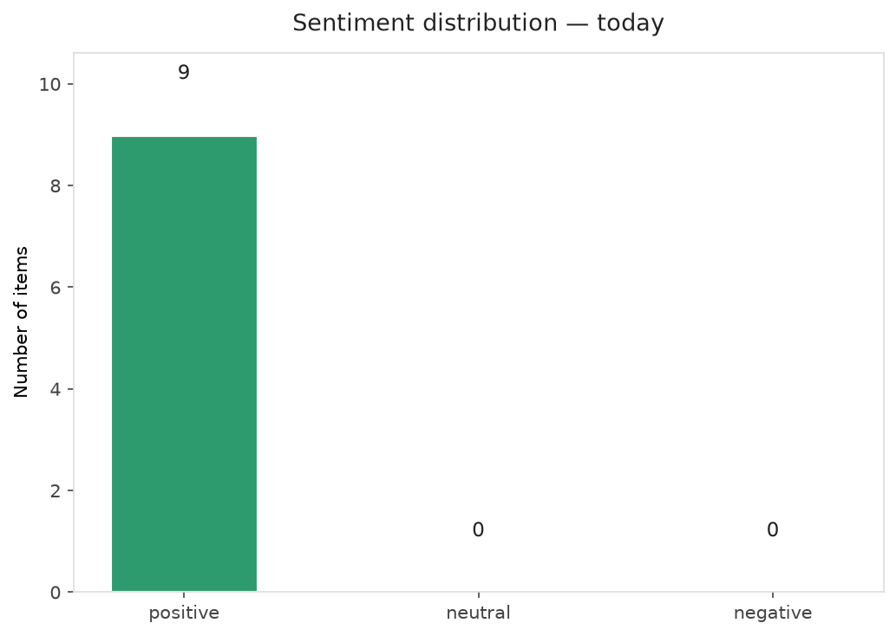
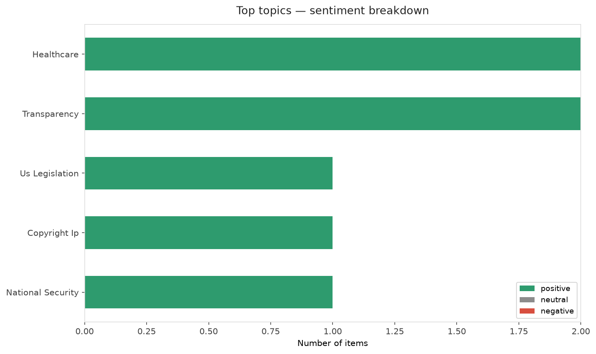
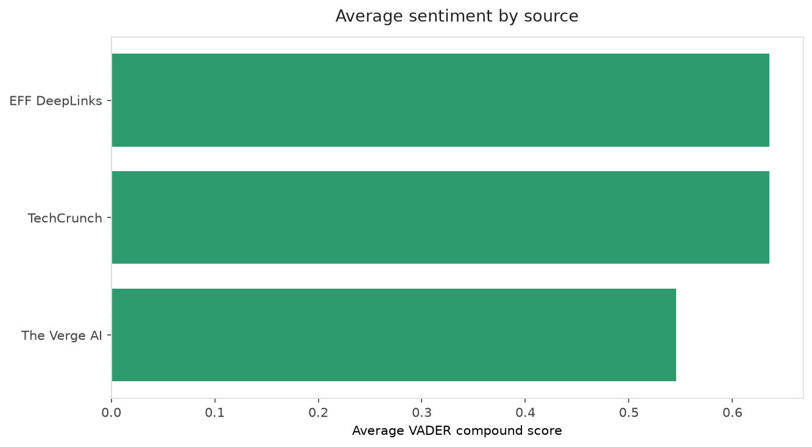
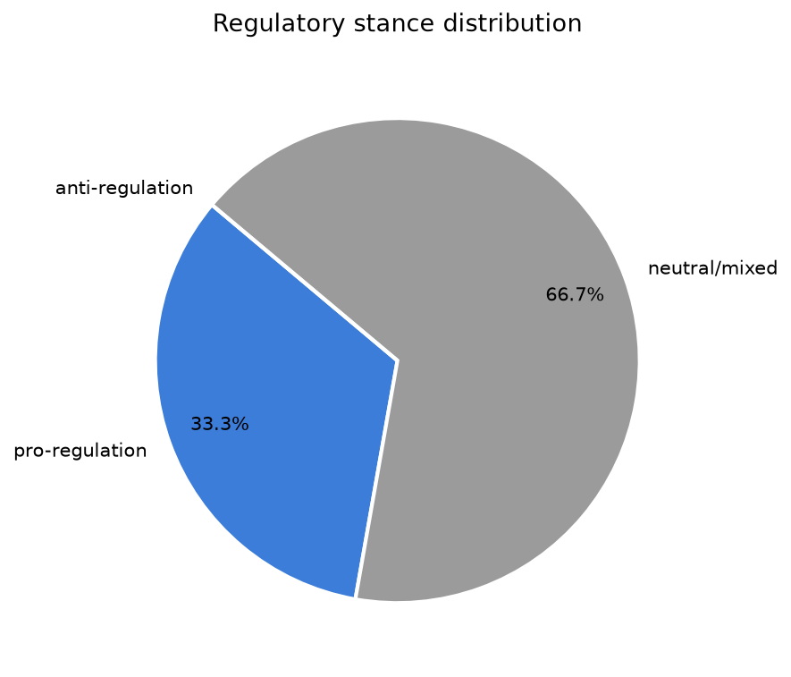
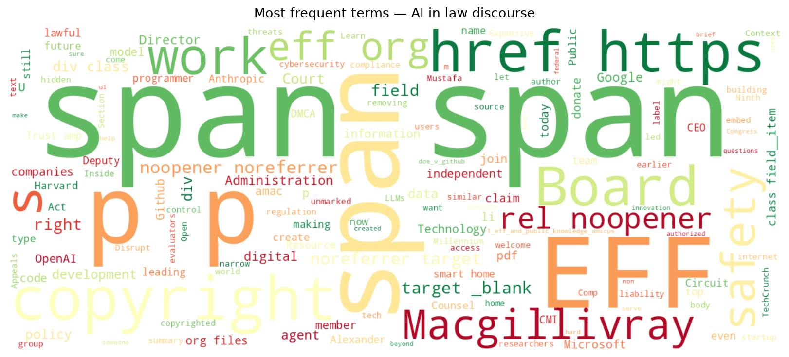
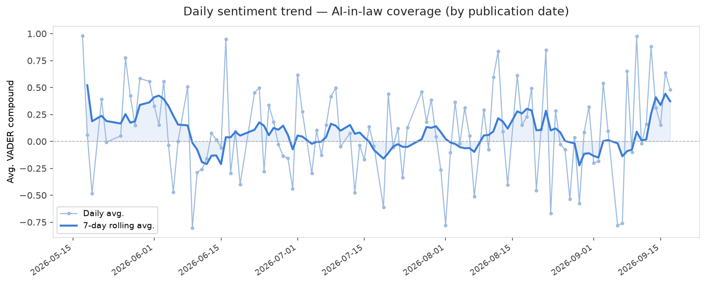
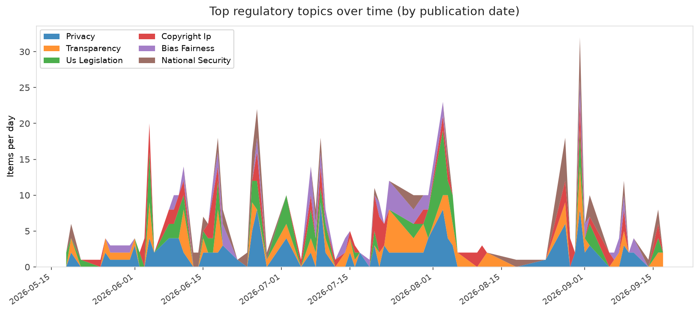
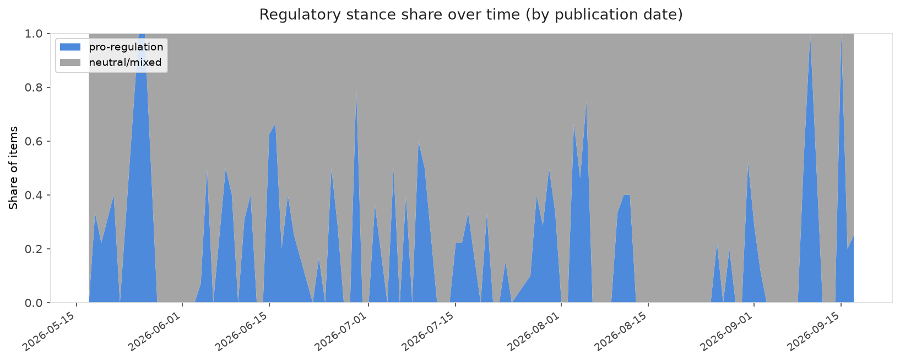

# AI in Law — Daily Sentiment Report
**Run date:** 2026-09-17 | **Items analyzed:** 9 | **Overall:** 🟢 Mildly positive (+0.552)

_Articles in this report were published between **2026-09-15** and **2026-09-17**._

---

## Summary

Today's collection covers **9** items from news outlets, academic preprints, Reddit, and regulatory sources.
Compared to the historical average of **+0.223**, today's sentiment is ↑ **0.330** points higher.

| Metric | Value |
|--------|-------|
| Positive items | 9 (100.0%) |
| Neutral items  | 0 (0.0%) |
| Negative items | 0 (0.0%) |
| Avg. VADER compound | +0.5525 |
| Pro-regulation items | 3 |
| Anti-regulation items | 0 |

---

## Top Topics Today

- **Healthcare** — 2 items
- **Transparency** — 2 items
- **Us Legislation** — 1 items
- **Copyright Ip** — 1 items
- **National Security** — 1 items

---

## Most Positive Coverage

- [EFF Welcomes Alexander Macgillivray to its Board of Directors](https://www.eff.org/deeplinks/2026/09/eff-welcomes-alexander-macgillivray-its-board-directors)  
  _EFF DeepLinks_ — VADER: `+0.989`
- [Google will now let any AI agent run your smart home](https://www.theverge.com/tech/996310/google-home-mcp-integration-agentic-ai-smart-home-price-release-date)  
  _The Verge AI_ — VADER: `+0.863`
- [Anthropic and OpenAI want to embed safety evaluators. Will they really be independent?](https://techcrunch.com/2026/09/16/anthropic-and-openai-want-to-embed-safety-evaluators-will-they-really-be-independent/)  
  _TechCrunch_ — VADER: `+0.754`

---

## Most Critical / Negative Coverage

- [Microsoft AI CEO says AI threats are real, and Anthropic is making it worse](https://www.theverge.com/podcast/996412/microsoft-ai-ceo-mustafa-suleyman-regulation-safety-anthropic-claude)  
  _The Verge AI_ — VADER: `+0.127`
- [AI models need more data about biology, and OpenAI is paying to create it](https://www.technologyreview.com/2026/09/15/1144129/ai-models-need-more-data-about-biology-and-openai-is-paying-to-create-it/)  
  _MIT Tech Review_ — VADER: `+0.153`
- [Victory! Appeals Court Rejects Expansive New Copyright Claim](https://www.eff.org/deeplinks/2026/09/victory-appeals-court-rejects-expansive-new-copyright-claim)  
  _EFF DeepLinks_ — VADER: `+0.284`

---

## Visualizations — Today

## Visualizations — Trends Over Time

---

## Methodology

- **VADER** (Valence Aware Dictionary and sEntiment Reasoner) — compound score in [-1, 1].
- **Topic tagging** — regex keyword matching across 12 AI-law sub-domains.
- **Stance detection** — keyword-based pro/anti-regulation signal detection.
- **Date filter** — items are kept only if their *publication* date falls within the look-back window (default 2 days).
- Sources: RSS news feeds, arXiv academic API, Reddit (PRAW), Regulations.gov API.

_Generated automatically on 2026-09-17 15:29 UTC._
