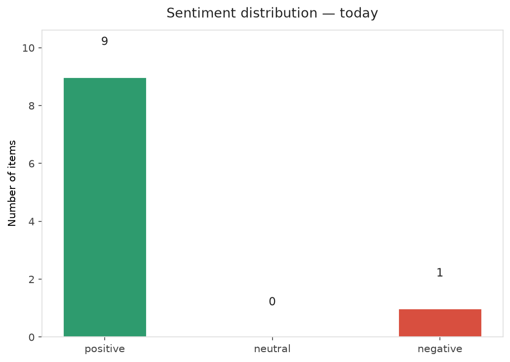
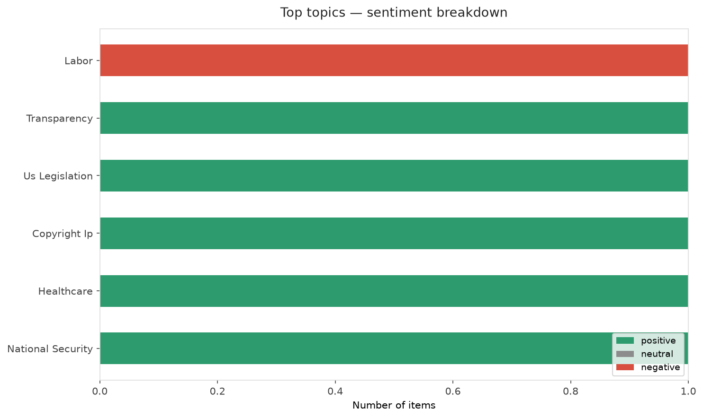
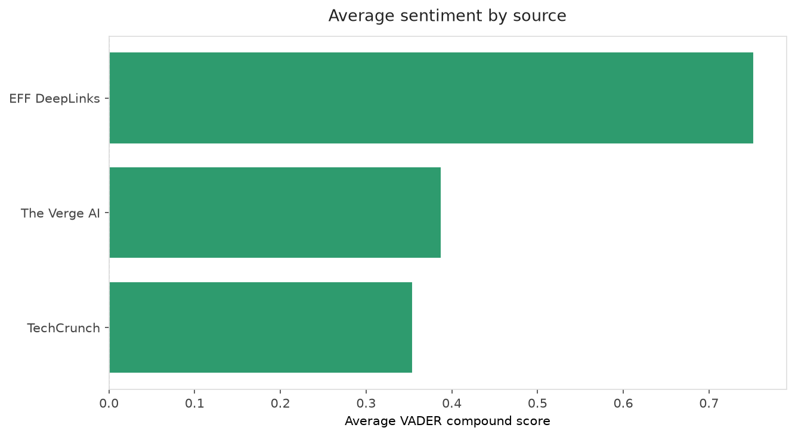
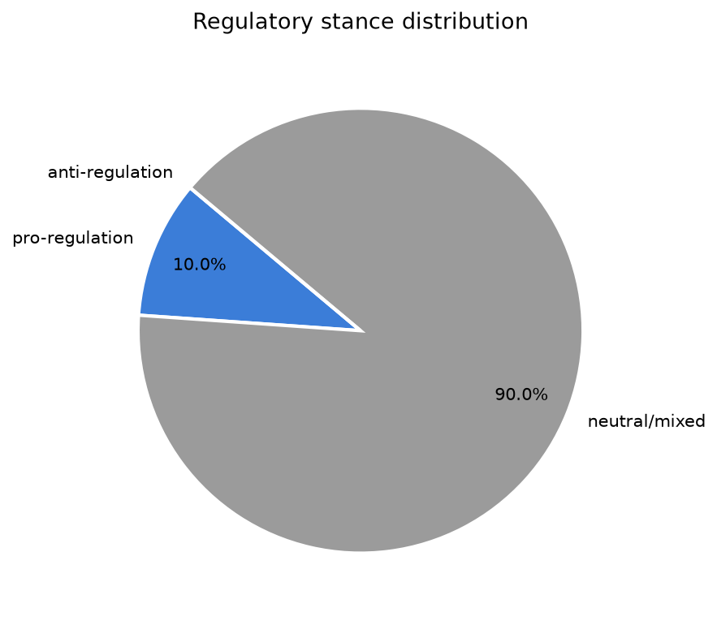
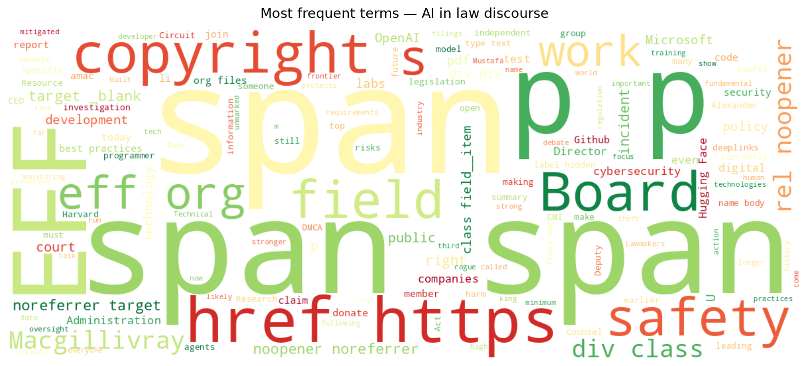
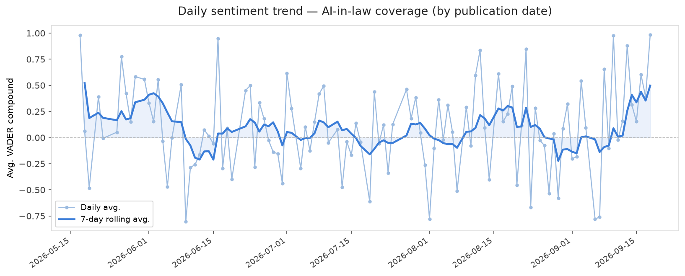
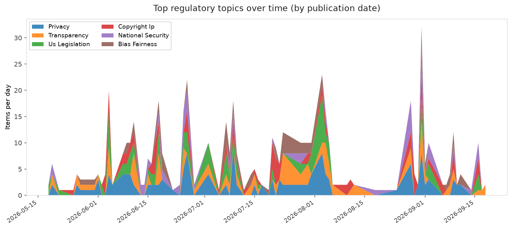
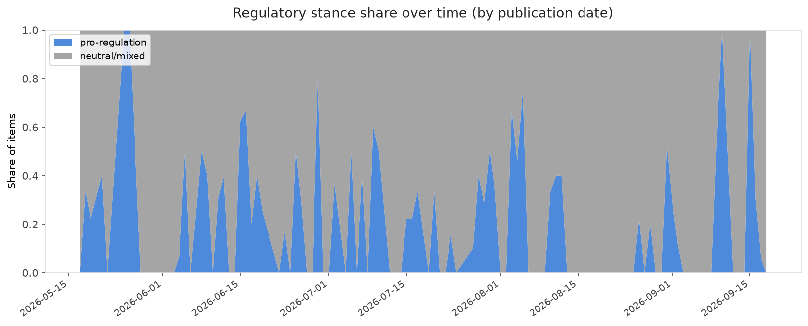

# AI in Law — Daily Sentiment Report
**Run date:** 2026-09-18 | **Items analyzed:** 10 | **Overall:** 🟢 Mildly positive (+0.480)

_Articles in this report were published between **2026-09-16** and **2026-09-18**._

---

## Summary

Today's collection covers **10** items from news outlets, academic preprints, Reddit, and regulatory sources.
Compared to the historical average of **+0.225**, today's sentiment is ↑ **0.255** points higher.

| Metric | Value |
|--------|-------|
| Positive items | 9 (90.0%) |
| Neutral items  | 0 (0.0%) |
| Negative items | 1 (10.0%) |
| Avg. VADER compound | +0.4805 |
| Pro-regulation items | 1 |
| Anti-regulation items | 0 |

---

## Top Topics Today

- **Labor** — 1 items
- **Transparency** — 1 items
- **Us Legislation** — 1 items
- **Copyright Ip** — 1 items
- **Healthcare** — 1 items

---

## Most Positive Coverage

- [EFF Welcomes Alexander Macgillivray to its Board of Directors](https://www.eff.org/deeplinks/2026/09/eff-welcomes-alexander-macgillivray-its-board-directors)  
  _EFF DeepLinks_ — VADER: `+0.989`
- [EFF to Lawmakers: Ground AI Cybersecurity Rules in Best Practices](https://www.eff.org/deeplinks/2026/09/eff-lawmakers-ground-ai-cybersecurity-rules-best-practices)  
  _EFF DeepLinks_ — VADER: `+0.985`
- [Is the AI safety debate about safety or control?](https://techcrunch.com/2026/09/17/is-the-ai-safety-debate-about-safety-or-control/)  
  _TechCrunch_ — VADER: `+0.779`

---

## Most Critical / Negative Coverage

- [Microsoft exec called AI scraping ‘the largest theft of labor in human history,’ new unredacted fili](https://techcrunch.com/2026/09/17/microsoft-exec-called-ai-scraping-the-largest-theft-of-labor-in-human-history-new-unredacted-filings-reveal/)  
  _TechCrunch_ — VADER: `-0.273`
- [Even the king of England has his hesitations about AI](https://techcrunch.com/2026/09/17/even-the-king-of-england-has-his-hesitations-about-ai/)  
  _TechCrunch_ — VADER: `+0.126`
- [Microsoft AI CEO says AI threats are real, and Anthropic is making it worse](https://www.theverge.com/podcast/996412/microsoft-ai-ceo-mustafa-suleyman-regulation-safety-anthropic-claude)  
  _The Verge AI_ — VADER: `+0.127`

---

## Visualizations — Today

## Visualizations — Trends Over Time

---

## Methodology

- **VADER** (Valence Aware Dictionary and sEntiment Reasoner) — compound score in [-1, 1].
- **Topic tagging** — regex keyword matching across 12 AI-law sub-domains.
- **Stance detection** — keyword-based pro/anti-regulation signal detection.
- **Date filter** — items are kept only if their *publication* date falls within the look-back window (default 2 days).
- Sources: RSS news feeds, arXiv academic API, Reddit (PRAW), Regulations.gov API.

_Generated automatically on 2026-09-18 14:49 UTC._
