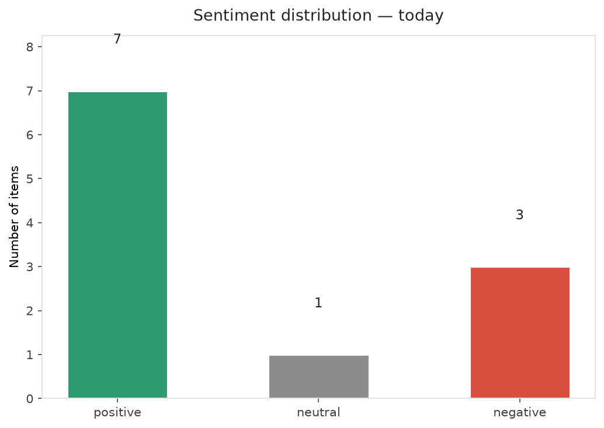
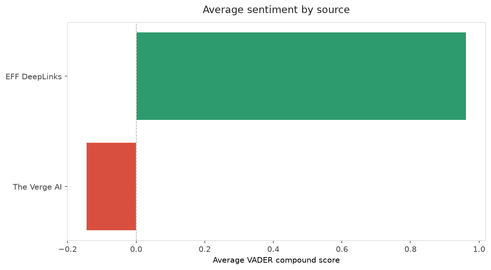
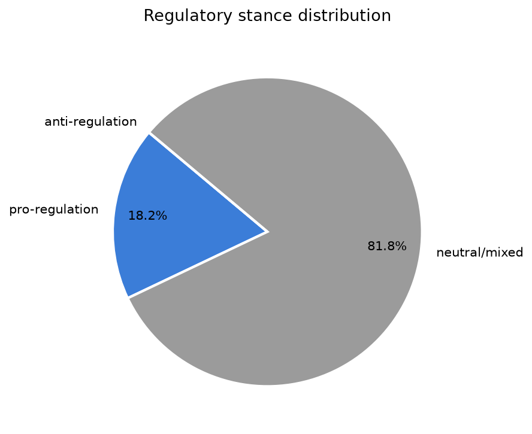
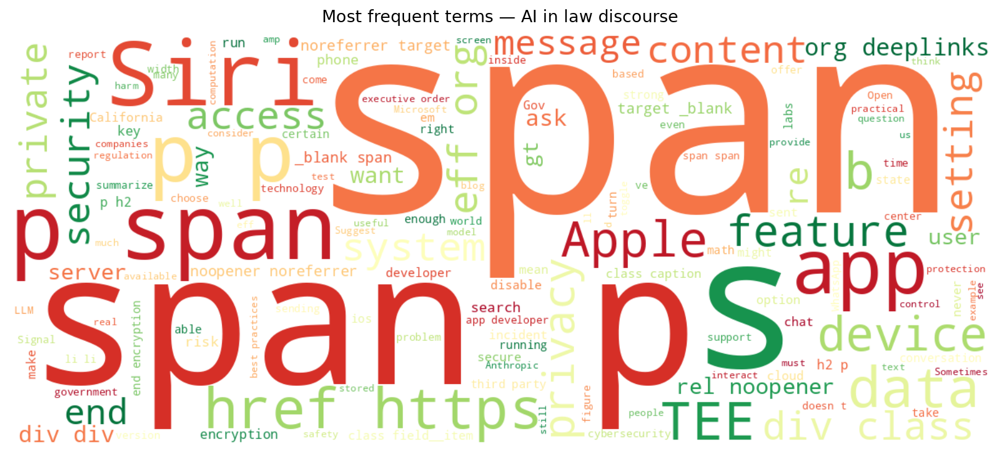
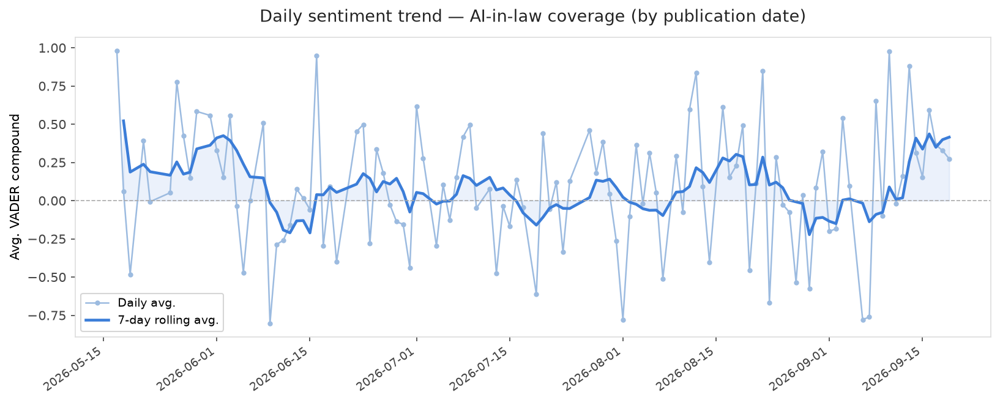
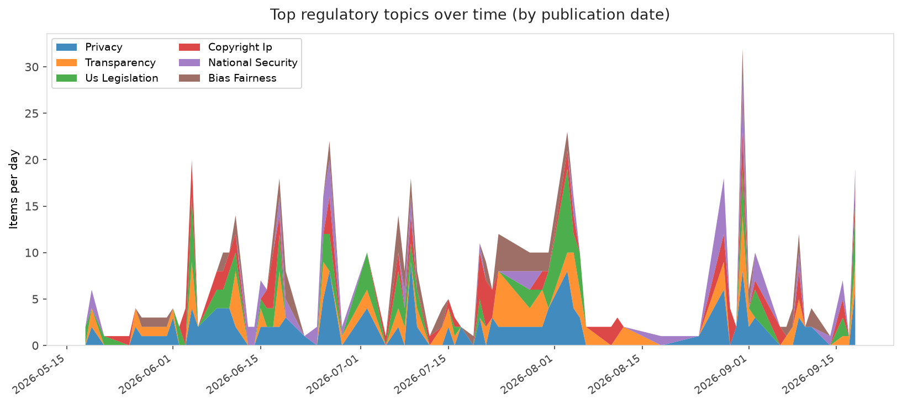
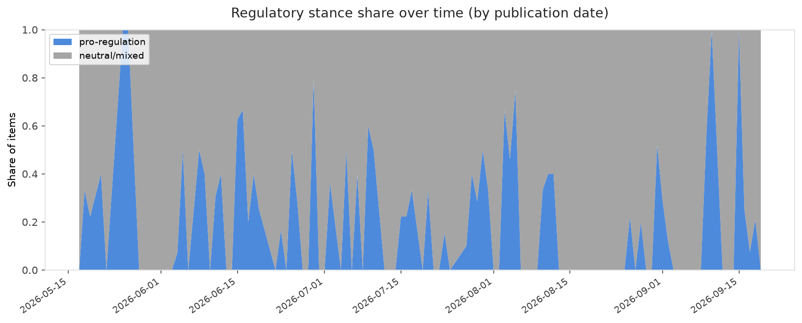

# AI in Law — Daily Sentiment Report
**Run date:** 2026-09-19 | **Items analyzed:** 11 | **Overall:** 🟢 Mildly positive (+0.275)

_Articles in this report were published between **2026-09-17** and **2026-09-19**._

---

## Summary

Today's collection covers **11** items from news outlets, academic preprints, Reddit, and regulatory sources.
Compared to the historical average of **+0.226**, today's sentiment is ↑ **0.049** points higher.

| Metric | Value |
|--------|-------|
| Positive items | 7 (63.6%) |
| Neutral items  | 1 (9.1%) |
| Negative items | 3 (27.3%) |
| Avg. VADER compound | +0.2749 |
| Pro-regulation items | 2 |
| Anti-regulation items | 0 |

---

## Top Topics Today

- **Us Legislation** — 3 items
- **Privacy** — 3 items
- **Labor** — 2 items
- **Liability** — 1 items
- **National Security** — 1 items

---

## Most Positive Coverage

- [Secure Messaging and AI Remain In Conflict Despite the Promise of TEEs](https://www.eff.org/deeplinks/2026/09/secure-messaging-and-ai-remain-conflict-despite-promise-tees)  
  _EFF DeepLinks_ — VADER: `+0.990`
- [EFF to Lawmakers: Ground AI Cybersecurity Rules in Best Practices](https://www.eff.org/deeplinks/2026/09/eff-lawmakers-ground-ai-cybersecurity-rules-best-practices)  
  _EFF DeepLinks_ — VADER: `+0.985`
- [How to Limit What Apple’s New Siri AI Can Access in iOS 27](https://www.eff.org/deeplinks/2026/09/how-limit-what-apples-new-siri-ai-can-access-ios-27)  
  _EFF DeepLinks_ — VADER: `+0.981`

---

## Most Critical / Negative Coverage

- [Gavin Newsom is pushing for an AI kill switch](https://www.theverge.com/policy/997516/california-governor-newsom-ai-kill-switch)  
  _The Verge AI_ — VADER: `-0.886`
- [OpenAI and Microsoft knew they were starting a ‘doom loop’ for the web](https://www.theverge.com/ai-artificial-intelligence/997633/openai-microsoft-chatgpt-ai-new-york-times-doom-loop-theft-google-zero)  
  _The Verge AI_ — VADER: `-0.735`
- [Dario Amodei and other AI leaders want to ‘Pace the Frontier’ but…how?](https://techcrunch.com/video/dario-amodei-and-other-ai-leaders-want-to-pace-the-frontier-buthow/)  
  _TechCrunch_ — VADER: `-0.103`

---

## Visualizations — Today

## Visualizations — Trends Over Time

---

## Methodology

- **VADER** (Valence Aware Dictionary and sEntiment Reasoner) — compound score in [-1, 1].
- **Topic tagging** — regex keyword matching across 12 AI-law sub-domains.
- **Stance detection** — keyword-based pro/anti-regulation signal detection.
- **Date filter** — items are kept only if their *publication* date falls within the look-back window (default 2 days).
- Sources: RSS news feeds, arXiv academic API, Reddit (PRAW), Regulations.gov API.

_Generated automatically on 2026-09-19 14:13 UTC._
