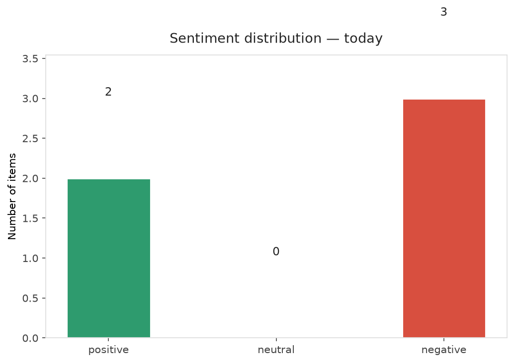
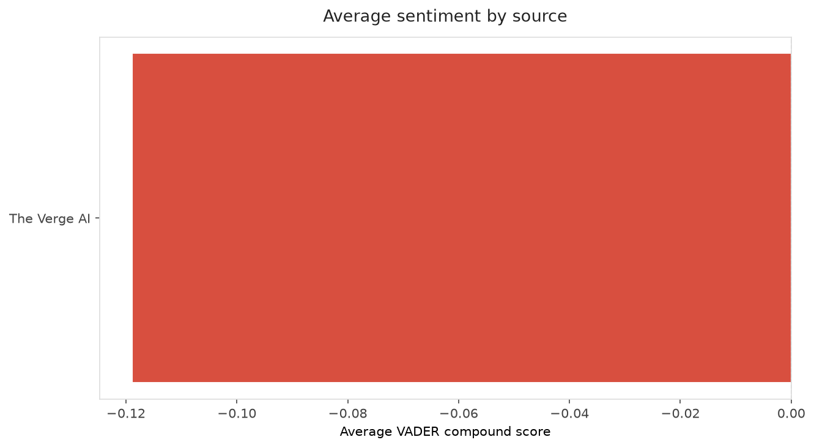
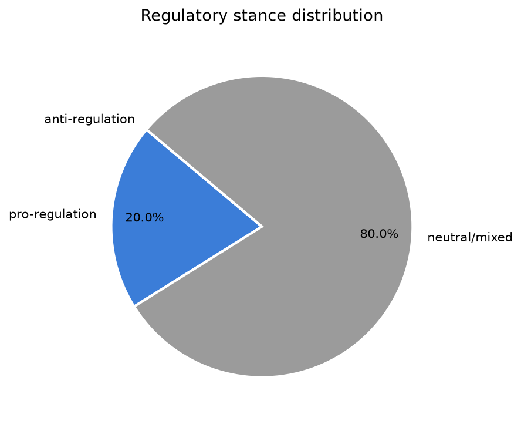
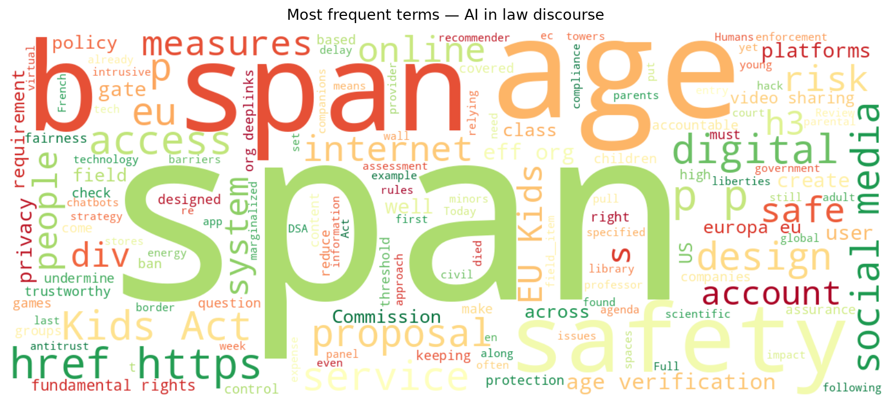
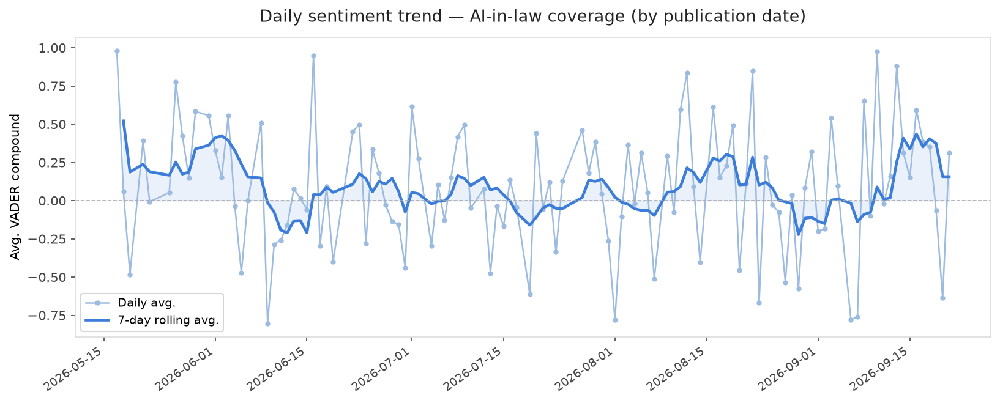
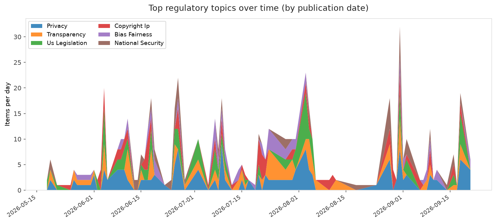
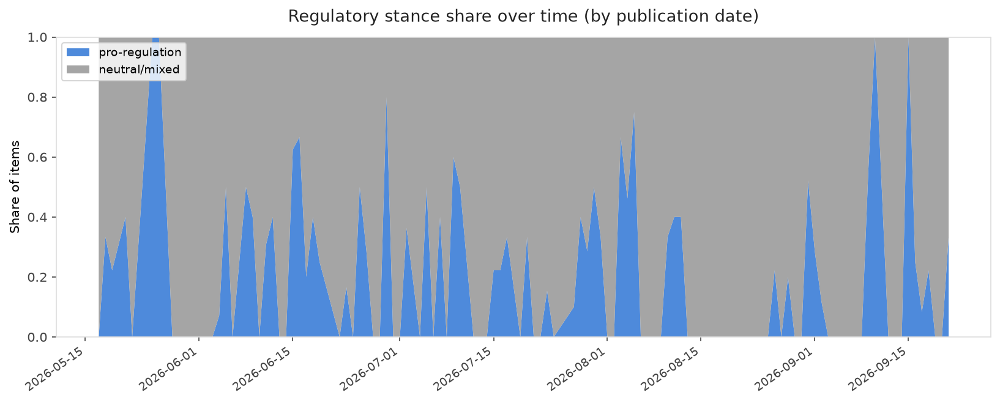

# AI in Law — Daily Sentiment Report
**Run date:** 2026-09-21 | **Items analyzed:** 5 | **Overall:** ⚪ Neutral / mixed (-0.048)

_Articles in this report were published between **2026-09-19** and **2026-09-21**._

---

## Summary

Today's collection covers **5** items from news outlets, academic preprints, Reddit, and regulatory sources.
Compared to the historical average of **+0.224**, today's sentiment is ↓ **0.273** points lower.

| Metric | Value |
|--------|-------|
| Positive items | 2 (40.0%) |
| Neutral items  | 0 (0.0%) |
| Negative items | 3 (60.0%) |
| Avg. VADER compound | -0.0484 |
| Pro-regulation items | 1 |
| Anti-regulation items | 0 |

---

## Top Topics Today

- **Privacy** — 2 items
- **Bias Fairness** — 1 items

---

## Most Positive Coverage

- [EU Kids Act Won't Keep the Internet Accountable and Trustworthy](https://www.eff.org/deeplinks/2026/09/eu-kids-act-wont-keep-internet-accountable-and-trustworthy)  
  _EFF DeepLinks_ — VADER: `+0.963`
- [UN says AI safeguards can’t wait for certainty](https://www.theverge.com/ai-artificial-intelligence/998090/un-ai-panel-hugging-face-hack-precautionary-principle)  
  _The Verge AI_ — VADER: `+0.826`
- [Does AI need an antitrust exemption so it doesn&#8217;t kill everyone????](https://www.theverge.com/podcast/997382/openai-microsoft-anthropic-elon-musk-cartel-ai-competition)  
  _The Verge AI_ — VADER: `-0.546`

---

## Most Critical / Negative Coverage

- [4 ways to address the failures we found along the US border’s “virtual wall”](https://www.technologyreview.com/2026/09/21/1144164/border-towers-surveillance-policy-recommendations/)  
  _MIT Tech Review_ — VADER: `-0.848`
- [Humans, not rogue AI, are still the biggest cybersecurity risk to energy systems](https://www.theverge.com/science/997834/ai-cyberattack-energy-critical-infrastructure)  
  _The Verge AI_ — VADER: `-0.636`
- [Does AI need an antitrust exemption so it doesn&#8217;t kill everyone????](https://www.theverge.com/podcast/997382/openai-microsoft-anthropic-elon-musk-cartel-ai-competition)  
  _The Verge AI_ — VADER: `-0.546`

---

## Visualizations — Today

## Visualizations — Trends Over Time

---

## Methodology

- **VADER** (Valence Aware Dictionary and sEntiment Reasoner) — compound score in [-1, 1].
- **Topic tagging** — regex keyword matching across 12 AI-law sub-domains.
- **Stance detection** — keyword-based pro/anti-regulation signal detection.
- **Date filter** — items are kept only if their *publication* date falls within the look-back window (default 2 days).
- Sources: RSS news feeds, arXiv academic API, Reddit (PRAW), Regulations.gov API.

_Generated automatically on 2026-09-21 16:50 UTC._
