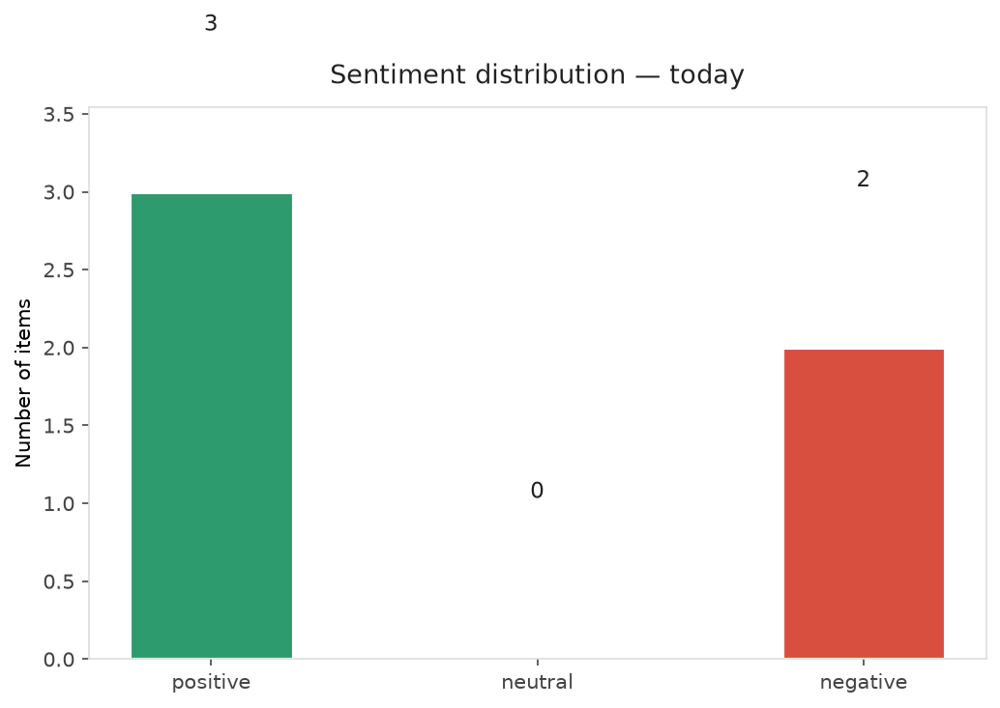
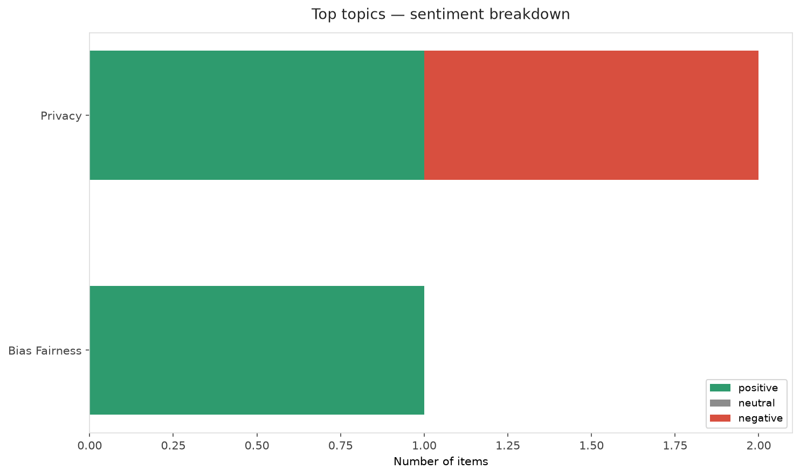
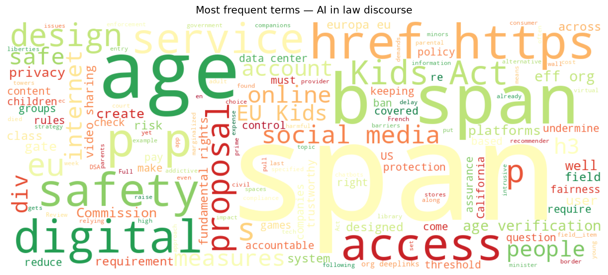
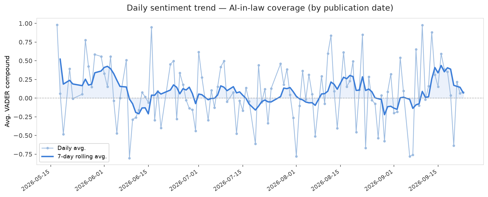
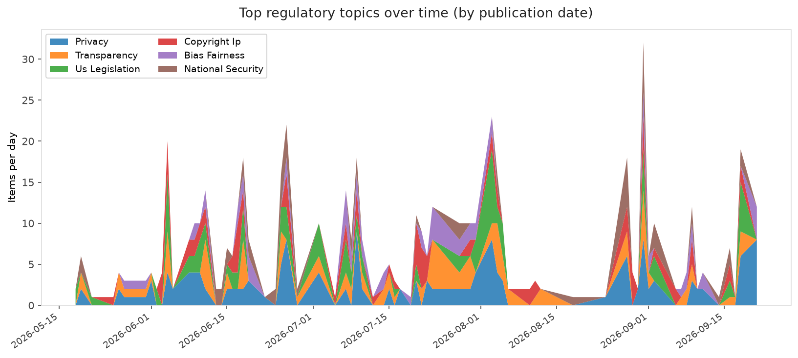
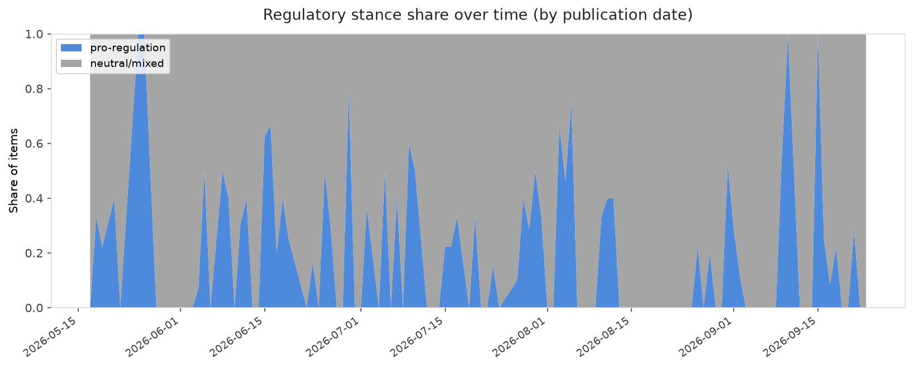

# AI in Law — Daily Sentiment Report
**Run date:** 2026-09-23 | **Items analyzed:** 5 | **Overall:** ⚪ Neutral / mixed (+0.015)

_Articles in this report were published between **2026-09-21** and **2026-09-23**._

---

## Summary

Today's collection covers **5** items from news outlets, academic preprints, Reddit, and regulatory sources.
Compared to the historical average of **+0.223**, today's sentiment is ↓ **0.208** points lower.

| Metric | Value |
|--------|-------|
| Positive items | 3 (60.0%) |
| Neutral items  | 0 (0.0%) |
| Negative items | 2 (40.0%) |
| Avg. VADER compound | +0.0152 |
| Pro-regulation items | 1 |
| Anti-regulation items | 0 |

---

## Top Topics Today

- **Privacy** — 2 items
- **Bias Fairness** — 1 items

---

## Most Positive Coverage

- [EU Kids Act Won't Keep the Internet Accountable and Trustworthy](https://www.eff.org/deeplinks/2026/09/eu-kids-act-wont-keep-internet-accountable-and-trustworthy)  
  _EFF DeepLinks_ — VADER: `+0.963`
- [California tightens rules on AI data center energy and water use](https://www.theverge.com/ai-artificial-intelligence/998453/california-ai-data-center-bills)  
  _The Verge AI_ — VADER: `+0.202`
- [‘We’re already fighting yesterday’s battle’: Greece’s prime minister gets candid about AI](https://techcrunch.com/2026/09/22/were-already-fighting-yesterdays-battle-greeces-prime-minister-gets-candid-about-ai/)  
  _TechCrunch_ — VADER: `+0.077`

---

## Most Critical / Negative Coverage

- [4 ways to address the failures we found along the US border’s “virtual wall”](https://www.technologyreview.com/2026/09/21/1144164/border-towers-surveillance-policy-recommendations/)  
  _MIT Tech Review_ — VADER: `-0.848`
- [Lawsuit demands OpenAI pay for new school after ChatGPT used in shooting](https://arstechnica.com/tech-policy/2026/09/lawsuit-demands-openai-pay-for-new-school-after-chatgpt-used-in-shooting/)  
  _Ars Technica Tech Policy_ — VADER: `-0.318`
- [‘We’re already fighting yesterday’s battle’: Greece’s prime minister gets candid about AI](https://techcrunch.com/2026/09/22/were-already-fighting-yesterdays-battle-greeces-prime-minister-gets-candid-about-ai/)  
  _TechCrunch_ — VADER: `+0.077`

---

## Visualizations — Today

## Visualizations — Trends Over Time

---

## Methodology

- **VADER** (Valence Aware Dictionary and sEntiment Reasoner) — compound score in [-1, 1].
- **Topic tagging** — regex keyword matching across 12 AI-law sub-domains.
- **Stance detection** — keyword-based pro/anti-regulation signal detection.
- **Date filter** — items are kept only if their *publication* date falls within the look-back window (default 2 days).
- Sources: RSS news feeds, arXiv academic API, Reddit (PRAW), Regulations.gov API.

_Generated automatically on 2026-09-23 15:21 UTC._
