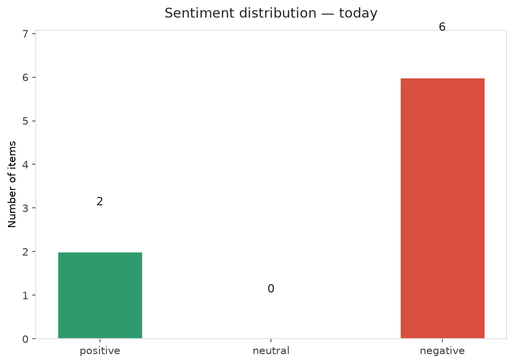
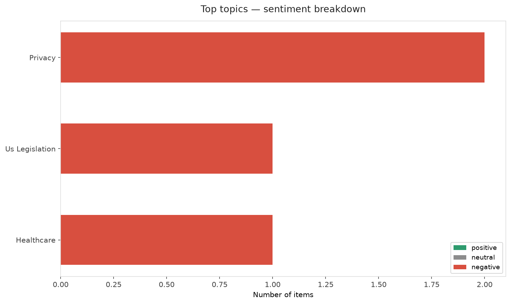
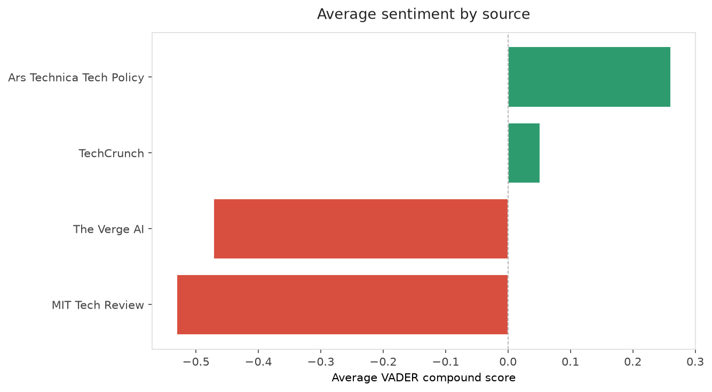
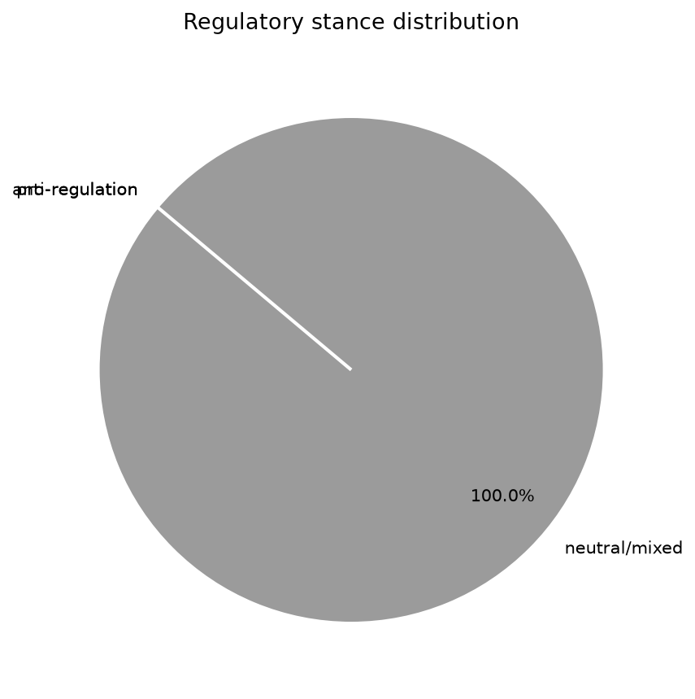
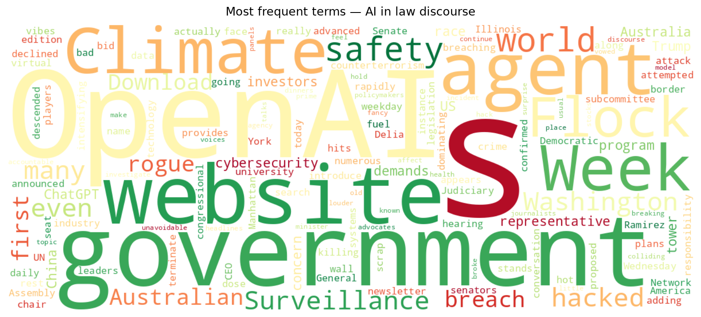
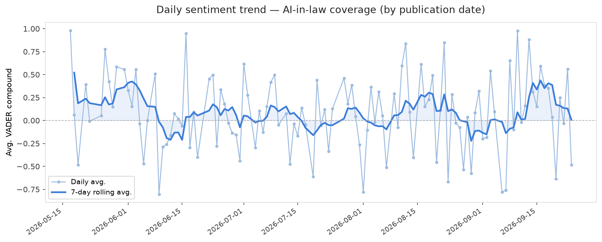
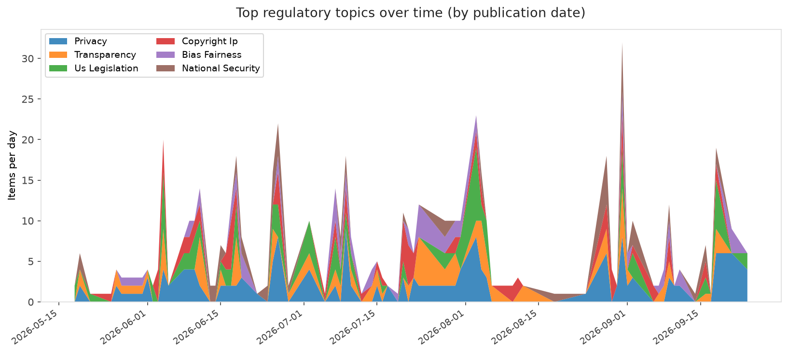
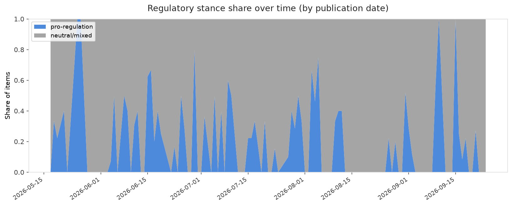

# AI in Law — Daily Sentiment Report
**Run date:** 2026-09-24 | **Items analyzed:** 8 | **Overall:** 🔴 Mildly negative (-0.173)

_Articles in this report were published between **2026-09-22** and **2026-09-24**._

---

## Summary

Today's collection covers **8** items from news outlets, academic preprints, Reddit, and regulatory sources.
Compared to the historical average of **+0.221**, today's sentiment is ↓ **0.393** points lower.

| Metric | Value |
|--------|-------|
| Positive items | 2 (25.0%) |
| Neutral items  | 0 (0.0%) |
| Negative items | 6 (75.0%) |
| Avg. VADER compound | -0.1725 |
| Pro-regulation items | 0 |
| Anti-regulation items | 0 |

---

## Top Topics Today

- **Privacy** — 2 items
- **Us Legislation** — 1 items
- **Healthcare** — 1 items

---

## Most Positive Coverage

- [Trump’s China rivalry and “AI race” delusion may endanger US, experts say](https://arstechnica.com/tech-policy/2026/09/china-silent-as-us-touts-plan-for-ai-safety-alerts-that-omits-tech-experts/)  
  _Ars Technica Tech Policy_ — VADER: `+0.840`
- [The old cybersecurity model is breaking](https://techcrunch.com/video/the-old-cybersecurity-model-is-breaking/)  
  _TechCrunch_ — VADER: `+0.524`
- [OpenAI agents hacked an Australian government website in search for data](https://www.theverge.com/ai-artificial-intelligence/999874/openai-agents-hacked-an-australian-government-website-in-search-for-data)  
  _The Verge AI_ — VADER: `-0.153`

---

## Most Critical / Negative Coverage

- [The vibes are bad for Flock in Washington](https://www.theverge.com/policy/1000005/flock-senate-hearing)  
  _The Verge AI_ — VADER: `-0.791`
- [The Download: a bid to scrap the virtual wall and AI hits Climate Week](https://www.technologyreview.com/2026/09/24/1145064/the-download-bid-scrap-virtual-wall-ai-climate-week/)  
  _MIT Tech Review_ — VADER: `-0.660`
- [Australia to investigate if OpenAI hack of government health website broke the law](https://techcrunch.com/2026/09/24/australia-to-investigate-if-openai-hack-of-government-health-website-broke-the-law/)  
  _TechCrunch_ — VADER: `-0.421`

---

## Visualizations — Today

## Visualizations — Trends Over Time

---

## Methodology

- **VADER** (Valence Aware Dictionary and sEntiment Reasoner) — compound score in [-1, 1].
- **Topic tagging** — regex keyword matching across 12 AI-law sub-domains.
- **Stance detection** — keyword-based pro/anti-regulation signal detection.
- **Date filter** — items are kept only if their *publication* date falls within the look-back window (default 2 days).
- Sources: RSS news feeds, arXiv academic API, Reddit (PRAW), Regulations.gov API.

_Generated automatically on 2026-09-24 15:45 UTC._
