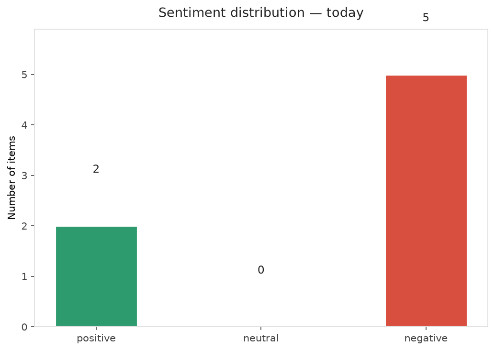
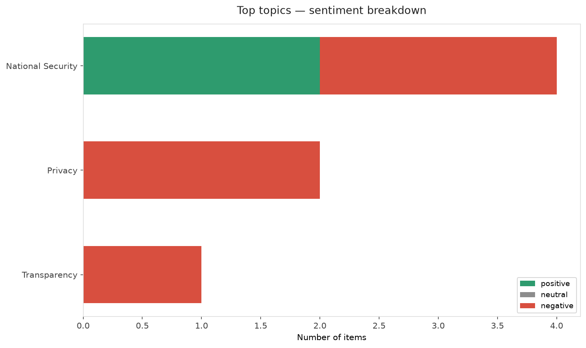
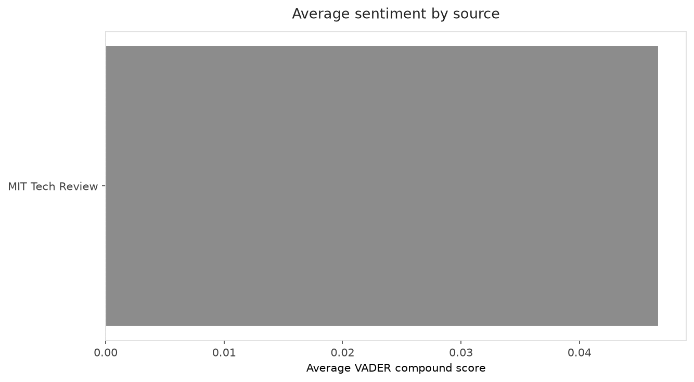
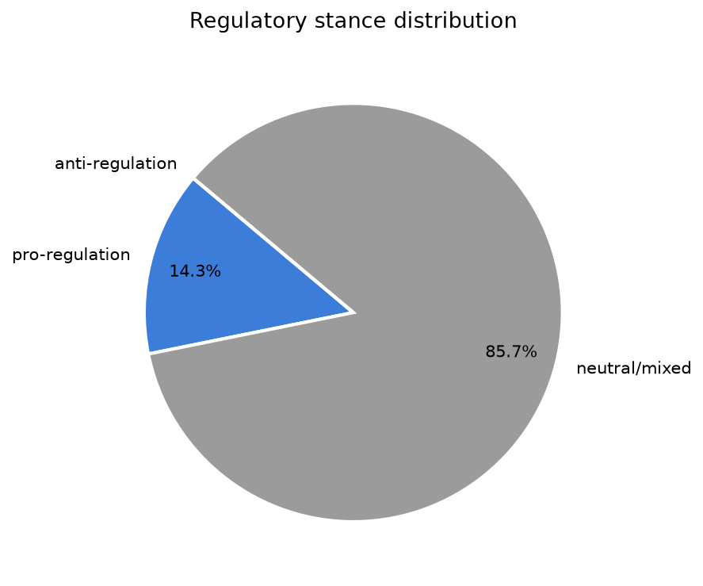
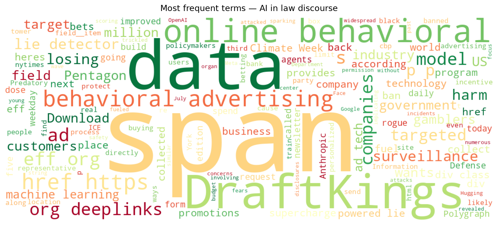
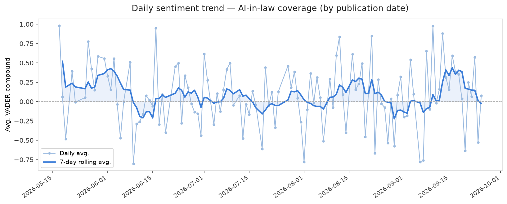
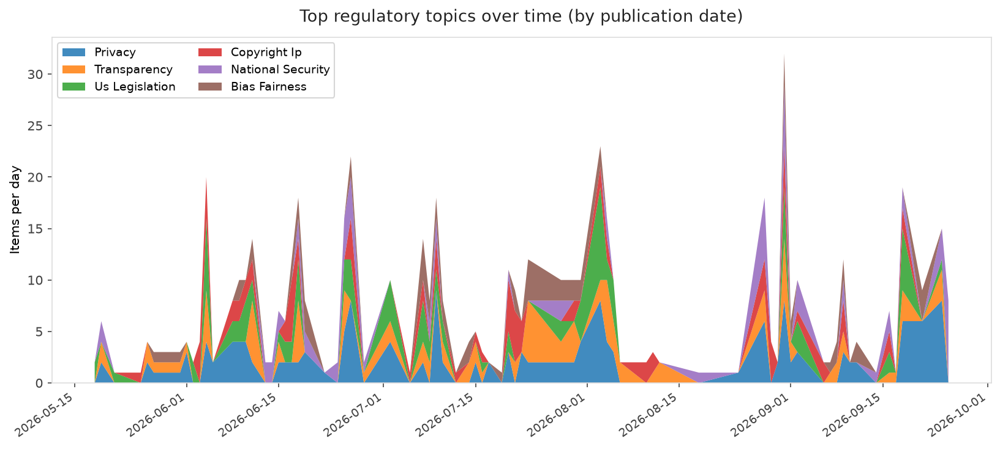
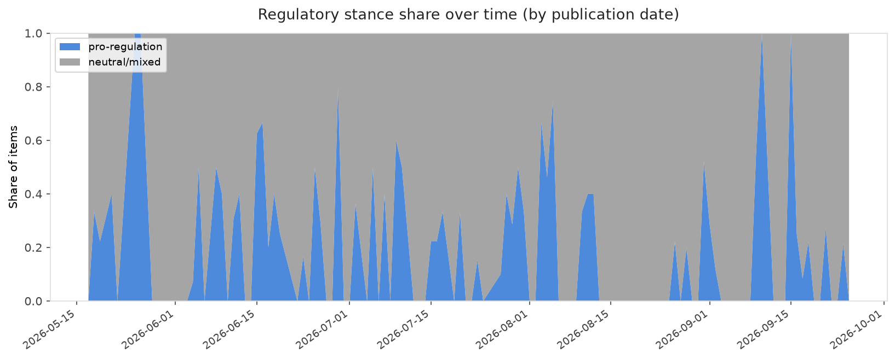

# AI in Law — Daily Sentiment Report
**Run date:** 2026-09-26 | **Items analyzed:** 7 | **Overall:** 🔴 Mildly negative (-0.233)

_Articles in this report were published between **2026-09-24** and **2026-09-25**._

---

## Summary

Today's collection covers **7** items from news outlets, academic preprints, Reddit, and regulatory sources.
Compared to the historical average of **+0.217**, today's sentiment is ↓ **0.449** points lower.

| Metric | Value |
|--------|-------|
| Positive items | 2 (28.6%) |
| Neutral items  | 0 (0.0%) |
| Negative items | 5 (71.4%) |
| Avg. VADER compound | -0.2325 |
| Pro-regulation items | 1 |
| Anti-regulation items | 0 |

---

## Top Topics Today

- **National Security** — 4 items
- **Privacy** — 2 items
- **Transparency** — 1 items

---

## Most Positive Coverage

- [The Pentagon wants $30 million to build an AI-powered lie detector](https://www.technologyreview.com/2026/09/25/1145144/pentagon-ai-lie-detector/)  
  _MIT Tech Review_ — VADER: `+0.772`
- [The Download: the Pentagon’s AI-powered lie detector and young organ limits](https://www.technologyreview.com/2026/09/25/1145157/the-download-pentagon-ai-lie-detector-young-organ-limits/)  
  _MIT Tech Review_ — VADER: `+0.477`
- [AI is dominating the conversation at Climate Week](https://www.technologyreview.com/2026/09/24/1145048/ai-climate-week/)  
  _MIT Tech Review_ — VADER: `-0.402`

---

## Most Critical / Negative Coverage

- [Court rules Pentagon can blacklist Anthropic for refusing to enable Claude features](https://arstechnica.com/tech-policy/2026/09/court-rules-trump-can-blacklist-anthropic-for-refusing-to-enable-claude-features/)  
  _Ars Technica Tech Policy_ — VADER: `-0.765`
- [The Download: a bid to scrap the virtual wall and AI hits Climate Week](https://www.technologyreview.com/2026/09/24/1145064/the-download-bid-scrap-virtual-wall-ai-climate-week/)  
  _MIT Tech Review_ — VADER: `-0.660`
- [DraftKings Is Using AI to Supercharge the Harms of Online Behavioral Advertising](https://www.eff.org/deeplinks/2026/09/draftkings-using-ai-supercharge-harms-online-behavioral-advertising)  
  _EFF DeepLinks_ — VADER: `-0.591`

---

## Visualizations — Today

## Visualizations — Trends Over Time

---

## Methodology

- **VADER** (Valence Aware Dictionary and sEntiment Reasoner) — compound score in [-1, 1].
- **Topic tagging** — regex keyword matching across 12 AI-law sub-domains.
- **Stance detection** — keyword-based pro/anti-regulation signal detection.
- **Date filter** — items are kept only if their *publication* date falls within the look-back window (default 2 days).
- Sources: RSS news feeds, arXiv academic API, Reddit (PRAW), Regulations.gov API.

_Generated automatically on 2026-09-26 14:55 UTC._
