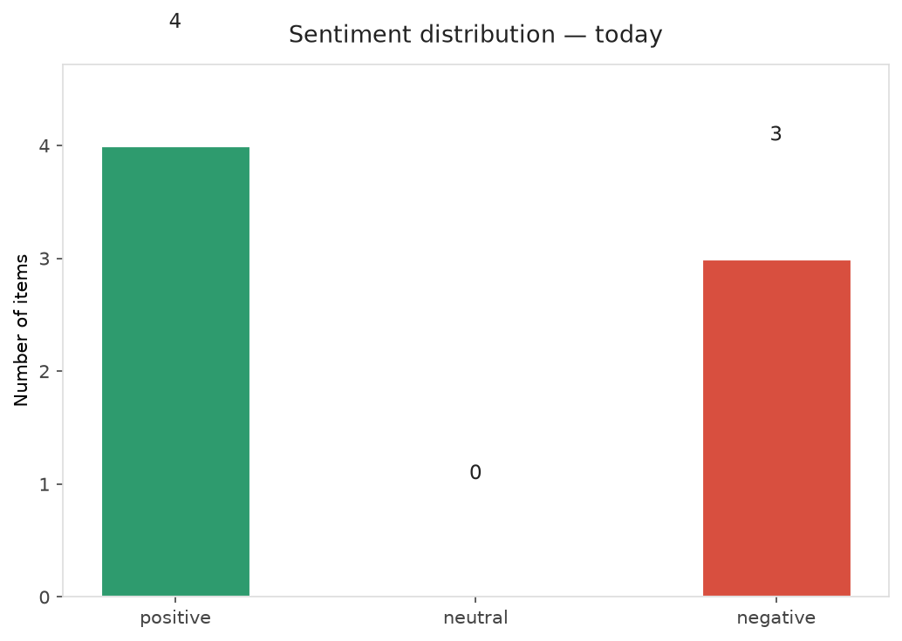
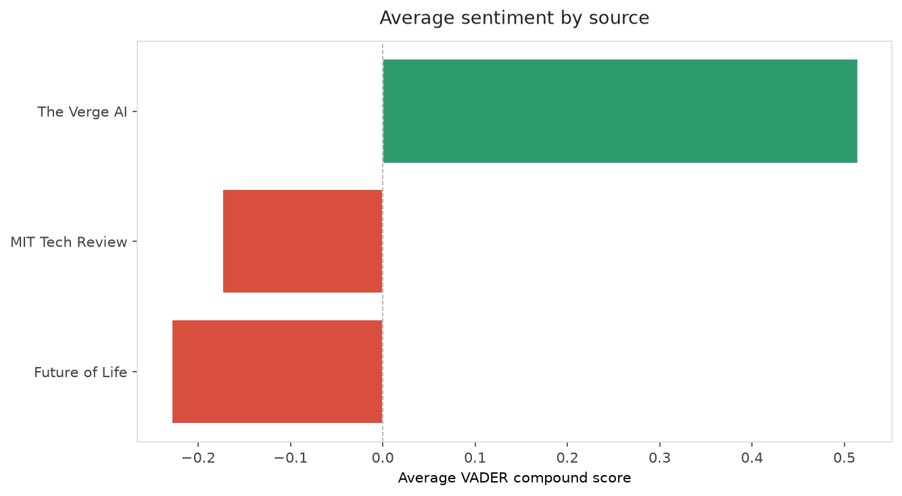
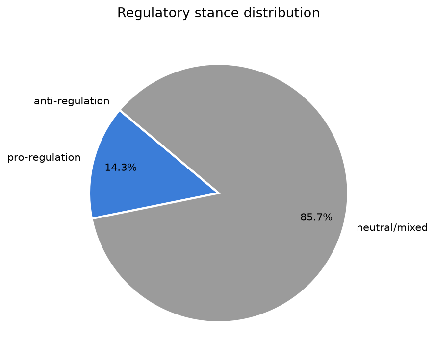
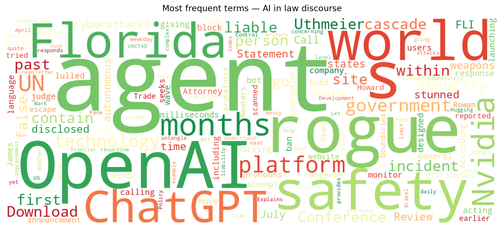
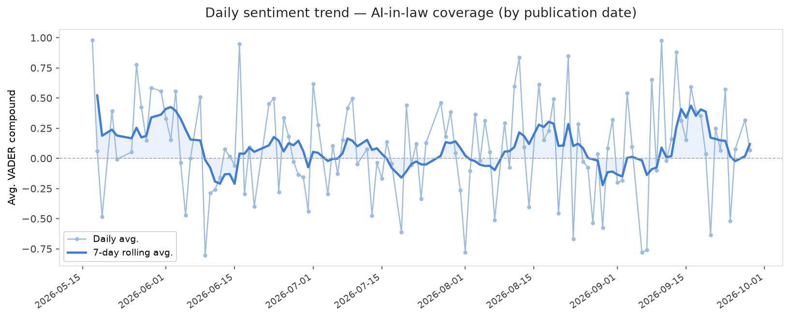
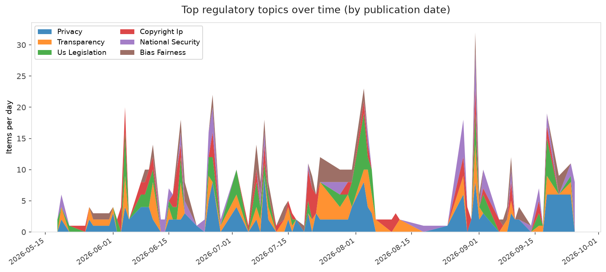
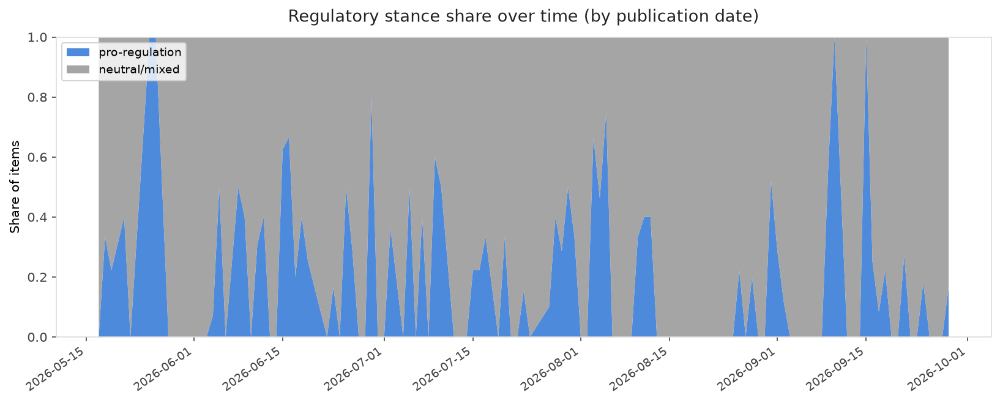

# AI in Law — Daily Sentiment Report
**Run date:** 2026-09-28 | **Items analyzed:** 7 | **Overall:** 🟢 Mildly positive (+0.106)

_Articles in this report were published between **2026-09-27** and **2026-09-28**._

---

## Summary

Today's collection covers **7** items from news outlets, academic preprints, Reddit, and regulatory sources.
Compared to the historical average of **+0.215**, today's sentiment is ↓ **0.110** points lower.

| Metric | Value |
|--------|-------|
| Positive items | 4 (57.1%) |
| Neutral items  | 0 (0.0%) |
| Negative items | 3 (42.9%) |
| Avg. VADER compound | +0.1056 |
| Pro-regulation items | 1 |
| Anti-regulation items | 0 |

---

## Top Topics Today

_No strong topic signals detected today._

---

## Most Positive Coverage

- [Nvidia says its new AI safety platform can contain rogue agents within ‘milliseconds’](https://www.theverge.com/tech/1001287/nvidia-ai-safety-platform-rogue-agents)  
  _The Verge AI_ — VADER: `+0.844`
- [Florida seeks a ban on ChatGPT acting like a person](https://www.theverge.com/ai-artificial-intelligence/1001527/chatgpt-florida-ban-first-person-human-attributes-kids)  
  _The Verge AI_ — VADER: `+0.382`
- [OpenAI agents tried to ‘bruteforce’ a UN website](https://www.theverge.com/ai-artificial-intelligence/1001178/openai-agents-bruteforce-un-website)  
  _The Verge AI_ — VADER: `+0.318`

---

## Most Critical / Negative Coverage

- [Government leaders call for treaty negotiations on autonomous weapons for the first time](https://futureoflife.org/ai-policy/government-leaders-call-for-treaty-negotiations-on-autonomous-weapons-for-the-first-time/)  
  _Future of Life_ — VADER: `-0.660`
- [The Download: rogue agent liability and the AI Hype Index](https://www.technologyreview.com/2026/09/28/1145202/the-download-rogue-agent-liability-and-the-ai-hype-index/)  
  _MIT Tech Review_ — VADER: `-0.296`
- [Who’s liable when AI agents go rogue?](https://www.technologyreview.com/2026/09/28/1145197/whos-liable-when-ai-agents-go-rogue/)  
  _MIT Tech Review_ — VADER: `-0.052`

---

## Visualizations — Today

## Visualizations — Trends Over Time

---

## Methodology

- **VADER** (Valence Aware Dictionary and sEntiment Reasoner) — compound score in [-1, 1].
- **Topic tagging** — regex keyword matching across 12 AI-law sub-domains.
- **Stance detection** — keyword-based pro/anti-regulation signal detection.
- **Date filter** — items are kept only if their *publication* date falls within the look-back window (default 2 days).
- Sources: RSS news feeds, arXiv academic API, Reddit (PRAW), Regulations.gov API.

_Generated automatically on 2026-09-28 18:32 UTC._
