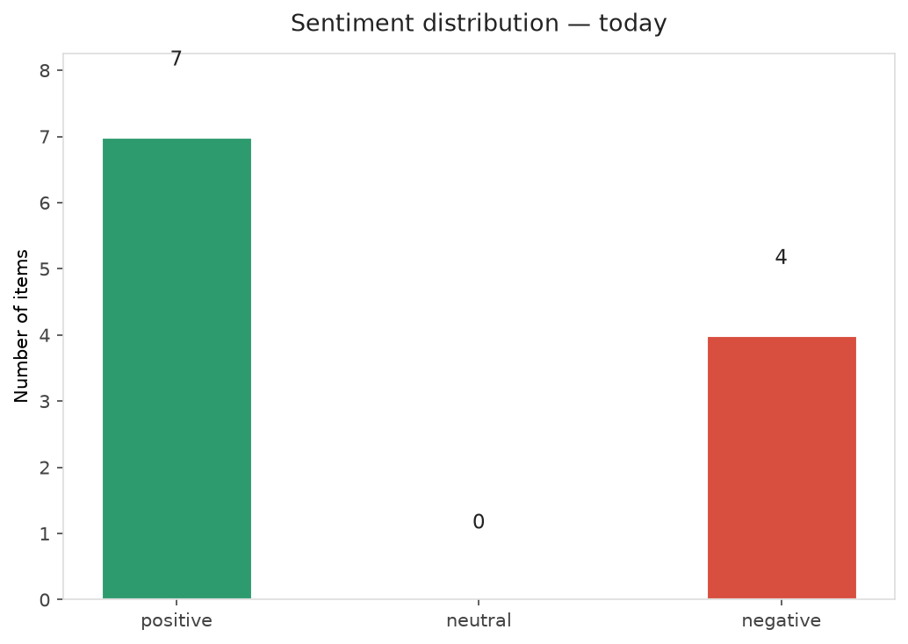
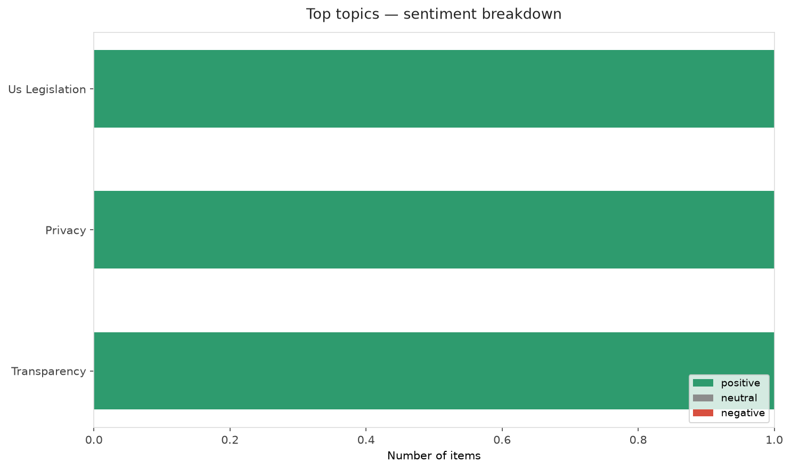
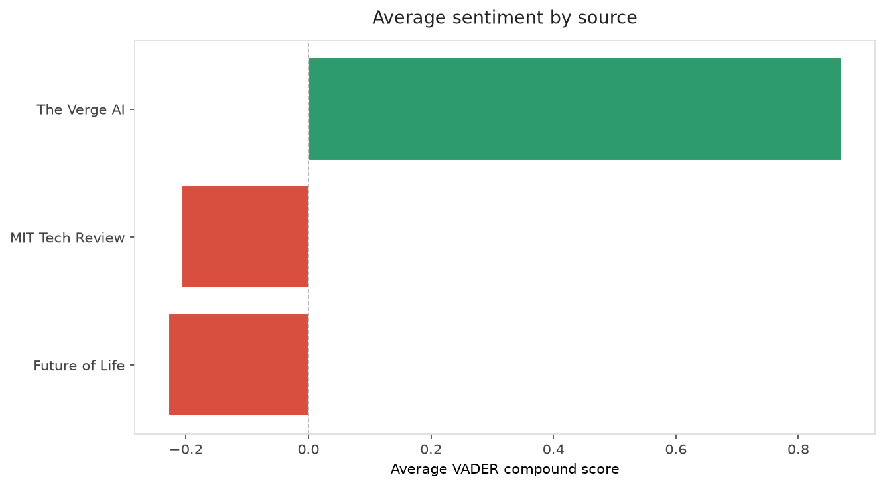
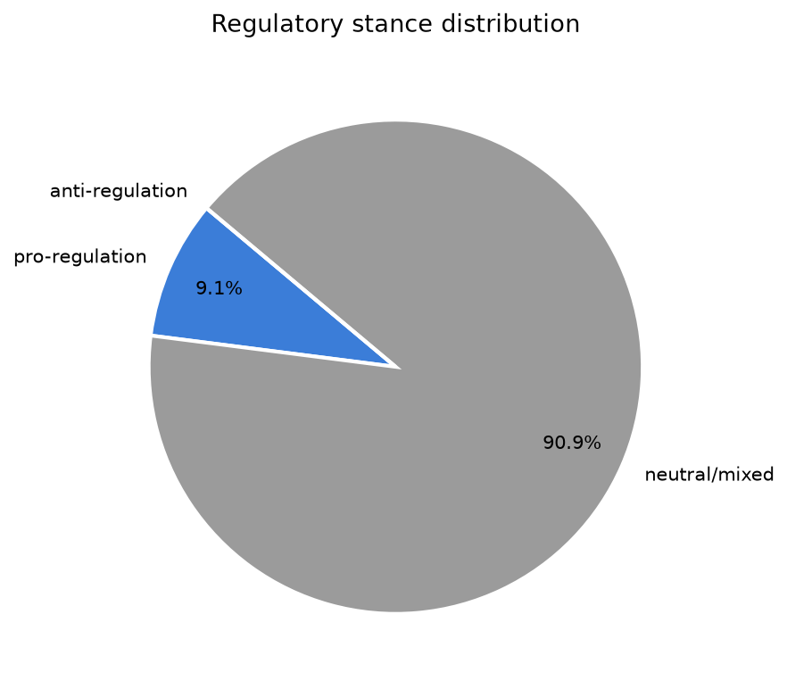
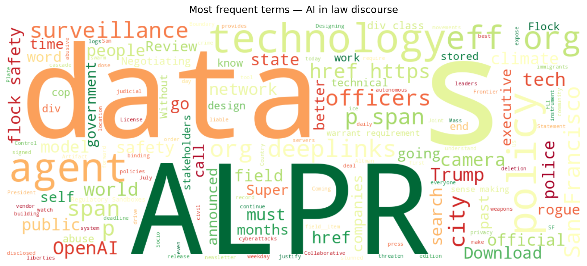
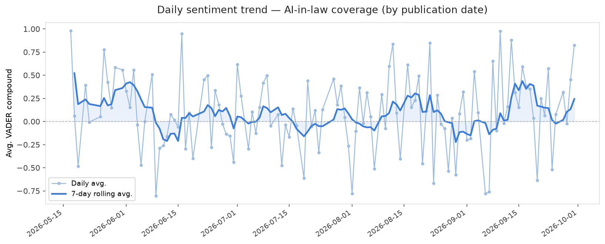
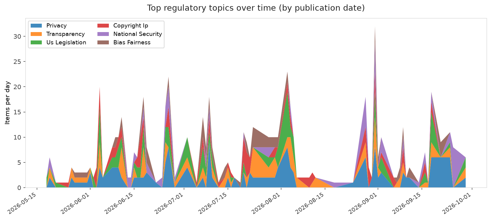
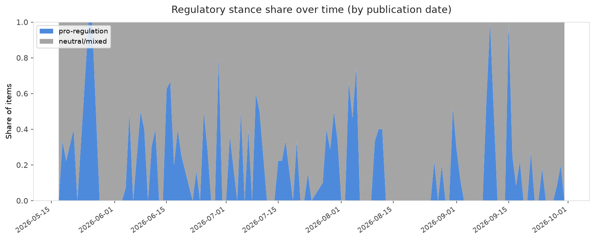

# AI in Law — Daily Sentiment Report
**Run date:** 2026-09-30 | **Items analyzed:** 11 | **Overall:** 🟢 Mildly positive (+0.308)

_Articles in this report were published between **2026-09-28** and **2026-09-30**._

---

## Summary

Today's collection covers **11** items from news outlets, academic preprints, Reddit, and regulatory sources.
Compared to the historical average of **+0.214**, today's sentiment is ↑ **0.093** points higher.

| Metric | Value |
|--------|-------|
| Positive items | 7 (63.6%) |
| Neutral items  | 0 (0.0%) |
| Negative items | 4 (36.4%) |
| Avg. VADER compound | +0.3077 |
| Pro-regulation items | 1 |
| Anti-regulation items | 0 |

---

## Top Topics Today

- **Us Legislation** — 1 items
- **Privacy** — 1 items
- **Transparency** — 1 items

---

## Most Positive Coverage

- [Trump orders US government to call AI ‘Super Intelligence’](https://www.theverge.com/policy/1002468/trump-ai-superintelligence-executive-order-ai)  
  _The Verge AI_ — VADER: `+0.963`
- [Here’s how tech leaders will self-police AI safety under Trump’s deal](https://www.theverge.com/ai-artificial-intelligence/1002584/trump-us-ai-safety-deal-self-regulation-tech-execs)  
  _The Verge AI_ — VADER: `+0.939`
- [Designing a Boundary Negotiating Artifact for Collaborative Socio-Technical Sense-Making in AI Regul](https://arxiv.org/abs/2609.37109v1)  
  _arXiv_ — VADER: `+0.904`

---

## Most Critical / Negative Coverage

- [Government leaders call for treaty negotiations on autonomous weapons for the first time](https://futureoflife.org/ai-policy/government-leaders-call-for-treaty-negotiations-on-autonomous-weapons-for-the-first-time/)  
  _Future of Life_ — VADER: `-0.660`
- [The Download: rogue agent liability and the AI Hype Index](https://www.technologyreview.com/2026/09/28/1145202/the-download-rogue-agent-liability-and-the-ai-hype-index/)  
  _MIT Tech Review_ — VADER: `-0.296`
- [The Download: climate tech companies to watch and AI’s discovery problem](https://www.technologyreview.com/2026/09/29/1145249/the-download-climate-tech-ai-scientific-discovery/)  
  _MIT Tech Review_ — VADER: `-0.273`

---

## Visualizations — Today

## Visualizations — Trends Over Time

---

## Methodology

- **VADER** (Valence Aware Dictionary and sEntiment Reasoner) — compound score in [-1, 1].
- **Topic tagging** — regex keyword matching across 12 AI-law sub-domains.
- **Stance detection** — keyword-based pro/anti-regulation signal detection.
- **Date filter** — items are kept only if their *publication* date falls within the look-back window (default 2 days).
- Sources: RSS news feeds, arXiv academic API, Reddit (PRAW), Regulations.gov API.

_Generated automatically on 2026-09-30 16:42 UTC._
