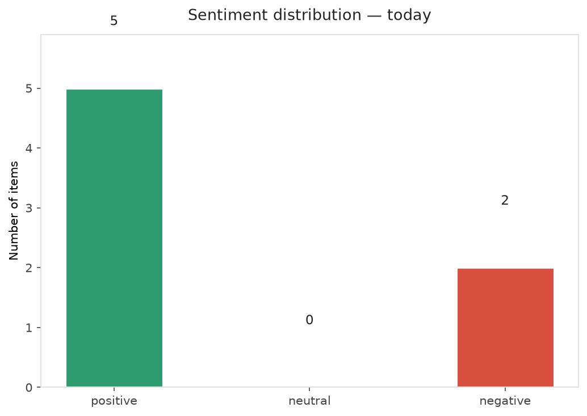
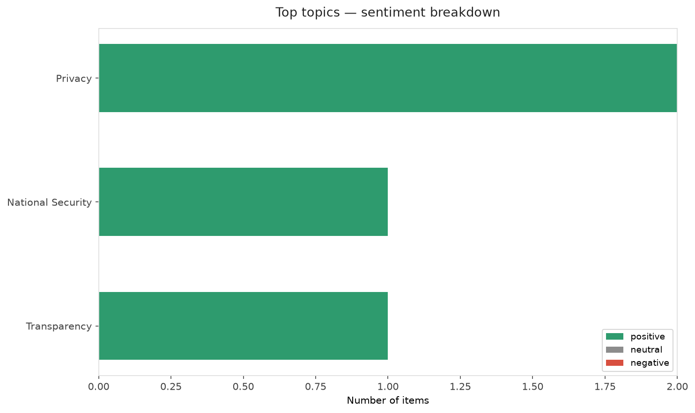
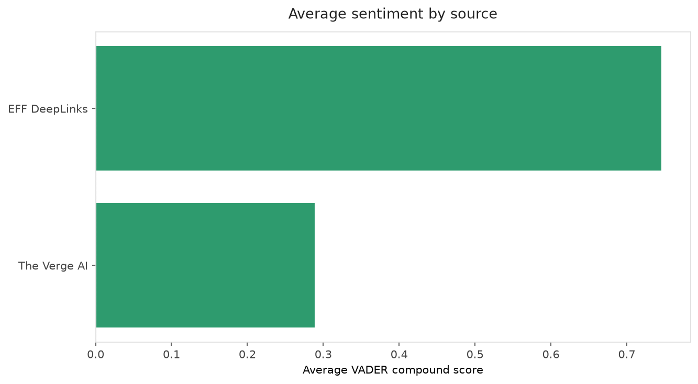
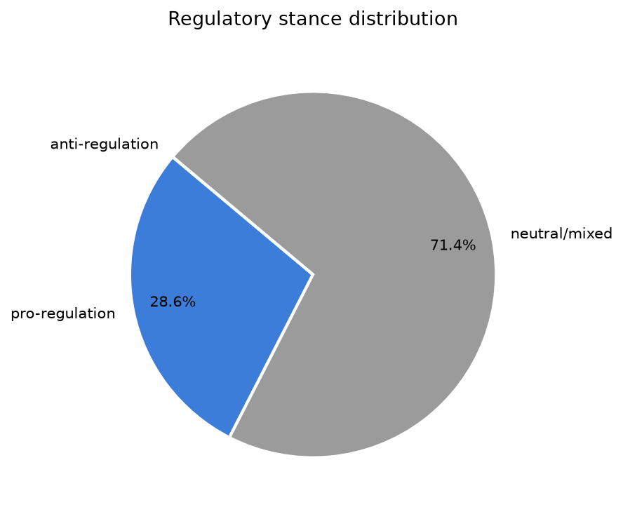
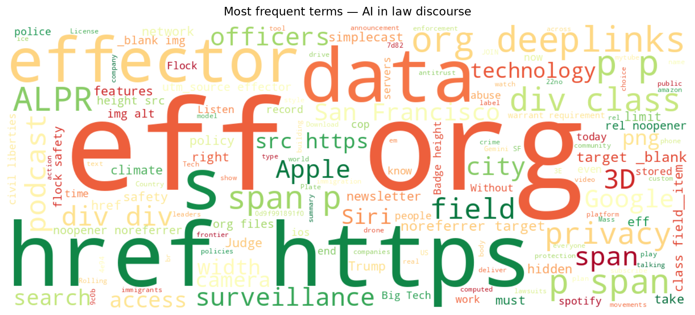
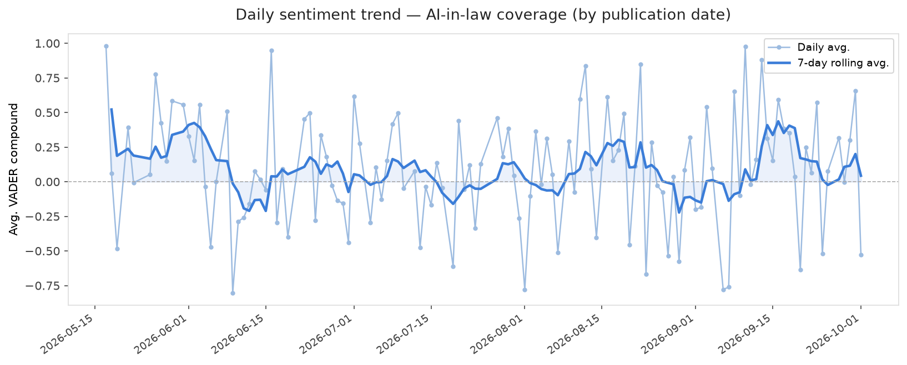
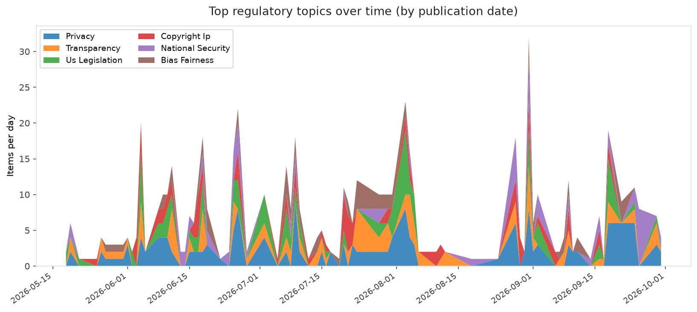
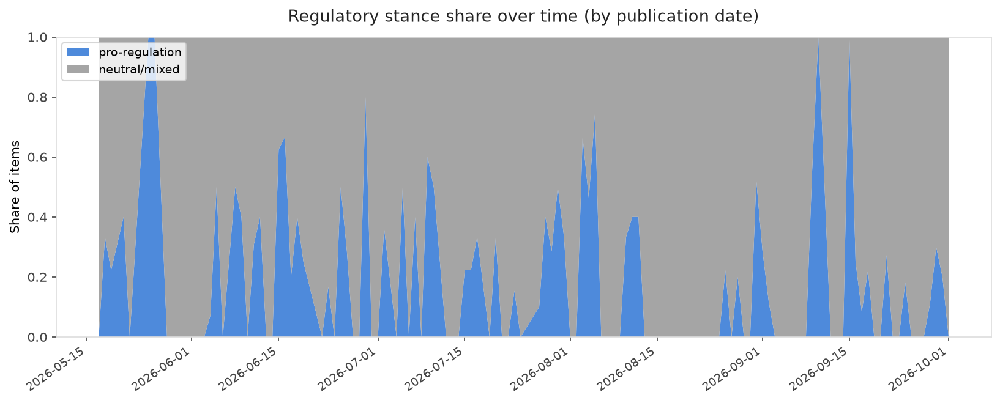

# AI in Law — Daily Sentiment Report
**Run date:** 2026-10-01 | **Items analyzed:** 7 | **Overall:** 🟢 Mildly positive (+0.327)

_Articles in this report were published between **2026-09-29** and **2026-10-01**._

---

## Summary

Today's collection covers **7** items from news outlets, academic preprints, Reddit, and regulatory sources.
Compared to the historical average of **+0.215**, today's sentiment is ↑ **0.112** points higher.

| Metric | Value |
|--------|-------|
| Positive items | 5 (71.4%) |
| Neutral items  | 0 (0.0%) |
| Negative items | 2 (28.6%) |
| Avg. VADER compound | +0.3271 |
| Pro-regulation items | 2 |
| Anti-regulation items | 0 |

---

## Top Topics Today

- **Privacy** — 2 items
- **National Security** — 1 items
- **Transparency** — 1 items

---

## Most Positive Coverage

- [📱 Hey Siri, How Do I Limit AI Data Access? | EFFector 38.17](https://www.eff.org/deeplinks/2026/09/hey-siri-how-do-i-limit-ai-data-access-effector-3817)  
  _EFF DeepLinks_ — VADER: `+0.865`
- [Here&#8217;s what AI leaders are saying about Trump’s new safety plan](https://www.theverge.com/ai-artificial-intelligence/1002636/ai-execs-trump-self-policing-deal-comments)  
  _The Verge AI_ — VADER: `+0.863`
- [While the Country Rejects ALPR Mass Surveillance, SF Settles for Weak Safeguards](https://www.eff.org/deeplinks/2026/09/while-country-rejects-alpr-mass-surveillance-sf-settles-weak-safeguards)  
  _EFF DeepLinks_ — VADER: `+0.629`

---

## Most Critical / Negative Coverage

- [Judge dismisses antitrust lawsuits over Google’s AI Overviews](https://www.theverge.com/tech/1003589/google-ai-overviews-chegg-penske-lawsuits-dismissed)  
  _The Verge AI_ — VADER: `-0.527`
- [The Download: climate tech companies to watch and AI’s discovery problem](https://www.technologyreview.com/2026/09/29/1145249/the-download-climate-tech-ai-scientific-discovery/)  
  _MIT Tech Review_ — VADER: `-0.273`
- [Trump plan to combat AI risks hinges on Big Tech pals policing themselves](https://arstechnica.com/tech-policy/2026/09/trump-plan-to-combat-ai-risks-hinges-on-big-tech-pals-policing-themselves/)  
  _Ars Technica Tech Policy_ — VADER: `+0.202`

---

## Visualizations — Today

## Visualizations — Trends Over Time

---

## Methodology

- **VADER** (Valence Aware Dictionary and sEntiment Reasoner) — compound score in [-1, 1].
- **Topic tagging** — regex keyword matching across 12 AI-law sub-domains.
- **Stance detection** — keyword-based pro/anti-regulation signal detection.
- **Date filter** — items are kept only if their *publication* date falls within the look-back window (default 2 days).
- Sources: RSS news feeds, arXiv academic API, Reddit (PRAW), Regulations.gov API.

_Generated automatically on 2026-10-01 17:19 UTC._
