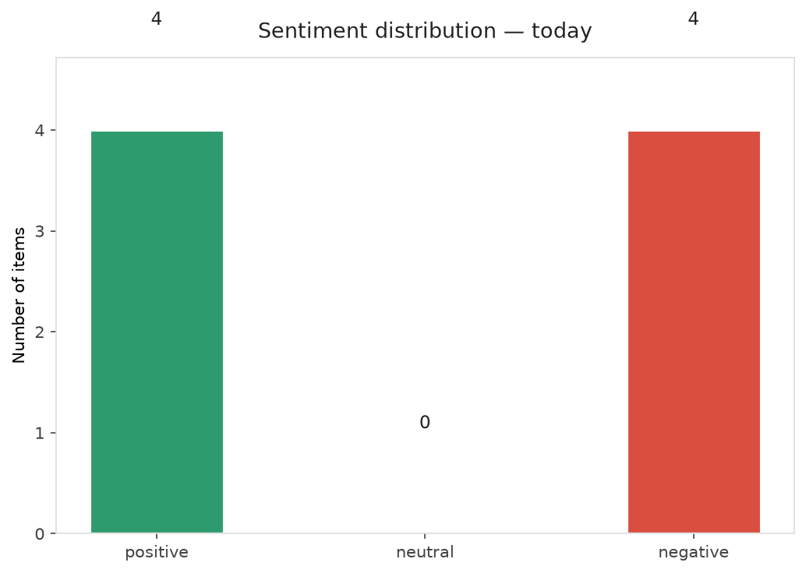
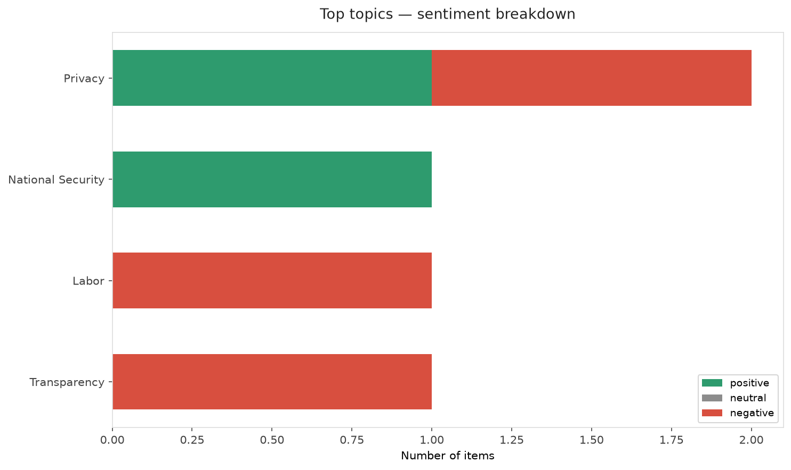
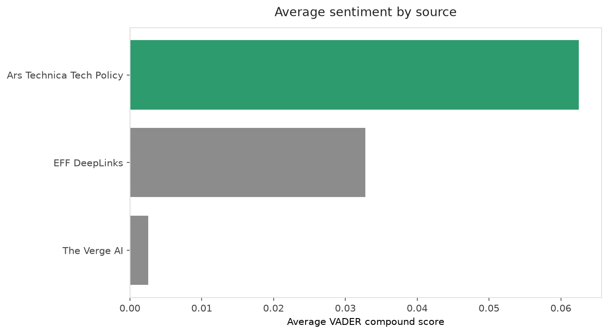
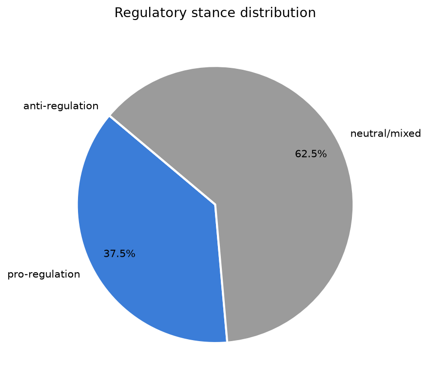
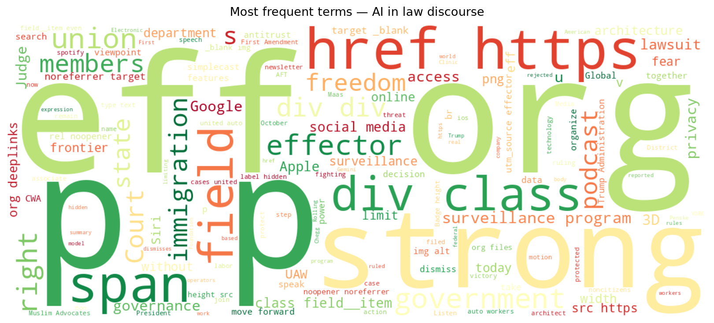
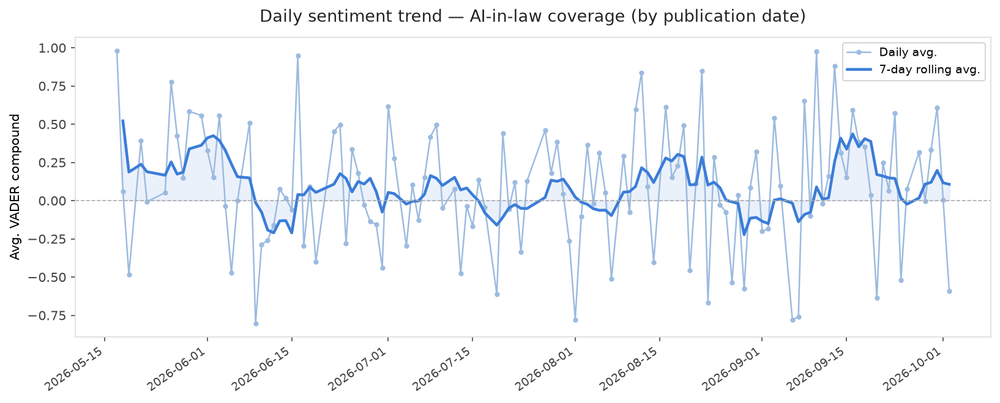
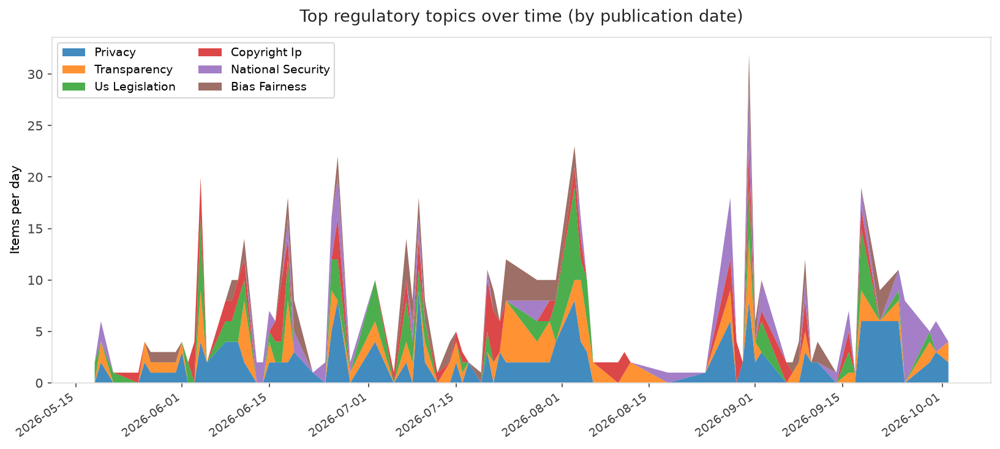
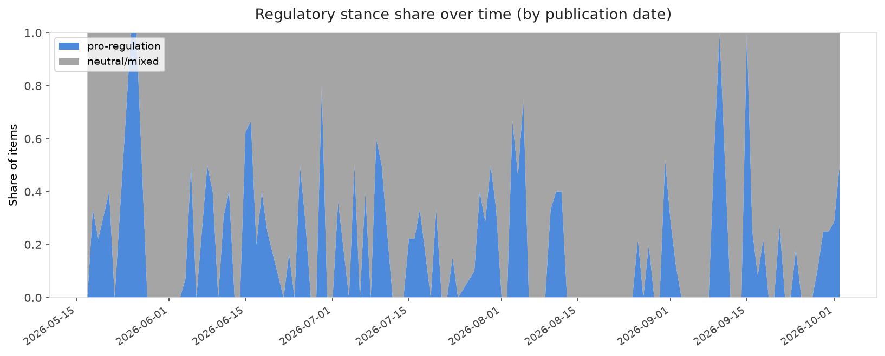

# AI in Law — Daily Sentiment Report
**Run date:** 2026-10-02 | **Items analyzed:** 8 | **Overall:** 🟢 Mildly positive (+0.087)

_Articles in this report were published between **2026-09-30** and **2026-10-02**._

---

## Summary

Today's collection covers **8** items from news outlets, academic preprints, Reddit, and regulatory sources.
Compared to the historical average of **+0.214**, today's sentiment is ↓ **0.127** points lower.

| Metric | Value |
|--------|-------|
| Positive items | 4 (50.0%) |
| Neutral items  | 0 (0.0%) |
| Negative items | 4 (50.0%) |
| Avg. VADER compound | +0.0871 |
| Pro-regulation items | 3 |
| Anti-regulation items | 0 |

---

## Top Topics Today

- **Privacy** — 2 items
- **National Security** — 1 items
- **Labor** — 1 items
- **Transparency** — 1 items

---

## Most Positive Coverage

- [Architecture Without an Architect? Global Governance of Artificial Intelligence in a Divided World](https://arxiv.org/abs/2610.01716v1)  
  _arXiv_ — VADER: `+0.882`
- [📱 Hey Siri, How Do I Limit AI Data Access? | EFFector 38.17](https://www.eff.org/deeplinks/2026/09/hey-siri-how-do-i-limit-ai-data-access-effector-3817)  
  _EFF DeepLinks_ — VADER: `+0.865`
- [Google announces Gemini 4 and says it&#8217;s so capable that only &#8216;trusted cyber defenders&#8](https://www.theverge.com/tech/1002980/google-gemini-4-argon)  
  _The Verge AI_ — VADER: `+0.532`

---

## Most Critical / Negative Coverage

- [Victory! Court Rejects Government Effort to Dismiss Social Media Surveillance Lawsuit](https://www.eff.org/press/releases/victory-court-rejects-government-effort-dismiss-social-media-surveillance-lawsuit)  
  _EFF DeepLinks_ — VADER: `-0.799`
- [Judge dismisses antitrust lawsuits over Google’s AI Overviews](https://www.theverge.com/tech/1003589/google-ai-overviews-chegg-penske-lawsuits-dismissed)  
  _The Verge AI_ — VADER: `-0.527`
- [Robotaxi operators will face fines for blocking first responders](https://techcrunch.com/2026/10/01/robotaxi-operators-will-face-fines-for-blocking-first-responders/)  
  _TechCrunch_ — VADER: `-0.382`

---

## Visualizations — Today

## Visualizations — Trends Over Time

---

## Methodology

- **VADER** (Valence Aware Dictionary and sEntiment Reasoner) — compound score in [-1, 1].
- **Topic tagging** — regex keyword matching across 12 AI-law sub-domains.
- **Stance detection** — keyword-based pro/anti-regulation signal detection.
- **Date filter** — items are kept only if their *publication* date falls within the look-back window (default 2 days).
- Sources: RSS news feeds, arXiv academic API, Reddit (PRAW), Regulations.gov API.

_Generated automatically on 2026-10-02 16:33 UTC._
