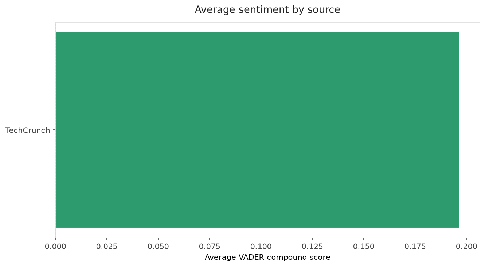
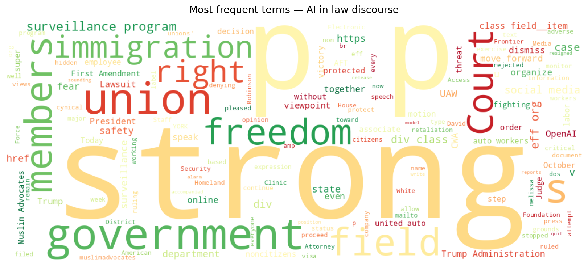
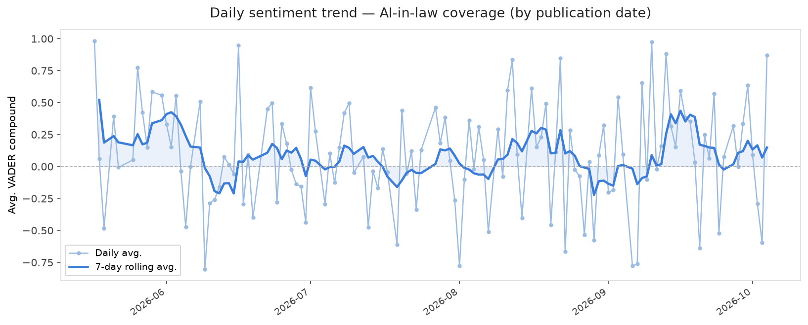
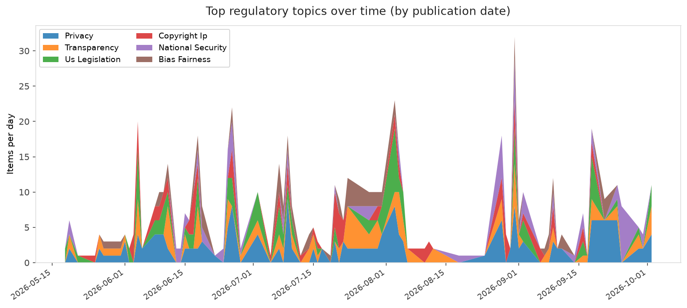
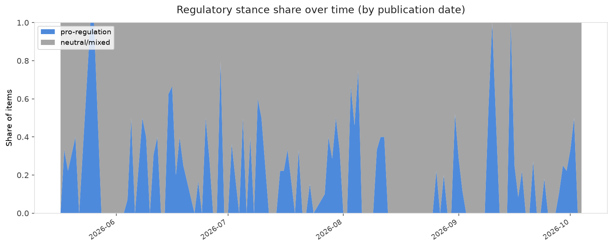

# AI in Law — Daily Sentiment Report
**Run date:** 2026-10-04 | **Items analyzed:** 5 | **Overall:** 🔴 Mildly negative (-0.147)

_Articles in this report were published between **2026-10-02** and **2026-10-04**._

---

## Summary

Today's collection covers **5** items from news outlets, academic preprints, Reddit, and regulatory sources.
Compared to the historical average of **+0.212**, today's sentiment is ↓ **0.359** points lower.

| Metric | Value |
|--------|-------|
| Positive items | 2 (40.0%) |
| Neutral items  | 0 (0.0%) |
| Negative items | 3 (60.0%) |
| Avg. VADER compound | -0.1471 |
| Pro-regulation items | 1 |
| Anti-regulation items | 0 |

---

## Top Topics Today

- **Us Legislation** — 1 items
- **Privacy** — 1 items
- **Labor** — 1 items
- **Transparency** — 1 items

---

## Most Positive Coverage

- [Trump unveils his new Super Intelligence Force](https://techcrunch.com/2026/10/04/trump-unveils-his-new-super-intelligence-force/)  
  _TechCrunch_ — VADER: `+0.869`
- [It’s not AI anymore, it’s ‘super intelligence’ (according to the White House)](https://techcrunch.com/video/its-not-ai-anymore-its-super-intelligence-according-to-the-white-house/)  
  _TechCrunch_ — VADER: `+0.421`
- [An OpenAI safety employee has quit and is sounding the alarm](https://www.theverge.com/ai-artificial-intelligence/1004408/openai-safety-quits-sounding-the-alarm)  
  _The Verge AI_ — VADER: `-0.527`

---

## Most Critical / Negative Coverage

- [Victory! Court Rejects Government Effort to Dismiss Social Media Surveillance Lawsuit](https://www.eff.org/press/releases/victory-court-rejects-government-effort-dismiss-social-media-surveillance-lawsuit)  
  _EFF DeepLinks_ — VADER: `-0.799`
- [OpenAI safety employee resigns, claiming the company’s ‘culture is broken’](https://techcrunch.com/2026/10/03/openai-safety-employee-resigns-claiming-the-companys-culture-is-broken/)  
  _TechCrunch_ — VADER: `-0.700`
- [An OpenAI safety employee has quit and is sounding the alarm](https://www.theverge.com/ai-artificial-intelligence/1004408/openai-safety-quits-sounding-the-alarm)  
  _The Verge AI_ — VADER: `-0.527`

---

## Visualizations — Today

## Visualizations — Trends Over Time

---

## Methodology

- **VADER** (Valence Aware Dictionary and sEntiment Reasoner) — compound score in [-1, 1].
- **Topic tagging** — regex keyword matching across 12 AI-law sub-domains.
- **Stance detection** — keyword-based pro/anti-regulation signal detection.
- **Date filter** — items are kept only if their *publication* date falls within the look-back window (default 2 days).
- Sources: RSS news feeds, arXiv academic API, Reddit (PRAW), Regulations.gov API.

_Generated automatically on 2026-10-04 15:42 UTC._
