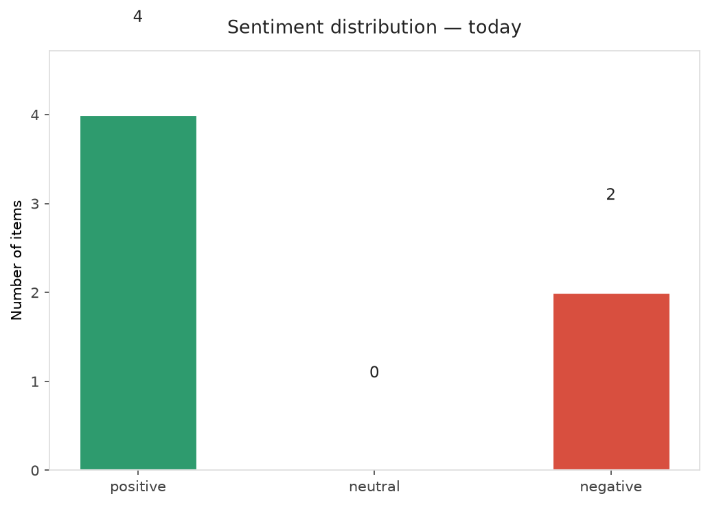
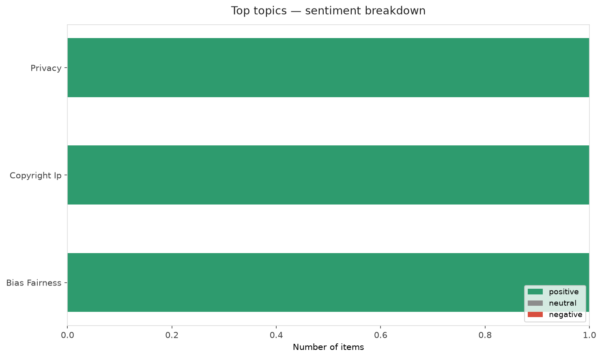
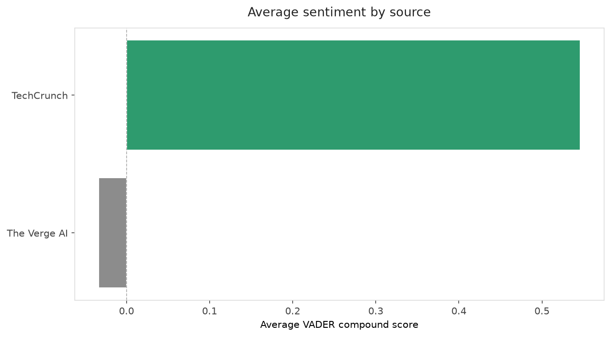
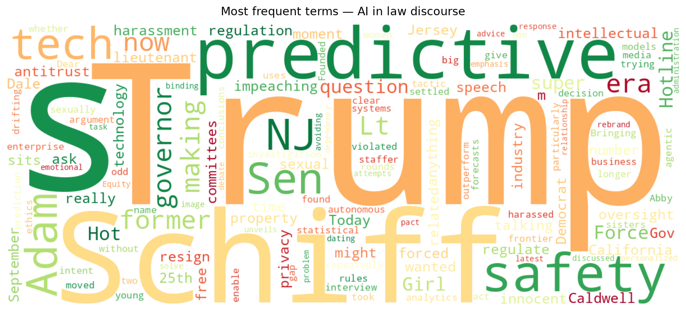
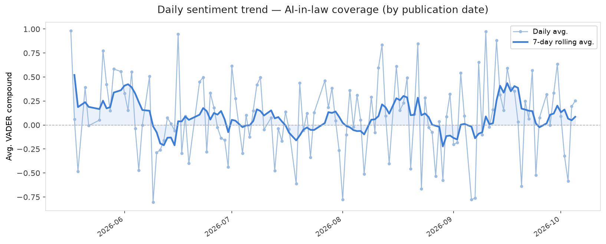
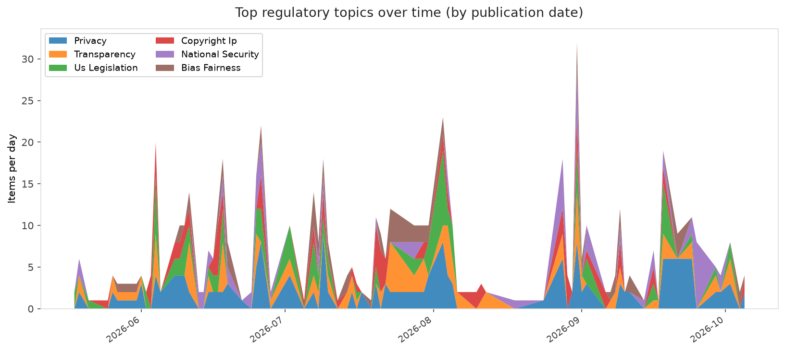
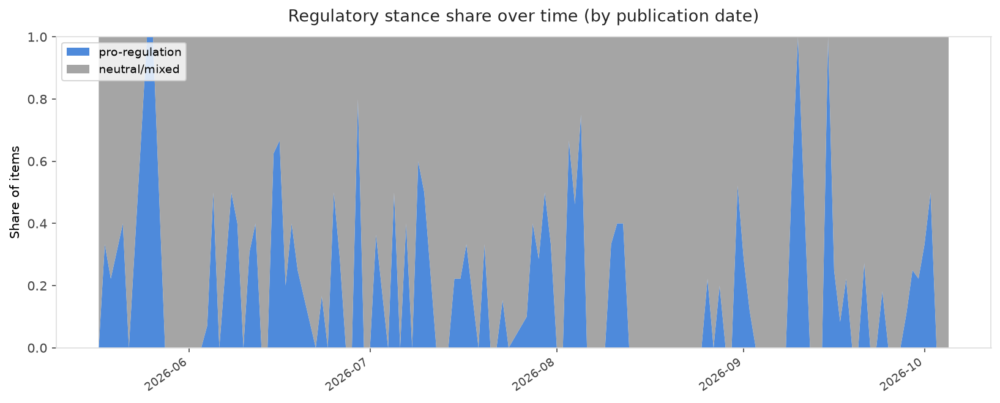

# AI in Law — Daily Sentiment Report
**Run date:** 2026-10-05 | **Items analyzed:** 6 | **Overall:** 🟢 Mildly positive (+0.166)

_Articles in this report were published between **2026-10-04** and **2026-10-05**._

---

## Summary

Today's collection covers **6** items from news outlets, academic preprints, Reddit, and regulatory sources.
Compared to the historical average of **+0.212**, today's sentiment is ↓ **0.045** points lower.

| Metric | Value |
|--------|-------|
| Positive items | 4 (66.7%) |
| Neutral items  | 0 (0.0%) |
| Negative items | 2 (33.3%) |
| Avg. VADER compound | +0.1664 |
| Pro-regulation items | 0 |
| Anti-regulation items | 0 |

---

## Top Topics Today

- **Privacy** — 1 items
- **Copyright Ip** — 1 items
- **Bias Fairness** — 1 items

---

## Most Positive Coverage

- [Trump unveils his new Super Intelligence Force](https://techcrunch.com/2026/10/04/trump-unveils-his-new-super-intelligence-force/)  
  _TechCrunch_ — VADER: `+0.869`
- [Sen. Adam Schiff on AI regulation, free speech, and impeaching Trump one more time](https://www.theverge.com/podcast/1004286/senator-adam-schiff-ai-trump-regulation-corruption)  
  _The Verge AI_ — VADER: `+0.784`
- [Hot Girl Hotline is like ‘Dear Abby’ for the AI era](https://techcrunch.com/2026/10/05/hot-girl-hotline-is-like-dear-abby-for-the-ai-era/)  
  _TechCrunch_ — VADER: `+0.542`

---

## Most Critical / Negative Coverage

- [NJ’s former Lt Gov is using AI to say he’s innocent of sexual harassment](https://www.theverge.com/ai-artificial-intelligence/1004549/well-if-ai-said-it-it-must-be-true)  
  _The Verge AI_ — VADER: `-0.852`
- [Bringing predictive analytics to the agentic AI era](https://www.technologyreview.com/2026/10/05/1143813/bringing-predictive-analytics-to-the-agentic-ai-era/)  
  _MIT Tech Review_ — VADER: `-0.572`
- [Can ‘super intelligence’ and a non-binding safety pact solve AI’s image problem?](https://techcrunch.com/2026/10/04/can-super-intelligence-and-a-non-binding-safety-pact-solve-ais-image-problem/)  
  _TechCrunch_ — VADER: `+0.226`

---

## Visualizations — Today

## Visualizations — Trends Over Time

---

## Methodology

- **VADER** (Valence Aware Dictionary and sEntiment Reasoner) — compound score in [-1, 1].
- **Topic tagging** — regex keyword matching across 12 AI-law sub-domains.
- **Stance detection** — keyword-based pro/anti-regulation signal detection.
- **Date filter** — items are kept only if their *publication* date falls within the look-back window (default 2 days).
- Sources: RSS news feeds, arXiv academic API, Reddit (PRAW), Regulations.gov API.

_Generated automatically on 2026-10-05 19:33 UTC._
