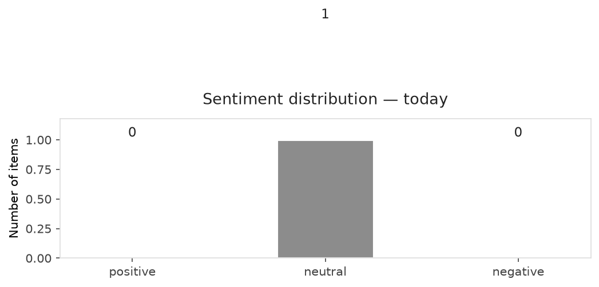
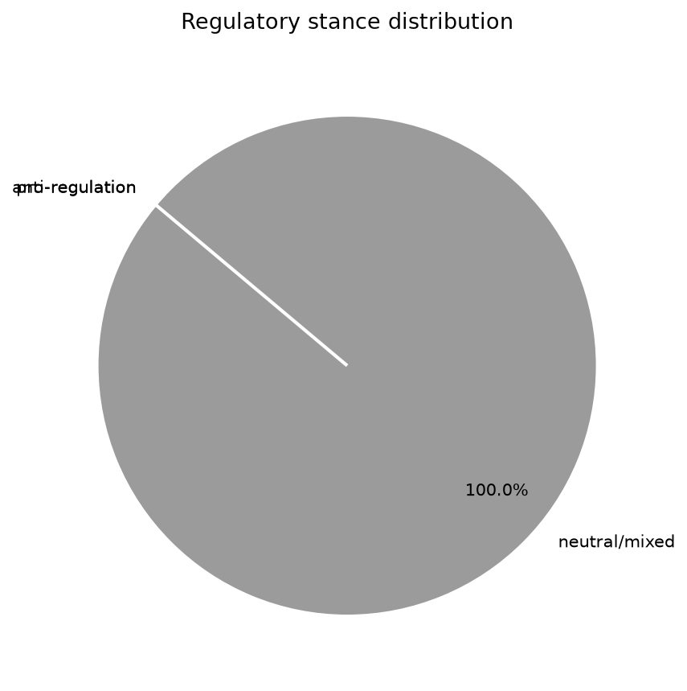
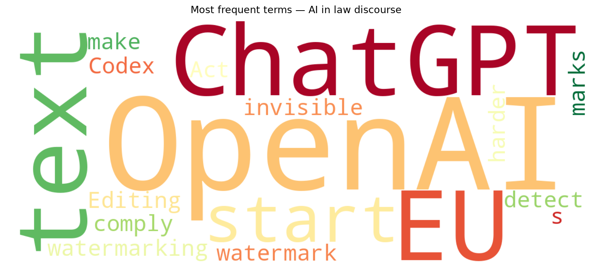
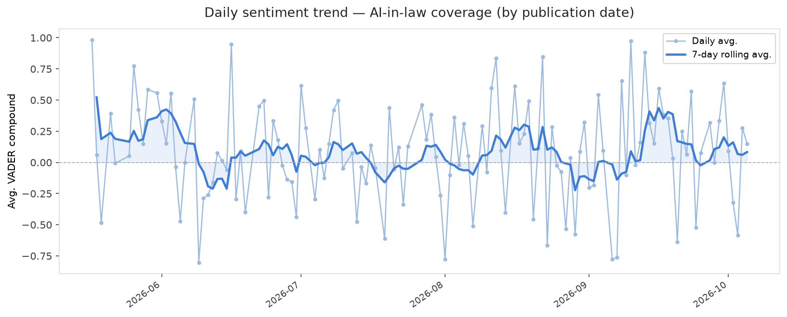
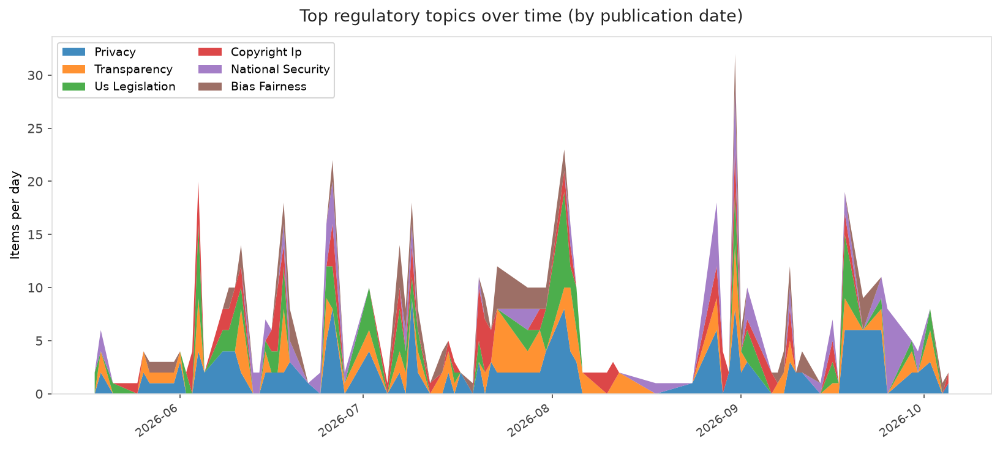

# AI in Law — Daily Sentiment Report
**Run date:** 2026-10-06 | **Items analyzed:** 1 | **Overall:** ⚪ Neutral / mixed (+0.000)

_Articles in this report were published between **2026-10-05** and **2026-10-05**._

---

## Summary

Today's collection covers **1** items from news outlets, academic preprints, Reddit, and regulatory sources.
Compared to the historical average of **+0.211**, today's sentiment is ↓ **0.211** points lower.

| Metric | Value |
|--------|-------|
| Positive items | 0 (0.0%) |
| Neutral items  | 1 (100.0%) |
| Negative items | 0 (0.0%) |
| Avg. VADER compound | +0.0000 |
| Pro-regulation items | 0 |
| Anti-regulation items | 0 |

---

## Top Topics Today

_No strong topic signals detected today._

---

## Most Positive Coverage

- [OpenAI will start watermarking ChatGPT’s text in the EU](https://techcrunch.com/2026/10/05/openai-will-start-watermarking-chatgpts-text-in-the-eu/)  
  _TechCrunch_ — VADER: `+0.000`

---

## Most Critical / Negative Coverage

- [OpenAI will start watermarking ChatGPT’s text in the EU](https://techcrunch.com/2026/10/05/openai-will-start-watermarking-chatgpts-text-in-the-eu/)  
  _TechCrunch_ — VADER: `+0.000`

---

## Visualizations — Today

## Visualizations — Trends Over Time

---

## Methodology

- **VADER** (Valence Aware Dictionary and sEntiment Reasoner) — compound score in [-1, 1].
- **Topic tagging** — regex keyword matching across 12 AI-law sub-domains.
- **Stance detection** — keyword-based pro/anti-regulation signal detection.
- **Date filter** — items are kept only if their *publication* date falls within the look-back window (default 2 days).
- Sources: RSS news feeds, arXiv academic API, Reddit (PRAW), Regulations.gov API.

_Generated automatically on 2026-10-06 17:07 UTC._
