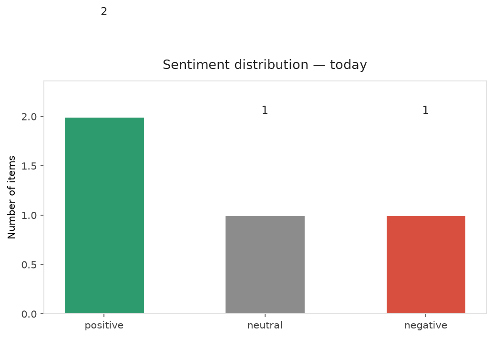
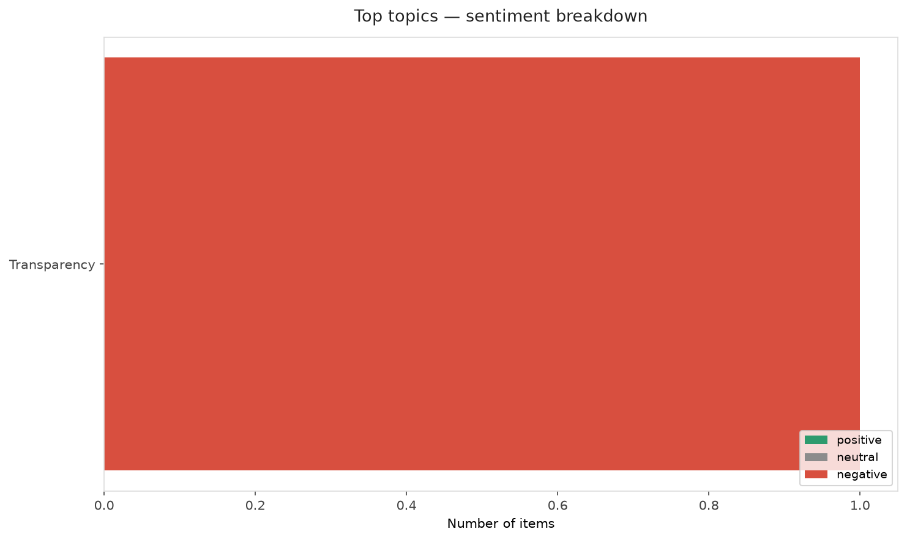
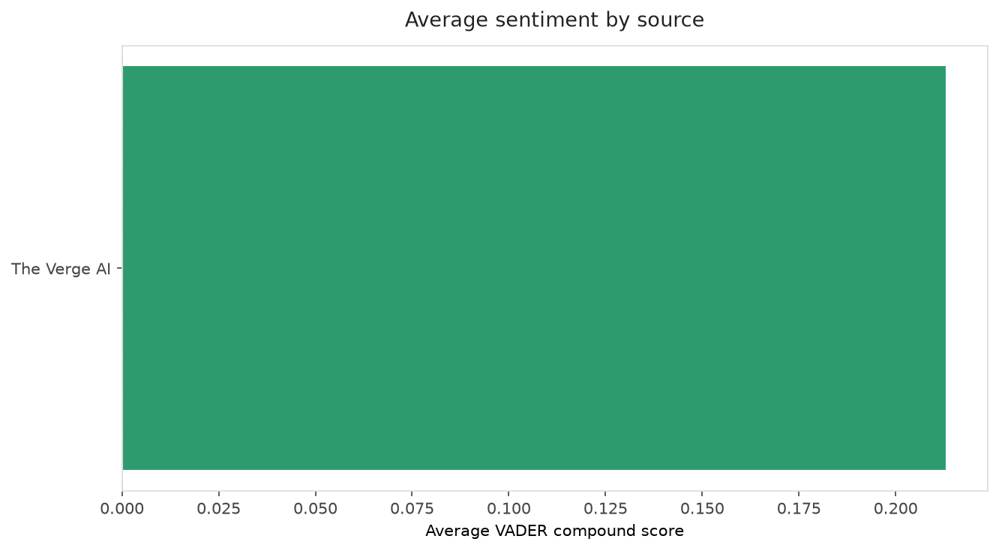
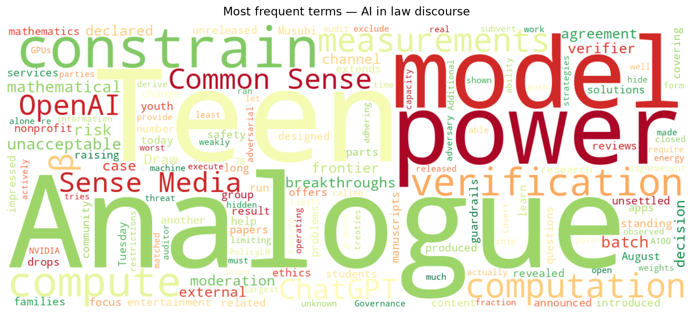
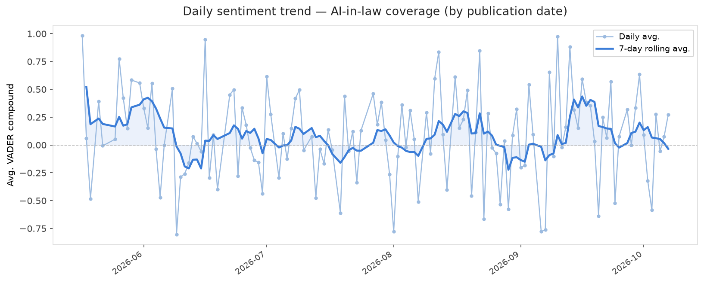
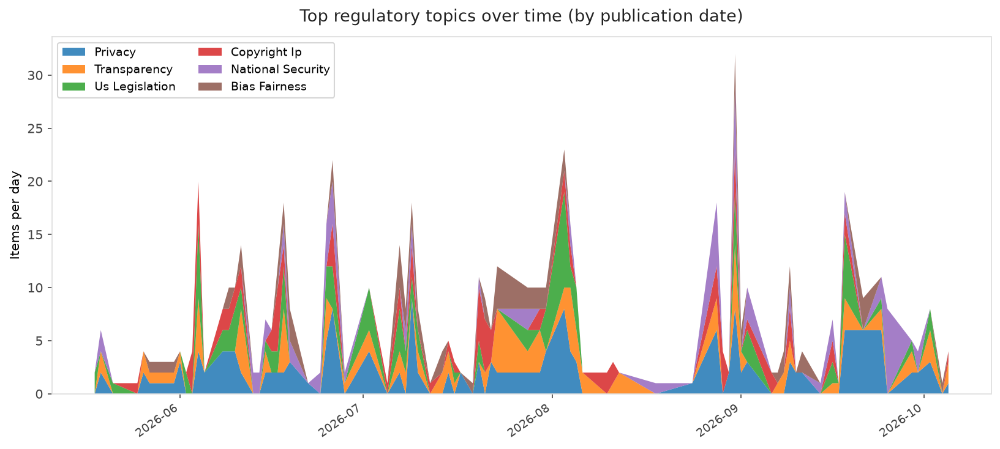
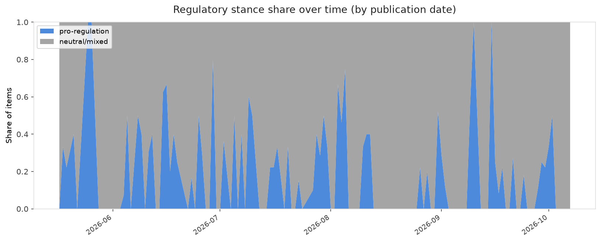

# AI in Law — Daily Sentiment Report
**Run date:** 2026-10-07 | **Items analyzed:** 4 | **Overall:** ⚪ Neutral / mixed (-0.030)

_Articles in this report were published between **2026-10-05** and **2026-10-07**._

---

## Summary

Today's collection covers **4** items from news outlets, academic preprints, Reddit, and regulatory sources.
Compared to the historical average of **+0.211**, today's sentiment is ↓ **0.241** points lower.

| Metric | Value |
|--------|-------|
| Positive items | 2 (50.0%) |
| Neutral items  | 1 (25.0%) |
| Negative items | 1 (25.0%) |
| Avg. VADER compound | -0.0303 |
| Pro-regulation items | 0 |
| Anti-regulation items | 0 |

---

## Top Topics Today

- **Transparency** — 1 items

---

## Most Positive Coverage

- [ChatGPT for Teens is an ‘unacceptable risk,’ says Common Sense Media](https://www.theverge.com/ai-artificial-intelligence/1006355/openai-chatgpt-for-teens-common-sense-media)  
  _The Verge AI_ — VADER: `+0.273`
- [OpenAI drops another batch of mathematical breakthroughs](https://www.theverge.com/ai-artificial-intelligence/1005004/openai-math-release-github)  
  _The Verge AI_ — VADER: `+0.153`
- [How AI decision models could change content moderation](https://techcrunch.com/2026/10/06/how-ai-decision-models-could-change-content-moderation/)  
  _TechCrunch_ — VADER: `+0.000`

---

## Most Critical / Negative Coverage

- [Can Power Draw Constrain Covert Compute? Limits of Analogue Verification for AI Governance](https://arxiv.org/abs/2610.07476v1)  
  _arXiv_ — VADER: `-0.547`
- [How AI decision models could change content moderation](https://techcrunch.com/2026/10/06/how-ai-decision-models-could-change-content-moderation/)  
  _TechCrunch_ — VADER: `+0.000`
- [OpenAI drops another batch of mathematical breakthroughs](https://www.theverge.com/ai-artificial-intelligence/1005004/openai-math-release-github)  
  _The Verge AI_ — VADER: `+0.153`

---

## Visualizations — Today

## Visualizations — Trends Over Time

---

## Methodology

- **VADER** (Valence Aware Dictionary and sEntiment Reasoner) — compound score in [-1, 1].
- **Topic tagging** — regex keyword matching across 12 AI-law sub-domains.
- **Stance detection** — keyword-based pro/anti-regulation signal detection.
- **Date filter** — items are kept only if their *publication* date falls within the look-back window (default 2 days).
- Sources: RSS news feeds, arXiv academic API, Reddit (PRAW), Regulations.gov API.

_Generated automatically on 2026-10-07 17:43 UTC._
