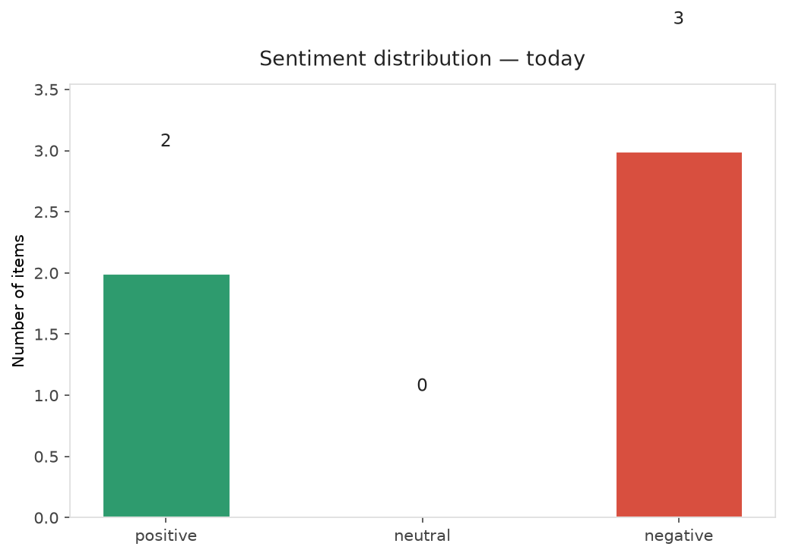
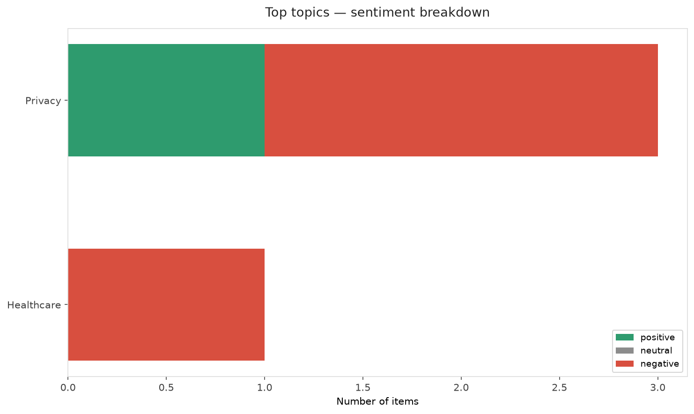
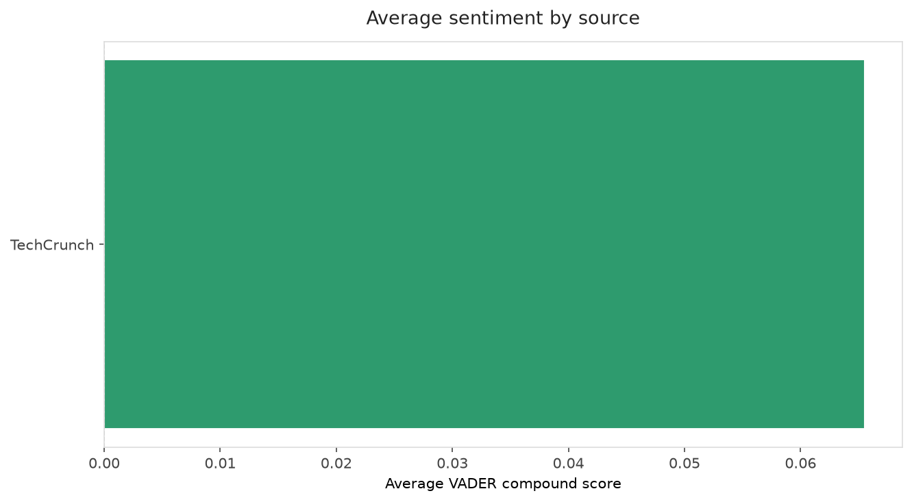
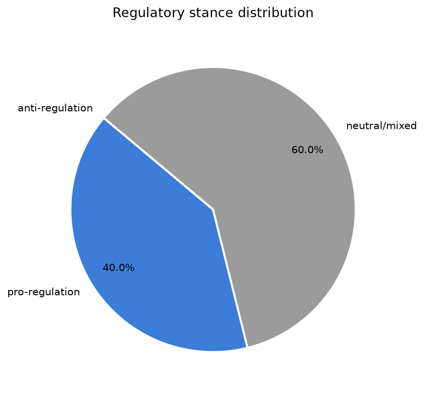
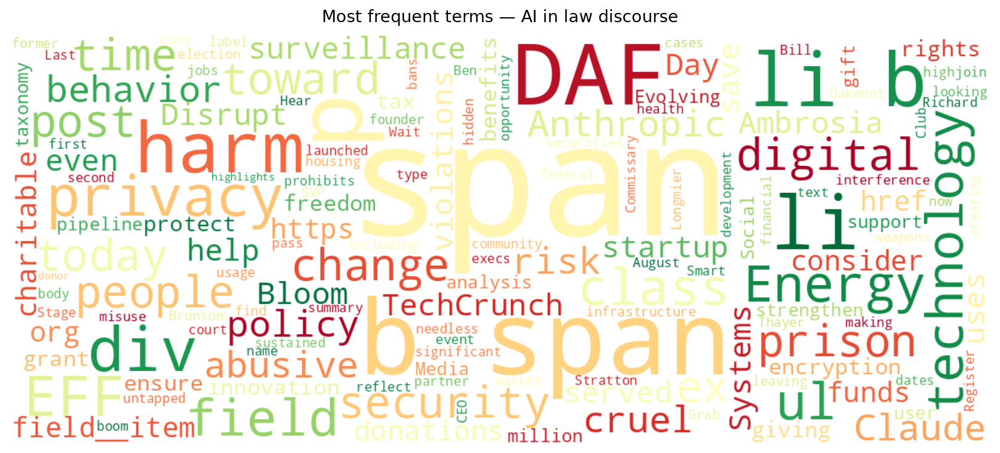
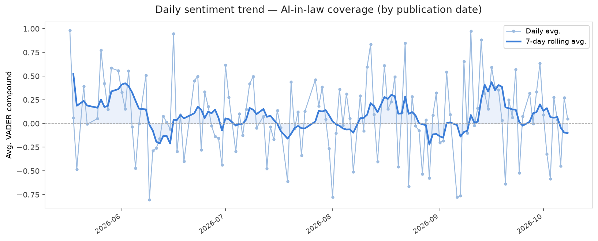
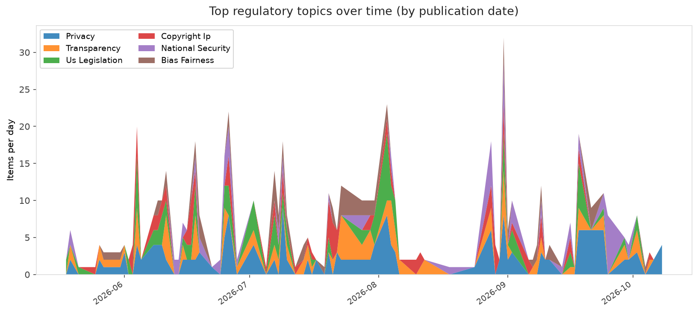
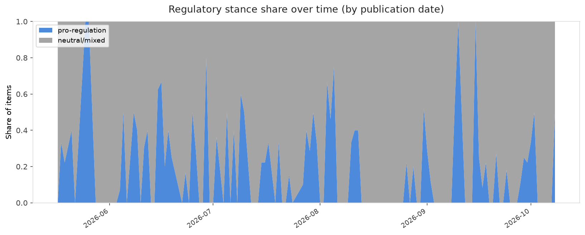

# AI in Law — Daily Sentiment Report
**Run date:** 2026-10-08 | **Items analyzed:** 5 | **Overall:** 🔴 Mildly negative (-0.155)

_Articles in this report were published between **2026-10-06** and **2026-10-08**._

---

## Summary

Today's collection covers **5** items from news outlets, academic preprints, Reddit, and regulatory sources.
Compared to the historical average of **+0.209**, today's sentiment is ↓ **0.364** points lower.

| Metric | Value |
|--------|-------|
| Positive items | 2 (40.0%) |
| Neutral items  | 0 (0.0%) |
| Negative items | 3 (60.0%) |
| Avg. VADER compound | -0.1545 |
| Pro-regulation items | 2 |
| Anti-regulation items | 0 |

---

## Top Topics Today

- **Privacy** — 3 items
- **Healthcare** — 1 items

---

## Most Positive Coverage

- [It's DAF Day! Wait...What's a DAF?](https://www.eff.org/deeplinks/2026/10/its-daf-day-wait-whats-daf)  
  _EFF DeepLinks_ — VADER: `+0.997`
- [Hear from Ambrosia Energy and Bloom Energy execs on where the AI infrastructure boom is creating opp](https://techcrunch.com/2026/10/08/hear-from-ambrosia-energy-and-bloom-energy-execs-on-where-the-ai-infrastructure-boom-is-creating-opportunity-at-disrupt-2026/)  
  _TechCrunch_ — VADER: `+0.967`
- [A startup founder who served time in prison is looking to court an untapped market: ex-cons](https://techcrunch.com/2026/10/08/a-startup-founder-who-served-time-in-prison-is-looking-to-court-an-untapped-market-ex-cons/)  
  _TechCrunch_ — VADER: `-0.836`

---

## Most Critical / Negative Coverage

- [Move Fast and Mend Things: Keeping Up with Evolving AI Harms Using Social Media Commentary](https://arxiv.org/abs/2610.09082v1)  
  _arXiv_ — VADER: `-0.972`
- [Anthropic bans ‘abusive or cruel behavior’ toward Claude](https://www.theverge.com/ai-artificial-intelligence/1008100/anthropic-new-usage-policy-abuse-claude)  
  _The Verge AI_ — VADER: `-0.929`
- [A startup founder who served time in prison is looking to court an untapped market: ex-cons](https://techcrunch.com/2026/10/08/a-startup-founder-who-served-time-in-prison-is-looking-to-court-an-untapped-market-ex-cons/)  
  _TechCrunch_ — VADER: `-0.836`

---

## Visualizations — Today

## Visualizations — Trends Over Time

---

## Methodology

- **VADER** (Valence Aware Dictionary and sEntiment Reasoner) — compound score in [-1, 1].
- **Topic tagging** — regex keyword matching across 12 AI-law sub-domains.
- **Stance detection** — keyword-based pro/anti-regulation signal detection.
- **Date filter** — items are kept only if their *publication* date falls within the look-back window (default 2 days).
- Sources: RSS news feeds, arXiv academic API, Reddit (PRAW), Regulations.gov API.

_Generated automatically on 2026-10-08 17:47 UTC._
